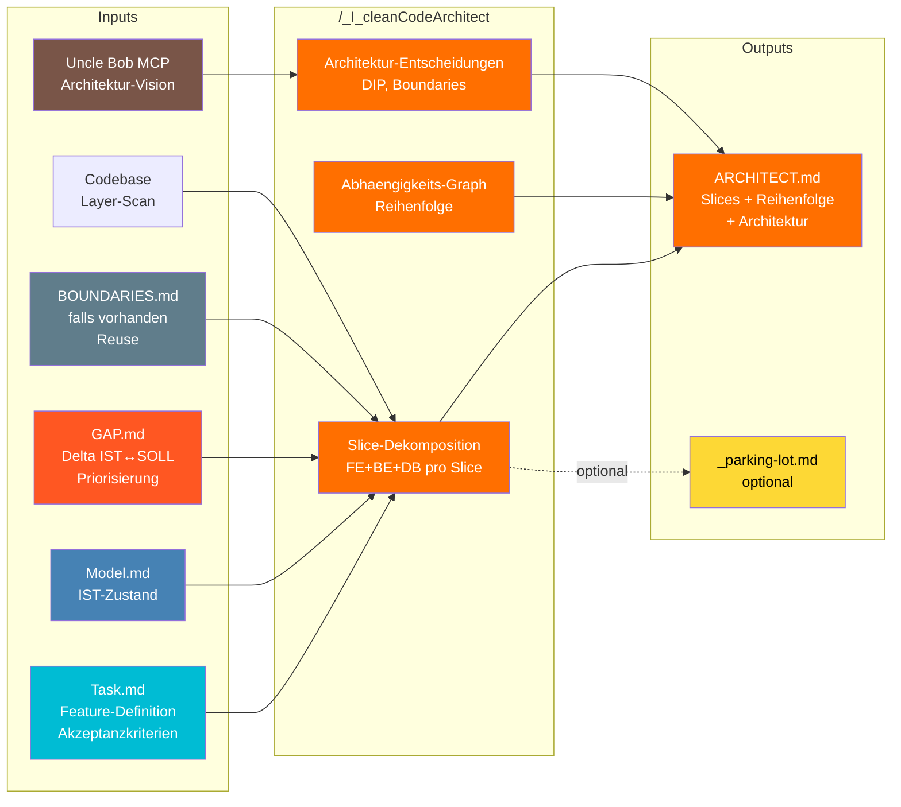
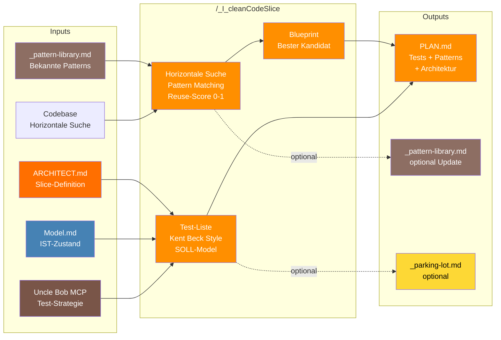
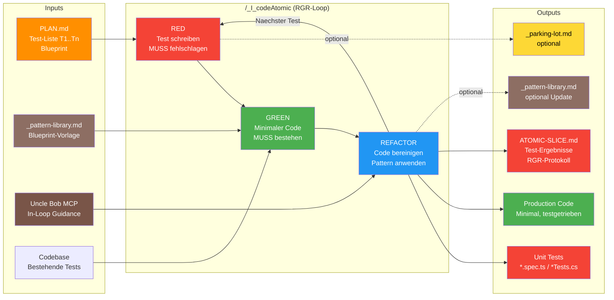
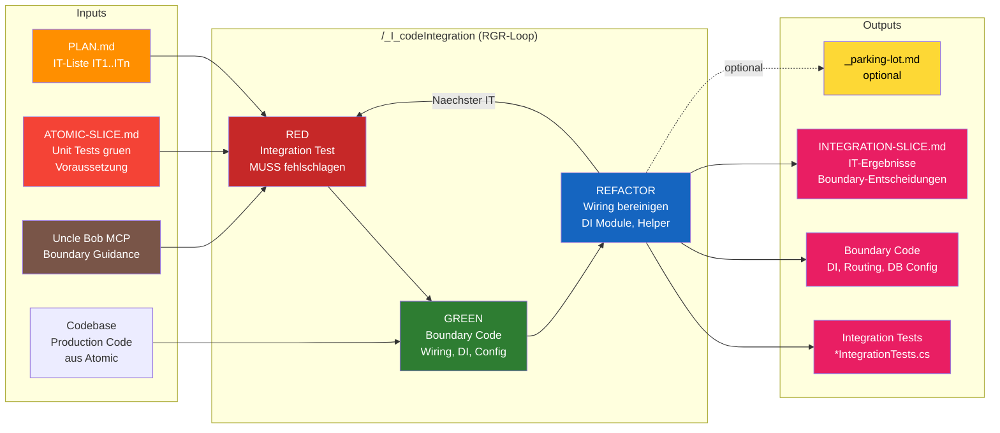

# Datenfluss-Diagramm: Implementierungs-Pipeline v3.0

**Version:** 3.0
**Datum:** 2026-02-03
**Aenderung:** Neue parallele Pipeline fuer TDD-basierte Feature-Implementierung

---

## Uebersicht: Zwei Parallele Welten

```mermaid
graph TD
    subgraph "WELT 1: Wissenschaftlicher Zyklus v2.2"
        W1_OBS[/_SC_observe]
        W1_MM[/_SC_modelMaintain]
        W1_QG[/_SC_qualityGate]
        W1_HYPO[/_SC_hypothese]
        W1_IMPL[/_SC_implement]
        W1_ERG[/_SC_ergebnis]

        W1_OBS --> W1_MM --> W1_QG --> W1_HYPO --> W1_IMPL --> W1_ERG
        W1_ERG -->|Loop| W1_OBS
    end

    subgraph "WELT 2: Implementierungs-Pipeline v3.0"
        subgraph "Pre-Pipeline"
            P0A[/_taskDefinition]
            P0B[/_model]
            P0C[/_gap]
            P0A -->|Task.md + Crumbs| P0B
            P0B -->|Model.md| P0C
        end
        P1[/_I_cleanCodeArchitect]
        P2[/_I_cleanCodeSlice]
        P3[/_I_codeAtomic]
        P4[/_I_codeIntegration]
        P5[/_I_codeSystem]

        P0C -->|GAP.md| P1
        P1 --> P2
        P2 --> P3 --> P4 --> P5
        P5 -->|Naechster Slice| P2
        P5 -->|Re-Eval nach Slice| P0C
    end

    subgraph "Gemeinsam"
        TASK[Task.md]
        MODEL[Model.md]
        PL[_parking-lot.md]
        MANIFEST[_manifest.md]
        PATTERNS[_pattern-library.md]
    end

    TASK --> P1
    TASK --> W1_OBS
    MODEL --> P1
    MODEL --> W1_OBS

    P3 -.->|Eskalation bei Stagnation| W1_OBS
    P4 -.->|Eskalation bei Stagnation| W1_OBS
    P5 -.->|Eskalation bei Stagnation| W1_OBS

    style P0A fill:#00BCD4,color:#fff
    style P0B fill:#4682B4,color:#fff
    style P0C fill:#FF5722,color:#fff
    style P1 fill:#FF6F00,color:#fff
    style P2 fill:#FF8F00,color:#fff
    style P3 fill:#F44336,color:#fff
    style P4 fill:#E91E63,color:#fff
    style P5 fill:#9C27B0,color:#fff
    style W1_OBS fill:#26C6DA,color:#fff
    style W1_MM fill:#9C27B0,color:#fff
    style W1_QG fill:#AB47BC,color:#fff
    style W1_HYPO fill:#66BB6A,color:#fff
    style W1_IMPL fill:#2ECC71,color:#fff
    style W1_ERG fill:#3F51B5,color:#fff
    style PL fill:#FDD835,color:#000
    style MANIFEST fill:#00BCD4,color:#fff
    style PATTERNS fill:#8D6E63,color:#fff
```

**Prinzip:**
- Pipeline v3.0 = schneller Pfad (TDD, bekanntes Terrain)
- Zyklus v2.2 = Eskalations-Pfad (Forschung, unbekanntes Terrain)
- Gemeinsame Infrastruktur: Model.md, _parking-lot.md, _manifest.md, _pattern-library.md

---

## Detaillierter Datenfluss: Pipeline v3.0

### Phase 1: Architektur (/_I_cleanCodeArchitect)



**Actor:** ARCHITEKT
**Verantwortung:** System in vertikale Slices zerlegen

**Datenfluss:**
1. Liest Task.md → Feature-Beschreibung, Akzeptanzkriterien
2. Liest Model.md → IST-Zustand (falls vorhanden)
3. Liest GAP.md → Delta IST↔SOLL, Priorisierung, Circuit-Breaker
4. Liest BOUNDARIES.md → Reuse bestehender Dekomposition
5. MCP Query → Uncle Bob Architektur-Guidance
6. Codebase Scan → Bestehende Layer identifizieren
7. Schreibt ARCHITECT.md → Slices, Reihenfolge, Architektur-Entscheidungen

---

### Phase 2: Slice-Planung (/_I_cleanCodeSlice) [Pro Slice]



**Actor:** SLICE-PLANER (Uncle Bob)
**Verantwortung:** Einzelnen Slice fuer TDD vorbereiten

**Datenfluss:**
1. Liest ARCHITECT.md → Slice-Definition (Komponenten, Dependencies)
2. Liest Model.md → IST-Zustand als Kontext
3. Liest _pattern-library.md → Bekannte Patterns fuer Horizontale Suche
4. MCP Queries → Test-Strategie, Pattern Reuse, DIP
5. Codebase Scan → Aehnliche Implementierungen finden (Horizontale Suche)
6. Bewertet Reuse-Score (0-1) → 3-Farb-Klassifikation (GRAY/ORANGE/RED)
7. Schreibt PLAN.md → Test-Liste (T1..Tn, IT1..ITn, ST1..STn) + Blueprint

**Wiederholung:** Pro Slice einmal ausfuehren

---

### Phase 3: Unit Tests (/_I_codeAtomic) [Pro Slice]



**Actor:** ATOMARER CODER
**Verantwortung:** Unit Tests + Production Code via TDD

**Datenfluss:**
1. Liest PLAN.md → Test-Liste (T1..Tn), Blueprint, Architektur
2. Liest _pattern-library.md → Blueprint-Code als Vorlage
3. RGR-Loop (30-Sekunden-Zyklen):
   - RED: Test aus Liste schreiben → muss fehlschlagen
   - GREEN: Minimaler Code → muss bestehen
   - REFACTOR: Bereinigen, Patterns anwenden
4. MCP Queries (in-loop) → Bei Unsicherheit
5. Schreibt: Unit Tests + Production Code + ATOMIC-{SLICE}.md
6. Manifest-Update nach JEDEM gruenen Test (Compact-Safe)

**Stagnation:** 5+ RGR ohne Fortschritt → Eskalation zu /_SC_observe

---

### Phase 4: Integration Tests (/_I_codeIntegration) [Pro Slice]



**Actor:** INTEGRATIONS-CODER
**Verantwortung:** Integration Tests + Boundary Code via TDD

**Datenfluss:**
1. Prueft Voraussetzung: ATOMIC-{SLICE}.md existiert, alle Unit Tests gruen
2. Liest PLAN.md → Integration Test-Liste (IT1..ITn)
3. Liest ATOMIC-{SLICE}.md → Refactoring-Entscheidungen, Interface-Design
4. RGR-Loop:
   - RED: Integration Test (Boundary Crossing) → muss fehlschlagen
   - GREEN: Wiring-Code (DI, Routing, DB Config) → muss bestehen
   - REFACTOR: DI Module extrahieren, Test-Helper
5. Machist-Stil an DIP-Grenzen, Statist wo keine Boundary
6. Schreibt: Integration Tests + Wiring Code + INTEGRATION-{SLICE}.md
7. Integritaets-Check: Unit Tests duerfen NICHT brechen

**Regel:** NUR Wiring-Code, KEINE neue Business Logic

---

### Phase 5: System Tests (/_I_codeSystem) [Pro Slice]

```mermaid
graph LR
    subgraph "Inputs"
        PLAN5[PLAN.md<br/>ST-Liste ST1..STn]
        INTMD5[INTEGRATION-SLICE.md<br/>ITs gruen<br/>Voraussetzung]
        TASK5[Task.md<br/>Akzeptanzkriterien]
        MCP5[Uncle Bob MCP<br/>E2E Guidance]
        CB5[Codebase<br/>Cypress, Config]
    end

    subgraph "/_I_codeSystem (RGR-Loop)"
        RED5[RED<br/>E2E Test<br/>MUSS fehlschlagen]
        GREEN5[GREEN<br/>System Config<br/>Routes, Seeds, Toggles]
        REFACTOR5[REFACTOR<br/>Page Objects<br/>Step Definitions]

        RED5 --> GREEN5 --> REFACTOR5
        REFACTOR5 -->|Naechster ST| RED5
    end

    subgraph "Outputs"
        ETESTS[System/E2E Tests<br/>*.cy.ts / *.feature]
        SYSMD[SYSTEM-SLICE.md<br/>ST-Ergebnisse<br/>AK-Mapping<br/>Slice-Abschluss]
        PL5[_parking-lot.md<br/>optional]
    end

    subgraph "Naechster Schritt"
        NEXT_SLICE[/_I_cleanCodeSlice<br/>Naechster Slice]
        FEATURE_DONE[Feature KOMPLETT<br/>Alle Slices fertig]
    end

    PLAN5 --> RED5
    INTMD5 --> RED5
    TASK5 --> RED5
    MCP5 --> RED5
    CB5 --> GREEN5

    REFACTOR5 --> ETESTS
    REFACTOR5 --> SYSMD

    SYSMD -->|Weitere Slices| NEXT_SLICE
    SYSMD -->|Alle Slices fertig| FEATURE_DONE
    REFACTOR5 -.->|optional| PL5

    style PLAN5 fill:#FF8F00,color:#fff
    style INTMD5 fill:#E91E63,color:#fff
    style TASK5 fill:#00BCD4,color:#fff
    style MCP5 fill:#795548,color:#fff
    style RED5 fill:#B71C1C,color:#fff
    style GREEN5 fill:#1B5E20,color:#fff
    style REFACTOR5 fill:#0D47A1,color:#fff
    style ETESTS fill:#9C27B0,color:#fff
    style SYSMD fill:#9C27B0,color:#fff
    style NEXT_SLICE fill:#FF8F00,color:#fff
    style FEATURE_DONE fill:#4CAF50,color:#fff
    style PL5 fill:#FDD835,color:#000
```

**Actor:** SYSTEM-TESTER
**Verantwortung:** System/E2E Tests + Slice-Abschluss-Erklaerung

**Datenfluss:**
1. Prueft Voraussetzung: INTEGRATION-{SLICE}.md existiert, alle ITs gruen
2. Liest PLAN.md → System Test-Liste (ST1..STn)
3. Liest Task.md → Akzeptanzkriterien (AK-Mapping)
4. RGR-Loop:
   - RED: E2E Test (Given/When/Then) → muss fehlschlagen
   - GREEN: System Config (Routes, Seeds, Toggles) → muss bestehen
   - REFACTOR: Page Objects, Step Definitions, Test-Data Builders
5. Schreibt: E2E Tests + SYSTEM-{SLICE}.md
6. AK-Mapping: Jedes Akzeptanzkriterium → mindestens 1 Test
7. Slice-Abschluss: Alle 3 Ebenen gruen → ABGESCHLOSSEN

---

## Slice-Iteration (Pro Slice)

```mermaid
graph TD
    ARCH[ARCHITECT.md<br/>N Slices definiert]

    subgraph "Slice 1 (Canary)"
        S1_PLAN[/_I_cleanCodeSlice S1]
        S1_ATOM[/_I_codeAtomic S1]
        S1_INT[/_I_codeIntegration S1]
        S1_SYS[/_I_codeSystem S1]

        S1_PLAN --> S1_ATOM --> S1_INT --> S1_SYS
    end

    subgraph "Slice 2"
        S2_PLAN[/_I_cleanCodeSlice S2]
        S2_ATOM[/_I_codeAtomic S2]
        S2_INT[/_I_codeIntegration S2]
        S2_SYS[/_I_codeSystem S2]

        S2_PLAN --> S2_ATOM --> S2_INT --> S2_SYS
    end

    subgraph "Slice N"
        SN_PLAN[/_I_cleanCodeSlice SN]
        SN_ATOM[/_I_codeAtomic SN]
        SN_INT[/_I_codeIntegration SN]
        SN_SYS[/_I_codeSystem SN]

        SN_PLAN --> SN_ATOM --> SN_INT --> SN_SYS
    end

    ARCH --> S1_PLAN
    S1_SYS -->|"Slice 1 ✅"| S2_PLAN
    S2_SYS -->|"Slice 2 ✅"| SN_PLAN
    SN_SYS -->|"Alle Slices ✅"| DONE[Feature KOMPLETT]

    style ARCH fill:#FF6F00,color:#fff
    style S1_PLAN fill:#FF8F00,color:#fff
    style S1_ATOM fill:#F44336,color:#fff
    style S1_INT fill:#E91E63,color:#fff
    style S1_SYS fill:#9C27B0,color:#fff
    style S2_PLAN fill:#FF8F00,color:#fff
    style S2_ATOM fill:#F44336,color:#fff
    style S2_INT fill:#E91E63,color:#fff
    style S2_SYS fill:#9C27B0,color:#fff
    style SN_PLAN fill:#FF8F00,color:#fff
    style SN_ATOM fill:#F44336,color:#fff
    style SN_INT fill:#E91E63,color:#fff
    style SN_SYS fill:#9C27B0,color:#fff
    style DONE fill:#4CAF50,color:#fff
```

**Pro Slice durchlaeuft die Pipeline komplett:**
1. PLAN → Test-Liste + Blueprint
2. ATOMIC → Unit Tests + Production Code (RGR)
3. INTEGRATION → Integration Tests + Wiring (RGR)
4. SYSTEM → E2E Tests + Config (RGR) → Slice ABGESCHLOSSEN
5. → Naechster Slice

---

## Eskalations-Pfade

```mermaid
graph TD
    subgraph "Pipeline v3.0"
        P3[/_I_codeAtomic]
        P4[/_I_codeIntegration]
        P5[/_I_codeSystem]
    end

    subgraph "Eskalation: Wiss. Zyklus v2.2"
        OBS[/_SC_observe]
        MM[/_SC_modelMaintain]
        HYPO[/_SC_hypothese]
    end

    subgraph "Triggers"
        STAG[Stagnation<br/>5+ RGR ohne Fortschritt]
        UNCLEAR[Architektur unklar<br/>nach MCP-Befragung]
        MISSING[Model.md veraltet<br/>oder fehlt]
    end

    P3 -->|STAG| OBS
    P4 -->|STAG| OBS
    P5 -->|STAG| OBS

    P3 -->|UNCLEAR| HYPO
    P4 -->|UNCLEAR| HYPO

    OBS --> MM --> HYPO
    HYPO -->|"Zurueck mit neuem Wissen"| P3
    HYPO -->|"Zurueck mit neuem Wissen"| P4

    style P3 fill:#F44336,color:#fff
    style P4 fill:#E91E63,color:#fff
    style P5 fill:#9C27B0,color:#fff
    style OBS fill:#26C6DA,color:#fff
    style MM fill:#9C27B0,color:#fff
    style HYPO fill:#66BB6A,color:#fff
    style STAG fill:#FF5722,color:#fff
    style UNCLEAR fill:#FF9800,color:#fff
    style MISSING fill:#FFC107,color:#fff
```

**Eskalations-Regeln:**
- **Stagnation (5+ RGR):** → /_SC_observe (System verstehen) → /_SC_modelMaintain → zurueck
- **Architektur unklar:** → /_SC_hypothese (neue Hypothese) → zurueck
- **Model fehlt:** → /_model (Model erstellen) → Pipeline neu starten

---

## Parking Lot Integration (Pipeline v3.0)

```mermaid
graph TD
    subgraph "Pipeline Commands (Writers)"
        P1[/_I_cleanCodeArchitect]
        P2[/_I_cleanCodeSlice]
        P3[/_I_codeAtomic]
        P4[/_I_codeIntegration]
        P5[/_I_codeSystem]
    end

    subgraph "Parking Lot (APPEND-ONLY)"
        PL[_parking-lot.md<br/>Incidental Findings]
    end

    subgraph "Task Manager (Reader)"
        TD[/_taskDefinition<br/>Proximity-Priorisierung]
    end

    P1 -.->|APPEND| PL
    P2 -.->|APPEND| PL
    P3 -.->|APPEND| PL
    P4 -.->|APPEND| PL
    P5 -.->|APPEND| PL

    PL -->|READ bei Feature-Ende| TD

    style PL fill:#FDD835,color:#000
    style TD fill:#00BCD4,color:#fff
    style P1 fill:#FF6F00,color:#fff
    style P2 fill:#FF8F00,color:#fff
    style P3 fill:#F44336,color:#fff
    style P4 fill:#E91E63,color:#fff
    style P5 fill:#9C27B0,color:#fff
```

**Identisch zum v2.2 Parking Lot:**
- Alle Pipeline-Commands koennen APPEND zu Parking Lot
- /_taskDefinition liest bei Feature-Ende
- Proximity-Priorisierung: Tasks im gleichen Slice = hoehere Prioritaet

---

## Actor-Separation: SRP Enforcement (Pipeline v3.0)

| Actor | Command | Verantwortung | Schreibt | Liest |
|-------|---------|---------------|----------|-------|
| **ANALYST** | /_gap | Delta IST↔SOLL + Circuit-Breaker | GAP.md | SPEC.md, Model.md, Codebase |
| **ARCHITEKT** | /_I_cleanCodeArchitect | System in Slices zerlegen | ARCHITECT.md | Task.md, Model.md, GAP.md, BOUNDARIES.md, MCP |
| **SLICE-PLANER** | /_I_cleanCodeSlice | Einzelnen Slice planen | PLAN.md | ARCHITECT.md, Model.md, Pattern-Lib, MCP |
| **ATOMARER CODER** | /_I_codeAtomic | Unit Tests + Code via TDD | Tests, Code, ATOMIC.md | PLAN.md, Pattern-Lib, MCP |
| **INTEGRATIONS-CODER** | /_I_codeIntegration | Integration Tests + Wiring | ITests, Wiring, INTEGRATION.md | PLAN.md, ATOMIC.md, MCP |
| **SYSTEM-TESTER** | /_I_codeSystem | System Tests + Abschluss | E2E Tests, SYSTEM.md | PLAN.md, INTEGRATION.md, Task.md, MCP |

**SRP-Prinzip (identisch zu v2.2):**
- Jeder Actor hat **EINE** Verantwortung
- **KEINE** ueberlappenden Verantwortlichkeiten
- Aenderungen an einem Actor → **KEIN** Einfluss auf andere

---

## 3-Tupel-Validierung (Pipeline v3.0)

| Tupel | n-1 SCHREIBT | n LIEST | n+1 LIEST | Status |
|-------|--------------|---------|-----------|--------|
| Task → Architect → Slice | Task.md | ✅ Task.md | ✅ ARCHITECT.md | ✅ OK |
| Architect → Slice → Atomic | ARCHITECT.md | ✅ ARCHITECT.md | ✅ PLAN.md | ✅ OK |
| Slice → Atomic → Integration | PLAN.md | ✅ PLAN.md | ✅ ATOMIC.md + PLAN.md | ✅ OK |
| Atomic → Integration → System | ATOMIC.md + Code | ✅ ATOMIC.md | ✅ INTEGRATION.md + PLAN.md | ✅ OK |
| Integration → System → NextSlice | INTEGRATION.md + Wiring | ✅ INTEGRATION.md | ✅ SYSTEM.md → ARCHITECT.md | ✅ OK |

**Ergebnis:** ALLE 3-Tupel valide ✅

---

## Artefakt-Fluss: Vollstaendige Kette

```
Task.md
  │
  ▼
ARCHITECT.md ─────────────────────────────────────────────┐
  │                                                        │
  ▼ (pro Slice)                                           │
PLAN.md ──────────────────────────────────────────────┐   │
  │                                                    │   │
  ▼                                                    │   │
ATOMIC-{SLICE}.md ── Unit Tests + Production Code     │   │
  │                                                    │   │
  ▼                                                    │   │
INTEGRATION-{SLICE}.md ── Integration Tests + Wiring  │   │
  │                                                    │   │
  ▼                                                    │   │
SYSTEM-{SLICE}.md ── E2E Tests + Config               │   │
  │                    │                               │   │
  │                    └── AK-Mapping (Task.md) ───────┘   │
  │                                                        │
  ▼                                                        │
[Slice ABGESCHLOSSEN] ──── Naechster Slice ────────────────┘
  │
  ▼ (alle Slices fertig)
[Feature KOMPLETT]
```

---

## Compact-Safety: Checkpoint-Granularitaet

| Phase | Checkpoint-Granularitaet | Resume-Information |
|-------|-------------------------|-------------------|
| /_I_cleanCodeArchitect | Nach ARCHITECT.md geschrieben | Manifest: Slices definiert |
| /_I_cleanCodeSlice | Nach PLAN.md geschrieben | Manifest: Slice geplant |
| /_I_codeAtomic | **Nach JEDEM gruenen Unit Test** | Manifest: T{n} Status |
| /_I_codeIntegration | **Nach JEDEM gruenen Integration Test** | Manifest: IT{n} Status |
| /_I_codeSystem | **Nach JEDEM gruenen System Test** | Manifest: ST{n} Status + AK |

**Feinste Granularitaet:** Jeder einzelne gruene Test = Compact-Checkpoint
**Grobste Granularitaet:** Slice-Abschluss (alle 3 Ebenen gruen)

---

## MCP Uncle Bob Integration (Alle Phasen)

| Phase | Query-Typ | Beispiel |
|-------|-----------|---------|
| Architect | Architektur-Vision | "architecture for {feature}, vertical slicing, DIP" |
| Architect | Test-Pyramide | "test pyramid for {feature type}, unit vs integration" |
| Slice | Testbare Architektur | "testable architecture for {slice}, outside-in" |
| Slice | Pattern Reuse | "pattern reuse for {component type}" |
| Atomic | In-Loop Guidance | "how to test {behavior}" |
| Atomic | Code Smell | "refactoring {smell description}" |
| Integration | Boundary Testing | "mock vs real for {boundary}" |
| Integration | DIP Design | "dependency inversion at {layer crossing}" |
| System | E2E Strategie | "system testing for {E2E scenario}" |
| System | GUI Testing | "GUI testing principles, test through stable interface" |

---

## Siehe auch

- [[DATAFLOW_v2.2]] - Wissenschaftlicher Zyklus Datenfluss
- [[I_cleanCodeArchitect]] - Phase 1 Details
- [[I_cleanCodeSlice]] - Phase 2 Details
- [[I_codeAtomic]] - Phase 3 Details
- [[I_codeIntegration]] - Phase 4 Details
- [[I_codeSystem]] - Phase 5 Details
- [[ANALYSE-Implementierungs-Pipeline]] - Urspruengliche Analyse
- [[Topologie-OmniCommand]] - Vollstaendige System-Topologie
