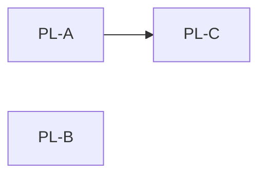

# /_BDF_batchPlan - BDF Batch-Planungs-Command (Wellen-basiert)

```yaml
status: active
version: 1.0.0
created: 2026-03-23
updated: 2026-03-23
op: BigDarkFactory
phase: BatchPlanning
type: building-block
chain_position: pre-sdf
difficulty_scaling: true
team_based: true
rf: RF-BDF-023
```

---

```
+======================================================================+
| BATCH-PLAN-COMMAND: /_BDF_batchPlan                                  |
+======================================================================+
|                                                                      |
| ACTOR: TEAM LEAD (DU — reiner Orchestrator)                         |
|   CONSTRAINT: Team Lead fuehrt KEINE Sub-Commands selbst aus.       |
|   NUR spawnen, tracken, entscheiden.                                 |
|                                                                      |
| ZWECK: Wellen-basierte Batch-Planung (Vogelperspektive — GROB).     |
|   BDF delegiert Batch-Planung an diesen Command.                     |
|   OUTPUT: Batch-Plan mit Items + Reihenfolge + Komplexitaet + Deps. |
|   TIEFE: GROB (sichtbare Schicht). KEIN 7-Modi-Check — das ist SDF. |
|                                                                      |
| ANTI-PATTERN (VERBOTEN):                                             |
|   Workers editieren Code oder Stage-Aktionen ausfuehren             |
|   Workers bewerten SRS/Fragilitaet in Detail — das ist SDF-Aufgabe  |
|   BDF-batchPlan wechselt Handschuhe zu SDF — das macht BDF         |
|                                                                      |
| RICHTIG:                                                             |
|   Workers LESEN (PL, Model, Spec, Code-Struktur) — NIE editieren    |
|   Workers schaetzen GROB (LOW/MEDIUM/HIGH) — kein tiefer Code-Dive  |
|   Output: .claude/analysis/drafts/{NAME}-batchPlan.md               |
|                                                                      |
| AUFRUF:                                                              |
|   /_BDF_batchPlan {NAME} [difficulty=normal]                         |
|                                                                      |
| LIEST:                                                               |
|   {VAULT}/_parking-lot.md     (offene [ ] Items)           |
|   .claude/models/BigDarkFactory_Model.md   (Kontext, W{n})          |
|   .claude/specs/BigDarkFactory_Spec.md     (RFs + AKs)              |
|   Code-Verzeichnisse (LESEN, KEIN Editieren)                        |
|                                                                      |
| SCHREIBT:                                                            |
|   .claude/analysis/drafts/{NAME}-batchPlan.md  (Batch-Plan)        |
|                                                                      |
| SCHREIBT NICHT (BL-165 AK-9 forbidden_keys):                        |
|   DF_BATCH_STATE.recommended_modus                                   |
|   DF_BATCH_STATE.sdf_mode / sdf_mode_hint                           |
|   DF_BATCH_STATE.expected_sdf_mode                                   |
|   DF_BATCH_STATE.mode_recommendation                                 |
+======================================================================+
```

---

## Parameter

| Parameter | Default | Werte | Beschreibung |
|-----------|---------|-------|-------------|
| `NAME` | (Pflicht) | String | Projekt-Name (z.B. BigDarkFactory) |
| `difficulty` | normal | easy, normal, hard | Planungs-Tiefe (easy=1 Drafter, normal=3 Drafter, hard=5 Explorer+5 Drafter) |

---

## Wellen-Uebersicht

```
W1: 5 Explorer ({floor}, PARALLEL)         # Default haiku, gecappt durch ceiling
  E01: PL-Items lesen
  E02: Model lesen
  E03: Spec lesen
  E04: Code-Stellen grob scannen
  E05: Dependencies ermitteln

W2: 3 Drafter ({middle}, PARALLEL)         # Default sonnet (middle rundet AUF)
  D01: Komplexitaets-Schaetzung
  D02: Dependency-Graph
  D03: Batch-Vorschlag

W3: 1 Synthese ({ceiling})                  # Default sonnet, opus wenn ceiling=opus
  → Konsolidierter Batch-Plan

# Tier-Mapping (User-Regel):
#   ceiling=opus    → W1=haiku, W2=sonnet, W3=opus
#   ceiling=sonnet  → W1=haiku, W2=sonnet, W3=sonnet (gecappt)
#   ceiling=haiku   → alle Wellen=haiku
```

---

## Ablauf (Team Lead)

### Phase 1: Initialisierung

```
name = $ARGUMENTS.NAME
difficulty = $ARGUMENTS.difficulty ?? "normal"

# Output-Pfad
batch_plan_path = ".claude/analysis/drafts/{name}-batchPlan.md"

Logge: "=== /_BDF_batchPlan GESTARTET: {name} ==="
Logge: "Difficulty: {difficulty}"
Logge: "Output: {batch_plan_path}"
```

### Phase 2: Welle 1 — Explorer (PARALLEL, 5 Workers)

Starte 5 Explorer-Workers GLEICHZEITIG. Warte bis ALLE fertig.

```
Worker E01: PL-Items-Explorer
  Auftrag: Lese {VAULT}/_parking-lot.md.
    Extrahiere ALLE offenen Items ([ ] Status).
    Pro Item: Name, Prioritaet (KRITISCH|HOCH|MITTEL|NIEDRIG), AK-Referenzen,
    difficulty-Annotation (falls vorhanden), Datum.
    Ausgabe: Liste aller offenen Items mit Metadaten.
  Output: .claude/analysis/drafts/{name}-batchPlan-E01.md

Worker E02: Model-Explorer
  Auftrag: Lese .claude/models/BigDarkFactory_Model.md.
    Identifiziere betroffene W{n}-Eintraege pro PL-Item-Thema.
    Welche Kap./W{n} beschreiben die Items? Gibt es Model-Luecken?
    Tiefe: GROB — Kapitel-Ebene reicht, kein tiefer Dive.
    Ausgabe: Item → W{n}-Zuordnung (sichtbare Ebene).
  Output: .claude/analysis/drafts/{name}-batchPlan-E02.md

Worker E03: Spec-Explorer
  Auftrag: Lese .claude/specs/BigDarkFactory_Spec.md (oder falls nicht
    vorhanden: {VAULT}/_manifest.md nach Spec-Eintraegen suchen).
    Identifiziere betroffene RFs und AKs pro PL-Item.
    Schicht-Zuordnung: Welcher Architektur-Bereich ist betroffen?
    (BDF-Layer / SDF-Layer / I-Layer / SC-Layer / Worker-Layer)
    Tiefe: GROB — RF-Katalog-Ebene reicht.
  Output: .claude/analysis/drafts/{name}-batchPlan-E03.md

Worker E04: Code-Scanner
  Auftrag: Scanne die betroffenen Code-Dateien grob.
    NUR LESEN — kein Editieren. Sichtbare Schicht reicht.
    Pro PL-Item: Welche .md-Commands oder .cs-Dateien sind offensichtlich betroffen?
    Gibt es fragile Stellen (viele Abhaengigkeiten, kritische Dateien)?
    Ausgabe: Item → betroffene Dateien (grob, nicht vollstaendig).
    WICHTIG: Kein tiefer Code-Dive — nur was auf den ersten Blick sichtbar ist.
  Output: .claude/analysis/drafts/{name}-batchPlan-E04.md

Worker E05: Dependency-Scout
  Auftrag: Untersuche Abhaengigkeiten zwischen den offenen PL-Items.
    Gibt es Items die andere Items voraussetzen? (A muss vor B kommen)
    Gibt es Dependency-Chains? (A → B → C)
    Gibt es unabhaengige Items (koennen in beliebiger Reihenfolge)?
    Quellen: PL-Item-Beschreibungen, AK-Referenzen, offensichtliche Namens-Zusammenhaenge.
    Tiefe: GROB — keine Code-Analyse noetig, logische Zusammenhaenge reichen.
  Output: .claude/analysis/drafts/{name}-batchPlan-E05.md
```

**Team Lead nach Welle 1:**
```
Warte auf alle 5 Explorer-Outputs.
Lies alle E01..E05 Dateien.
Erstelle kurze interne Zusammenfassung (nicht schreiben — im Kontext halten):
  - N offene PL-Items gefunden
  - Betroffene Schichten: [...]
  - Moegl. Dependencies: [...]
Weiter mit Welle 2.
```

### Phase 3: Welle 2 — Drafter (PARALLEL, 3 Workers)

Starte 3 Drafter-Workers GLEICHZEITIG. Warte bis ALLE fertig.

```
Worker D01: Komplexitaets-Schaetzer
  Auftrag: Lies E01..E05 Outputs.
    Schaetze GROB Komplexitaet pro PL-Item: LOW | MEDIUM | HIGH
    Kriterien (GROB, kein Detail-Dive):
      LOW:    1 Schicht, klar definiert, wenig Abhaengigkeiten, kleine Aenderung
      MEDIUM: 2 Schichten, etwas unklar, moderate Abhaengigkeiten
      HIGH:   3+ Schichten, viel unklar, viele Abhaengigkeiten, fragil
    Fragilitaet als Faktor: fragile Stellen → Batch kleiner halten.
    WICHTIG (BL-162 AK-7, F98 verschaerft 2026-05-08):
      KEIN 7-Modi-Check, KEINE Modus-Empfehlung an SDF, KEIN difficulty-Tag.
      BDF liefert nur Daten — SDF Phase 1.1 (C3) entscheidet den Modus selbst.
    Format: Tabelle mit Item | Komplexitaet | Fragilitaet
  Output: .claude/analysis/drafts/{name}-batchPlan-D01.md

Worker D02: Dependency-Graph-Ersteller
  Auftrag: Lies E01..E05 Outputs (besonders E05).
    Erstelle Dependency-Graph als Mermaid-Diagramm.
    Regeln:
      - A --> B bedeutet: A muss VOR B erledigt sein
      - Kein Pfeil = unabhaengig (kann in beliebiger Reihenfolge)
    Identifiziere:
      - Kritischer Pfad (laengste Abhaengigkeits-Kette)
      - Parallelisierbare Gruppen (unabhaengige Items)
      - Blocker (Items die viele andere blockieren)
    Format: Mermaid-Diagramm + Beschreibung der Ketten
  Output: .claude/analysis/drafts/{name}-batchPlan-D02.md

Worker D03: Batch-Vorschlaeger
  Auftrag: Lies E01..E05 + D01-Output (Komplexitaet) + D02-Output (Dependencies).
    Erstelle konkreten Batch-Vorschlag:
    Gruppierings-Kriterien:
      - Dependencies beachten (A vor B wenn A → B)
      - Aehnliche Schicht/Thema zusammen (thematische Cluster)
      - Nicht zu voll: max 5-7 Items pro Batch empfohlen
      - Fragile/HIGH-Items: kleinerer Batch (max 3-4 Items)
    Ausgabe: Batch-Nummern mit Item-Liste + Reihenfolge + Begruendung.
    Format: Batch 1: [Item-A, Item-B], Batch 2: [Item-C], ...
    WICHTIG: Items die blockiert sind (fehlende Dependencies) → spaeterer Batch.
  Output: .claude/analysis/drafts/{name}-batchPlan-D03.md
```

**Team Lead nach Welle 2:**
```
Warte auf alle 3 Drafter-Outputs.
Lies alle D01..D03 Dateien.
Pruefe Konsistenz:
  - Stimmen Komplexitaets-Einschaetzungen mit Dependency-Graph ueberein?
  - Sind alle offenen Items in mindestens einem Batch enthalten?
  - Ist kein Batch ueberladen (>7 Items bei normal complexity)?
Weiter mit Welle 3.
```

### Phase 4: Welle 3 — Synthese (1 Worker)

```
Worker Synthese:
  Auftrag: Lies alle Explorer und Drafter Outputs (E01..E05, D01..D03).
    Erstelle den finalen konsolidierten Batch-Plan als Markdown-Datei.
    Pflicht-Sektionen:
      1. Header: Datum, Projekt, Anzahl Items, Anzahl Batches
      2. Batch-Uebersicht: Tabelle (Batch | Items | Rationale | Gesamt-Komplexitaet)
      3. Pro Batch: Detail-Block (Items + Reihenfolge + Komplexitaet + Fragilitaet)
         # F98 verschaerft 2026-05-08: KEINE SDF-Empfehlung — SDF Phase 1.1 entscheidet
      4. Dependency-Graph: Mermaid-Diagramm aus D02
      5. Kritischer Pfad: Welche Items muessen in welcher Reihenfolge?
      6. Empfehlungen fuer BDF: Batch-Reihenfolge, Hinweise, Warnung bei fragilen Items
    Output-Format: siehe unten (Output-Format-Sektion)
    WICHTIG: Nur Planung — kein Code-Aendern, kein Stage, kein Commit.
  Schreibe: .claude/analysis/drafts/{name}-batchPlan.md
```

### Phase 5: Abschluss

```
Lies .claude/analysis/drafts/{name}-batchPlan.md — pruefe ob Datei existiert.

IF Datei existiert:
  Logge: "=== /_BDF_batchPlan FERTIG ==="
  Logge: "Batch-Plan: .claude/analysis/drafts/{name}-batchPlan.md"
  Logge: "Naechster Schritt: BDF liest Batch-Plan + Handschuh-Wechsel zu SDF"
ELSE:
  Logge: "FEHLER: Synthese-Output fehlt — Synthese-Worker neu starten"
  → Synthese-Worker neu starten (Phase 4 wiederholen)

# Aufraeumen: Intermediate Explorer/Drafter Files koennen bleiben (fuer Debugging).
# BDF liest NUR den konsolidierten Batch-Plan ({name}-batchPlan.md).
```

---

## Output-Format: Batch-Plan

Die Synthese schreibt folgende Datei: `.claude/analysis/drafts/{NAME}-batchPlan.md`

```markdown
---
feature: {NAME}
date: {DATUM}
type: batch-plan
version: 1.0
items_total: N
batches_total: M
status: ready
---

# Batch-Plan: {NAME}

**Erstellt:** {DATUM}
**Offene Items:** N
**Geplante Batches:** M

---

## Batch-Uebersicht

| Batch | Items | Gesamt-Komplexitaet | Rationale |
|-------|-------|---------------------|-----------|
| Batch 1 | PL-A, PL-B | MEDIUM | Gleiche Schicht, unabhaengig |
| Batch 2 | PL-C | HIGH | Fragil, allein im Batch |
| ... | | | |

---

## Batch-Details

### Batch 1

| Item | Prioritaet | Reihenfolge | Komplexitaet | Fragilitaet |
|------|-----------|-------------|-------------|-------------|
| PL-A | HOCH | 1 | LOW | niedrig |
| PL-B | MITTEL | 2 | MEDIUM | niedrig |

**Rationale:** {Begruendung fuer Gruppierung}
**Dependencies:** PL-A hat keine Voraussetzungen. PL-B ist unabhaengig von PL-A.

---

### Batch 2

| Item | Prioritaet | Reihenfolge | Komplexitaet | Fragilitaet |
|------|-----------|-------------|-------------|-------------|
| PL-C | KRITISCH | 1 | HIGH | hoch |

**Rationale:** PL-C ist fragil (viele Abhaengigkeiten) — allein im Batch fuer Sicherheit.
**Dependencies:** PL-C muss nach Batch 1 kommen (PL-B ist Voraussetzung).

---

## Dependency-Graph



---

## Kritischer Pfad

1. PL-A (Batch 1, Order 1)
2. PL-C (Batch 2, Order 1) — wartet auf PL-A

**Laengste Kette:** PL-A → PL-C

---

## Empfehlungen fuer BDF

- Batch 1 zuerst abarbeiten (PL-A + PL-B, unabhaengig)
- Batch 2 erst nach Batch 1 (PL-C braucht PL-A als Voraussetzung)
- WARNUNG: PL-C hat hohe Fragilitaet — SDF sollte kleinere Schritte waehlen
```

---

## Worker-Vertraege

### E01: PL-Items-Explorer

| Feld | Inhalt |
|------|--------|
| Modell | haiku |
| Liest | {VAULT}/_parking-lot.md |
| Schreibt | .claude/analysis/drafts/{NAME}-batchPlan-E01.md |
| Tiefe | GROB — alle offenen Items mit Metadaten |
| VERBOTEN | Code-Editieren, Stage, Commit |

### E02: Model-Explorer

| Feld | Inhalt |
|------|--------|
| Modell | haiku |
| Liest | .claude/models/BigDarkFactory_Model.md |
| Schreibt | .claude/analysis/drafts/{NAME}-batchPlan-E02.md |
| Tiefe | GROB — Kapitel-Ebene, W{n}-Zuordnung pro Thema |
| VERBOTEN | Code-Editieren, Detail-Analyse |

### E03: Spec-Explorer

| Feld | Inhalt |
|------|--------|
| Modell | haiku |
| Liest | .claude/specs/BigDarkFactory_Spec.md |
| Schreibt | .claude/analysis/drafts/{NAME}-batchPlan-E03.md |
| Tiefe | GROB — RF-Ebene, Schicht-Zuordnung |
| VERBOTEN | Code-Editieren, tiefer AK-Dive |

### E04: Code-Scanner

| Feld | Inhalt |
|------|--------|
| Modell | haiku |
| Liest | Code-Verzeichnisse (NUR LESEN) |
| Schreibt | .claude/analysis/drafts/{NAME}-batchPlan-E04.md |
| Tiefe | GROB — offensichtlich betroffene Dateien, erste Sichtebene |
| VERBOTEN | Code-Editieren — AUSSCHLIESSLICH LESEN |

### E05: Dependency-Scout

| Feld | Inhalt |
|------|--------|
| Modell | haiku |
| Liest | E01-Output + PL-Item-Beschreibungen |
| Schreibt | .claude/analysis/drafts/{NAME}-batchPlan-E05.md |
| Tiefe | GROB — logische Zusammenhaenge, keine Code-Analyse |
| VERBOTEN | Code-Editieren, tiefer Code-Dive |

### D01: Komplexitaets-Schaetzer

| Feld | Inhalt |
|------|--------|
| Modell | sonnet |
| Liest | E01..E05 Outputs |
| Schreibt | .claude/analysis/drafts/{NAME}-batchPlan-D01.md |
| Tiefe | GROB — LOW/MEDIUM/HIGH (kein 7-Modi-Check) |
| VERBOTEN | Code-Editieren, 7-Modi-Bewertung (ist SDF-Aufgabe) |

### D02: Dependency-Graph-Ersteller

| Feld | Inhalt |
|------|--------|
| Modell | sonnet |
| Liest | E01..E05 Outputs |
| Schreibt | .claude/analysis/drafts/{NAME}-batchPlan-D02.md |
| Tiefe | GROB — logische Abhaengigkeiten, Mermaid-Diagramm |
| VERBOTEN | Code-Editieren, Code-Analyse |

### D03: Batch-Vorschlaeger

| Feld | Inhalt |
|------|--------|
| Modell | sonnet |
| Liest | E01..E05 + D01 + D02 Outputs |
| Schreibt | .claude/analysis/drafts/{NAME}-batchPlan-D03.md |
| Tiefe | Batch-Gruppierung, Reihenfolge, Rationale |
| VERBOTEN | Code-Editieren, Stage, Commit |

### Synthese: Batch-Plan-Konsolidierer

| Feld | Inhalt |
|------|--------|
| Modell | sonnet |
| Liest | E01..E05 + D01..D03 Outputs |
| Schreibt | .claude/analysis/drafts/{NAME}-batchPlan.md |
| Tiefe | Finaler Plan — alle Sektionen (Uebersicht + Details + Graph + Empfehlungen) |
| VERBOTEN | Code-Editieren, Stage, Commit |

---

## Akzeptanzkriterien (RF-BDF-023)

| AK-ID | Kriterium |
|-------|-----------|
| AK-BDF-023a | 3-Wellen-Struktur beschrieben (W1 Explorer + W2 Drafter + W3 Synthese) |
| AK-BDF-023b | W1: 5 Workers, lesen PL + Model + Spec + Code + Dependencies |
| AK-BDF-023c | W2: 3 Workers, 2 Flavors (Komplexitaet GROB + Dependency-Graph) |
| AK-BDF-023d | W3: 1 Worker, konsolidiert zu Batch-Plan |
| AK-BDF-023e | Output: items-Liste mit order + complexity_grob + depends_on |
| AK-BDF-023f | Tiefe GROB (Vogelperspektive) — kein Code-Detail, kein 7-Modi-Check |
| AK-BDF-023g | Workers: NUR Planung — kein Code-Aendern, kein Stage, kein Commit |
