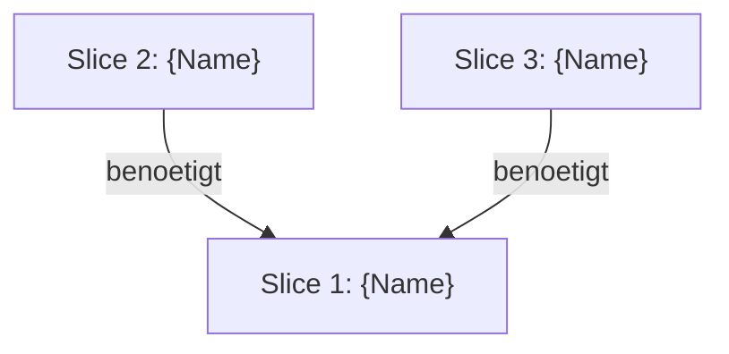
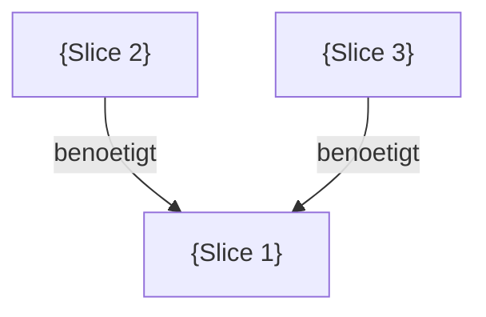

# /_I_cleanCodeArchitect

**Status:** NEU v3.1 (Implementierungs-Pipeline Phase 1, Mitose-Support)
**Actor:** ARCHITEKT
**Zweck:** System-Dekomposition in vertikale Slices + Architektur-Entscheidungen

---

## Vertrag

```
╔═══════════════════════════════════════════════════════════════════════════╗
║  COMMAND: /_I_cleanCodeArchitect {NAME} [easy|normal|hard]                ║
╠═══════════════════════════════════════════════════════════════════════════╣
║  LIEST (Input) - PFLICHT:                                                ║
║    1. .claude/analysis/_manifest.md                                      ║
║    2. .claude/Task.md (Feature-Definition)                               ║
║    3. .claude/analysis/synthese/{NAME}-GAP.md (falls vorhanden)         ║
║       ◄── NEU v3.0: Delta IST↔SOLL + Priorisierung fuer Slices        ║
║    4. .claude/specs/{NAME}_Spec.md (falls vorhanden, SOLL-Zustand)     ║
║    5. .claude/models/{NAME}_Model.md (falls vorhanden, IST-Zustand)     ║
║    6. .claude/analysis/synthese/{NAME}-BOUNDARIES.md (falls vorhanden)  ║
║       → Reuse von bestehender Dekomposition aus wiss. Zyklus            ║
║    7. Codebase (via Glob/Grep/Read)                                     ║
║    8. MCP Clean Code (Uncle Bob Queries)                                 ║
║    9. .claude/analysis/evidence/*.md (optional, falls vorhanden)         ║
║       → Architektur-Constraints beachten VOR Slice-Schnitt              ║
║       → constraint-Evidence = "NIE so implementieren" (hard rule)       ║
║                                                                          ║
║  SCHREIBT (Output) - PFLICHT:                                            ║
║    .claude/analysis/synthese/{NAME}-ARCHITECT.md                         ║
║      → System-Ueberblick (Architektur-Vision)                           ║
║      → Vertikale Slices (FE → BE → DB pro Feature-Teil)                ║
║      → Abhaengigkeiten zwischen Slices                                  ║
║      → Architektur-Entscheidungen (DIP, Patterns, Boundaries)          ║
║      → Test-Pyramide (Unit → Integration → System)                     ║
║      → Uncle Bob Empfehlungen (MCP Queries)                             ║
║      → Empfohlene Slice-Reihenfolge                                     ║
║    .claude/analysis/_manifest.md (aktualisieren)                         ║
║                                                                          ║
║  SCHREIBT (Output) - OPTIONAL:                                           ║
║    .claude/SLICE-BRIEFINGS.md                                           ║
║      → Konkrete Code-Aenderungen, Dateien, Tests pro Slice             ║
║      → Quick-Reference fuer Worktree-Arbeit (von FanOut genutzt)       ║
║    .claude/_parking-lot.md (APPEND, falls Incidental Findings)          ║
║                                                                          ║
║  MCP INTEGRATION:                                                        ║
║    - mcp__cleancoder__query() fuer Architektur-Guidance                 ║
║    - Query Topics:                                                       ║
║      * "architecture for {feature description}"                         ║
║      * "vertical slicing strategy for {component types}"               ║
║      * "dependency inversion boundaries {layer description}"            ║
║      * "test pyramid strategy for {feature type}"                       ║
║                                                                          ║
║  MCP-BREMSE:                                                             ║
║    ┌─────────────────────────────────────────────────────────┐           ║
║    │  easy:   MIDDLE-Modus → max 3 Queries, limit=3         │           ║
║    │  normal: MAX-Modus    → max 5 Queries, limit=5         │           ║
║    │  hard:   MAX-Modus    → max 5 Queries, limit=5         │           ║
║    │                                                         │           ║
║    │  Modi:  min=1Q/1R  middle=3Q/3R  max=5Q/5R            │           ║
║    │  Planer-Phase: Schwierigkeit bestimmt Modus             │           ║
║    └─────────────────────────────────────────────────────────┘           ║
║                                                                          ║
║  PIPELINE-POSITION:                                                      ║
║    [/_taskDefinition] → [/_spec] → [/_model] → [/_gap]                  ║
║      → [/_I_cleanCodeArchitect] → [/_I_mitose] → [/_I_fanOut]          ║
║      → [/_I_cleanCodeSlice pro Worktree]                                ║
║                                                                          ║
║  ACTOR: ARCHITEKT                                                        ║
║    Zerlegt das Feature in vertikale Slices.                             ║
║    Trifft Architektur-Entscheidungen mit Uncle Bob.                     ║
║    KEINE Code-Aenderungen, KEINE Tests.                                 ║
╚═══════════════════════════════════════════════════════════════════════════╝
```

---

## Verantwortlichkeit

Der **ARCHITEKT** Actor hat eine einzige Verantwortung:

**System in vertikale Slices zerlegen + Architektur-Entscheidungen treffen**

Was der Architekt **TUT**:
- ✅ Feature in vertikale Slices zerlegen (FE → BE → DB)
- ✅ Abhaengigkeiten zwischen Slices identifizieren
- ✅ Architektur-Entscheidungen treffen (DIP, Boundaries, Patterns)
- ✅ Test-Pyramide definieren (welche Tests auf welcher Ebene)
- ✅ Uncle Bob MCP befragen fuer Architektur-Guidance
- ✅ Slice-Reihenfolge empfehlen (Canary-First, Dependencies)
- ✅ Bestehende BOUNDARIES.md wiederverwenden (falls vorhanden)

Was der Architekt **NICHT TUT**:
- ❌ Code schreiben (→ /_I_codeAtomic)
- ❌ Tests schreiben (→ /_I_codeAtomic)
- ❌ Einzelne Slices planen (→ /_I_cleanCodeSlice)
- ❌ Model.md updaten (→ /_SC_modelMaintain)
- ❌ Findings sammeln (→ /_SC_observe)

---

## Pipeline-Position

```
TASKDEFINITION → [SPEC] → MODEL → [GAP] → **CLEANCODEARCHITECT** → MITOSE → CLEANCODESLICE
                                |
                                ↓
                          ARCHITECT.md
                          (Slices + Architektur)
                                ↓
                    Falls parallele Slices:
                         /_I_mitose (Worktrees)
                    Falls nur 1 Slice:
                         /_I_cleanCodeSlice
```

**Prev:** /_gap (GAP-Analyse nach Model+Spec)
**Next:** /_I_mitose (falls parallele Slices) ODER /_I_cleanCodeSlice (falls nur 1 Slice)

**Eskalation:** Bei Architektur-Zweifeln → /_model (wissenschaftlicher Zyklus)

---

## Uncle Bob's Leitprinzip

> "We avoid big design up front, but we also avoid no design up front.
> There is real value to thinking through the system, and creating a
> decoupled domain model up front. But we err on the side of the small
> and the simple. Our goal is to establish the basic shape of the system
> and not to think through every single little detail."

**Bedeutung fuer diese Phase:**
- Architektur-Ueberblick JA, Detail-Design NEIN
- Slices definieren JA, Implementation planen NEIN
- Boundaries identifizieren JA, Code schreiben NEIN
- Simple und klein halten, nicht over-engineeren

---

## Schritt 0: Manifest + Inputs lesen

**IMMER als Erstes:**

1. Lies `.claude/analysis/_manifest.md`
   - Ermittle aktuellen {NAME}
   - Pruefe ob Task.md existiert
   - Lies **SYSTEM-MODEL** aus System-Konfiguration
2. Lies `.claude/Task.md`
   - Feature-Beschreibung
   - Akzeptanzkriterien
   - Scope-Grenzen
3. Lies `.claude/models/{NAME}_Model.md` (falls vorhanden)
   - IST-Zustand des Systems
   - Bekannte Wahrheiten (W{n})
   - Aktive TCs
4. Lies `.claude/analysis/synthese/{NAME}-BOUNDARIES.md` (falls vorhanden)
   - REUSE: Bestehende Dekomposition aus wissenschaftlichem Zyklus
   - Teilprobleme und Datei-Mapping uebernehmen
   - Vertikale Suche Ergebnisse wiederverwenden

---

## Schritt 1: Codebase-Exploration

Verschaffe dir einen Ueberblick ueber die bestehende Architektur:

```
1. Glob-Suche nach bestehenden Layern:
   - FE: **/src/app/**/*.component.ts
   - BE: **/Controllers/**/*Controller.cs
   - BE: **/Services/**/*Service.cs
   - DB: **/Entities/**/*.cs
   - Tests: **/*.spec.ts, **/*Tests.cs

2. Bestehende Patterns identifizieren:
   - Controller-Service-Repository Muster?
   - Dependency Injection vorhanden?
   - Interface-basierte Abstraktion?
   - Bestehende Test-Infrastruktur?
```

---

## Schritt 2: Uncle Bob MCP Queries

### Query 1: Architektur-Vision

```python
mcp__cleancoder__query(
    "architecture for {FEATURE_DESCRIPTION},
     vertical slicing strategy,
     dependency inversion principles,
     clean architecture boundaries"
)
```

**Ergebnis dokumentieren:** Uncle Bob's Empfehlungen fuer Gesamtarchitektur

### Query 2: Test-Pyramide

```python
mcp__cleancoder__query(
    "test pyramid for {FEATURE_TYPE},
     unit tests vs integration tests vs system tests,
     outside-in testing strategy,
     when to use mocks vs real implementations"
)
```

**Ergebnis dokumentieren:** Welche Tests auf welcher Ebene

### Query 3: Boundary Crossings (falls relevant)

```python
mcp__cleancoder__query(
    "dependency inversion at boundaries,
     {SPECIFIC_BOUNDARY_DESCRIPTION},
     interface design for testability"
)
```

---

## Schritt 3: Slice-Dekomposition

### Vertikale Slices definieren

Fuer JEDES identifizierte Teilproblem:

```markdown
### Slice: {SLICE_NAME}

**Vertikale Komponenten:**
- **FE:** {Komponenten (Component, Service, Model)}
- **BE:** {Komponenten (Controller, Service, Repository)}
- **DB:** {Komponenten (Entity, Migration)}

**Schnittstellen:**
- {API Endpoints}
- {Events/Messages}

**Abhaengigkeiten:**
- {Andere Slices die benoetigt werden}
- {Shared Services}
```

### Abhaengigkeits-Graph



### Reihenfolge-Empfehlung

| Schritt | Slice | Begruendung |
|---------|-------|-------------|
| 1 | {Slice} | {Canary-First / Keine Dependencies / Foundation} |
| 2 | {Slice} | {Abhaengig von Schritt 1} |
| 3 | {Slice} | {Abhaengig von Schritt 1+2} |

**Strategie:** Canary-First (Peripherie vor Core, einfachster Slice zuerst)

---

## Output-Format: ARCHITECT.md

**Pfad:** `.claude/analysis/synthese/{NAME}-ARCHITECT.md`

```markdown
---
name: {NAME}
phase: architect
pipeline: implementation
tier: {SYSTEM-MODEL}
model: {TATSAECHLICHES-MODELL}
agent: Hauptagent
date: {YYYY-MM-DD}
reads: Task.md, models/{NAME}_Model.md
status: final
---

# Architektur: {NAME}

**Feature:** {Beschreibung aus Task.md}
**Datum:** {YYYY-MM-DD}
**Uncle Bob Architekt:** Clean Code MCP

## 1. System-Ueberblick

{2-3 Saetze: Was wird gebaut? Welche Layer sind beteiligt?}

### Uncle Bob's Architektur-Empfehlung

> {Relevantes Zitat aus MCP Query 1}

**Architektur-Typ:** {Clean Architecture / Layered / Microservice / ...}
**Kern-Prinzip:** {DIP / SRP / OCP / ...}

## 2. Vertikale Slices

### Slice 1: {NAME}

**Vertikale Komponenten:**
- **FE:** {Komponenten}
- **BE:** {Komponenten}
- **DB:** {Komponenten}

**Schnittstellen:**
- {API Endpoints}

**Komplexitaet:** leicht / mittel / schwer

---

### Slice 2: {NAME}
...

## 3. Abhaengigkeits-Graph



**Kritischer Pfad:** {Slice-Reihenfolge}

## 4. Architektur-Entscheidungen

### Dependency Inversion

> {Uncle Bob Zitat ueber DIP}

**Boundaries:**
```
{Layer 1} → I{Interface} ← {Layer 2}
```

**Entscheidung:** {Welche Interfaces? Warum?}

### Test-Strategie

> {Uncle Bob Zitat ueber Tests}

**Test-Pyramide:**
```
        /  System Tests  \        (/_I_codeSystem)
       / Integration Tests \      (/_I_codeIntegration)
      /    Unit Tests        \    (/_I_codeAtomic)
```

**Pro Slice:**
- Unit Tests: {Was wird getestet?}
- Integration Tests: {Was wird getestet?}
- System Tests: {Was wird getestet?}

## 5. Empfohlene Reihenfolge

| # | Slice | Komplexitaet | Begruendung |
|---|-------|--------------|-------------|
| 1 | {Slice} | leicht | Canary: Peripherie, keine Dependencies |
| 2 | {Slice} | mittel | Abhaengig von Slice 1 |
| 3 | {Slice} | schwer | Core-Logic, abhaengig von 1+2 |

**Strategie:** {Canary-First / Dependency-Order / Risk-First}

## 6. Eskalations-Trigger

Wann zurueck zum wissenschaftlichen Zyklus:
- [ ] Architektur unklar nach MCP-Befragung → /_model
- [ ] Bestehender Code unverstaendlich → /_SC_observe
- [ ] Model.md veraltet/fehlt → /_model

## 7. Zusammenfassung

{N} Slices identifiziert. Empfohlene Reihenfolge: {Slices}.

### Naechster Schritt

Falls **mehrere Slices parallel** moeglich (keine Abhaengigkeiten):
→ /_I_mitose {FEATURE_PREFIX}
  (Erstellt Git Worktrees fuer parallele Slice-Bearbeitung)

Falls **nur 1 Slice** oder **strikt sequenziell**:
→ /_I_cleanCodeSlice {ERSTER_SLICE}
```

---

## Schwierigkeits-Parameter

| Schwierigkeit | MCP Queries | Codebase-Tiefe |
|---------------|-------------|----------------|
| **easy** | 1-2 Queries | Oberflaechlich |
| **normal** | 2-3 Queries | Standard |
| **hard** | 3-5 Queries + Subagenten | Tiefenanalyse |

---

## Bruecke zu bestehenden Commands

### Reuse von /_architecturalBoundaries

Falls `.claude/analysis/synthese/{NAME}-BOUNDARIES.md` existiert:
- **Teilprobleme** → werden zu **Slices** uminterpretiert
- **Datei-Mapping** (Sektion 6) → wird direkt uebernommen
- **Abhaengigkeiten** (Sektion 3) → werden direkt uebernommen
- **BOUNDARIES.md bleibt unveraendert** (ARCHITECT.md ist Ergaenzung)

### Reuse von Model.md

Falls `.claude/models/{NAME}_Model.md` existiert:
- **W{n}** → IST-Zustand als Kontext
- **TCs** → Layer-Information fuer Slice-Zuordnung
- **Kap. 6a** → Offene Bereiche als Slice-Kandidaten

---

## Parking Lot Integration

Falls waehrend Architektur-Planung Incidental Tasks auffallen:

```markdown
## {YYYY-MM-DD} - Von /_I_cleanCodeArchitect (Pipeline)

- [ ] **{Task-Titel}**
  - **Beschreibung:** {1-2 Saetze}
  - **Grund:** {Entdeckt waehrend Architektur-Planung}
  - **Prioritaet:** HOCH / MITTEL / NIEDRIG
  - **TC-Naehe:** {Technologie-Concern}
  - **Quelle:** Architektur-Analyse in ARCHITECT.md
```

---

## Kompakt-Sicherheit

Nach Command-Abschluss:
- State: ARCHITECT.md geschrieben
- Resume: /_I_cleanCodeSlice kann ARCHITECT.md lesen

---

## Obsidian-Tags

```yaml
tags:
  - type/architect
  - pipeline/implementation
  - op/{FEATURE}
  - topic/Architecture
  - topic/Vertical-Slicing
pipeline-position: architect
prev: [[Task.md]]
next: [[I_mitose]] (parallel) | [[I_cleanCodeSlice]] (single)
```

---

## Siehe auch

- [[I_mitose]] - Naechster Schritt bei parallelen Slices (Git Worktrees)
- [[I_cleanCodeSlice]] - Naechster Schritt bei einzelnem Slice
- [[_architecturalBoundaries]] - Bestehende Dekomposition (Reuse)
- [[_taskDefinition]] - Feature-Definition (Input)
- [[_model]] - Eskalation bei Architektur-Zweifeln

---

## NOTIFY (Pflicht - Allerletzter Schritt)

**NUR wenn ALLES fertig ist** (alle Schritte abgeschlossen, Zusammenfassung ausgegeben):

```bash
powershell -Command "notify '{FEATURE} /_I_cleanCodeArchitect abgeschlossen'"
```

WICHTIG: Keine Zwischen-Benachrichtigungen! NUR ganz am Ende.
