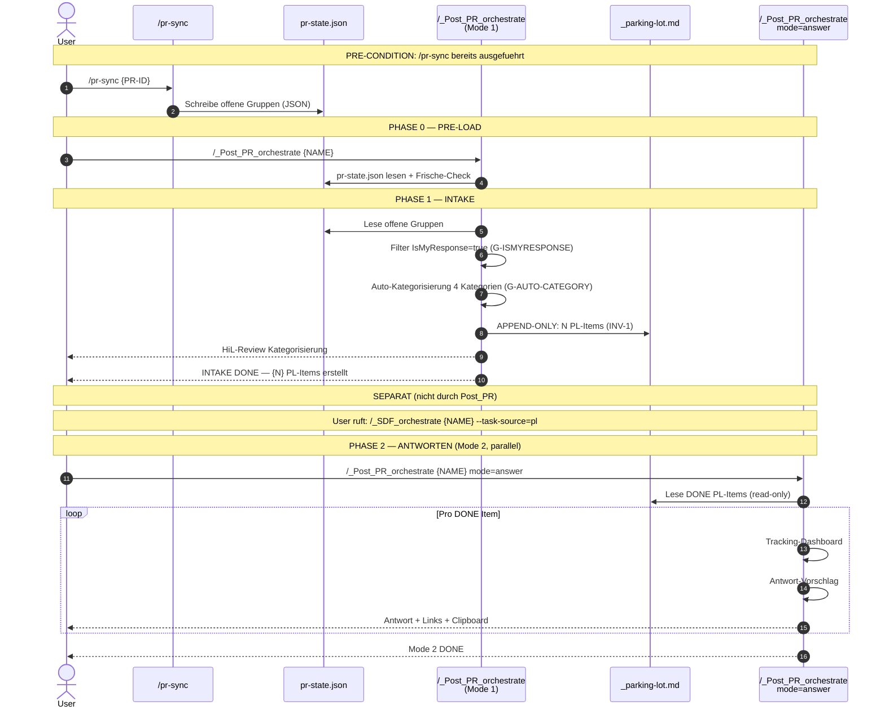
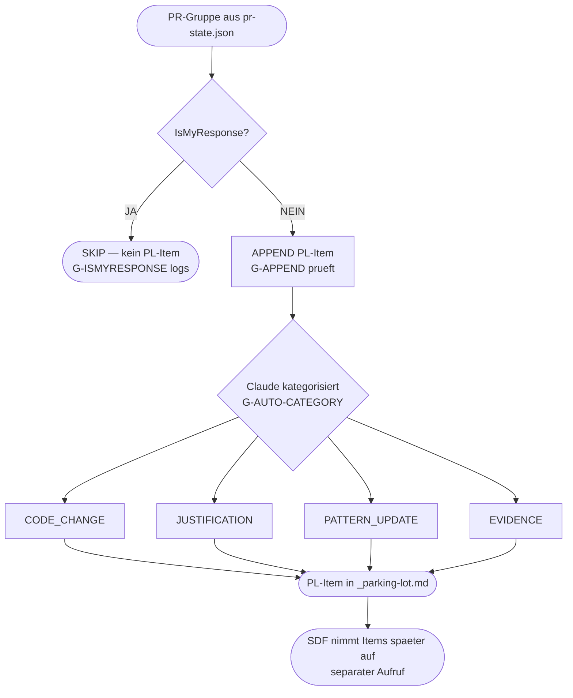
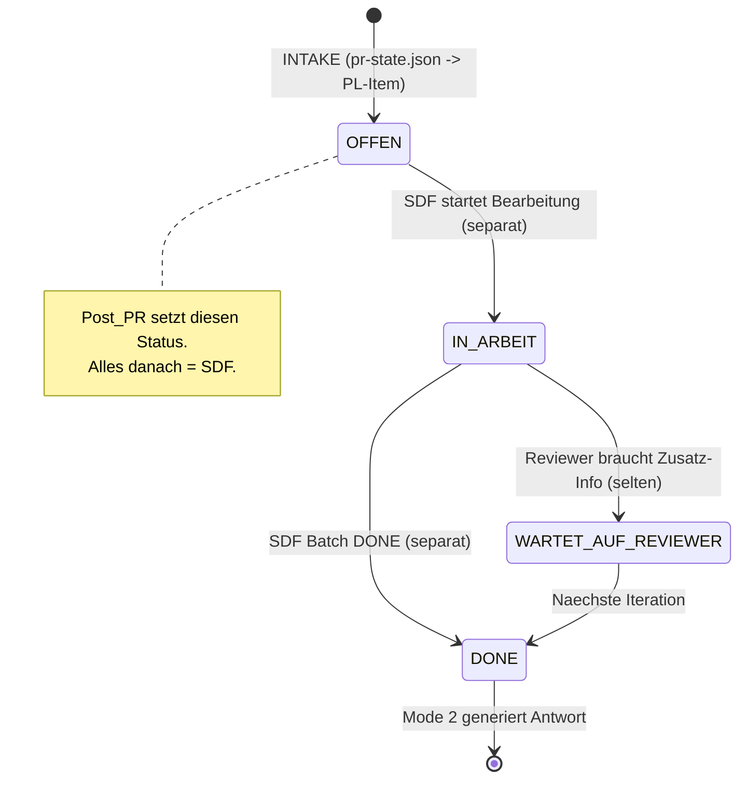

# /_Post_PR_orchestrate - Team Lead PR-Review Orchestrierung

```yaml
status: active
version: 2.3.0
created: 2026-04-13
updated: 2026-04-13
op: PostPR
phase: Meta
type: orchestration
chain_position: post-pr
difficulty_scaling: false
team_based: false
feeds_into:
  - _SDF_orchestrate
  - _parking-lot
related:
  - pr-sync
  - _SDF_orchestrate
replaces:
  - /pr-review
  - /pr-answer
  - /pr-status
```

---

```
+======================================================================+
| VERTRAG: /_Post_PR_orchestrate                                       |
+======================================================================+
|  LIEST:                                                              |
|    .claude/pr-state.json              (PR-Gruppen, IsMyResponse)     |
|    .claude/commands/_parking-lot.md   (Duplikat-Check, Status)       |
|    .claude/evidence/*.md              (Evidence-Links fuer Mode 2)   |
|                                                                      |
|  SCHREIBT:                                                           |
|    .claude/commands/_parking-lot.md   (APPEND-ONLY, INV-1)           |
|      Neue PL-Items mit Kategorie + Metadaten                        |
|                                                                      |
|  SCHREIBT NICHT:                                                     |
|    Keinen Code. Kein Model. Kein K-Score. Keine Evidence.            |
|    Keine Commits. Kein Manifest-State.                               |
|    (All das macht SDF wenn User SDF separat aufruft.)                |
|                                                                      |
|  RUFT AUF:                                                           |
|    NICHTS. Post_PR delegiert an NIEMANDEN.                           |
|    Post_PR ERSTELLT nur PL-Items. Fertig.                            |
|                                                                      |
|  HAUPTPRODUKT: PL-Items in _parking-lot.md (Mode 1)                 |
|                Antwort-Vorschlaege (Mode 2, Konsolen-Output)         |
|                                                                      |
|  INVARIANTEN:                                                        |
|    INV-1:  APPEND-ONLY in _parking-lot.md — NIEMALS ueberschreiben  |
|    INV-4:  Claude kategorisiert automatisch — User korrigiert nur HiL|
|    INV-5:  IsMyResponse=true -> KOMPLETT uebersprungen               |
|    INV-7:  Mode 2 = read-only (schreibt nichts persistent)          |
|    INV-8:  JUSTIFICATION ist Untermenge von EVIDENCE                 |
|    INV-9:  PL-Format rueckwaerts-kompatibel — Checkbox = Master     |
|    INV-14: Timestamp + Quelle PFLICHT bei jedem neuen PL-Item       |
+======================================================================+
```

---

```
+======================================================================+
| META-COMMAND: /_Post_PR_orchestrate                                  |
+======================================================================+
|                                                                      |
| ACTOR: TEAM LEAD (DU — die ausfuehrende Claude-Instanz)            |
|   Team Lead fuehrt INTAKE direkt aus (kein Agent, kein Handschuh).  |
|                                                                      |
| ZWECK: PR-Kommentare von Reviewern als PL-Items in _parking-lot.md |
|   schreiben. Automatische Kategorisierung in 4 Typen.               |
|   Das ist ALLES. Keine Implementierung, kein K-Score, kein Batch.  |
|   SDF nimmt die PL-Items spaeter auf (separater Aufruf).           |
|                                                                      |
| ZWEI MODI:                                                          |
|   MODE 1 (default):  Pre-Load -> INTAKE -> PL-Items erstellt       |
|   MODE 2 (answer):   Read-only Antwort-Generierung (parallel)      |
|                                                                      |
| KEIN HANDSCHUH-WECHSEL. KEIN Agent-Spawn. KEIN Sub-Command.        |
|                                                                      |
| DANACH (separat, NICHT durch Post_PR ausgeloest):                   |
|   User oder BDF ruft: /_SDF_orchestrate {NAME} --task-source=pl    |
|   SDF macht: K-Score -> Modus-Wahl (M5: SC+Standard) ->            |
|              SC_orchestrate (denken) -> I_orchestrate (implementieren)|
|                                                                      |
| FLOW:                                                               |
|   MODE 1: pr-state.json lesen -> INTAKE -> PL-Items -> DONE        |
|   MODE 2: PL lesen -> Dashboard -> Antwort-Vorschlaege             |
+======================================================================+
```

---

## Aufruf

```
/_Post_PR_orchestrate {NAME} [mode=answer]
```

**Parameter:**

| Parameter | Default | Werte | Beschreibung |
|-----------|---------|-------|-------------|
| `name` | (PFLICHT) | String | Feature-Name (z.B. DCSRE-881). |
| `mode` | (leer) | leer, answer | Leer = Mode 1 (INTAKE). `answer` = Mode 2 (read-only). |

**Beispiele:**
```
/_Post_PR_orchestrate DCSRE-881                    -> Mode 1: INTAKE
/_Post_PR_orchestrate DCSRE-881 mode=answer        -> Mode 2: Antworten (read-only)
```

---

## 2-PHASEN-ARCHITEKTUR (Mermaid)



---

## KATEGORIE-ROUTING (Mermaid)



---

## STATUS-MASCHINE (Mermaid)



---

## PHASE 0: PRE-LOAD

### Schritt 0.1: Mode-Erkennung

```
IF mode == "answer":
  GOTO Phase_2_Mode2(NAME)
  RETURN
```

### Schritt 0.2: Parameter-Validierung

```
ASSERT NAME != null, "ABORT: Feature-Name {NAME} ist PFLICHT"

# pr-state.json Existenz + Frische
pr_state_path = ".claude/pr-state.json"
ASSERT file_exists(pr_state_path), "ABORT: pr-state.json nicht gefunden — zuerst /pr-sync ausfuehren"

pr_state = read_json(pr_state_path)
pr_state_age = now() - pr_state.timestamp
IF pr_state_age > 60min:
  WARNING "pr-state.json ist {pr_state_age} alt — ggf. /pr-sync erneut ausfuehren"

# _parking-lot.md Existenz
pl_path = ".claude/commands/_parking-lot.md"
ASSERT file_exists(pl_path), "ABORT: _parking-lot.md nicht gefunden"

Logge: "[POST-PR] Phase 0 PRE-LOAD DONE"
```

---

## PHASE 1: INTAKE (Team Lead direkt)

### Schritt 1.1: PR-Gruppen zu PL-Items

```
# Bestehende PL-Items lesen fuer Duplikat-Check
existing_pl_items = parse_parking_lot(pl_path)
existing_sources = [item.source FOR item IN existing_pl_items WHERE item.source STARTS_WITH "Gr."]

open_groups = []
skipped_count = 0
new_items = []

FOR group IN pr_state.groups:
    # G-ISMYRESPONSE: IsMyResponse=true uebersprungen (INV-5)
    IF group.IsMyResponse == true:
        skipped_count += 1
        LOG "G-ISMYRESPONSE: SKIP Gr.{group.id} (letzter Autor: {group.last_author})"
        CONTINUE

    # Nur offene Gruppen (nicht resolved, nicht outdated)
    IF group.status != "open":
        CONTINUE

    # G-APPEND Duplikat-Check (INV-1, Idempotenz)
    source_key = "Gr.{group.id}"
    IF source_key IN existing_sources:
        LOG "G-APPEND: SKIP Gr.{group.id} — PL-Item existiert bereits (Idempotenz)"
        CONTINUE

    open_groups.append(group)

# Exit bei 0 offenen Gruppen
IF len(open_groups) == 0:
    OUTPUT "Alle Gruppen beantwortet oder nicht relevant."
    OUTPUT "IsMyResponse-Skips: {skipped_count}"
    OUTPUT "Bestehende PL-Items: {len(existing_sources)}"
    RETURN
```

### Schritt 1.2: Auto-Kategorisierung (INV-4)

```
FOR group IN open_groups:
    category = auto_categorize(group)
    # G-AUTO-CATEGORY: Audit-Trail protokollieren
    LOG "G-AUTO-CATEGORY: Gr.{group.id} -> {category} (Claude-Entscheidung, {now()})"

    # PL-Item erstellen (INV-14: Timestamp + Quelle PFLICHT)
    beschreibung = truncate(group.summary, 300)  # AK-11: max 300 Zeichen
    timestamp = format_date(now())

    new_item = {
        checkbox: "[ ]",
        label: "[{category}]",
        beschreibung: beschreibung,
        annotation: "(PR-Gr.{group.id}) {timestamp} src: pr-state.json",
        frontmatter: {
            source: "Gr.{group.id}",
            category: category,
            status: "OFFEN",
            k_score: null,
            micro_assay: null,
            evidence_ref: null,
            presentation_link: null
        }
    }
    new_items.append(new_item)

# G-APPEND: APPEND-ONLY schreiben (INV-1)
append_to_parking_lot(pl_path, new_items)
OUTPUT "INTAKE: {len(new_items)} neue PL-Items erstellt, {skipped_count} IsMyResponse uebersprungen"
```

### Schritt 1.2a: Auto-Kategorisierung Detail

```
FUNCTION auto_categorize(group):
    # Claude analysiert den Reviewer-Kommentar und bestimmt die Kategorie
    #
    # CODE_CHANGE: Reviewer fordert Code-Aenderung (Bug, Logik, Refactoring)
    #   Indikatoren: "sollte", "muss geaendert", "Bug", "falsch", "bitte aendern"
    #
    # JUSTIFICATION: Pattern korrekt, muss erklaert werden
    #   Indikatoren: "warum", "Begruendung", "erklaeren", bestehender Code verteidigen
    #   JUSTIFICATION ist Untermenge von EVIDENCE (INV-8)
    #
    # PATTERN_UPDATE: Neues Pattern / Konvention entdeckt
    #   Indikatoren: "Konvention", "Pattern", "Standard", "Best Practice"
    #
    # EVIDENCE: Bewusste Abweichung, braucht Rechtfertigung
    #   Indikatoren: "Architektur-Entscheidung", "bewusst", "Trade-off"
    #
    # Hierarchie: JUSTIFICATION subset EVIDENCE
    # Richtung: JUSTIFICATION kann zu PATTERN_UPDATE fuehren (nicht umgekehrt)

    context = {
        kommentar: group.comments,
        betroffene_dateien: group.files,
        code_kontext: group.diff_context
    }

    category = claude_classify(context, enum=[CODE_CHANGE, JUSTIFICATION, PATTERN_UPDATE, EVIDENCE])
    RETURN category
```

### Schritt 1.3: HiL-Review Kategorisierung

```
OUTPUT "=== HIL-REVIEW: KATEGORISIERUNG ==="
OUTPUT ""

FOR item IN new_items:
    OUTPUT "  {item.frontmatter.source}: [{item.frontmatter.category}] {item.beschreibung}"

OUTPUT ""
OUTPUT "Korrekturen? (z.B. 'Gr.3 -> CODE_CHANGE' oder ENTER fuer Weiter)"

user_input = AskUserQuestion()

IF user_input != "":
    corrections = parse_corrections(user_input)
    FOR correction IN corrections:
        old_cat = get_item(correction.source).frontmatter.category
        new_cat = correction.new_category

        # G-AUTO-CATEGORY: Audit-Trail
        LOG "G-AUTO-CATEGORY: {correction.source} korrigiert: {old_cat} -> {new_cat} (HiL, {now()})"

        get_item(correction.source).frontmatter.category = new_cat

    # PL-Items mit Korrekturen aktualisieren
    update_parking_lot_categories(pl_path, new_items)
    OUTPUT "  {len(corrections)} Korrekturen angewendet"
```

### Schritt 1.4: INTAKE Abschluss

```
OUTPUT ""
OUTPUT "=== POST-PR INTAKE ABGESCHLOSSEN ==="
OUTPUT ""
OUTPUT "Ergebnis: {len(new_items)} PL-Items erstellt, {skipped_count} IsMyResponse uebersprungen"
OUTPUT ""
OUTPUT "Weiter: Phase 2 (Vorarbeit) → Phase 3 (Abarbeitung) automatisch..."
```

---

## PHASE 2: VORARBEIT — A_ORCHESTRATE PR-RESYNC (Handschuh-Wechsel)

```
# ═══ HANDSCHUH-WECHSEL: Post_PR → A_orchestrate (pl-resync) ═══
# A_orchestrate analysiert die neuen PL-Items:
#   - W_fetch (bestehendes Wissen laden)
#   - modelMaintain (Model auf PL-Item-Bereich aktualisieren)
#   - K-Score pro PL-Item berechnen (Wellen-basiert!)
#   - Reifegrad + Mode-Recommendation
#
# ANTI-PATTERN: K-Score SELBST berechnen ← VERBOTEN
# RICHTIG: Skill("_A_orchestrate") — A macht das mit Wellen.

Logge: "[POST-PR] Phase 2: Handschuh-Wechsel → A_orchestrate pl-resync"
Logge: "[POST-PR] A analysiert PL-Items: W_fetch → modelMaintain → K-Score (Wellen)"

Skill(skill="_A_orchestrate", args="{NAME} pl-resync")

# Nach A-Completion: K-Score pro PL-Item im Manifest
Logge: "[POST-PR] Phase 2 DONE. A_orchestrate pl-resync abgeschlossen."
Logge: "[POST-PR] K-Score + Reifegrad fuer PL-Items verfuegbar."
```

---

## PHASE 3: ABARBEITUNG — SDF (Handschuh-Wechsel)

```
# ═══ HANDSCHUH-WECHSEL: Post_PR → SDF_orchestrate ═══
# SDF nimmt die PL-Items auf und routet sie:
#   - 7-Modi-Entscheidung basierend auf K-Score (M1-M7)
#   - SC_orchestrate (denkt ueber das Problem nach)
#   - I_orchestrate FULL (implementiert)
#   - stage_orchestrate (Commit pro Batch)
#   - GAP-Loop bis 0%
#
# ANTI-PATTERN: Implementation SELBST machen ← VERBOTEN
# RICHTIG: Skill("_SDF_orchestrate") — SDF macht alles.

Logge: "[POST-PR] Phase 3: Handschuh-Wechsel → SDF_orchestrate (task-source=pl)"
Logge: "[POST-PR] SDF routet PL-Items: Modi-Entscheidung → SC → I → stage"

Skill(skill="_SDF_orchestrate", args="{NAME} --task-source=pl")

# Nach SDF-Completion: PL-Items sind [x] DONE
Logge: "[POST-PR] Phase 3 DONE. SDF-Abarbeitung abgeschlossen."
Logge: "[POST-PR] PL-Items verarbeitet. mode=answer fuer Antworten verfuegbar."

OUTPUT ""
OUTPUT "=== POST-PR ABARBEITUNG ABGESCHLOSSEN ==="
OUTPUT ""
OUTPUT "Fuer Antwort-Generierung (parallel moeglich):"
OUTPUT "  /_Post_PR_orchestrate {NAME} mode=answer"
```

---

## PHASE 4: MODE 2 — ANTWORT-GENERIERUNG (mode=answer, read-only)

Phase 4 ist ein **interaktiver 1-auf-1 Loop**. Pro Gruppe: Thread oeffnen, Antwort generieren,
Clipboard kopieren, User pastet, "next". Kein Batch, kein Parallel — sequentiell mit User.

**Voraussetzungen:**
- /pr-sync {PR-ID} wurde ausgefuehrt (pr-state.json existiert mit Thread-IDs)
- PL-Items existieren (Mode 1 INTAKE wurde ausgefuehrt)
- pr-state.json enthaelt die Gruppen-Nummern die zu den PL-Items gehoeren

**G-MODE2-READONLY:** Alle schreibenden Operationen BLOCKIERT (INV-7).
Mode 2 liest PL + pr-state, generiert Antworten, kopiert ins Clipboard. Schreibt NICHTS.

### Schritt 4.0: Daten laden + Dashboard

Lies _parking-lot.md und pr-state.json. Zaehle Status (OFFEN/IN_ARBEIT/DONE).
Zeige Tracking-Dashboard:

```
+======================================================+
|  POST-PR TRACKING DASHBOARD — {NAME}                 |
+======================================================+
|  DONE:                  {N}                           |
|  IN_ARBEIT:             {M}                           |
|  OFFEN:                 {O}                           |
|  GESAMT:                {T}                           |
+======================================================+
```

Filtere nur PL-Items deren source mit "Gr." beginnt (Post-PR Items).
Wenn 0 DONE-Items: "Keine DONE-Items — SDF zuerst ausfuehren." RETURN.

### Schritt 4.1: Sequentieller Antwort-Loop (1-auf-1)

Fuer JEDE offene Gruppe (nicht IsMyResponse, nicht bereits beantwortet):

**Schritt A — Thread oeffnen:**
Fuehre /pr-findings fuer die aktuelle Gruppe aus. Das Skript kennt die Thread-ID
aus pr-state.json und oeffnet den richtigen Kommentar-Thread im Browser.

```bash
powershell -ExecutionPolicy Bypass -File "{PROJEKT}/.claude/scripts/pr/findings.ps1" -PrId {PR_ID} -GroupNr {GR_NR}
```

WICHTIG: /pr-findings ist der EINZIGE zuverlaessige Weg zum Thread.
VERBOTEN: URLs manuell bauen, Playwright, ?path= Parameter, ?discussionId=.
Diese funktionieren NICHT zuverlaessig bei Azure DevOps (CaseStudy 2026-04-13).

**Schritt B — Antwort generieren:**
Generiere Antwort basierend auf Kategorie. Max 5 Saetze, sachlich, klar.

- **CODE_CHANGE:** "Umgesetzt in:\n- {commit_url}" (Commit-Link aus /pr-link)
  Fuehre /pr-link fuer Commit-URLs aus:
  ```bash
  powershell -ExecutionPolicy Bypass -File "{PROJEKT}/.claude/scripts/pr/link.ps1" -PrId {PR_ID} -GroupNr {GR_NR}
  ```
- **JUSTIFICATION:** Erklaerung warum das Pattern korrekt ist (kein Commit noetig)
- **PATTERN_UPDATE:** Erklaerung + ggf. Verweis auf Konvention
- **EVIDENCE:** Kurzfassung der Architektur-Entscheidung

**Schritt C — Clipboard kopieren:**
Kopiere die Antwort direkt ins Clipboard:
```bash
powershell -Command "Set-Clipboard '{antwort_text}'"
```

**Schritt D — User-Interaktion:**
Zeige dem User:
```
Gr.{NR} ({KATEGORIE}) — Antwort im Clipboard. Ctrl+V im Thread.
Original: "{erste 80 Zeichen des Reviewer-Kommentars}..."
Antwort:  {antwort_text}
---
"next" → naechste Gruppe | "skip" → ueberspringen | "edit" → Antwort aendern | "stop" → beenden
```

Warte auf User-Input:
- **"next"** (oder Enter): Naechste Gruppe (Schritt A)
- **"skip"**: Gruppe ueberspringen, naechste
- **"edit {neuer text}"**: Neuen Text ins Clipboard, gleiche Gruppe nochmal zeigen
- **"stop"**: Loop beenden

### Schritt 4.2: Zusammenfassung

Nach Loop-Ende (alle Gruppen oder "stop"):
```
========================================================
Mode 2 DONE: {N} Antworten gepostet, {M} uebersprungen
{O} Gruppen noch offen
========================================================
```

---

## HAUPT-FLOW

Wenn du `/_Post_PR_orchestrate` ausfuehrst, ist das hier dein Ablauf.
Lies die Phasen oben (0-4) fuer Details. Hier der Kurzweg:

**Mode 1 (default):** INTAKE → Vorarbeit → Abarbeitung
1. Lies pr-state.json (MUSS existieren — sonst "zuerst /pr-sync")
2. Lies _parking-lot.md (MUSS existieren)
3. Wenn pr-state.json aelter als 1h: Warnung ausgeben
4. Phase 1: INTAKE ausfuehren (PL-Items erstellen, HiL-Review)
5. Phase 2: `Skill(skill="_A_orchestrate", args="{NAME} pl-resync")`
6. Phase 3: `Skill(skill="_SDF_orchestrate", args="{NAME} --task-source=pl")`
7. Hinweis ausgeben: `/_Post_PR_orchestrate {NAME} mode=answer`

**Mode 2 (answer):** Sequentieller Antwort-Loop
1. Dashboard anzeigen (Schritt 4.0)
2. Pro Gruppe: /pr-findings → Antwort → Clipboard → "next" (Schritt 4.1)
3. Zusammenfassung (Schritt 4.2)

---

## GUARD-SYSTEM (4 Guards — Post_PR-relevant)

```
+---------------------+----------+--------------------------------------------+--------------+
| Guard               | Invariante| Pruefung                                  | Verhalten    |
+---------------------+----------+--------------------------------------------+--------------+
| G-APPEND            | INV-1    | Vor JEDEM Schreibvorgang: existiert Item   | SKIP+Log     |
|                     |          | bereits? -> SKIP. NIEMALS ueberschreiben.  |              |
+---------------------+----------+--------------------------------------------+--------------+
| G-AUTO-CATEGORY     | INV-4    | Bei jeder Kategorisierung: Audit-Trail     | Log          |
|                     |          | (Original + ggf. HiL-Korrektur + Timestamp)|              |
+---------------------+----------+--------------------------------------------+--------------+
| G-ISMYRESPONSE      | INV-5    | Bei INTAKE: IsMyResponse=true -> SKIP.     | Skip+Log     |
|                     |          | Skip-Count + Liste loggen.                 |              |
+---------------------+----------+--------------------------------------------+--------------+
| G-MODE2-READONLY    | INV-7    | Bei mode=answer: JEDE schreibende Op ->    | ABORT        |
|                     |          | ABORT. Nur Konsolen-Output + Clipboard.    |              |
+---------------------+----------+--------------------------------------------+--------------+
```

**HINWEIS:** G-EVIDENCE, G-BATCH-ATOMICITY, G-KSCORE-ORDER werden von SDF durchgesetzt (nicht Post_PR). Post_PR erstellt nur PL-Items — die Guards fuer Bearbeitung/Commits liegen beim SDF.

---

## ANTI-PATTERN

```
VERBOTEN: K-Score INLINE berechnen (macht SDF)
VERBOTEN: Batching INLINE machen (macht SDF)
VERBOTEN: Code-Implementierung (macht SDF -> I_orchestrate)
VERBOTEN: Evidence erstellen (macht SDF -> _R_evidence)
VERBOTEN: Commits erstellen (macht SDF -> _stage_orchestrate)
VERBOTEN: Handschuh-Wechsel zu A_orchestrate/SDF/I/SC
VERBOTEN: Agent spawnen (Post_PR = Team Lead direkt, kein Agent)
VERBOTEN: Automatischer Trigger nach /pr-sync (v1.0 = rein manuell)
VERBOTEN: PL-Items ueberschreiben, aendern oder loeschen (APPEND-ONLY)
VERBOTEN: Mode 2 schreibt irgendwas persistent (INV-7)
VERBOTEN: Numerische Gruppen-ID als Reihenfolge verwenden
```

---

## FEHLERBEHANDLUNG

```
+------------------------------+-----------------------------------------+
| Fehler                       | Reaktion                                |
+------------------------------+-----------------------------------------+
| pr-state.json fehlt          | ABORT: "Zuerst /pr-sync ausfuehren"    |
+------------------------------+-----------------------------------------+
| pr-state.json >1h alt        | WARNING + weiter (Idempotenz schuetzt)  |
+------------------------------+-----------------------------------------+
| _parking-lot.md fehlt        | ABORT: "Datei nicht gefunden"           |
+------------------------------+-----------------------------------------+
| 0 offene Gruppen             | EXIT CLEAN: "Alle beantwortet"          |
+------------------------------+-----------------------------------------+
| Duplikat PL-Item erkannt     | SKIP + Log (G-APPEND, Idempotenz)       |
+------------------------------+-----------------------------------------+
| Mode 2 findet 0 DONE Items  | INFO: "SDF zuerst ausfuehren"           |
+------------------------------+-----------------------------------------+
| Kategorie-Zuweisung unklar   | HiL-Review (Phase 1.3)                 |
+------------------------------+-----------------------------------------+
| IsMyResponse Falsch-Positiv  | Skip-Count loggen, Dashboard zeigt es   |
+------------------------------+-----------------------------------------+
| Ungueltige mode-Parameter    | ABORT: "mode muss 'answer' oder leer"  |
+------------------------------+-----------------------------------------+
```

---

## PL-ITEM TEMPLATE (INV-9 rueckwaerts-kompatibel)

```yaml
# Bestehendes Format (unveraendert, Master-Status):
# - [ ] Beschreibung            -> OFFEN
# - [x] Beschreibung            -> DONE
# - [~] Beschreibung            -> VERWORFEN

# Post-PR PL-Item (nach INTAKE, Phase 1):
- [ ] [CODE_CHANGE] Controller-Endpunkt Null-Check fehlend (PR-Gr.3) 2026-04-13 src: pr-state.json
  source: Gr.3
  category: CODE_CHANGE
  status: OFFEN
  k_score: null
  micro_assay: null
  evidence_ref: null
  presentation_link: null

# Nach SDF-Bearbeitung (separat, NICHT durch Post_PR):
- [x] [CODE_CHANGE] Controller-Endpunkt Null-Check fehlend (PR-Gr.3) 2026-04-13 src: pr-state.json
  source: Gr.3
  category: CODE_CHANGE
  status: DONE
  k_score: 4.5
  micro_assay: "Problem: Null-Check fehlte. Aktion: Guard-Clause ergaenzt. Learning: Systematisch pruefen."
  evidence_ref: null
  presentation_link: null
```

---

## HELPER-FUNKTIONEN

```
FUNCTION parse_parking_lot(pl_path):
    content = read_file(pl_path)
    items = []
    FOR line IN content.lines:
        IF line matches /^- \[([ x~])\]/:
            item = parse_pl_item(line)
            item.frontmatter = parse_frontmatter_subfields(line.following_indented_lines)
            IF item.checkbox == "[x]" AND item.frontmatter.status != "DONE":
                item.frontmatter.status = "DONE"  # Checkbox gewinnt (INV-9)
            items.append(item)
    RETURN items

FUNCTION append_to_parking_lot(pl_path, new_items):
    # G-APPEND: APPEND-ONLY (INV-1)
    content = read_file(pl_path)

    section_marker = "## Post-PR Items"
    IF section_marker NOT IN content:
        content += "\n\n{section_marker}\n"

    FOR item IN new_items:
        line = "- {item.checkbox} {item.label} {item.beschreibung} {item.annotation}"
        frontmatter_lines = format_frontmatter(item.frontmatter)
        content += "\n{line}\n{frontmatter_lines}"

    write_file(pl_path, content)
```

---

## AK-COVERAGE MATRIX

```
AK-01 (INTAKE alle Gruppen)         -> Phase 1, Schritt 1.1 intake()
AK-02 (Auto-Kategorisierung)        -> Phase 1, Schritt 1.2 auto_categorize()
AK-03 (K-Score berechnet)           -> SDF (nicht Post_PR — delegiert)
AK-04 (Dependency-Matrix DAG)       -> SDF (nicht Post_PR — delegiert)
AK-05 (Micro-Assay doppelt)         -> SDF (nicht Post_PR — delegiert)
AK-06 (stage pro Batch)             -> SDF (nicht Post_PR — delegiert)
AK-07 (Mode 2 parallel read-only)   -> Phase 2, Phase_2_Mode2()
AK-08 (JUST subset EVIDENCE)        -> Phase 1 Kategorisierung (INV-8)
AK-09 (Evidence 3 Outputs)          -> SDF (nicht Post_PR — delegiert)
AK-10 (N:M Batching)                -> SDF (nicht Post_PR — delegiert)
AK-11 (PL max 300 Zeichen)          -> Phase 1, Schritt 1.2 truncate(300)
AK-12 (INV-9 Rueckwaerts)           -> PL-ITEM TEMPLATE, parse_parking_lot()
AK-13 (Idempotent kein Auto)        -> Phase 1, Duplikat-Check (G-APPEND)
AK-14 (3-Phasen-Architektur)        -> Phase 0 + Phase 1 + Phase 2 (Post_PR) + SDF (separat)
AK-15 (ERSETZT /pr-*)               -> DEPRECATION-NOTIZ, META-COMMAND Block
AK-16 (7 Guards)                     -> 4 Guards Post_PR + 3 Guards SDF
AK-17 (Status-Maschine)             -> STATUS-MASCHINE Mermaid (OFFEN von Post_PR, Rest von SDF)
AK-18 (Skalierung kein Limit)       -> Kein Limit in INTAKE, SDF skaliert Batching
```

---

## LIFECYCLE-INTEGRATION

```
/pr-sync -> pr-state.json (Datenquelle)
  -> /_Post_PR_orchestrate (NUR INTAKE: PL-Items erstellen)
  -> [SEPARAT] /_SDF_orchestrate --task-source=pl (K-Score, Modus, Bearbeitung)
    -> /_A_orchestrate pl-resync (Vorarbeit: W_fetch + Model)
    -> /_SC_orchestrate (Denken)
    -> /_I_orchestrate (Implementieren)
    -> /_stage_orchestrate (Commits)
    -> /_R_evidence (Evidence)
  -> /_Post_PR_orchestrate mode=answer (Antwort-Generierung, parallel)
```

---

## DEPRECATION-NOTIZ

```
DEPRECATED nach stabiler v2.1 (PL-PPO-07):
  /pr-review    -> ERSETZT durch /_Post_PR_orchestrate (Mode 1: INTAKE)
  /pr-answer    -> ERSETZT durch /_Post_PR_orchestrate mode=answer (Mode 2)
  /pr-status    -> ERSETZT durch Mode 2 Tracking-Dashboard
```

---

## QUICK-START

**PR-Kommentare als PL-Items aufnehmen:**
```
1. /pr-sync {PR-ID}                                # pr-state.json aktualisieren
2. /_Post_PR_orchestrate DCSRE-881                  # INTAKE: PL-Items erstellen
3. /_SDF_orchestrate DCSRE-881 --task-source=pl     # SDF: Bearbeitung (separat)
4. /_Post_PR_orchestrate DCSRE-881 mode=answer      # Antworten (parallel)
```
