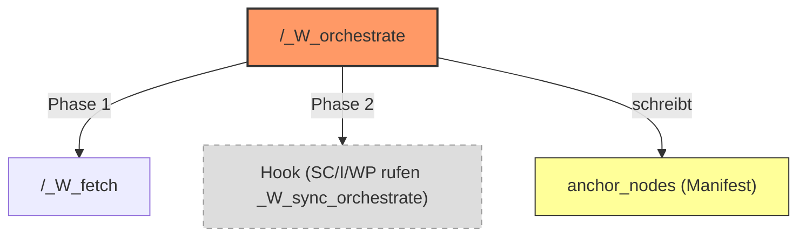

# /_W_orchestrate - Team Lead Wissens-Lebenszyklus-Orchestrierung

```yaml
status: active
version: 1.1.0
created: 2026-03-13
op: WissensKoaleszenz
phase: Meta
type: orchestration
chain_position: meta
team_based: true
```

---

```
+======================================================================+
|  VERTRAG: /_W_orchestrate                                             |
+======================================================================+
|  SIGNATUR:                                                            |
|    /_W_orchestrate {phase} {FEATURE} [difficulty]                     |
|                    [--anchor-threshold=0.7]                           |
|                                                                       |
|  LIEST:                                                               |
|    {VAULT}/_manifest.md  (NAME, Phase, Zyklen-Info)                  |
|    {VAULT}/_session_params.md (ceiling, floor, difficulty)            |
|    {VAULT}/Task.md               (Feature-Kontext)                   |
|    .claude/models/{FEATURE}_Model.md (Feature-Model)                 |
|                                                                       |
|  SCHREIBT (Team Lead direkt):                                         |
|    {VAULT}/_manifest.md                                              |
|      → ## W_fetch Ankerpunkte (nach Phase 1, YAML anchor_nodes)      |
|      → merged_into-Flags (nach Phase 3)                              |
|      → Sync-Log (nach jeder Phase)                                   |
|                                                                       |
|  RUFT AUF (via Agents):                                              |
|    /_W_fetch {FEATURE} {difficulty}       (Phase 1: FETCH)           |
|    (Phase 3: DEEP WIRE — entfernt, BL-065. Obsoleter Push-Command archiviert.) |
|                                                                       |
|  INVARIANTEN:                                                         |
|    - Team Lead fuehrt KEINE Commands selbst aus                      |
|    - 1 Agent = 1 Command = stirbt danach (KURZLEBIG_PROMPT)         |
|    - Kein Agent spawnt Sub-Agents (W7-Constraint)                    |
|    - Phase 1 + Phase 3 sequentiell (Phase 2 = Hook)                  |
|    - anchor_nodes-Klassifikation ist einzige eigene Logik            |
+======================================================================+
```

---

```
+======================================================================+
| META-COMMAND: /_W_orchestrate                                         |
+======================================================================+
|                                                                       |
| ACTOR: TEAM LEAD (DU - die ausfuehrende Claude-Instanz)             |
| AGENTS: Kurzlebige Single-Command-Agents (1 Agent = 1 Command)      |
|                                                                       |
| ZWECK: Orchestriert den 3-Phasen-Lebenszyklus von Feature-Wissen.    |
|        Phase 1 (FETCH): Wissen holen + Ankerpunkte klassifizieren.   |
|        Phase 2 (SYNC): Hook-Pattern (passiv, nicht aktiv gesteuert). |
|        Phase 3 (DEEP WIRE): Wissen sichern, splitten, verdrahten.   |
|                                                                       |
| PRINZIP: 1 Agent = 1 Command = stirbt danach (KURZLEBIG_PROMPT).   |
|          State lebt in DOKUMENTEN (Vertraegen), nicht im Agenten.    |
|          Kein Worker-Loop, kein TaskList-Polling.                     |
|          Team Lead spawnt pro Phase 1 Agent, wartet auf Ergebnis.   |
|                                                                       |
| WARUM EIGENER COMMAND:                                                |
|   - _W_fetch (Phase 1) klassifiziert anchor_nodes                   |
|   - anchor_nodes werden von _W_fetch geschrieben, von _W_modelSplit |
|     gelesen — aber niemand klassifiziert die Relationen dazwischen   |
|   - /_W_orchestrate schliesst diese Luecke mit ~20-30 LOC eigener   |
|     Klassifikationslogik und delegiert alles andere                  |
|                                                                       |
+======================================================================+
```

---

## Verantwortlichkeit

**KNOWLEDGE-ORCHESTRATOR:** Steuert den 3-Phasen-Lebenszyklus von Feature-Wissen.

**TUT:** Koordiniert fetch (Phase 1), sync (Phase 2 passiv), deep-wire (Phase 3).
Klassifiziert anchor_nodes nach Relation-Heuristik (R1-R5).
Schreibt Ankerpunkte ins Manifest. Aktualisiert merged_into-Flags.

**NICHT:** Direkt suchen (das macht _W_fetch). Direkt splitten (das macht _W_modelSplit).
Direkt syncen (das macht _W_sync_orchestrate via Hook).
# BL-065: removed — Direkt pushen (das macht _W_push_orchestrate) — archiviert per BL-065.

---

## Aufruf + Parameter

```
/_W_orchestrate {phase} {FEATURE} [difficulty] [--anchor-threshold=0.7]
```

**Parameter:**

| Parameter | Default | Werte | Beschreibung |
|-----------|---------|-------|-------------|
| `phase` | (PFLICHT) | fetch, deep-wire, full | Welche Phase(n) ausfuehren |
| `FEATURE` | (Manifest) | String | Feature-/Forschungsname. Falls nicht angegeben: lese `NAME:` aus `{VAULT}/_manifest.md`. Falls kein Manifest: FEHLER. |
| `difficulty` | normal | easy, normal, hard | Steuert _W_fetch Tiefe + _W_push Tiefe |
| `--anchor-threshold` | 0.7 | Float 0.0-1.0 | Mindest-Score fuer Ankerpunkte |

**Beispiele:**
```
/_W_orchestrate fetch OmniCommand-TTL                → Phase 1, normal, threshold 0.7
/_W_orchestrate fetch DCSRE-93 hard                  → Phase 1, hard, threshold 0.7
/_W_orchestrate deep-wire OmniCommand normal         → Phase 3, normal
/_W_orchestrate full MyFeature hard --anchor-threshold=0.5  → Phase 1+3, hard, threshold 0.5
```

**Voraussetzungen:**
- Manifest existiert: `{VAULT}/_manifest.md`
- Phase 1 (fetch): Task.md oder User-Beschreibung vorhanden
- Phase 3 (deep-wire): Model existiert, anchor_nodes im Manifest (optional, Graceful Degradation)

---

## Schwierigkeits-Parameter

| Schwierigkeit | Phase 1 (_W_fetch) | anchor-threshold |
|---------------|--------------------|-----------------|
| **easy** | _W_fetch easy (Auto-Accept, Score >= 0.5) | 0.5 (automatisch gesenkt) |
| **normal** | _W_fetch normal (3 Wellen, User bestaetigt) | 0.7 (default) |
| **hard** | _W_fetch hard (5 Wellen, User bestaetigt) | 0.7 (default) |
# BL-065: removed — Phase 3 (_W_push_orchestrate) Spalte entfernt (archiviert per BL-065)

**Session-Params Override:**
Lies `_session_params.md` falls vorhanden. Hierarchie: opus=3, sonnet=2, haiku=1.
```
params = lies("_session_params.md")
difficulty = params.difficulty ODER Command-Parameter
ceiling    = min(ceiling, params.ceiling)
floor      = max(floor, params.floor)
Validierung: ceiling >= floor (sonst ceiling = floor + Warning)
```

---

## Phase 1: FETCH (Feature-START)

### Schritt 1.1: Kontext laden

Lies folgende Dateien:
1. `{VAULT}/_manifest.md` → NAME, Phase, bestehende Wissens-Basis
2. `{VAULT}/_session_params.md` → ceiling, floor, difficulty Override
3. `{VAULT}/Task.md` → Feature-Kontext fuer Keyword-Extraktion

**Validierung:**
- Manifest MUSS existieren → Sonst STOPP mit Meldung
- Task.md ODER User-Beschreibung MUSS vorhanden sein → Sonst WARNUNG

### Schritt 1.2: Team erstellen

```
TeamCreate:
  team_name: "wo-{FEATURE}"
  description: "Wissens-Orchestrierung - {FEATURE}"
```

### Schritt 1.3: _W_fetch Agent spawnen

```
TaskCreate:
  subject: "Wissen holen (Phase 1)"
  activeForm: "Fetching knowledge for {FEATURE}"
  description: |
    Fuehre /_W_fetch {FEATURE} {difficulty} aus.
    Suche existierendes Wissen in Vault + RAG.
    Schreibe Wissens-Basis + Keyword-Pool ins Manifest.

Agent spawnen:
  name: "wo-{FEATURE}-fetch"
  subagent_type: "general-purpose"
  model: "{ceiling}"
  team_name: "wo-{FEATURE}"
  mode: "bypassPermissions"
  prompt: [KURZLEBIG_PROMPT fuer /_W_fetch {FEATURE} {difficulty}]
```

### Schritt 1.4: Warte auf _W_fetch Completion

Agent meldet: "_W_fetch {FEATURE}: [Summary]"
Team Lead prueft: Manifest enthält "## Wissens-Basis" Sektion?

### Schritt 1.5: Relation-Klassifikation (eigene Logik, ~20-30 LOC)

**Nach _W_fetch:** Lies Wissens-Basis aus Manifest (Treffer mit Score, Source, Keywords).

**Fuer jeden Treffer mit Score >= {anchor-threshold}:**

```
RELATION-KLASSIFIKATION (R1-R5 Heuristik, Prioritaet absteigend):

  R1: Keyword-Overlap >= 2 UND score >= 0.70
      → THEMATISCH_VERWANDT
      (Viele gemeinsame Keywords + hoher Score = starke thematische Naehe)

  R2: source = BOTH (Vault + RAG) UND score >= 0.65
      → THEMATISCH_VERWANDT
      (In beiden Quellen gefunden = hohe Konfidenz)

  R3: Haupt-Model (kein Feature-Kuerzel im Dateinamen) UND score >= 0.50
      → UEBERGEORDNET
      (z.B. OmniCommand_Model.md ohne Feature-Suffix = Dach-Model)

  R4: split-into im Ziel-Frontmatter vorhanden
      → UEBERGEORDNET
      (Ziel hat Children = ist Dach-Knoten)

  R5: hop >= 1 (Graph-Traversal Treffer, nicht direkt gematcht)
      → CO_CREATED
      (Ueber co-created-with/cycle-cluster gefunden)

  DEFAULT: score >= {anchor-threshold}
      → THEMATISCH_VERWANDT
      (Konservative Wahl wenn keine Regel spezifischer greift)

Prioritaet: R1 > R2 > R3 > R4 > R5 > DEFAULT
(Erste zutreffende Regel gewinnt)
```

**Score-Schwelle:**
- normal/hard: `--anchor-threshold` (default 0.7)
- easy: automatisch 0.5 (breitere Akzeptanz, kein User-Input)

### Schritt 1.6: User-Korrektur (normal/hard) / Auto-Accept (easy)

```
Bei normal/hard:
  Praesentiere Tabelle:
  | # | Datei | Score | Keywords | Relation (Vorschlag) | Korrektur? |
  |---|-------|-------|----------|----------------------|------------|
  | 1 | SCZyklus_Model.md | 0.87 | TTL, SC-Zyklus | THEMATISCH_VERWANDT | |
  | 2 | MetaProzess_Model.md | 0.74 | Prozess, Lifecycle | UEBERGEORDNET | |

  User kann Relation aendern oder Eintraege entfernen.

Bei easy:
  Auto-Accept (keine User-Interaktion).
```

### Schritt 1.7: Manifest Ankerpunkte schreiben

**Soft Limit:** Max 5 anchor_nodes (nach match_score absteigend sortiert).
Bei >= 6 Kandidaten: WARNUNG ">{N} Ankerpunkte, Top-5 nach Score behalten".

**Graceful Degradation:** 0 Treffer mit Score >= threshold → anchor_nodes: [] (leere Liste).
Sektion IMMER schreiben (auch bei leerem Array).

```
Schreibe in Manifest:

  ## W_fetch Ankerpunkte
  **Erstellt:** {DATUM}
  **Anzahl:** {N} Ankerpunkte (Soft Limit: 5)
  **Lifecycle:** Geschrieben von /_W_orchestrate Phase 1, Gelesen von _W_modelSplit Schritt 0.5

  anchor_nodes:
    - file: "{relativer_pfad_zur_quelldatei}"
      match_score: {0.0-1.0}
      relation: "{THEMATISCH_VERWANDT|UEBERGEORDNET|UNTERGEORDNET|CO_CREATED}"
      match_keywords: ["{kw1}", "{kw2}", ...]
      # --- Optional ---
      match_wn: "{W{n}-Referenz falls vorhanden}"
      hop: {0|1|2}
      source: "{Vault|RAG|BOTH}"
      merged_into: false

  **Relation-Enum Schwellen:**
    THEMATISCH_VERWANDT: score >= 0.70 (Keyword-Overlap >= 2 ODER source=BOTH)
    UEBERGEORDNET:       score >= 0.50 (Haupt-Model ODER split-into vorhanden)
    UNTERGEORDNET:       score >= 0.60 (Sub-Model, abgeleitetes Dokument)
    CO_CREATED:          score >= 0.40 (Graph-Traversal hop >= 1)
```

### Schritt 1.8: Sync-Log schreiben

```
Schreibe in Manifest (APPEND):

  ## W_orchestrate Sync-Log
  | Phase | Timestamp | Feature | Difficulty | anchor_count | merge_count | Status |
  |-------|-----------|---------|------------|--------------|-------------|--------|
  | FETCH | {DATUM} | {FEATURE} | {difficulty} | {N} | - | DONE |
```

**AUSGABE Phase 1:**
```
"Phase 1 (FETCH) abgeschlossen."
"{N} Ankerpunkte klassifiziert (Threshold: {T})."
"Relationen: {X} THEMATISCH_VERWANDT, {Y} UEBERGEORDNET, {Z} CO_CREATED."
"Naechster Schritt: Feature-Arbeit (SC/I/WP) oder /_W_orchestrate deep-wire."
```

---

## Phase 2: SYNC (Hook-Pattern, NICHT aktiv gesteuert)

**WICHTIG:** Phase 2 ist KEIN ausfuehrbarer Phase-Parameter.
`/_W_orchestrate sync` ist UNGUELTIG (wuerde falsche Erwartung wecken).

**Mechanismus:**
SC/I/WP_orchestrate rufen `/_W_sync_orchestrate` bereits in ihren eigenen Zyklen auf.
Diese Sync-Aufrufe sind prozessbegleitend und brauchen keine externe Steuerung.

```
SC_orchestrate  → /_W_sync_orchestrate {FEATURE} {difficulty} --co-work
                   (nach _SC_ergebnis, Phase 3.3a)

I_orchestrate   → /_W_sync_orchestrate {FEATURE} {difficulty} --co-work
                   (nach Pipeline-Abschluss)

WP_orchestrate  → /_W_sync_orchestrate {FEATURE} {difficulty} --co-work
                   (nach ACCEPT)
```

**HINWEIS:** P3-Trigger in SC/I/WP (ObsidianSync Integration, TC-7, Slice 6) sind
bereits implementiert. Phase 2 dokumentiert nur den bestehenden Hook-Mechanismus.

---

## FULL-Modus (Phase 1 sequentiell)

```
/_W_orchestrate full {FEATURE} {difficulty}
```

Fuehrt Phase 1 (FETCH) aus.
Phase 2 (SYNC) ist Hook und wird NICHT aktiv ausgefuehrt.
# BL-065: removed — Phase 3 (DEEP WIRE) entfernt. _W_push_orchestrate archiviert (OQ-G03 offen).

**Ablauf:**
```
1. Phase 1 (FETCH):
   → _W_fetch → Relation-Klassifikation → Ankerpunkte schreiben
   → Sync-Log: FETCH DONE

2. [Feature-Arbeit findet hier NICHT statt]
   → FULL ist fuer den Fall: Fetch + sofortiger Deep Wire
   → z.B. nach manuellem Feature-Abschluss ohne Pipeline
```

**HINWEIS:** Phase 3 (DEEP WIRE) wurde per BL-065 entfernt (OQ-G03 — Phase-3-Ersatz-Pattern
offen). Nach OQ-G03-Entscheidung wird Phase 3 neu implementiert.

---

## Delegation-Hierarchie


# BL-065: removed — Phase 3 WPO-Knoten entfernt (_W_push_orchestrate archiviert per BL-065)

**Leserichtung:**
- /_W_orchestrate SCHREIBT anchor_nodes (Phase 1, Relation-Klassifikation)
- Phase 3 (DEEP WIRE) wurde per BL-065 entfernt (OQ-G03 offen)

---

## Session-Params

Lies `{VAULT}/_session_params.md` falls vorhanden:

```
params = lies("_session_params.md")

Effektive Werte:
  difficulty = params.difficulty ODER Command-Parameter ODER "normal"
  ceiling    = min(Command-ceiling ODER opus, params.ceiling ODER opus)
  floor      = max(Command-floor ODER haiku, params.floor ODER haiku)

Validierung:
  ceiling >= floor (sonst ceiling = floor + Warning ausgeben)
```

**Modell-Zuordnung:**

| Rolle | easy | normal | hard |
|-------|------|--------|------|
| Team Lead | DU (Opus) | DU (Opus) | DU (Opus) |
| Phase 1 Agent (_W_fetch) | 1 {ceiling} | 1 {ceiling} | 1 {ceiling} |

# BL-065: removed — Phase 3 Agent (_W_push) Zeile entfernt (archiviert per BL-065)

**KEINE Wellen:** /_W_orchestrate selbst hat keine Wellen.
Die Wellen leben innerhalb von _W_fetch (3 oder 5 Wellen je nach difficulty).

---

## Abgrenzung

```
/_W_orchestrate        = Phase-1-Dach (MIT anchor_nodes-Kontext)
                         Phase 1: FETCH + Klassifikation
                         Phase 2: SYNC (Hook, passiv)
                         # BL-065: removed — Phase 3 entfernt (_W_push_orchestrate archiviert)

# BL-065: removed — _W_push_orchestrate (POST-CYCLE Push) archiviert per BL-065
# BL-065: removed — Koexistenz-Block entfernt

  - /_W_orchestrate fetch wird von _A_orchestrate Phase 0 aufgerufen
    (Discovery-Modus, TC-3)

Wann welchen Command nutzen:
  /_W_orchestrate fetch     → Feature-START (Wissen holen + Ankerpunkte)
  # BL-065: removed — deep-wire und full Phase-3-Ablauf entfernt (OQ-G03 offen)
  /_W_orchestrate full      → Nur Phase 1 (Phase 3 nach OQ-G03-Entscheidung)
```

---

## KURZLEBIG_PROMPT (Single-Command-Agent)

Pro Phase spawnt Team Lead 1 kurzlebigen Agent.
Jeder Agent bekommt diesen minimalen Prompt:

```
Du bist ein Single-Command-Agent fuer die Wissens-Orchestrierung.
Agent-Name: wo-{FEATURE}-{phase}
Team: wo-{FEATURE}

=== DEIN AUFTRAG ===

Genau 1 Command ausfuehren, dann fertig.

Command:     {COMMAND_PATH} {FEATURE} {ARGS}
Task-ID:     {TASK_ID}

=== WISSEN ABRUFEN (Optional) ===

Falls feature-lokales Wissen vorhanden:
  mcp__cleancoder__query(
    query_text="[dein Fokus]",
    collection="local_knowledge_{FEATURE_ID}",
    limit=3
  )
  {FEATURE_ID} = sanitized Feature-Name (lowercase, underscores)

=== SCHRITTE ===

1. Lade den Command via Skill-Tool:
   Skill(skill="{COMMAND_NAME}", args="{FEATURE} {ARGS}")
   Beispiele:
     Skill(skill="_W_fetch", args="DCSRE-93 normal")
     # Skill(skill="_W_push_orchestrate", args="OmniCommand hard")  # BL-065: removed (Phase 3 deleted per AK-04)
   WICHTIG: Nutze das Skill-Tool — NICHT die .md-Datei direkt lesen!
2. Fuehre den geladenen Skill vollstaendig aus.
3. TaskUpdate {TASK_ID} status=completed
4. SendMessage an "team-lead":
   "{COMMAND} {FEATURE}: [2-3 Saetze Summary]"

=== REGELN ===

- KEIN git commit, KEIN git push
- KEIN Sub-Agent spawnen (W7-Constraint)
- IMMER Skill-Tool verwenden — niemals .md-Datei manuell lesen als Ersatz
- NUR dieser eine Command, dann fertig (KEIN TaskList-Loop)
- Manifest (_manifest.md) nach Command aktualisieren
- Arbeite gruendlich, nicht schnell
```

---

## Fehlerbehandlung

| Fehler | Aktion |
|--------|--------|
| anchor_nodes leer (0 Treffer >= threshold) | anchor_nodes: [] schreiben. |
| _W_fetch crashed | Team Lead: Neuen Agent spawnen, gleichen Task zuweisen. Max 2 Retries. |
| Phase-3-Agent crashed (BL-065 removed) | Eintrag entfernt — Phase 3 nicht mehr aktiv. |
| Manifest nicht vorhanden | STOPP mit Meldung: "Kein Manifest. Bitte erst /_A_orchestrate ausfuehren." |
| Session-Params nicht lesbar | Defaults verwenden (normal, opus ceiling, haiku floor). WARNUNG ausgeben. |
| Agent stagniert (keine Message >5min) | Team Lead: SendMessage "Status?" an Agent. |

---

## Qualitaetskriterien

- Relation-Klassifikation (R1-R5) ist deterministisch und nachvollziehbar
- anchor_nodes Schema konsistent mit TC-1 (4 Pflichtfelder, 4 optionale Felder)
- Soft Limit 5 Ankerpunkte eingehalten
- Sync-Log nach Phase 1 aktualisiert
- Graceful Degradation bei 0 Treffern (anchor_nodes: [])
# BL-065: removed — _W_push_orchestrate UNVERAENDERT-Invariante entfernt (archiviert per BL-065)
# BL-065: removed — Koexistenz-Invariante entfernt (_W_push_orchestrate archiviert)

---

## NOTIFY (Pflicht - Allerletzter Schritt)

**NUR wenn ALLES fertig ist** (alle Phasen abgeschlossen, Zusammenfassung ausgegeben):

```bash
# Windows:
powershell -Command "notify '{FEATURE} /_W_orchestrate {phase} abgeschlossen'"

# Linux:
echo "/_W_orchestrate {FEATURE} {phase} abgeschlossen"
```

WICHTIG: Keine Zwischen-Benachrichtigungen! NUR ganz am Ende.

---

ARGUMENTS: $ARGUMENTS
