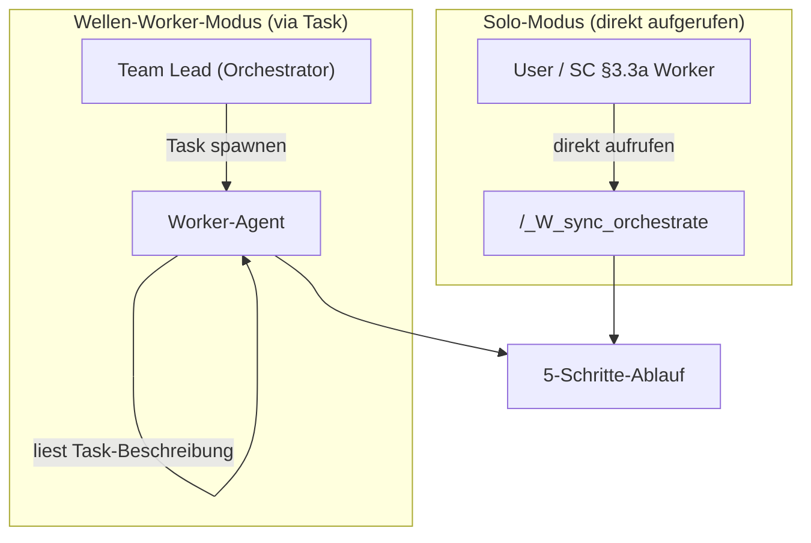
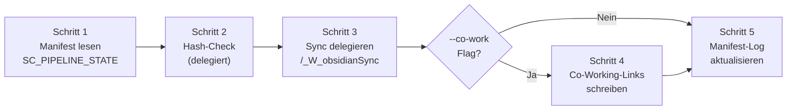

# /_W_sync_orchestrate

```yaml
status: active
version: 1.0.0
created: 2026-02-24
updated: 2026-02-24
op: ObsidianSync
phase: Meta
type: orchestration
chain_position: sync
```

---

## Vertrag

```
╔═══════════════════════════════════════════════════════════════════════════╗
║  COMMAND: /_W_sync_orchestrate {FEATURE} [easy|normal|hard] [--co-work]  ║
╠═══════════════════════════════════════════════════════════════════════════╣
║                                                                           ║
║  ZWECK:                                                                   ║
║    Thin wrapper ueber /_W_obsidianSync. Liest SC_PIPELINE_STATE aus      ║
║    Manifest, delegiert Sync, setzt optional Co-Working-Links im Vault.   ║
║    Atomic Unit: Von SC/I/WP_orchestrate aufrufbar. DRY-Einstiegspunkt.  ║
║                                                                           ║
║  LIEST:                                                                   ║
║    .claude/analysis/_manifest.md       (SC_PIPELINE_STATE, Zyklus-Info)  ║
║    .claude/models/*.md                 (Hash-Kandidaten fuer Sync)        ║
║    .claude/analysis/synthese/*.md      (Hash-Kandidaten fuer Sync)        ║
║                                                                           ║
║  RUFT AUF:                                                                ║
║    /_W_obsidianSync {FEATURE} {easy|normal|hard}  (delegiert Sync)       ║
║                                                                           ║
║  SCHREIBT:                                                                ║
║    Vault-Dateien (via /_W_obsidianSync)                                   ║
║    co-created-with + cycle-cluster Frontmatter (bei --co-work, nach Sync) ║
║    .claude/analysis/_manifest.md (Sync-Log: Zyklus N, N Dateien, Zeit)   ║
║                                                                           ║
║  KEIN:                                                                    ║
║    git, kein Sub-Agent spawnen, kein Quality Gate                         ║
║                                                                           ║
╚═══════════════════════════════════════════════════════════════════════════╝
```

---

## Aufruf-Syntax

```
/_W_sync_orchestrate {FEATURE} [easy|normal|hard] [--co-work]
```

| Parameter | Default | Beschreibung |
|-----------|---------|-------------|
| FEATURE | (PFLICHT) | Feature-Name fuer Vault-Dateien-Zuordnung |
| difficulty | easy | Sync-Schwierigkeit (an _W_obsidianSync weitergegeben) |
| --co-work | (nicht gesetzt) | Aktiviert G-COWORK Guard fuer Co-Working-Links |

**Beispiele:**
```bash
# Prozessbegleitend nach modelMaintain (Delta-Sync, kein Co-Work)
/_W_sync_orchestrate DateiabholungAnalyse easy

# Zyklus-Abschluss nach ergebnis (mit Co-Working-Links)
/_W_sync_orchestrate DateiabholungAnalyse normal --co-work

# Feature-Ende via W_push_orchestrate (voller Sync + Co-Work)
/_W_sync_orchestrate DateiabholungAnalyse hard --co-work
```

---

## GLOBALE PARAMETER (/_param Override)

Lies `.claude/analysis/_manifest.md` und suche nach GLOBAL_* Feldern.

| Manifest-Feld | Wirkung |
|---|---|
| `GLOBAL_DIFFICULTY` | Ueberschreibt lokalen `difficulty` Default |
| `GLOBAL_CEILING` | Nicht anwendbar — Thin Wrapper ohne Wellen-Muster |
| `GLOBAL_FLOOR`   | Nicht anwendbar — Thin Wrapper ohne Wellen-Muster |

**Begruendung (Thin Wrapper):**
_W_sync_orchestrate delegiert direkt an _W_obsidianSync.
_W_obsidianSync ist ein monolithischer spezialisierter Prozess (Guard-Chain sequentiell,
Hash-basierte Vault-Kopien). Wellen-Skalierung ist nicht moeglich und nicht sinnvoll.
Nur difficulty wird weitergereicht (Sync-Tiefe: easy=1x, normal=3x, hard=vollstaendig).

**Falls KEINE GLOBAL_* Felder gesetzt:** Lokale Defaults gelten unveraendert.

---

## Dual-Mode: Solo vs. Wellen-Worker



**SOLO-MODUS** (direkt aufgerufen: `/_W_sync_orchestrate {FEATURE} normal --co-work`)
- Fuehre alle 5 Schritte selbst aus, sequentiell
- Kein Spawning, kein Sub-Agent
- Sende NOTIFY am Ende

**WELLEN-WORKER-MODUS** (Task enthaelt Anweisung vom Orchestrator)
- Lies Task-Beschreibung um Rolle zu erkennen:
  - `"W_sync_orchestrate {NAME} easy: Sync nach modelMaintain"`
  - `"W_sync_orchestrate {NAME} normal --co-work: Post-Cycle Sync nach ergebnis"`
- Fuehre 5-Schritte-Ablauf gemaess Task-Beschreibung aus
- KEIN Sub-Spawning
- TaskUpdate completed + SendMessage an Team Lead

**Worker-Vertrag:**
```
Worker liest:  Task-Beschreibung → FEATURE + difficulty + --co-work Flag
Worker fuehrt: 5-Schritte-Ablauf aus (delegiert Sync an /_W_obsidianSync)
Worker schreibt: Vault-Dateien (via obsidianSync) + Co-Work-Frontmatter + Manifest-Log
Worker meldet: TaskUpdate completed + SendMessage
Worker spawnt: NICHTS
```

---

## 5-Schritte-Ablauf



### Schritt 1: Manifest lesen + SC_PIPELINE_STATE

```
1. Lies .claude/analysis/_manifest.md
   → Pruefe ob SC_PIPELINE_STATE Sektion vorhanden
   → Falls vorhanden: Extrahiere cycle_nr (aktueller Zyklus N)
   → Falls NICHT vorhanden:
       WARN: "SC_PIPELINE_STATE nicht im Manifest — Co-Work nicht moeglich"
       cycle_nr = "unbekannt"
       Co-Work wird in Schritt 4 SKIP

2. Ausgabe: "Zyklus N = {cycle_nr} (aus SC_PIPELINE_STATE)"
```

### Schritt 2: Hash-Check (delegiert)

```
Hash-Check wird vollstaendig an /_W_obsidianSync delegiert.
Kein eigener Hash-Mechanismus noetig — obsidianSync hat Hash-Check bereits integriert.

Ausgabe: Wird von obsidianSync in Schritt 3 protokolliert
```

### Schritt 3: Sync delegieren

```
1. Fuehre /_W_obsidianSync {FEATURE} {difficulty} aus
   → Bei easy:  Delta-Sync (nur geaenderte Dateien, kein Guard)
   → Bei normal: Vollstaendiger Sync + Guards (G-CHAIN, G-BIDIR, G-NAME, G-XREF, G-CAUSAL)
   → Bei hard:   Vollstaendiger Sync + Guards + Mermaid-Diagramm

2. Warte auf Completion von /_W_obsidianSync
   (sync_orchestrate ist kein Orchestrator von obsidianSync — obsidianSync laeuft inline)

3. Protokolliere Ergebnis:
   "Sync abgeschlossen: {N} Dateien gesynct, {M} uebersprungen (Hash unveraendert)"

FEHLER: Falls /_W_obsidianSync FAIL → AUSGABE: Fehler weiterleiten → STOPP
```

### Schritt 4: Co-Working-Links (NUR bei --co-work Flag)

```
Falls KEIN --co-work Flag → SKIP (gehe zu Schritt 5)
Falls SC_PIPELINE_STATE fehlt → WARN + SKIP (gehe zu Schritt 5)

Algorithmus:
  cycle_nr = SC_PIPELINE_STATE.cycle_nr  (aus Schritt 1)

  zyklus_gruppe = [
    "{NAME}-OBSERVE{cycle_nr}.md"       → Vault: OBSERVE{N}
    "{NAME}-QUALITYGATE{cycle_nr}.md"   → Vault: QUALITYGATE{N}
    "{NAME}-HYPOTHESEN.md"              → Vault: HYPOTHESEN
    "{NAME}-ERGEBNIS{cycle_nr}.md"      → Vault: ERGEBNIS{N}
  ]

  Filtere: nur tatsaechlich im Vault vorhandene Dateien
  Falls keine Dateien gefunden: WARN + SKIP

  FUER JEDE datei IN gefilterte_gruppe:
    co_partner = gruppe OHNE datei (Dateinamen ohne .md, fuer Wiki-Links)

    Lese {VAULT_PATH}/{datei}
    Pruefe ob "co-created-with" Feld bereits vorhanden (Idempotenz):
      → Falls VORHANDEN: Pruefe ob alle Partner eingetragen
          Fehlende Partner erganzen
      → Falls NEU: Appende nach bestehendem Frontmatter (nach letztem ---)

    Co-Working-Frontmatter Template:
      co-created-with:
        - '[[{partner_1_ohne_md}]]'
        - '[[{partner_2_ohne_md}]]'
        ...
      cycle-cluster: {cycle_nr}

    Schreibe zurueck nach {VAULT_PATH}/{datei}

  Ausgabe: "G-COWORK: {N} Dateien mit co-created-with + cycle-cluster geschrieben"
```

**Beispiel Co-Working-Frontmatter (Zyklus 3):**

```yaml
---
id: DateiabholungAnalyse-OBSERVE3
tags:
  - type/observe
  - op/DateiabholungAnalyse
feature: '[[DateiabholungAnalyse]]'
cycle: 3
chain-position: observe
prev: '[[DateiabholungAnalyse-ERGEBNIS2]]'
next: '[[DateiabholungAnalyse-QUALITYGATE3]]'
co-created-with:
  - '[[DateiabholungAnalyse-QUALITYGATE3]]'
  - '[[DateiabholungAnalyse-HYPOTHESEN]]'
  - '[[DateiabholungAnalyse-ERGEBNIS3]]'
cycle-cluster: 3
---
```

### Schritt 5: Manifest aktualisieren

```
Schreibe Sync-Log in .claude/analysis/_manifest.md:

Falls "## Sync-Log (sync_orchestrate)" Sektion existiert → aktualisiere letzten Eintrag
Falls nicht → fuege am Ende des Manifests ein

Format:
**LETZTER SYNC via sync_orchestrate:**
- Datum: {YYYY-MM-DD HH:MM}
- Zyklus: {cycle_nr}
- Schwierigkeit: {easy|normal|hard}
- Co-Work: {Ja/Nein}
- Dateien gesynct: {N}
```

---

## Schwierigkeits-Tabelle

| Schwierigkeit | obsidianSync-Delegation | Co-Work | Typischer Einsatz |
|--------------|------------------------|---------|------------------|
| **easy** | easy (Delta, Hash-Only, keine Guards) | Optional (--co-work selten) | Prozessbegleitend nach modelMaintain |
| **normal** | normal (alle Guards ausser Mermaid) | Optional (--co-work empfohlen) | Zyklus-Abschluss nach ergebnis |
| **hard** | hard (alle Guards inkl. Mermaid) | Empfohlen (--co-work) | Feature-Ende via W_push_orchestrate |

---

## Ceiling-Vererbung

```
sync_orchestrate erbt Schwierigkeit vom Parent-Orchestrator:
- SC easy laeuft   → maximal easy sync (nicht normal/hard)
- SC normal laeuft → bis normal sync
- Faustregel: Prozessbegleitend = easy/normal, Feature-Ende = hard

Trigger-Empfehlungen:
  Nach modelMaintain:  easy           (kein --co-work, reiner Delta-Sync)
  Nach ergebnis:       normal --co-work  (Zyklus-Abschluss, Co-Work aktivieren)
  Nach push_temp:      easy           (kein --co-work)
  Feature-Ende:        hard --co-work  (via W_push_orchestrate Step 5)
```

---

## Fehlerbehandlung

| Fehler | Aktion |
|--------|--------|
| Manifest nicht gefunden | AUSGABE: "Manifest fehlt unter .claude/analysis/_manifest.md" → STOPP |
| SC_PIPELINE_STATE fehlt im Manifest | WARN: "Co-Work nicht moeglich — SC_PIPELINE_STATE nicht im Manifest" → SKIP Co-Work, Sync weiter |
| Vault nicht erreichbar (via _W_obsidianSync) | Degraded Mode: Nur Manifest-Log, kein Sync |
| _W_obsidianSync FAIL | AUSGABE: Fehler weiterleiten → STOPP |
| Vault-Datei nicht gefunden bei Co-Work | WARN: "{datei} nicht im Vault — uebersprungen" → Rest weiter |
| co-created-with Frontmatter-Konflikt | Lesen → Pruefen → Ergaenzen (kein blindes Append) |

---

## NOTIFY (Pflicht — Allerletzter Schritt)

**NUR wenn ALLE 5 Schritte abgeschlossen und Zusammenfassung ausgegeben:**

```bash
notify '{FEATURE} /_W_sync_orchestrate abgeschlossen'
```

WICHTIG: Keine Zwischen-Benachrichtigungen. NUR am Ende.

---

## Abschluss-Ausgabe

```
/_W_sync_orchestrate {FEATURE} {difficulty} {--co-work?} - Ergebnis:

## Sync-Zusammenfassung

- Zyklus: {cycle_nr}
- Schwierigkeit: {easy|normal|hard}
- Co-Work: {Ja/Nein}
- Sync: {N} Dateien gesynct, {M} uebersprungen (Hash unveraendert)
- Co-Working-Links: {N} Dateien mit co-created-with + cycle-cluster (falls --co-work)
- Manifest-Log: aktualisiert

Vault synchronisiert ({difficulty}{, Co-Working-Links gesetzt}).
```

ARGUMENTS: $ARGUMENTS
