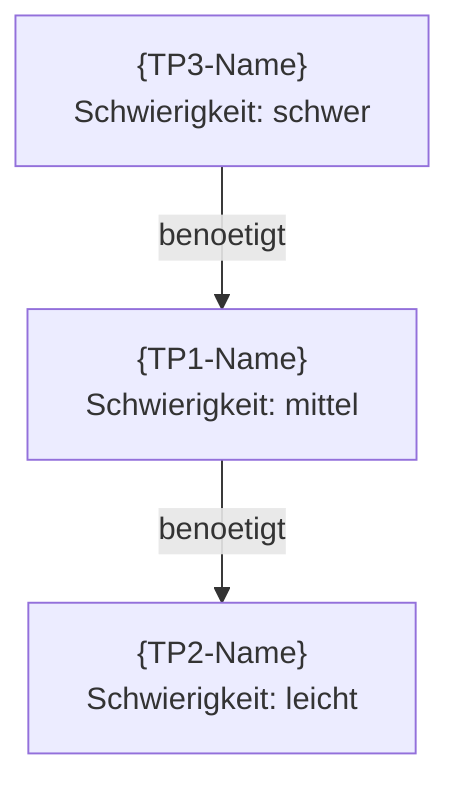

# Architectural Boundaries (Teilproblem-Dekomposition + Vertikale Suche)

Du zerlegst das Problem in unabhaengige Teilprobleme mit klaren Grenzen.
Dies ist die STRUKTURIERENDE Phase: Dekomponieren, Priorisieren, Abhaengigkeiten kartieren.
Typischerweise EINMALIG nach der ersten Analyse, oder bei signifikanter Scope-Aenderung.

**NEU (v2.2): Vertikale Suche (ALT-System Phase 2.1 Integration)**
Nach der Teilproblem-Dekomposition wird fuer JEDES Teilproblem eine
Vertikale Suche durchgefuehrt: Abstrakte TP-Namen werden zu konkreten
Dateipfaden aufgeloest. Dies liefert praezise Informationen fuer /_SC_hypothese
und /_SC_implement (WO genau im Code gearbeitet werden muss).

## Aufruf

```
/_architecturalBoundaries [normal|hard]
```

Default ohne Parameter: **normal**
Kein easy-Modus (Dekomposition erfordert ganzheitliche Perspektive).

---

## VERTRAG (Pflicht-I/O)

```
╔═══════════════════════════════════════════════════════════════════════════╗
║  COMMAND: /_architecturalBoundaries [normal|hard]                        ║
╠═══════════════════════════════════════════════════════════════════════════╣
║                                                                          ║
║  LIEST (Input) - PFLICHT:                                                ║
║    1. .claude/analysis/_manifest.md                                      ║
║    2. .claude/models/{NAME}_Model.md  ◄── MUSS EXISTIEREN               ║
║    3. .claude/analysis/synthese/{NAME}-ANALYSE{CYCLE}.md                 ║
║       ◄── Mindestens die erste Analyse muss existieren                  ║
║    4. .claude/patterns/_pattern-library.md  ◄── NEU: Layer-Definitionen  ║
║       (Graceful Degradation: Ohne Pattern-Library = manuelle Suche)      ║
║                                                                          ║
║  SCHREIBT (Output) - PFLICHT:                                            ║
║    1. .claude/analysis/synthese/{NAME}-BOUNDARIES.md                     ║
║       → Teilproblem-Dekomposition mit Bounded Contexts                  ║
║       → Relative Schwierigkeit (leicht/mittel/schwer/unbekannt)         ║
║       → Abhaengigkeits-Graph (Mermaid)                                  ║
║       → Empfohlene Reihenfolge                                           ║
║       → Optionen/Abzweigungen pro Teilproblem                           ║
║       → NEU: Datei-Mapping (Vertikale Suche, Sektion 6)                 ║
║       → NEU: Aenderungs-Kategorien (NEW/MODIFY/EXTEND pro TP)          ║
║    2. .claude/analysis/_manifest.md (aktualisieren)                      ║
║                                                                          ║
║  EINMALIG (oder bei signifikanter Scope-Aenderung):                     ║
║    Bei erneutem Aufruf wird BOUNDARIES.md UEBERSCHRIEBEN                ║
║    (nicht versioniert — es gibt nur EIN aktuelles Decomposition).       ║
║                                                                          ║
║  GRACEFUL DEGRADATION:                                                   ║
║    Ohne diesen Command geht der Zyklus direkt von _SC_qualityGate              ║
║    zu _SC_hypothese. BOUNDARIES ist OPTIONAL.                               ║
║                                                                          ║
║  3-TUPEL POSITION:                                                       ║
║    [_SC_qualityGate] ──▶ [_architecturalBoundaries] ──▶ [_SC_hypothese]           ║
║    Zerlegt Problem in Teilprobleme, informiert _SC_hypothese               ║
║    ueber Scope und Priorisierung.                                        ║
║                                                                          ║
║  MCP INTEGRATION (OPTIONAL, Uncle Bob Clean Code):                       ║
║    - mcp__cleancoder__query() fuer Architektur-Dekomposition            ║
║    - Query Topics:                                                       ║
║      * "clean architecture boundaries for {domain}"                     ║
║      * "dependency inversion at {layer crossing}"                       ║
║      * "component decomposition for {problem description}"              ║
║                                                                          ║
║  MCP-BREMSE:                                                             ║
║    ┌─────────────────────────────────────────────────────────┐           ║
║    │  MIDDLE-Modus → max 3 Queries, limit=3                 │           ║
║    │  Modi:  min=1Q/1R  middle=3Q/3R  max=5Q/5R            │           ║
║    └─────────────────────────────────────────────────────────┘           ║
║                                                                          ║
║  COMPACT-SICHER:                                                         ║
║    Nach Welle 1 kann /compact ausgefuehrt werden.                        ║
║    Welle 2 liest aus drafts/{NAME}-boundaries-D*.md.                    ║
║                                                                          ║
╚═══════════════════════════════════════════════════════════════════════════╝
```

---

## Schritt 0: Manifest + Inputs lesen

**IMMER als Erstes:**

1. Lies `.claude/analysis/_manifest.md`
   - Ermittle den aktuellen {NAME}
   - Lies **SYSTEM-MODEL** und **SCHWIERIGKEIT** aus der System-Konfiguration
   - Bestimme effektives Modell: `min(SYSTEM-MODEL, Command-Max=opus)`
   - Leite Modell-Zuordnung pro Welle ab (siehe Manifest → Modell-Zuordnung)
2. Lies `.claude/models/{NAME}_Model.md`
   - Verifizierte Wahrheiten als Kontext
   - Technologie-Concerns (TCs) identifizieren
   - Offene Fragen als Dekompositions-Hinweise
3. Lies `.claude/analysis/synthese/{NAME}-ANALYSE{CYCLE}.md`
   - Falls nicht vorhanden → FEHLER: "Keine Analyse gefunden. Starte erst /_SC_observe"
   - Findings als Basis fuer Teilproblem-Identifikation
   - Falls vorhanden: Kohaesion-Check und Model-Split-Empfehlung beruecksichtigen
4. **NEU:** Lies `.claude/patterns/_pattern-library.md` (falls vorhanden)
   - Layer-Definitionen (Kap. 4) fuer Glob-Pattern-Auswahl in Vertikaler Suche
   - Datei-Suffix-Konventionen fuer Pfad-Inferenz
   - Falls nicht vorhanden: Nutze Standard-Heuristik aus Schritt 3.1

---

## Kontext

```
    /_model ──▶ /_SC_qualityGate ──▶ [/_architecturalBoundaries] ──▶ /_SC_hypothese
                                      │
                                      ├── Teilproblem-Plan (abstrakt)
                                      ├── Vertikale Suche (konkret)
                                      │   Abstrakt → Dateipfade
                                      │   Glob + Grep Heuristik
                                      ▼
                               {NAME}-BOUNDARIES.md
                               (informiert Scope fuer _SC_hypothese)

    INPUT:  {NAME}_Model.md (W{n}, TCs, offene Fragen)
            {NAME}-ANALYSE{CYCLE}.md (Findings, Kohaesion)
            _pattern-library.md (Layer-Definitionen, Glob-Patterns)
    OUTPUT: {NAME}-BOUNDARIES.md (Teilprobleme, Schwierigkeit, Reihenfolge,
                                  NEU: Datei-Mapping, Aenderungs-Kategorien)
```

---

## Schwierigkeits-Parameter

| Schwierigkeit | Drafts (Welle 1) | Synthese (Welle 2) |
|---------------|------------------|-------------------|
| **normal** | --- | 1 (DU, Hauptagent) |
| **hard** | 2-3 Subagenten | 1 (DU, Hauptagent) |

**System-Model (aus Manifest):** Bestimmt welches Modell pro Welle laeuft.
- opus: Drafts=sonnet, Synthese=opus
- sonnet: Drafts=sonnet, Synthese=sonnet
- haiku: Drafts=haiku, Synthese=haiku

---

## Ablauf: Normal (Standard)

```
             ┌──────────────────┐
SYNTHESE     │  DU, Hauptagent  │  ──LIEST──▶ MODEL + ANALYSE
             │  7 Sektionen     │  ──SCHREIBT──▶ synthese/{NAME}-BOUNDARIES.md
             └──────────────────┘
                      │
                      ▼
             ┌──────────────────┐
VERTIKALE    │  DU, Hauptagent  │  ──NUTZT──▶ Glob + Grep Tools
SUCHE        │  Datei-Mapping   │  ──LIEST──▶ Pattern-Library (Layer-Def.)
             └──────────────────┘  ──SCHREIBT──▶ Sektion 6 in BOUNDARIES.md
```

Keine Drafts noetig. Du liest Model + Analyse und erstellst die Dekomposition.
Danach fuehrst du die Vertikale Suche durch (Sektion 6: Datei-Mapping).
Manifest trotzdem aktualisieren.

---

## Ablauf: Hard

```
Welle 1:  ┌───┐ ┌───┐ ┌───┐
DRAFTS    │ D │ │ D │ │ D │  ──LIEST──▶ MODEL + ANALYSE
          └─┬─┘ └─┬─┘ └─┬─┘  ──SCHREIBT──▶ drafts/{NAME}-boundaries-D*.md
            └─────┼─────┘
                  │
             [/compact moeglich]
                  │
                  ▼
Welle 2:  ┌──────────────────┐
SYNTHESE  │  DU, Hauptagent  │  ──LIEST──▶ drafts/{NAME}-boundaries-D*.md
          │  5 Sektionen     │  ──SCHREIBT──▶ synthese/{NAME}-BOUNDARIES.md
          └──────────────────┘
```

---

## Welle 1: Drafts (bei hard)

### Agent-Auftraege

Starte Drafter-Agenten **parallel**. JEDER Agent erhaelt:

```
Du bist Drafter D{NN} fuer die Teilproblem-Dekomposition von "{NAME}".

INPUT - LIES ZUERST DIESE DATEIEN:
  1. .claude/models/{NAME}_Model.md
  2. .claude/analysis/synthese/{NAME}-ANALYSE{CYCLE}.md

AUFTRAG: {Fokus-Beschreibung}

SCHREIB-PFLICHT:
Du MUSST deine Findings in folgende Datei schreiben:
  .claude/analysis/drafts/{NAME}-boundaries-D{NN}-{fokus}.md

DATEI-FORMAT (Pflicht):
  ---
  name: {NAME}
  phase: boundaries
  wave: drafts
  tier: {SYSTEM-MODEL}
  model: {TATSAECHLICHES-MODELL}
  agent: D{NN}
  fokus: {fokus}
  date: {YYYY-MM-DD}
  reads: models/{NAME}_Model.md, synthese/{NAME}-ANALYSE{CYCLE}.md
  status: final
  ---

  # Boundaries D{NN}: {Fokus-Titel}

  ## Gelesene Inputs
  - MODEL: v{X.Y}, {N} aktive W{n}
  - ANALYSE: {Datum}, {Kern-Findings}

  ## Identifizierte Teilprobleme
  | # | Teilproblem | TC | Bounded Context | Dateien |
  |---|-------------|-----|----------------|---------|

  ## Abhaengigkeiten
  {Welches Teilproblem haengt von welchem ab?}

  ## Schwierigkeits-Einschaetzung
  | Teilproblem | Schwierigkeit | Begruendung |
  |-------------|---------------|-------------|

  ## Alternative Ansaetze
  {Pro Teilproblem: Gibt es verschiedene Wege?}

  ## Zusammenfassung
  {5-10 Saetze}

WICHTIG:
- Teilprobleme mit BOUNDED CONTEXTS identifizieren (klare Grenzen)
- Schwierigkeit NUR als leicht/mittel/schwer/unbekannt (KEINE Stunden-Schaetzung! W12, GH-6)
- Abhaengigkeiten als gerichteten Graphen beschreiben
- Die Datei MUSS geschrieben werden, NICHT nur als Text zurueckgeben
```

### Drafter-Fokus-Bereiche

| Agent | Fokus | Aufgabe |
|-------|-------|---------|
| D01 | technologie-dekomposition | TC-basierte Zerlegung, Bounded Contexts, Schnittstellen |
| D02 | abhaengigkeits-analyse | Was haengt von was ab? Kritischer Pfad? Reihenfolge-Optionen |
| D03 | risiko-priorisierung | Welches Teilproblem hat das hoechste Risiko? Unbekannte Faktoren? |

### Nach Welle 1: Manifest aktualisieren

```markdown
**PHASE:** _architecturalBoundaries
**WELLE:** 1 abgeschlossen, 2 ausstehend
**NAECHSTER SCHRITT:** Welle 2 (Synthese) starten - liest drafts/{NAME}-boundaries-D*.md

### Drafts (_architecturalBoundaries - Welle 1)
- [x] .claude/analysis/drafts/{NAME}-boundaries-D01-technologie-dekomposition.md
- [x] .claude/analysis/drafts/{NAME}-boundaries-D02-abhaengigkeits-analyse.md
- [x] .claude/analysis/drafts/{NAME}-boundaries-D03-risiko-priorisierung.md
```

**NACH dem Manifest-Update kann /compact ausgefuehrt werden.**

---

## Welle 2: Synthese (DU, Hauptagent)

### Voraussetzung (bei hard)

Lies ALLE Dateien in `.claude/analysis/drafts/{NAME}-boundaries-D*.md`

Falls nicht vorhanden → FEHLER: "Welle 1 nicht abgeschlossen."

### Dein Auftrag

Erstelle das BOUNDARIES-Dokument mit 7 Pflicht-Sektionen (5 bestehende + 2 neue).

**WICHTIG:**
- Schwierigkeit NUR als leicht/mittel/schwer/unbekannt — KEINE Stunden-Schaetzung (W12, GH-6)
- Abhaengigkeits-Graph als Mermaid-Diagramm
- Teilprobleme mit Bounded Contexts (klare Grenzen, minimale Ueberlappung)
- Falls Kohaesion-Check in ANALYSE Model-Split empfohlen hat: Teilprobleme an TCs ausrichten
- Jedes Teilproblem mit W{n}-Referenzen belegen
- **NEU:** Nach Sektionen 1-5: Vertikale Suche durchfuehren (Sektionen 6-7)

### Boundaries-Dokument Struktur

**Pfad**: `.claude/analysis/synthese/{NAME}-BOUNDARIES.md`

```markdown
---
name: {NAME}
phase: boundaries
wave: synthese
tier: {SYSTEM-MODEL}
model: {TATSAECHLICHES-MODELL}
agent: Hauptagent
date: {YYYY-MM-DD}
reads: models/{NAME}_Model.md, synthese/{NAME}-ANALYSE{CYCLE}.md
status: final
---

# Architectural Boundaries: {NAME}

**Datum:** YYYY-MM-DD
**Model-Basis:** {NAME}_Model.md v{X.Y}
**Analyse-Basis:** {NAME}-ANALYSE{CYCLE}.md

## 1. Teilproblem-Dekomposition

| # | Teilproblem | TC | Bounded Context | Dateien | W{n}-Bezug |
|---|-------------|-----|----------------|---------|------------|
| TP1 | ... | ... | ... | ... | W{x}, W{y} |
| TP2 | ... | ... | ... | ... | W{z} |

### Bounded Contexts

**TP1: {Name}**
- Umfang: {Was gehoert dazu?}
- Grenze: {Was gehoert NICHT dazu?}
- Schnittstelle: {Wie kommuniziert es mit anderen TPs?}

**TP2: {Name}**
- Umfang: ...
- Grenze: ...
- Schnittstelle: ...

## 2. Relative Schwierigkeit

| Teilproblem | Schwierigkeit | Begruendung | Unbekannte Faktoren |
|-------------|---------------|-------------|---------------------|
| TP1 | leicht/mittel/schwer/unbekannt | ... | ... |
| TP2 | leicht/mittel/schwer/unbekannt | ... | ... |

**KEINE Stunden-Schaetzung.** Schwierigkeit ist RELATIV (Vergleich zwischen TPs).

## 3. Abhaengigkeits-Graph



**Kritischer Pfad:** TP2 → TP1 → TP3

## 4. Empfohlene Reihenfolge

| Schritt | Teilproblem | Begruendung |
|---------|-------------|-------------|
| 1 | TP2 | Keine Abhaengigkeiten, leicht → schneller Erfolg |
| 2 | TP1 | Abhaengig von TP2, mittlere Schwierigkeit |
| 3 | TP3 | Abhaengig von TP1, schwer → am Ende |

**Strategie:** {Bottom-up / Kritischer-Pfad-zuerst / Risiko-zuerst / Abhaengigkeits-basiert}

## 5. Optionen und Abzweigungen

### TP1: {Name}
| Option | Ansatz | Vor-/Nachteile |
|--------|--------|---------------|
| A | ... | Pro: ... / Contra: ... |
| B | ... | Pro: ... / Contra: ... |

### TP2: {Name}
| Option | Ansatz | Vor-/Nachteile |
|--------|--------|---------------|
| A | ... | Pro: ... / Contra: ... |

## 6. Datei-Mapping (Vertikale Suche)

**Methodik:** ALT-System Phase 2.1 -- Abstrakte TP-Namen zu konkreten Dateipfaden

### 6.1 Datei-Zuordnung pro Teilproblem

| TP | Layer | Ziel-Dateipfad | Existiert | Kategorie | Kontext-Dateien |
|----|-------|---------------|-----------|-----------|-----------------|
| TP1 | {Layer-ID} | {konkreter/pfad/zur/datei.ext} | JA/NEIN | NEW/MODIFY/EXTEND | {datei1, datei2} |
| TP2 | {Layer-ID} | {konkreter/pfad/zur/datei.ext} | JA/NEIN | NEW/MODIFY/EXTEND | {datei1} |

### 6.2 Such-Protokoll

**TP1: {Name}**
- Layer: {Layer-ID aus Pattern-Library}
- Glob-Pattern: {verwendetes Pattern, z.B. `**/Controllers/*Controller.cs`}
- Glob-Ergebnis: {N} Treffer
- Grep-Verifikation: {Pattern, z.B. `class\s+XyzController`}
- Entscheidung: {GEFUNDEN bei Pfad:Zeile / NICHT GEFUNDEN → NEW}
- Kontext-Dateien: {Import-Analyse / Layer-Expansion}

**TP2: {Name}**
- Layer: ...
- Glob-Pattern: ...
- ...

### 6.3 Aenderungs-Kategorien (ALT-System 6-Kategorien, vereinfacht)

| Kategorie | Bedeutung | Betroffene TPs |
|-----------|-----------|---------------|
| NEW | Datei existiert nicht, muss erstellt werden | {TP-Liste} |
| MODIFY | Datei existiert, bestehende Logik anpassen | {TP-Liste} |
| EXTEND | Datei existiert, neue Funktionalitaet hinzufuegen | {TP-Liste} |

## 7. Zusammenfassung Vertikale Suche

| Metrik | Wert |
|--------|------|
| TPs gesamt | {N} |
| Dateien gefunden (existiert=JA) | {N} |
| Dateien neu (existiert=NEIN) | {N} |
| Kontext-Dateien identifiziert | {N} |
| Kategorie-Verteilung | NEW: {N}, MODIFY: {N}, EXTEND: {N} |

## Zusammenfassung

{N} Teilprobleme identifiziert. Empfohlene Reihenfolge: {TP-Reihenfolge}.
Kritischer Pfad: {Pfad}. Hoechstes Risiko: {TP-Name}.
Vertikale Suche: {N} Dateien gefunden, {M} neue Dateien noetig.

## Referenzen
| Quelle | Typ |
|--------|-----|
| {NAME}_Model.md | Model v{X.Y} |
| {NAME}-ANALYSE{CYCLE}.md | Analyse (Findings, Kohaesion) |
| _pattern-library.md | Layer-Definitionen + Glob-Patterns |
```

---

## Schritt 3: Vertikale Suche (Datei-Mapping)

**NACH den Sektionen 1-5, VOR dem Manifest-Update.**

Fuer JEDES identifizierte Teilproblem (TP) aus Sektion 1 fuehre die
Vertikale Suche durch. Ziel: Abstrakte TP-Namen zu konkreten Dateipfaden aufloesen.

### 3.1 Layer bestimmen

Fuer jedes TP: Ordne es einem Layer aus der Pattern-Library zu.
Falls `.claude/patterns/_pattern-library.md` existiert, nutze die Layer-Definitionen (Kap. 4).
Falls nicht: Nutze folgende Standard-Heuristik:

| TP-Hinweis | Layer-ID | Glob-Basis-Pattern |
|------------|----------|-------------------|
| "Component", "View", "Dialog", "Page" | FE-COMP | `**/src/app/**/*.component.ts` |
| "Service" (Frontend) | FE-SVC | `**/src/app/**/*.service.ts` |
| "Controller", "Endpoint", "API" | BE-CTRL | `**/Controllers/**/*Controller.cs` |
| "Service" (Backend) | BE-SVC | `**/Services/**/*Service.cs` |
| "Repository", "Data Access" | BE-REPO | `**/Repositories/**/*Repository.cs` |
| "DTO", "Model", "Request", "Response" | BE-DTO | `**/DTOs/**/*Dto.cs` |
| "Entity", "Domain" | BE-ENT | `**/Entities/**/*.cs` |
| "Migration", "Schema" | DB-MIG | `**/Migrations/**/*.cs` |
| "Docker", "Container" | INF-DOCK | `**/docker-compose*.yml` |
| "Test" | TEST-UNIT | `**/*.spec.ts`, `**/*Tests.cs` |

### 3.2 Glob-basierte Dateisystem-Traversierung

Pro TP:

1. **Pfad-Inferenz aus TP-Name:**
   Wandle den abstrakten TP-Namen in einen konkreten Dateinamen um:
   - Frontend: `kebab-case(TP-Name)` + Layer-Suffix (z.B. `.component.ts`)
   - Backend: `PascalCase(TP-Name)` + Layer-Suffix (z.B. `Service.cs`)
   - Beispiel: "User Lock Reason Display" → `user-lock-reason-display.component.ts`
   - Beispiel: "PLZ Filter Service" → `PlzFilterService.cs`

2. **Glob-Suche ausfuehren:**
   Nutze das Glob-Tool mit dem Layer-spezifischen Pattern:
   ```
   Glob-Pattern: **/{inferierter-dateiname}
   Fallback 1:   {Layer-Basis-Pattern}/*{kern-teil-des-namens}*
   Fallback 2:   {Layer-Basis-Pattern} (alle Dateien im Layer)
   ```

3. **Ergebnis dokumentieren:**
   - Treffer gefunden → notiere Pfad + "Existiert: JA"
   - Kein Treffer → notiere inferierten Pfad + "Existiert: NEIN" + Kategorie "NEW"

### 3.3 Grep-basierte Content-Verifikation

Fuer JEDEN Glob-Treffer:

1. **Klassen-Definition pruefen:**
   ```
   Grep-Pattern: class\s+{PascalCase(TP-Name)}
   ```
   Verifiziert: Ist die richtige Klasse in dieser Datei?

2. **Methoden-Hinweise pruefen:**
   ```
   Grep-Pattern: {relevante-methoden-namen-aus-TP}
   ```
   Verifiziert: Hat die Datei relevante Methoden?

3. **Bei Mehrdeutigkeit (mehrere Treffer):**
   - Waehle die Datei mit der hoechsten Uebereinstimmung
   - Dokumentiere alternative Kandidaten

### 3.4 Kontext-Datei-Sammlung

Fuer JEDE gefundene (oder inferierte) Ziel-Datei:

**Layer-spezifische Expansion:**

| Layer | Kontext-Dateien suchen |
|-------|----------------------|
| FE-COMP | `.html` Template, `.scss` Styles, `.spec.ts` Tests |
| FE-SVC | Zugehoerige `.spec.ts`, importierte DTOs/Interfaces |
| BE-CTRL | Zugehoeriger Service (I{Name}Service.cs), DTOs |
| BE-SVC | Interface (I{Name}Service.cs), Tests ({Name}Tests.cs), DTOs |
| BE-REPO | Entity-Klasse, DbContext-Registrierung |
| BE-DTO | Entity-Klasse (Mapping-Quelle) |
| DB-MIG | DbContext, Entity-Klasse |

**Import-Analyse (optional, bei existierenden Dateien):**
- Lies die Ziel-Datei
- Extrahiere Import-/Using-Statements
- Markiere DTO- und Interface-Imports als "critical: true"

### 3.5 Aenderungs-Kategorie bestimmen

Pro TP:

| Prüfung | Ergebnis | Kategorie |
|---------|----------|-----------|
| Datei existiert NICHT | → | **NEW** |
| Datei existiert, TP erfordert neue Methode/Logik | → | **EXTEND** |
| Datei existiert, TP aendert bestehende Logik | → | **MODIFY** |

### 3.6 Sektionen 6 + 7 schreiben

Dokumentiere alle Ergebnisse in Sektionen 6 und 7 des BOUNDARIES-Dokuments
(siehe Template oben).

---

### Nach Welle 2 + Vertikaler Suche: Manifest finalisieren

```markdown
**PHASE:** _architecturalBoundaries abgeschlossen
**NAECHSTER SCHRITT:** /_SC_hypothese (informiert durch Teilproblem-Plan + Datei-Mapping)

### Architectural Boundaries - {Datum}
- [x] .claude/analysis/synthese/{NAME}-BOUNDARIES.md
- [x] Teilprobleme: {N} identifiziert
- [x] Kritischer Pfad: {TP-Reihenfolge}
- [x] Hoechste Schwierigkeit: {leicht/mittel/schwer/unbekannt}
- [x] Vertikale Suche: {N} Dateien gefunden, {M} neue Dateien (NEW), {K} Kontext-Dateien
- [x] Kategorien: NEW={N}, MODIFY={M}, EXTEND={K}
```

---

## Qualitaetskriterien

- Teilprobleme mit klaren Bounded Contexts (minimale Ueberlappung)
- Schwierigkeit NUR als leicht/mittel/schwer/unbekannt (KEINE Stunden, W12, GH-6)
- Abhaengigkeits-Graph als Mermaid-Diagramm
- Empfohlene Reihenfolge mit Begruendung
- Optionen pro Teilproblem (Alternativen bewertet)
- Model-Bezug: W{n} pro Teilproblem referenziert
- Falls Kohaesion-Check Model-Split empfohlen: Teilprobleme an TCs ausgerichtet
- Jeder Bounded Context hat Umfang, Grenze und Schnittstelle
- Keine Hypothesen — nur Struktur und Priorisierung
- **NEU: Vertikale Suche (Sektion 6+7)**
  - JEDES TP hat eine Layer-Zuordnung
  - JEDES TP hat ein Datei-Mapping (Pfad + Existiert JA/NEIN)
  - JEDES TP hat eine Aenderungs-Kategorie (NEW/MODIFY/EXTEND)
  - Such-Protokoll dokumentiert Glob-Pattern + Grep-Verifikation
  - Kontext-Dateien pro TP identifiziert (Templates, Tests, DTOs, Interfaces)
  - Zusammenfassung der Vertikalen Suche mit Metriken

---

## Naechster Schritt

Nach Abschluss: `/_SC_hypothese` ausfuehren (Scope durch Teilproblem-Plan informiert)

---

## NOTIFY (Pflicht - Allerletzter Schritt)

**NUR wenn ALLES fertig ist** (alle Schritte abgeschlossen, Zusammenfassung ausgegeben):

```bash
powershell -Command "notify '{FEATURE} /_architecturalBoundaries abgeschlossen'"
```

WICHTIG: Keine Zwischen-Benachrichtigungen! NUR ganz am Ende.

ARGUMENTS: $ARGUMENTS
