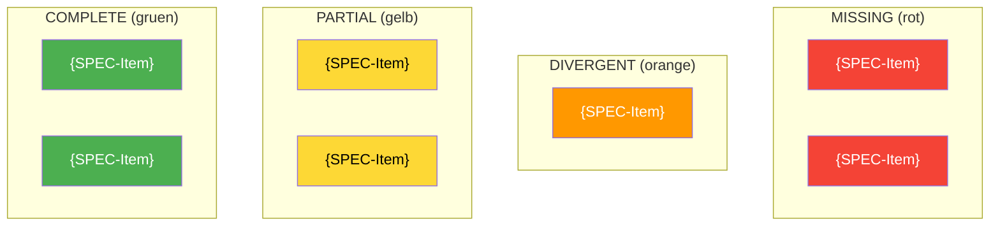
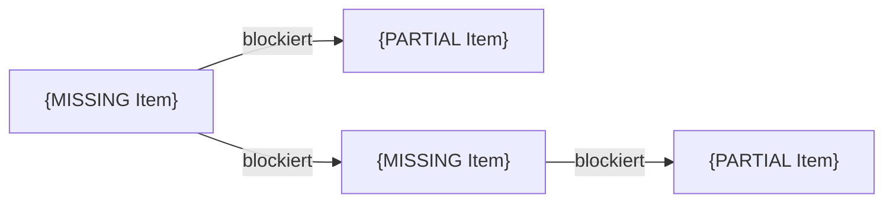
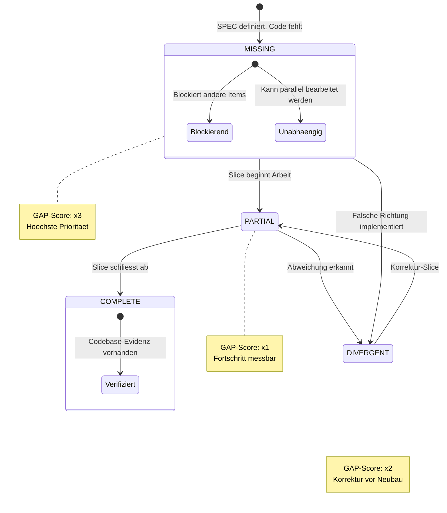

# Gap-Analyse: IST vs SOLL Delta

Du erstellst oder aktualisierst die Gap-Analyse - das strukturierte Delta zwischen
SPEC (SOLL) und MODEL (IST). Der GAP quantifiziert was fehlt, was divergiert,
und was bereits existiert. Der GAP ist der Circuit Breaker der Pipeline:
Wenn das Delta zu gross oder wachsend ist, stoppt die Pipeline.

**Status:** NEU v3.0
**Actor:** ANALYST
**Zweck:** Delta zwischen Ziel-Architektur (SPEC) und IST-Zustand (MODEL) identifizieren,
quantifizieren, priorisieren und als Circuit Breaker fuer die Pipeline einsetzen

## Aufruf

```
/_gap {NAME} [easy|normal|hard]
```

- **NAME** (Pflicht): Eindeutiger Name (identisch mit /_spec und /_model)
- **Schwierigkeit** (Optional): Default `hard` bei Erst-Analyse, `normal` bei Re-Evaluation
  nach Slice, `easy` fuer Quick-Check

---

## VERTRAG (Pflicht-I/O)

```
+===============================================================+
|  COMMAND: /_gap {NAME} [easy|normal|hard]                      |
+===============================================================+
|                                                                |
|  LIEST (Input) - PFLICHT:                                      |
|    1. .claude/analysis/_manifest.md (falls vorhanden)          |
|    2. .claude/specs/{NAME}_Spec.md (SOLL - MUSS EXISTIEREN)   |
|       --> Ziel-Architektur: Komponenten, Interfaces, NFR       |
|    3. .claude/models/{NAME}_Model.md (IST - MUSS EXISTIEREN)  |
|       --> Aktueller Zustand: W{n}, Architektur, Patterns       |
|    4. Codebase (direkt via Glob/Grep/Read)                     |
|       --> Tatsaechlicher Implementierungs-Stand                |
|                                                                |
|  LIEST (Input) - BEI RE-EVALUATION:                            |
|    5. .claude/analysis/synthese/{NAME}-GAP.md (vorheriges Δ)  |
|       --> Delta-Trend: Schrumpft der GAP?                      |
|    6. .claude/analysis/synthese/{NAME}-ARCHITECT.md (Slices)   |
|       --> Welche Slices sind abgeschlossen?                    |
|    7. .claude/analysis/synthese/{NAME}-SYSTEM-{SLICE}.md       |
|       --> Slice-Abschluss-Reports                              |
|                                                                |
|  LIEST (Input) - QUALITY GATE (PFLICHT):                       |
|   10. .claude/reference/Topologie-OmniCommand.md               |
|       --> Mermaid Quality Gate: Min 3 Diagramm-Typen           |
|       --> Struktur-Template fuer Report-Aufbau                  |
|       --> Referenz fuer Vertrags-Matrix, Index, Metriken        |
|                                                                |
|  LIEST (Input) - OPTIONAL:                                     |
|    8. .claude/_parking-lot.md (bekannte offene Punkte)         |
|    9. MCP Clean Code (Uncle Bob Queries)                       |
|       --> Architektur-Conformance, Dependency Rules             |
|                                                                |
|  SCHREIBT (Output) - PFLICHT:                                  |
|                                                                |
|    Welle 1 (Exploration, nur bei hard):                        |
|      .claude/analysis/exploration/{NAME}-gap-E01-{fokus}.md    |
|      .claude/analysis/exploration/{NAME}-gap-E02-{fokus}.md    |
|      ... (pro Agent eine Datei)                                |
|                                                                |
|    Welle 2 (Drafts, bei normal+hard):                          |
|      .claude/analysis/drafts/{NAME}-gap-D01-{fokus}.md         |
|      .claude/analysis/drafts/{NAME}-gap-D02-{fokus}.md         |
|      ... (pro Agent eine Datei)                                |
|                                                                |
|    Welle 3 (Synthese = DU, Hauptagent):                        |
|      .claude/analysis/synthese/{NAME}-GAP.md                   |
|                                                                |
|    Manifest (IMMER):                                           |
|      .claude/analysis/_manifest.md (aktualisieren)             |
|                                                                |
|  SCHREIBT (Output) - OPTIONAL:                                 |
|    .claude/_parking-lot.md (APPEND, Incidental Findings)       |
|                                                                |
|  MCP INTEGRATION (OPTIONAL, Uncle Bob Clean Code):             |
|    - mcp__cleancoder__query() fuer Architektur-Conformance     |
|    - Query Topics:                                             |
|      * "architecture conformance check for {system}"           |
|      * "dependency inversion violations in {boundary}"         |
|      * "component responsibilities gap in {layer}"             |
|                                                                |
|  MCP-BREMSE:                                                   |
|    +-----------------------------------------------------+     |
|    |  easy:   MIN-Modus    --> max 1 Query,  limit=1     |     |
|    |  normal: MIDDLE-Modus --> max 3 Queries, limit=3    |     |
|    |  hard:   MAX-Modus    --> max 5 Queries, limit=5    |     |
|    |                                                     |     |
|    |  Modi:  min=1Q/1R  middle=3Q/3R  max=5Q/5R        |     |
|    +-----------------------------------------------------+     |
|                                                                |
|  PIPELINE-POSITION (DUAL):                                     |
|                                                                |
|    PRE-PIPELINE:                                               |
|    [/_spec] --> [/_model] --> [/_gap] --> [/_I_cleanCodeArch.] |
|                                                                |
|    I_* LOOP (Re-Eval nach jedem Slice):                        |
|    [/_I_codeSystem] --> [/_gap easy] --> [/_I_cleanCodeSlice]  |
|       (Slice N done)    (Re-Eval)     (Slice N+1 start)       |
|                                                                |
|    SC OPTIONAL (bei Architektur-Abweichung):                   |
|    [/_SC_observe] --> [/_gap] --> weiter oder STOP              |
|                                                                |
|  COMPACT-SICHER:                                               |
|    GAP-Datei ueberlebt /compact.                               |
|    /_I_cleanCodeArchitect, /_I_cleanCodeSlice lesen von Disk.  |
|                                                                |
|  ACTOR: ANALYST                                                |
|    Vergleicht SOLL (SPEC) mit IST (MODEL + Codebase).         |
|    Quantifiziert Delta, priorisiert Luecken.                   |
|    KEINE Code-Aenderungen, KEINE Tests.                        |
|    KEINE Model-Updates (das macht /_SC_modelMaintain).         |
|    KEINE Hypothesen (das macht /_SC_hypothese).                |
+===============================================================+
```

---

## Verantwortlichkeit

Der **ANALYST** Actor hat eine einzige Verantwortung:

**Delta zwischen SOLL und IST identifizieren, quantifizieren, priorisieren**

Was der Analyst **TUT**:
- SPEC-Komponenten (C1-Cn) gegen Codebase abgleichen
- SPEC-Interfaces (I1-In) gegen bestehende Interfaces pruefen
- SPEC-Endpoints (E1-En) gegen vorhandene API-Routen pruefen
- NFR-Abdeckung bewerten (Performance, Security, etc.)
- GAP-Score berechnen (quantifizierbar, vergleichbar)
- Prioritaeten setzen (was ist kritisch, was kann warten)
- Circuit-Breaker-Entscheidung treffen (Pipeline weiter oder STOP)
- Uncle Bob MCP befragen fuer Conformance-Guidance

Was der Analyst **NICHT TUT**:
- Code schreiben (das machen die I_* Phasen)
- IST-Zustand beschreiben (das macht /_model)
- SOLL-Zustand definieren (das macht /_spec)
- Hypothesen aufstellen (das macht /_SC_hypothese)
- Model aktualisieren (das macht /_SC_modelMaintain)
- Slices planen (das macht /_I_cleanCodeArchitect)

---

## GAP vs PARKING LOT

```
GAP (/_gap)                           PARKING LOT (_parking-lot.md)
+-------------------------------+     +-------------------------------+
| KLARE ABWEICHUNG IST <-> SOLL|     | BEOBACHTUNG / NEBENFUND       |
|                               |     |                               |
| - "Fehlt laut SPEC"          |     | - "Mir ist aufgefallen..."    |
| - "Divergiert vom Plan"       |     | - "Koennte man mal anschauen"|
| - "NFR nicht erfuellt"       |     | - "Anderes Feature betroffen" |
|                               |     |                               |
| Prioritaet: KRITISCH          |     | Prioritaet: SEMI-WICHTIG     |
| Effekt: Kann Pipeline STOPPEN|     | Effekt: Wird gesammelt        |
| Metrik: MUSS schrumpfen      |     | Metrik: Wird abgearbeitet     |
| Quelle: SPEC + MODEL          |     | Quelle: Jeder Command         |
| Verantwortung: ANALYST        |     | Verantwortung: Jeder Actor    |
+-------------------------------+     +-------------------------------+
```

**Kernunterschied:** GAP ist strukturiert, quantifiziert, und hat einen Score.
Parking Lot ist eine Queue von Beobachtungen ohne Gewichtung.

---

## Pipeline-Position (DUAL)

### Position A: Pre-Pipeline (Initial-Analyse)

```
TASKDEFINITION --> SPEC --> MODEL --> **GAP** --> I_cleanCodeArchitect
                   (SOLL)   (IST)    (DELTA)     (plant auf Basis von Δ)
```

**Wann:** Nach /_model, vor /_I_cleanCodeArchitect
**Schwierigkeit:** hard (3 Wellen, gruendliche Analyse)
**Zweck:** Initiales Delta ermitteln, Slices werden auf Basis des Deltas geplant

### Position B: I_* Loop (Re-Evaluation nach Slice)

```
/_I_codeSystem (Slice N)
         |
         v
/_gap easy (Re-Eval)  ────> GAP geschrumpft?
         |                        |
         |                   JA:  | NEIN:
         v                   v    v
/_I_cleanCodeSlice     WARNUNG + ggf. Eskalation
  (Slice N+1)          zu /_SC_observe
```

**Wann:** Nach jedem abgeschlossenen Slice (/_I_codeSystem fertig)
**Schwierigkeit:** easy oder normal (Quick-Check, Delta-Update)
**Zweck:** Fortschritt messen, Circuit Breaker pruefen

### Position C: Scientific Cycle (Optional)

```
/_SC_observe --> Findings zeigen Arch-Abweichung?
                      |
                  JA: v
                 /_gap normal (Sonder-Analyse)
                      |
              GAP kritisch?
              |             |
          JA: v         NEIN: v
     STOP Pipeline    /_SC_qualityGate (weiter)
     (kein E2E auf
      kaputtem Fundament)
```

**Wann:** Optional, wenn OBSERVE Architektur-Probleme findet
**Schwierigkeit:** normal (gezielte Re-Analyse)
**Zweck:** Architektur-Abweichungen fangen bevor sie in der Pipeline Schaden anrichten

---

## Circuit Breaker

Der GAP ist der **Circuit Breaker** der Pipeline. Uncle Bob:
> "Every good architect knows that you solve the riskiest parts first.
>  You don't dance around outside the problem solving trivialities."

Wenn die Architektur fundamental schief ist, macht E2E-Testing keinen Sinn.

### GAP-Score Schwellen

```
GAP-Score = Summe aller gewichteten Delta-Items

Gewichtung:
  MISSING    * 3  (Komponente fehlt komplett)
  DIVERGENT  * 2  (existiert, aber falsche Richtung)
  PARTIAL    * 1  (teilweise implementiert)
  COMPLETE   * 0  (abgedeckt)

Normalisiert: GAP% = GAP-Score / MAX-Score * 100
```

### Schwellen-Tabelle

| GAP%    | Status    | Aktion                                      |
|---------|-----------|---------------------------------------------|
| 0-10%   | GRUEN     | Pipeline frei, E2E sinnvoll                 |
| 11-30%  | GELB      | Pipeline frei, Slices auf MISSING fokussieren |
| 31-60%  | ORANGE    | WARNUNG: Prioritaeten pruefen               |
| 61-80%  | ROT       | STOP empfohlen, erst Kern-Architektur bauen |
| 81-100% | KRITISCH  | PIPELINE STOP PFLICHT, zurueck zu Architect  |

### Trend-Bewertung (ab Re-Eval)

| Trend         | Aktion                                       |
|---------------|----------------------------------------------|
| GAP schrumpft | Weiter (Uncle Bob: "growing conformance")    |
| GAP stagniert | WARNUNG: Slices adressieren nicht den GAP     |
| GAP waechst   | STOP: Eskalation zu /_SC_observe             |

---

## Schwierigkeits-Parameter

| Schwierigkeit | Exploration (W1) | Drafts (W2)     | Synthese (W3)       |
|---------------|-----------------|-----------------|---------------------|
| **easy**      | ---             | ---             | 1 (DU, Hauptagent)  |
| **normal**    | ---             | 2-3 Subagenten  | 1 (DU, Hauptagent)  |
| **hard**      | 3-5 Subagenten  | 3-5 Subagenten  | 1 (DU, Hauptagent)  |

**System-Model (aus Manifest):** Bestimmt welches Modell pro Welle laeuft.
- opus: Exploration=haiku, Drafts=sonnet, Synthese=opus
- sonnet: Exploration=haiku, Drafts=sonnet, Synthese=sonnet
- haiku: Exploration=haiku, Drafts=haiku, Synthese=haiku

**Typischer Verlauf:**
- **1. Invokation (vor Architect):** hard → gruendliche 3-Wellen-Analyse
- **Re-Eval nach Slice 1:** normal → Drafts + Synthese
- **Re-Eval nach Slice 2+:** easy → Quick-Synthese
- **Alles steuerbar ueber Manifest SCHWIERIGKEIT**

---

## Schritt 0: Manifest + Inputs lesen

**IMMER als Erstes:**

1. Lies `.claude/analysis/_manifest.md` falls vorhanden
   - Ermittle aktuellen {NAME}
   - Lies **SYSTEM-MODEL** und **SCHWIERIGKEIT** aus System-Konfiguration
   - Bestimme effektives Modell: `min(SYSTEM-MODEL, Command-Max=opus)`
   - Pruefe ob vorheriges GAP existiert (Re-Eval vs. Initial)
2. Lies `.claude/specs/{NAME}_Spec.md` (SOLL)
   - Falls NICHT vorhanden: FEHLER "SPEC fehlt. Starte /_spec {NAME}"
   - Extrahiere alle SPEC-Items: C1-Cn, I1-In, E1-En, N1-Nn
3. Lies `.claude/models/{NAME}_Model.md` (IST)
   - Falls NICHT vorhanden: FEHLER "MODEL fehlt. Starte /_model {NAME}"
   - Extrahiere W{n} und IST-Architektur
4. Falls Re-Eval: Lies vorheriges `{NAME}-GAP.md`
   - Extrahiere vorherigen GAP-Score fuer Trend-Vergleich
5. Lies `.claude/reference/Topologie-OmniCommand.md` (Mermaid Quality Gate)
   - Sektion 13: Quality-Gate Checkliste fuer Diagramm-Konformitaet
   - Min 4 verschiedene Mermaid-Diagramm-Typen im GAP-Report PFLICHT
   - Struktur-Template: flowchart + pie + mindmap + stateDiagram + graph

---

## Schritt 1: Uncle Bob MCP Queries (optional)

### Query 1: Architektur-Conformance

```python
mcp__cleancoder__query(
    "architecture conformance validation between specification and implementation,
     dependency rule violations, component boundary analysis"
)
```

**Ergebnis:** Conformance-Patterns, typische Violations, Boundary-Checks

### Query 2: Gap-Priorisierung (bei vielen Gaps)

```python
mcp__cleancoder__query(
    "risk-first architecture approach, which components to build first,
     stable dependencies principle, acyclic dependency principle"
)
```

---

## Ablauf: hard (Erst-Analyse)

```
Welle 1:       +---+ +---+ +---+ +---+ +---+
EXPLORATION    | E | | E | | E | | E | | E |  --SCANNT--> Codebase vs SPEC
               +-+-+ +-+-+ +-+-+ +-+-+ +-+-+
                 +-----+-----+-----+-----+
                             |
                        [/compact moeglich]
                             |
                             v
Welle 2:  +---+ +---+ +---+
DRAFTS    | D | | D | | D |  --LIEST--> exploration/{NAME}-gap-E*.md
          +-+-+ +-+-+ +-+-+  --SCHREIBT--> drafts/{NAME}-gap-D*.md
            +-----+-----+
                  |
             [/compact moeglich]
                  |
                  v
Welle 3:  +------------------+
SYNTHESE  |  DU, Hauptagent  |  --LIEST--> drafts/{NAME}-gap-D*.md
          |                  |  --SCHREIBT--> synthese/{NAME}-GAP.md
          +------------------+
```

---

## Welle 1: Exploration (Codebase-Scan gegen SPEC)

### Agent-Auftraege

Starte 3-5 Explorer-Agenten **parallel**. JEDER Agent erhaelt:

```
Du bist Explorer E{NN} fuer die Gap-Analyse von "{NAME}".

INPUT - LIES ZUERST DIESE DATEIEN:
  1. .claude/specs/{NAME}_Spec.md (SOLL-Zustand)
  2. .claude/models/{NAME}_Model.md (IST-Zustand)

AUFTRAG: {Fokus-Beschreibung}

SCHREIB-PFLICHT:
Du MUSST deine Findings in folgende Datei schreiben:
  .claude/analysis/exploration/{NAME}-gap-E{NN}-{fokus}.md

DATEI-FORMAT (Pflicht):
  ---
  name: {NAME}
  phase: gap
  wave: exploration
  tier: {SYSTEM-MODEL}
  model: {TATSAECHLICHES-MODELL}
  agent: E{NN}
  fokus: {fokus}
  date: {YYYY-MM-DD}
  reads: specs/{NAME}_Spec.md, models/{NAME}_Model.md
  status: final
  ---

  # Gap-Exploration E{NN}: {Fokus-Titel}

  ## Gelesene Inputs
  - SPEC: {Anzahl Komponenten}, {Anzahl Interfaces}, {Anzahl Endpoints}
  - MODEL: {Anzahl W{n}}, {IST-Architektur-Zusammenfassung}

  ## Delta-Items
  | # | SPEC-Item | Kategorie | Status | Codebase-Evidenz |
  |---|-----------|-----------|--------|-----------------|
  | Δ1 | C{n}: {Name} | COMP | MISSING/PARTIAL/COMPLETE/DIVERGENT | {Datei:Zeile oder ---} |
  | Δ2 | I{n}: {Name} | IFACE | ... | ... |

  ## Zusammenfassung
  {3-5 Saetze: Wie gross ist der GAP in diesem Fokus-Bereich?}

WICHTIG:
- Fuer JEDES SPEC-Item: In der Codebase pruefen ob es existiert
- MISSING = existiert nicht, PARTIAL = teilweise, COMPLETE = voll da, DIVERGENT = falsche Richtung
- Codebase-Evidenz IMMER mit Datei:Zeile belegen
- KEINE Interpretation, NUR Delta-Feststellung
```

### Explorer-Fokus-Bereiche

| Agent | Fokus | Aufgabe |
|-------|-------|---------|
| E01 | backend-comp | Backend-Komponenten: Services, Controllers, Repositories |
| E02 | frontend-comp | Frontend-Komponenten: Components, Services, Models |
| E03 | interfaces | Interfaces + API-Endpoints: Boundaries, Contracts |
| E04 | datenmodell | Datenbank: Entities, Migrations, Schema |
| E05 | nfr-konventionen | NFR + Namenskonventionen: Performance, Security, Naming |

### Nach Welle 1: Manifest aktualisieren

```markdown
**PHASE:** _gap
**WELLE:** 1 abgeschlossen, 2 ausstehend
**NAECHSTER SCHRITT:** Welle 2 (Drafts) starten - liest exploration/{NAME}-gap-E*.md
```

**NACH dem Manifest-Update kann /compact ausgefuehrt werden.**

---

## Welle 2: Drafts (Delta-Konsolidierung + Bewertung)

### Voraussetzung

Lies ALLE Dateien in `.claude/analysis/exploration/{NAME}-gap-E*.md`

Falls nicht vorhanden → FEHLER: "Welle 1 nicht abgeschlossen."

### Agent-Auftraege

Starte 2-3 (normal) oder 3-5 (hard) Drafter-Agenten **parallel**:

```
Du bist Drafter D{NN} fuer die Gap-Bewertung von "{NAME}".

INPUT - LIES ZUERST DIESE DATEIEN:
  1. .claude/specs/{NAME}_Spec.md (SOLL)
  2. {Liste aller exploration/{NAME}-gap-E*.md}

AUFTRAG: {Fokus-Beschreibung}

SCHREIB-PFLICHT:
Du MUSST deine Findings in folgende Datei schreiben:
  .claude/analysis/drafts/{NAME}-gap-D{NN}-{fokus}.md

DATEI-FORMAT (Pflicht):
  ---
  name: {NAME}
  phase: gap
  wave: drafts
  tier: {SYSTEM-MODEL}
  model: {TATSAECHLICHES-MODELL}
  agent: D{NN}
  fokus: {fokus}
  date: {YYYY-MM-DD}
  reads: exploration/{NAME}-gap-E*.md, specs/{NAME}_Spec.md
  status: final
  ---

  # Gap-Bewertung D{NN}: {Fokus-Titel}

  ## Gelesene Exploration-Inputs
  {Liste der gelesenen Exploration-Dateien mit Delta-Zusammenfassung}

  ## Konsolidierte Delta-Items
  | # | SPEC-Item | Status | Prioritaet | Abhaengigkeiten | Empfehlung |
  |---|-----------|--------|-----------|-----------------|------------|
  | Δ1 | C{n}: {Name} | MISSING | HOCH | Blockiert I{m}, E{k} | Slice 1 |

  ## Cross-Cutting Gaps
  {Gaps die mehrere SPEC-Bereiche betreffen}

  ## Risiko-Bewertung
  {Welche Gaps sind architektur-kritisch? Was blockiert was?}

  ## Zusammenfassung
  {5-10 Saetze}

WICHTIG:
- Explorer-Findings konsolidieren (Deduplizierung)
- Prioritaeten setzen: Was blockiert andere Arbeit?
- Abhaengigkeiten identifizieren: Welcher Gap muss VOR welchem geschlossen werden?
- KEINE Code-Aenderungen vorschlagen (das macht /_I_cleanCodeArchitect)
```

### Drafter-Fokus-Bereiche

| Agent | Fokus | Aufgabe |
|-------|-------|---------|
| D01 | konsolidierung | Deduplizieren, Cross-Referenzen, Vollstaendigkeit |
| D02 | priorisierung | Abhaengigkeiten, Reihenfolge, Blockaden |
| D03 | risiko | Architektur-kritische Gaps, Circuit-Breaker-Einschaetzung |
| D04-D05 | (bei hard) | Tiefere Analyse, Alternative Loesungswege |

### Nach Welle 2: Manifest aktualisieren

```markdown
**WELLE:** 2 abgeschlossen, 3 ausstehend
**NAECHSTER SCHRITT:** Welle 3 (Synthese) starten - liest drafts/{NAME}-gap-D*.md
```

**NACH dem Manifest-Update kann /compact ausgefuehrt werden.**

---

## Welle 3: Synthese (DU, Hauptagent)

### Voraussetzung

Lies ALLE Dateien in `.claude/analysis/drafts/{NAME}-gap-D*.md`

Falls nicht vorhanden → FEHLER: "Welle 2 nicht abgeschlossen."

### Dein Auftrag

1. Lies alle Draft-Reports
2. Lies `.claude/reference/Topologie-OmniCommand.md` (Quality Gate)
3. Konsolidiere ALLE Delta-Items (Deduplizierung)
4. Berechne GAP-Score (siehe Metrik)
5. Erstelle priorisierte Delta-Liste
6. Triff Circuit-Breaker-Entscheidung
7. Erstelle GAP-Diagramme (Heavy Mermaid — siehe Quality Gate)
8. Pruefe Report gegen Mermaid Quality Gate (siehe unten)

**FINAL-Trigger (W98) — pruefe VOR Schritt 9 bei Re-Eval:**

```
WENN dies eine Re-Evaluation ist (Version >= 2):

  Bedingung A: Code-GAP = 0%?
    → Alle SPEC-Items haben Status COMPLETE (kein MISSING, PARTIAL, DIVERGENT)

  Bedingung B: Test-GAP < 20%?
    → Test-Coverage-Luecken < 20% (z.B. aus /_I_verify oder Circuit-Breaker-Bewertung)

  Bedingung C: Model-Audit = keine neuen Gaps?
    → Delta zur vorherigen GAP-Version = 0 (kein neues MISSING/DIVERGENT aufgetaucht)

  WENN A UND B UND C erfuellt:
    → STOP. Keine neue GAP-Datei anlegen.
    → In-Place-Update der bestehenden {NAME}-GAP.md:
         Schreibe in Frontmatter: final-trigger: true
         Ergaenze Trend-Tabelle: "GAP FINAL-TRIGGER: Alle Kriterien erfuellt → Version {N} = FINAL"
    → Output: "GAP FINAL-TRIGGER: Alle Kriterien erfuellt → Version {N} = FINAL"
    → Verhindert 0-Delta-Redundanzversionen (DCSRE-93: GAP v7 = exakt v6, 43% Reduktion moeglich)
    → Fahre NICHT mit Schritt 9 fort.

  ANSONSTEN: Fahre mit Schritt 9 fort.
```

9. Schreibe `.claude/analysis/synthese/{NAME}-GAP.md`

### Mermaid Quality Gate (PFLICHT)

Vor dem Schreiben der Synthese: Lies `.claude/reference/Topologie-OmniCommand.md` Sektion 13.
Der GAP-Report MUSS folgende Mermaid-Kriterien erfuellen:

| # | Kriterium | Minimum | Referenz |
|---|-----------|---------|----------|
| 1 | `flowchart` — Gesamt-Delta-Uebersicht | 1 | Sektion 3: Delta-Uebersicht |
| 2 | `mindmap` — GAP-Struktur/Metriken | 1 | NEU: GAP-Landschaft |
| 3 | `stateDiagram-v2` — Komponenten-Transitionen | 1 | NEU: Status-Fluss |
| 4 | `pie` — GAP-Verteilung | 1 | NEU: Score-Visualisierung |
| 5 | `graph LR` — Abhaengigkeits-Graph | 1 | Sektion 5: Abhaengigkeiten |
| 6 | Verschiedene Mermaid-Typen gesamt | **≥ 4** | Topologie Sek.13: min 3, GAP min 4 |

**Regel:** Wenn der GAP-Report WENIGER als 4 verschiedene Mermaid-Diagramm-Typen hat,
ist er NICHT konform und MUSS vor dem Schreiben erweitert werden.

**Warum 4 statt 3?** Die Topologie fordert min 3 fuer Model-Topologien.
Der GAP-Report ist dichter (quantifiziertes Delta) und braucht zusaetzlich `pie` fuer Score-Verteilung.

---

## Output-Format: {NAME}-GAP.md

**Pfad:** `.claude/analysis/synthese/{NAME}-GAP.md`

```markdown
---
name: {NAME}
phase: gap
tier: {SYSTEM-MODEL}
model: {TATSAECHLICHES-MODELL}
agent: Hauptagent
date: {YYYY-MM-DD}
reads: specs/{NAME}_Spec.md, models/{NAME}_Model.md
gap-score: {SCORE}
gap-percent: {PERCENT}%
circuit-breaker: {GRUEN|GELB|ORANGE|ROT|KRITISCH}
evaluation: {initial|re-eval-S{NN}}
status: final
version: {N}
---

# Gap-Analyse: {NAME}

**Feature:** {Beschreibung aus Task.md}
**Datum:** {YYYY-MM-DD}
**Version:** {N} (initial | nach Slice {NN})
**SPEC-Version:** {aus Spec.md}
**MODEL-Version:** {aus Model.md}

## 1. GAP-Score

| Metrik | Wert |
|--------|------|
| SPEC-Items gesamt | {N} |
| MISSING | {N} (×3 = {Score}) |
| DIVERGENT | {N} (×2 = {Score}) |
| PARTIAL | {N} (×1 = {Score}) |
| COMPLETE | {N} (×0 = 0) |
| **GAP-Score** | **{TOTAL}** |
| **GAP%** | **{PERCENT}%** |
| **Status** | **{GRUEN/GELB/ORANGE/ROT/KRITISCH}** |

### GAP-Verteilung (Mermaid Pie)


### Trend (ab Re-Eval)

| Version | Datum | GAP-Score | GAP% | Trend | Ausloeser |
|---------|-------|-----------|------|-------|-----------|
| 1 | {DATUM} | {SCORE} |  | {↓↑→} | Nach Slice {N} |

## 2. Circuit-Breaker-Entscheidung

```
ENTSCHEIDUNG: {PIPELINE FREI | WARNUNG | STOP EMPFOHLEN | STOP PFLICHT}

Begruendung: {Warum diese Entscheidung?}

Empfohlene Aktion:
  {Weiter mit /_I_cleanCodeArchitect | Slices re-priorisieren |
   Eskalation zu /_SC_observe | Zurueck zu /_spec (SOLL anpassen)}
```

## 3. Delta-Uebersicht (Mermaid)



## 4. GAP-Landschaft (Mermaid Mindmap)

```mermaid
mindmap
  root(("{NAME} GAP {PERCENT}%"))
    MISSING
      {SPEC-Item 1}
        Blockiert: {Items}
        Prioritaet: HOCH
      {SPEC-Item 2}
        Blockiert: {Items}
    DIVERGENT
      {SPEC-Item}
        IST-Richtung: {Beschreibung}
        SOLL-Richtung: {Beschreibung}
    PARTIAL
      {SPEC-Item 1}
        Fortschritt: {%}
        Fehlend: {Was}
      {SPEC-Item 2}
    COMPLETE
      {SPEC-Item 1}
      {SPEC-Item 2}
```

## 5. Detaillierte Delta-Tabelle

### Backend-Komponenten

| # | SPEC-Item | Status | Prioritaet | Codebase-Evidenz | Blockiert |
|---|-----------|--------|-----------|-----------------|-----------|
| Δ1 | C{n}: {Name} | {Status} | {HOCH/MITTEL/NIEDRIG} | {Datei:Zeile} | {Items} |

### Frontend-Komponenten

| # | SPEC-Item | Status | Prioritaet | Codebase-Evidenz | Blockiert |
|---|-----------|--------|-----------|-----------------|-----------|

### Interfaces + Boundaries

| # | SPEC-Item | Status | Prioritaet | Codebase-Evidenz | Blockiert |
|---|-----------|--------|-----------|-----------------|-----------|

### API-Endpoints

| # | SPEC-Item | Status | Prioritaet | Codebase-Evidenz | Blockiert |
|---|-----------|--------|-----------|-----------------|-----------|

### NFR + Konventionen

| # | SPEC-Item | Status | Prioritaet | Codebase-Evidenz | Blockiert |
|---|-----------|--------|-----------|-----------------|-----------|

## 6. Abhaengigkeits-Graph (Mermaid)



## 7. Komponenten-Status-Fluss (Mermaid StateDiagram)



## 8. Priorisierte Slice-Empfehlung

| Prioritaet | SPEC-Items | Empfohlener Slice | Begruendung |
|-----------|-----------|------------------|-------------|
| 1 (HOCH) | Δ1, Δ3 | Slice 1: {Name} | Blockiert alles andere |
| 2 (MITTEL) | Δ2, Δ5 | Slice 2: {Name} | Nach Slice 1 moeglich |
| 3 (NIEDRIG) | Δ4 | Slice 3: {Name} | Unabhaengig |

## 9. Offene Fragen

| # | Frage | Betroffene Items | Kritikalitaet |
|---|-------|-----------------|--------------|
| Q1 | {Was ist unklar?} | Δ{n}, Δ{m} | HOCH/MITTEL/NIEDRIG |

## 10. Zusammenfassung

{5-10 Saetze: GAP-Status, kritische Luecken, empfohlene Reihenfolge,
 Circuit-Breaker-Entscheidung}

Naechster Schritt: {/_I_cleanCodeArchitect | /_SC_observe | /_spec (anpassen)}
```

---

## Re-Evaluation (nach Slice)

### Ablauf: normal (Re-Eval mit Drafts)

```
Welle 1:  +---+ +---+
DRAFTS    | D | | D |  --LIEST--> vorheriges GAP.md + Codebase
          +-+-+ +-+-+  --SCHREIBT--> drafts/{NAME}-gap-reeval-D*.md
            +-----+
                  |
                  v
Welle 2:  +------------------+
SYNTHESE  |  DU, Hauptagent  |  --LIEST--> drafts + vorheriges GAP.md
          |                  |  --SCHREIBT--> synthese/{NAME}-GAP.md (update)
          +------------------+
```

### Ablauf: easy (Quick Re-Eval)

```
             +------------------+
SYNTHESE     |  DU, Hauptagent  |  --LIEST--> vorheriges GAP.md + Codebase
             |                  |  --SCHREIBT--> synthese/{NAME}-GAP.md (update)
             +------------------+
```

### Re-Eval Checkliste

**Schritt 0 — FINAL-Trigger prüfen (W98, zuerst!):**

Pruefe BEVOR du irgendetwas re-evaluierst ob der FINAL-Trigger greift:
- Code-GAP = 0%? (alle MISSING-Items implementiert)
- Test-GAP < 20%? (Test-Coverage akzeptabel)
- Model-Audit = keine neuen Gaps? (kein Delta zur vorherigen GAP-Version)

WENN alle 3 Bedingungen WAHR:
  → STOP. Diese Version ist FINAL.
  → In-Place-Update: Schreibe `FINAL: true` ins bestehende GAP.md (Kopfzeile / Trend-Tabelle).
  → Keine neue GAP-Version anlegen.
  → Verhindert 0-Delta-Redundanz (DCSRE-93: GAP v7 = exakt v6, 43% Reduktion moeglich).

ANSONSTEN: Fahre mit Schritt 1 fort.

1. Lies vorheriges `{NAME}-GAP.md` (Version N)
2. Fuer jedes Delta-Item mit Status MISSING/PARTIAL/DIVERGENT:
   - Pruefe Codebase: Hat sich der Status geaendert?
   - MISSING → PARTIAL? PARTIAL → COMPLETE? DIVERGENT → korrigiert?
3. Berechne neuen GAP-Score
4. Vergleiche mit vorherigem Score → Trend
5. Update die Trend-Tabelle (Version N+1)
6. Triff Circuit-Breaker-Entscheidung
7. Schreibe aktualisiertes `{NAME}-GAP.md`

### Slice-Abschluss-Integration

```
/_I_codeSystem (Slice 1 done)
     |
     v
/_gap easy
     |
     +-- Liest: {NAME}-GAP.md (Version 1, GAP-Score: 24)
     +-- Prueft: Welche Delta-Items hat Slice 1 adressiert?
     +-- Schreibt: {NAME}-GAP.md (Version 2, GAP-Score: 15)
     +-- Trend: ↓ (24 → 15, -37.5%)
     +-- Circuit-Breaker: GELB → weiter mit Slice 2
     |
     v
/_I_cleanCodeSlice (Slice 2)
```

---

## Qualitaetskriterien

| Kriterium | Pruefung |
|-----------|----------|
| Vollstaendigkeit | JEDES SPEC-Item hat einen Delta-Status |
| Evidenz | MISSING/PARTIAL/DIVERGENT mit Codebase-Evidenz (Datei:Zeile) |
| Quantifizierung | GAP-Score berechnet und normalisiert |
| Priorisierung | Delta-Items nach Abhaengigkeit priorisiert |
| Trend (Re-Eval) | Vergleich mit vorheriger Version dokumentiert |
| Circuit-Breaker | Entscheidung mit Begruendung dokumentiert |
| Slice-Empfehlung | MISSING-Items zu Slices gruppiert |
| Abhaengigkeiten | Blockade-Graph erstellt (was blockiert was) |
| Keine Vermischung | KEIN Code, KEINE Hypothesen, KEIN Model-Update |
| **Mermaid Quality Gate** | **Min 4 verschiedene Diagramm-Typen** (flowchart, pie, mindmap, stateDiagram) |
| **Topologie-Konformitaet** | **Referenz gelesen:** .claude/reference/Topologie-OmniCommand.md Sek.13 |
| **Diagramm-Dichte** | **Min 5 Mermaid-Bloecke** im GAP-Report (Sek. 1,3,4,6,7) |

---

## Manifest-Update nach Abschluss

### Initial-Analyse

```markdown
**PHASE:** _gap abgeschlossen
**NAECHSTER SCHRITT:** /_I_cleanCodeArchitect {NAME}

### Gap-Analyse - {Datum}
- [x] .claude/analysis/synthese/{NAME}-GAP.md (v1)
- [x] GAP-Score: {SCORE} ({PERCENT}%)
- [x] Circuit-Breaker: {STATUS}
- [x] MISSING: {N}, DIVERGENT: {N}, PARTIAL: {N}, COMPLETE: {N}
- [x] Empfohlene Slices: {N}
```

### Re-Evaluation

```markdown
**PHASE:** _gap re-eval nach Slice {NN}
**NAECHSTER SCHRITT:** /_I_cleanCodeSlice {NAECHSTER_SLICE}

### Gap Re-Eval - {Datum}
- [x] .claude/analysis/synthese/{NAME}-GAP.md (v{N})
- [x] GAP-Score: {NEU} (vorher: {ALT}, Trend: {↓↑→})
- [x] Circuit-Breaker: {STATUS}
```

---

## Kompakt-Sicherheit

Nach Command-Abschluss:
- State: {NAME}-GAP.md geschrieben mit GAP-Score und Delta-Tabelle
- Resume: /_I_cleanCodeArchitect liest GAP.md fuer Slice-Planung
- Resume: /_gap easy liest vorheriges GAP.md fuer Re-Eval

---

## Wer liest den GAP?

| Command | Wie GAP gelesen wird |
|---------|---------------------|
| **/_I_cleanCodeArchitect** | Slice-Planung: Welche MISSING-Items in welchen Slice? |
| **/_I_cleanCodeSlice** | Fokus: Welche Delta-Items adressiert dieser Slice? |
| **/_SC_observe** | Kontext: Bekannte Gaps beeinflussen Observation |
| **/_SC_qualityGate** | Feature-Abschluss: GAP% < 10% = Feature fertig? |
| **/_I_codeSystem** | **NICHT** (E2E testet nur fertige Slices) |

---

## Obsidian-Tags

```yaml
tags:
  - type/gap
  - pipeline/pre-pipeline
  - pipeline/I-loop
  - pipeline/SC-optional
  - op/{FEATURE}
  - topic/Architecture
  - topic/GapAnalysis
  - topic/CircuitBreaker
pipeline-position: gap
prev: [[_model]]
next: [[I_cleanCodeArchitect]]
sc-prev: [[SC_observe]]
sc-next: [[SC_qualityGate]]
```

---

## Siehe auch

- [[_model]] - Vorheriger Schritt (IST-Zustand, Input fuer GAP)
- [[spec]] - SOLL-Zustand (Input fuer GAP)
- [[I_cleanCodeArchitect]] - Naechster Schritt (plant Slices auf Basis von GAP)
- [[I_cleanCodeSlice]] - Fokussiert Slice auf GAP-Items
- [[SC_observe]] - Kann GAP optional triggern
- [[SC_qualityGate]] - Nutzt GAP% fuer Feature-Abschluss-Erkennung

---

## NOTIFY (Pflicht - Allerletzter Schritt)

**NUR wenn ALLES fertig ist** (alle Schritte abgeschlossen, Zusammenfassung ausgegeben):

```bash
powershell -Command "notify '{FEATURE} /_gap abgeschlossen'"
```

WICHTIG: Keine Zwischen-Benachrichtigungen! NUR ganz am Ende.

ARGUMENTS: $ARGUMENTS
