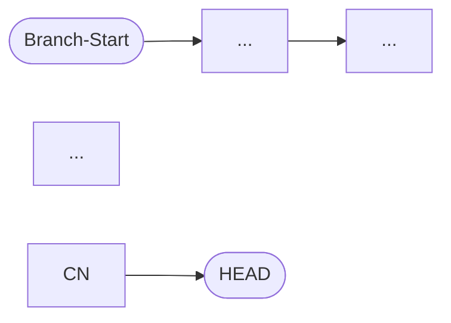

```yaml
status: active
version: 1.0.0
created: 2026-03-30
op: GitAnalyse
phase: A-Pipeline
type: satellite
chain_position: A_orchestrate/1.5
requires_pr: true
```

---

# /_git_analyse — Git-Analyse fuer PR-Review-Modus

```
╔══════════════════════════════════════════════════════════════════════╗
║  VERTRAG: /_git_analyse                                              ║
╠══════════════════════════════════════════════════════════════════════╣
║  LIEST:    Git Repository (git log, git diff, git branch)           ║
║  SCHREIBT: .claude/analysis/git-analyse-{NAME}.md                   ║
║  TOOLS:    Bash (git commands), Read, Write                         ║
║  SCHREIBT NICHT: Code, Tests, Config                                ║
║  POSITION: A_orchestrate Phase 1.5 (nach TaskDef, vor W_fetch)     ║
║            NUR aktiv wenn pr=true in _session_params.md             ║
║  COLDSTART: ja — keine Vorbedingungen ausser Git-Repository         ║
╚══════════════════════════════════════════════════════════════════════╝
```

---

## Aufruf

```
/_git_analyse {NAME} [--branch=BRANCH]
```

- `NAME` — Feature/Ticket-Name (PFLICHT, z.B. DCSRE-881)
- `--branch` — Branch-Name (optional, Default: aktueller Branch via `git branch --show-current`)

---

## Guard: pr=true Pflicht

Lies `{VAULT}/_session_params.md`.
Falls `pr` nicht gesetzt oder `pr=false` → ABBRUCH mit Hinweis:

```
/_git_analyse ist nur im PR-Review-Modus verfuegbar.
Setze pr=true via /_param pr=true und starte erneut.
```

---

## Schritt 1: Branch + Commits analysieren

**Branch bestimmen:**
```bash
git branch --show-current
# oder falls --branch uebergeben: direkt verwenden
```

Branch-Name parsen:
- Ticket-ID extrahieren (z.B. `DCSRE-881`, `feature/DCSRE-881-...`)
- Feature-Beschreibung aus Branch-Suffix ableiten (kebab-case → Klartext)
- Base-Branch bestimmen: `git merge-base HEAD origin/main`

**Commits auflisten:**
```bash
git log origin/main..HEAD --oneline --format="%h %an %s"
```

Analysiere pro Commit:
- Intention (was sollte erreicht werden?)
- Schritt im Entwicklungsprozess (Setup / Feature / Fix / Refactor / Test / Docs)
- Abweichung vom Ticket-Scope? (Keywords ausserhalb Ticket-Bereich)
- Mehrere Autoren → wer hat was beigetragen?

---

## Schritt 2: Dirty Files bestimmen

```bash
git diff --name-only origin/main...HEAD
```

Kategorisiere die geaenderten Dateien:

| Kategorie    | Muster                          |
|--------------|---------------------------------|
| Backend      | `*.cs` (ausser Tests)           |
| Tests        | `*Tests.cs`, `*Spec.cs`         |
| Frontend     | `*.ts`, `*.tsx`, `*.vue`        |
| Config       | `*.json`, `*.yaml`, `*.xml`     |
| Migrations   | `Migrations/*.cs`, `*Migration*`|
| Docs         | `*.md`                          |
| Sonstige     | alles andere                    |

Zaehle pro Kategorie. Bestimme den Suchbereich fuer die nachfolgende Analyse.

---

## Schritt 3: Developer-Journey als Mermaid

Baue ein Mermaid-Flowchart aus den Commits (chronologisch):



Pro Commit-Knoten: `{ShortHash}: {Autor-Kuerzel} — {Intention}`
Abweichungen hervorheben mit `:::warning` Style-Klasse (falls vorhanden).

Halte das Diagramm lesbar: max 10 Knoten. Bei mehr als 10 Commits → Gruppen zusammenfassen.

---

## Schritt 4: Output schreiben

Schreibe `.claude/analysis/git-analyse-{NAME}.md`:

```markdown
# Git-Analyse: {NAME}

## Branch-Info
- Branch: {branch-name}
- Base: origin/main ({merge-base-hash})
- Commits: {anzahl}
- Autoren: {liste}

## Autoren-Tabelle
| Autor | Commits | Bereiche |
|-------|---------|----------|
| ...   | ...     | ...      |

## Dirty Files ({gesamt})
| Kategorie  | Anzahl | Beispiele |
|------------|--------|-----------|
| Backend    | ...    | ...       |
| Tests      | ...    | ...       |
| ...        |        |           |

## Scope-Einschaetzung
IN-SCOPE: [Bereiche die zum Ticket passen]
OUT-OF-SCOPE: [Bereiche ausserhalb Ticket-Scope, falls vorhanden]

## Abweichungs-Warnung
[NUR ausfuellen wenn OUT-OF-SCOPE Commits gefunden — sonst weglassen]

## Developer-Journey
[Mermaid-Diagramm]
```

---

## Abschluss

Gib dem Team Lead eine kompakte Zusammenfassung:
- Branch + Ticket-ID + Commit-Anzahl
- Autoren (falls mehrere)
- Groesste betroffene Kategorie
- Abweichungs-Warnung (falls vorhanden, FETT markieren)
- Pfad zur Ausgabedatei
