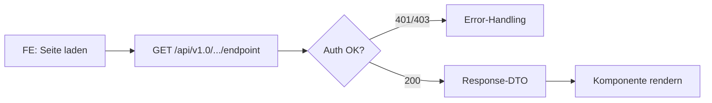
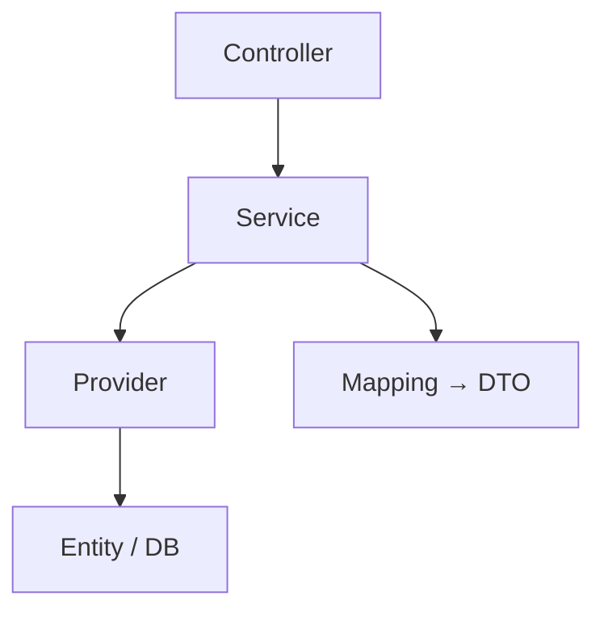
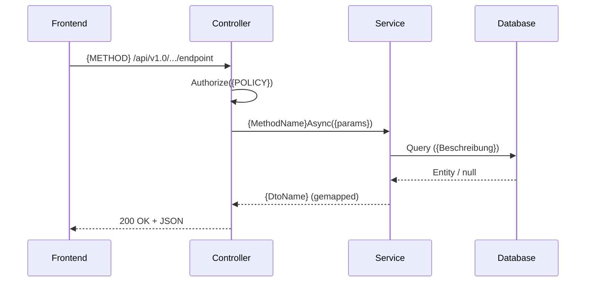

# /_handout — Technisches Entwickler-Handout v2.0

```yaml
status: active
version: 2.1.0
created: 2026-03-17
updated: 2026-06-16
type: satellite
team_based: false
```

---

```
+===============================================================+
| META-COMMAND: /_handout                                        |
+===============================================================+
|                                                                |
| ACTOR: DU (die ausfuehrende Claude-Instanz, KEIN Team)        |
|                                                                |
| ZWECK: Technisches Handout fuer menschliche Entwickler.        |
|        Output ist ein Dokument das ein FE/BE-Entwickler liest  |
|        und SOFORT umsetzen kann — ohne KI-Kontext.             |
|        Maximum Information Density.                            |
|                                                                |
| LIEST:                                                         |
|   - {META}/handout/REFERENZ-FE-DCSRE98.md (GOLDSTANDARD)|
|     → PFLICHT-READ: Checkliste + Stil aus Frontmatter lesen   |
|     → ONE-SHOT Referenz: Struktur, Tiefe, Qualitaet matchen   |
|   - .claude/models/{NAME}_Model.md (Architektur-Kontext)      |
|   - .claude/specs/{NAME}_Spec.md (Requirements, BL-008)       |
|   - .claude/analysis/gap/{NAME}-GAP*.md (Luecken-Analyse)     |
|   - .claude/evidence/*.md (Architektur-Entscheidungen)         |
|   - .claude/analysis/blueprints/{NAME}/ (falls vorhanden)     |
|   - .claude/crumbs/{NAME}_crumbs.md (Rohmaterial)             |
|   - _manifest.md (Pipeline-Status, Phase)                     |
|   - Relevante Code-Dateien (Controller, DTOs, Services)       |
|                                                                |
| SCHREIBT (v2.1.0 BL-Routing, BL-339 AK-8 Satelliten-Sweep):   |
|   DEFAULT (BL-Kontext aufloesbar, global!=true):              |
|     - {bl_folder}/Handouts/HANDOUT-{NAME}-{PERSONA}-{DATE}.md |
|       (Vault, im Backlog-Item an dem gerade gearbeitet wird;  |
|        Handouts/-Ordner lazy erstellen — ADR-03)             |
|   GLOBAL (global=true ODER kein BL-Kontext aufloesbar):       |
|     - .claude/output/HANDOUT-{NAME}-{PERSONA}-{DATE}.md       |
|       (Projekt-Ebene)                                         |
|                                                                |
| INVARIANTEN:                                                   |
|   - KEIN W{n}, KEIN Pipeline-Jargon, KEINE Agenten-Referenzen |
|   - Reines technisches Dokument                                |
|   - C# Class + JSON-Beispiel fuer JEDES DTO (FE/Fullstack)    |
|   - Mermaid Flowcharts + Tabellen                              |
|   - Nomenklatur-Sektion am Ende (Domain-Begriffe)              |
|   - Realistische Werte (Guid, Datum, Text — nicht "string")   |
|                                                                |
+===============================================================+
```

---

## Aufruf

```
/_handout {NAME} [fe|be|fullstack] [coldStart=true] [global=true] [bl=BL-XXX]
```

| Parameter | Default | Werte | Beschreibung |
|-----------|---------|-------|-------------|
| `NAME` | (Manifest) | String | Feature-/Ticket-Name. Falls nicht angegeben: aus Manifest lesen. |
| `persona` | fullstack | fe, be, fullstack | Zielgruppe bestimmt Fokus und Struktur. |
| `coldStart` | false | true, false | Wenn true: kein Model/Spec noetig, leite aus Code direkt ab. |
| `global` | false | true, false | **v2.1.0 (BL-339 AK-8 Satelliten-Sweep):** true = Handout auf Projekt-Ebene (.claude/output/) erzwingen. Default false = Handout gehoert in das Backlog-Item an dem gerade gearbeitet wird ({bl_folder}/Handouts/). |
| `bl` | (optional) | BL-XXX / DCSRE-XXX | Explizite BL-ID — uebersteuert die automatische BL-Kontext-Aufloesung (Schritt 0.6). |

**Beispiele:**
```
/_handout DCSRE-1513 fe              → FE-fokussiertes Handout
/_handout DCSRE-1513 be              → BE-fokussiertes Handout
/_handout DCSRE-1513 fullstack       → Beide Perspektiven kombiniert
/_handout DCSRE-1513                 → fullstack (Default)
/_handout                            → NAME aus Manifest, fullstack
/_handout DCSRE-98 fe coldStart=true → FE-Handout ohne Model/Spec (direkt aus Code)
```

---

## GLOBALE PARAMETER

```
params = lies("{VAULT}/_session_params.md")
NAME = $ARGUMENTS[0] ?? lies("_manifest.md").NAME
PERSONA = $ARGUMENTS[1] ?? "fullstack"
COLD_START = $ARGUMENTS enthält "coldStart=true" ? true : false
GLOBAL = $ARGUMENTS enthält "global=true" ? true : false
BL = $ARGUMENTS enthält "bl=BL-XXX" ? {BL-XXX} : null
```

---

## Ablauf

### Schritt 0: Phase-Erkennung (NEU)

Bestimme die PHASE des Features durch Lesen der Pipeline-Artefakte.
Die Phase steuert WAS im Handout steht (Tiefe, Konkretheit, Controller-Code).

```
PHASE-MATRIX:
┌─────────────────────┬──────────────┬─────────────────────────────────────────┐
│ Artefakt-Zustand    │ Phase        │ Handout-Auswirkung                      │
├─────────────────────┼──────────────┼─────────────────────────────────────────┤
│ coldStart=true      │ ENTWURF      │ Aus Code abgeleitet, keine Garantie.    │
│ (kein Model/Spec)   │              │ DTOs aus Controller/Route-Dateien.      │
│                     │              │ Status: "Aus Code abgeleitet"           │
├─────────────────────┼──────────────┼─────────────────────────────────────────┤
│ Model+Spec, kein    │ DUMMY        │ Vertrag-Vorschlaege, Interface-Stubs.   │
│ Code (A gelaufen)   │              │ DTOs aus Spec, Controller = Dummy.      │
│                     │              │ Status: "Entwurf — noch nicht impl."    │
├─────────────────────┼──────────────┼─────────────────────────────────────────┤
│ Model+Spec+Code     │ IMPL         │ Echte DTOs, echte Controller-Logik.     │
│ Gap > 0%            │              │ Status: "In Implementierung"            │
├─────────────────────┼──────────────┼─────────────────────────────────────────┤
│ Model+Spec+Code     │ FINAL        │ Alles echt, alles komplett.             │
│ Gap = 0% oder       │              │ Status: "Implementiert — bereit"        │
│ Pre-PR gelaufen     │              │                                         │
└─────────────────────┴──────────────┴─────────────────────────────────────────┘
```

**Ermittlung:**
```
1. Falls COLD_START = true → PHASE = ENTWURF, springe zu Schritt 1 (coldStart-Pfad)
2. Lies Model:     .claude/models/{NAME}_Model.md       → MODEL_EXISTS
3. Lies Spec:      .claude/specs/{NAME}_Spec.md → SPEC_EXISTS  # BL-008
4. Lies Gap:       .claude/analysis/gap/{NAME}-GAP*.md  → GAP_PERCENT
5. Lies Manifest:  _manifest.md                         → PIPELINE_STATE
6. Pruefe Code:    Existieren Controller/DTOs fuer {NAME}? → CODE_EXISTS

Falls !MODEL_EXISTS && !SPEC_EXISTS && !COLD_START:
  FEHLER: "Kein Model und keine Spec fuer {NAME} gefunden.
  Entweder /_A_orchestrate ausfuehren oder coldStart=true setzen."

PHASE = bestimme aus Matrix oben.
```

### Schritt 0.6: OUTPUT-ROUTING (v2.1.0 BL-339 AK-8 — Handout gehoert ins Backlog-Item)

```
1. Bestimme Datum (YYYY-MM-DD) = {DATE}.

2. OUTPUT-ROUTING:

   IF GLOBAL == true:
     OUTPUT_PATH = .claude/output/HANDOUT-{NAME}-{PERSONA}-{DATE}.md
     → Logge: "[HANDOUT] global=true → Projekt-Ebene"
   ELSE:
     BL-KONTEXT-AUFLOESUNG (Prioritaets-Kette, erste Quelle gewinnt):
       a) Expliziter Param: bl=BL-XXX
       b) Branch-Kontext: py -3 .claude/scripts/current_context.py --format=json
          → bl_id (nur wenn != null; auf generischen Branches wie
          feature/bdf-YYYY-MM-DD liefert das null — dann weiter zu c)
       c) Gespraechskontext: An welchem BL-Item wird in dieser Session
          GERADE gearbeitet? (Dieselbe Herleitung wie das feature:-Feld
          im Frontmatter — wenn du dort eine BL-ID einsetzen kannst,
          IST das der BL-Kontext.)
       d) Keine Quelle liefert BL-ID → FALLBACK global:
          OUTPUT_PATH = .claude/output/HANDOUT-{NAME}-{PERSONA}-{DATE}.md
          → Logge: "[HANDOUT] Kein BL-Kontext aufloesbar → Fallback Projekt-Ebene
            (explizit erzwingen: bl=BL-XXX)"

     IF BL_ID aufgeloest:
       bl_folder = py -3 .claude/scripts/resolve_bl_path.py {BL_ID}
       mkdir -p {bl_folder}/Handouts/        # lazy, ADR-03
       OUTPUT_PATH = {bl_folder}/Handouts/HANDOUT-{NAME}-{PERSONA}-{DATE}.md
       → Logge: "[HANDOUT] BL-Kontext: {BL_ID} → {bl_folder}/Handouts/"
```

### Schritt 0.5: Goldstandard-Referenz laden (PFLICHT)

```
REFERENZ = lies("{META}/handout/REFERENZ-FE-DCSRE98.md")
CHECKLISTE = REFERENZ.frontmatter.checkliste      # 8 Pflicht-Sektionen
STIL_REGELN = REFERENZ.frontmatter.stil_regeln     # 7 Stil-Regeln

# Jedes Handout MUSS alle 8 Checklisten-Punkte abdecken:
#   1. API-Vertrag (Endpoint-Tabelle)
#   2. Response-DTO (C# Class mit Inline-Kommentaren)
#   3. JSON-Beispiel (vollstaendig, realistische Werte)
#   4. Besonderheiten (nummerierte Edge-Cases)
#   5. Datenfluss (Mermaid-Diagramm)
#   6. Authorization (Rollen-Matrix)
#   7. Nomenklatur (Domain-Begriffe)
#   8. Changelog (versioniert)
#
# Stil-Regeln aus REFERENZ.frontmatter.stil_regeln beachten.
# Bei Abweichung: Sektion darf leer sein wenn nicht zutreffend,
# aber NIE stillschweigend weglassen — explizit "N/A" markieren.
```

### Schritt 1: Kontext laden

**Normal-Pfad** (COLD_START = false):
```
1. Model:      .claude/models/{NAME}_Model.md
2. Spec:       .claude/specs/{NAME}_Spec.md  # BL-008
3. Gap:        .claude/analysis/gap/{NAME}-GAP*.md
4. Evidence:   .claude/evidence/*.md (Pattern: *{NAME}* oder alle)
5. Blueprints: .claude/analysis/blueprints/{NAME}/
6. Crumbs:     .claude/crumbs/{NAME}_crumbs.md
7. Code:       Relevante Dateien aus Model/Spec ableiten (Controller, DTOs, Services)

Graceful Degradation — fehlende Dateien = SKIP, kein Fehler.
```

**coldStart-Pfad** (COLD_START = true):
```
1. Suche Controller:  **/*Controller*.cs die {NAME} oder Feature-Keywords enthalten
2. Suche DTOs:        **/*Dto*.cs, **/*Response*.cs, **/*Request*.cs im Feature-Bereich
3. Suche Routes:      Extrahiere [HttpGet], [HttpPost], [Route] Attribute aus Controllern
4. Suche Entities:    **/*Entity*.cs, **/Entities/*.cs im Feature-Bereich
5. Crumbs:            .claude/crumbs/{NAME}_crumbs.md (falls vorhanden)

Kein Model/Spec/Gap/Evidence noetig. Alles wird aus Code abgeleitet.
Handout-Header bekommt Warnung: "⚠ coldStart — aus Code abgeleitet, kein Model/Spec."
```

### Schritt 2: Skalierung bestimmen (NEU)

Zaehle Endpoints und DTO-Komplexitaet. Bestimme Handout-Groesse.

```
SKALIERUNGS-MATRIX:
┌───────────────────────────┬──────────┬────────────┬────────────────────────┐
│ Feature-Groesse           │ Stufe    │ Ziel-LOC   │ Referenz               │
├───────────────────────────┼──────────┼────────────┼────────────────────────┤
│ 1-2 Endpoints, simple DTOs│ KLEIN    │ ~100 Zeilen│ DCSRE-1513 Stil        │
│                           │          │            │ JSON nur, kein C# Class│
├───────────────────────────┼──────────┼────────────┼────────────────────────┤
│ 3-8 Endpoints ODER        │ MITTEL   │ ~200 Zeilen│ Hybrid                 │
│ 1-2 EP mit komplexen DTOs│          │            │ C# Class + JSON        │
├───────────────────────────┼──────────┼────────────┼────────────────────────┤
│ 8+ Endpoints ODER         │ GROSS    │ ~400+ Zeil.│ DCSRE-98 Stil          │
│ Gigantische DTOs (50+     │          │            │ C# Class + JSON +      │
│ Properties)               │          │            │ Akkordeon-Sektionen    │
└───────────────────────────┴──────────┴────────────┴────────────────────────┘

KLEIN:
  - JSON-Beispiel pro DTO (KEIN C# Class noetig)
  - Keine Akkordeon-Gruppierung
  - Nomenklatur nur bei >=3 Domain-Begriffen

MITTEL:
  - C# Class-Definition + JSON-Beispiel pro DTO
  - Thematische Gruppierung bei >20 Properties
  - Nomenklatur immer

GROSS:
  - C# Class-Definition + JSON-Beispiel pro DTO
  - Thematische Akkordeon-Gruppierung (Sektionen per Kommentar-Trenner)
  - Controller-Code-Beispiel
  - Nomenklatur immer (umfangreich)
  - Besonderheiten-Sektion mit nummerierten Edge-Cases
```

### Schritt 3: Persona-Filter

Je nach PERSONA werden unterschiedliche Sektionen betont:

| Sektion | fe | be | fullstack |
|---------|----|----|-----------|
| Neue Endpoints | JA (Konsument) | JA (Ersteller) | JA |
| C# Class-Definition | JA (Hauptfokus) | KURZ | JA |
| Response-DTOs (JSON) | JA (Hauptfokus) | KURZ | JA |
| Request-DTOs (JSON) | JA | KURZ | JA |
| Entity-Aenderungen | NEIN | JA (Hauptfokus) | JA |
| Migration-Hinweise | NEIN | JA | JA |
| Provider/Service-Logik | NEIN | JA | JA |
| Controller-Code | PHASE-ABHAENGIG | JA | JA |
| Mermaid Flowchart (Datenfluss) | JA | JA | JA |
| Authorization-Matrix | JA | JA | JA |
| UI-Hinweise (Routing, Komponenten) | JA | NEIN | JA |
| Vorher/Nachher (Code) | OPTIONAL | JA | JA |
| Nomenklatur | JA | JA | JA |
| Besonderheiten (Edge-Cases) | JA | JA | JA |

### Schritt 4: Handout schreiben

**Output:** `{OUTPUT_PATH}` (aus Schritt 0.6 — BL-Ordner `{bl_folder}/Handouts/` ODER Projekt-Ebene `.claude/output/`)

Waehle Template basierend auf PERSONA.
Fuege Phase-Status in Header ein.
Skaliere nach Schritt 2.
Fuelle ALLE Platzhalter mit KONKRETEN Werten aus dem geladenen Kontext.

**Vault-Frontmatter-Konformitaet (v2.1.0 — nur wenn Handout im Vault landet):**
Wenn OUTPUT_PATH im BL-Ordner liegt ({bl_folder}/Handouts/, also BL-Kontext aufgeloest),
MUSS dem Handout-Dokument ein YAML-Frontmatter-Block VORANGESTELLT werden — UEBER dem
`# {TICKET-ID} ...`-Titel (vault_document_frontmatter_schema, BL-045 RF-06, P-12
Rueckverfolgbarkeit). Bei global/Projekt-Ebene (.claude/output/) entfaellt der Block —
dort beginnt das Handout wie bisher direkt mit dem Titel (kein KI/Vault-Jargon noetig).

```markdown
---
id: HANDOUT-{NAME}-{PERSONA}-{DATE}
type: handout
tags:
  - type/handout
  - persona/{PERSONA}
  - feature/{NAME}
  - bl/{BL_ID}                      # nur wenn BL-Kontext aufgeloest (v2.1.0)
date: {DATE}
created: {DATE}
updated: {DATE}
feature: {NAME}
bl-item: {BL_ID}                    # v2.1.0 — Pflicht wenn Handout im Vault landet
                                    # (vault_document_frontmatter_schema, BL-045 RF-06)
phase: {PHASE}
---
```

Der Frontmatter ist Vault-Metadaten und zaehlt NICHT als KI-Jargon im Sinne der
Stil-Invarianten — er steht vor dem eigentlichen technischen Dokument.

---

## Template: FE-Handout (HERZSTUECK)

Dies ist das zentrale Template. Goldstandard: DCSRE-98 Stil.
Bei KLEIN: Sektionen 2+3 vereinfachen (nur JSON, kein C# Class).

```markdown
# {TICKET-ID}  FE-Handout: {FEATURE-TITEL}

**Zielgruppe:** Frontend-Entwickler
**Stand:** {DATE}
**Status:** {PHASE_STATUS}

---

## 1. API-Vertrag

{Pro Endpoint:}

### {METHOD} /api/v1.0/{CONTROLLER}/{action}

| Eigenschaft | Wert |
|-------------|------|
| **Authorization** | Policy `{POLICY}` — Rollen: {ROLLEN} |
| **URL-Parameter** | {Params mit Typ, z.B. "`einrichtungId` (Guid)" oder "Keine"} |
| **Query-Parameter** | {Query-Params oder "Keine"} |
| **Request-Body** | {DTO-Name oder "Keiner"} |
| **HTTP 200** | {Erfolgsfall — KONKRET, z.B. "SA gefunden ODER keine SA (leeres DTO, Status 'Offen')"} |
| **HTTP 400** | {Validierungsfehler — KONKRET oder ENTFALLEN wenn nicht moeglich} |
| **HTTP 401** | Nicht authentifiziert |
| **HTTP 403** | {KONKRET — z.B. "PE: fremde Einrichtung / LV: anderer LV"} |
| **HTTP 404** | {KONKRET — z.B. "Einrichtung existiert nicht" oder ENTFALLEN wenn immer 200} |

**Wichtig:** {Edge-Case der NICHT offensichtlich ist, z.B. "Keine SA vorhanden = 200 OK mit leerem DTO, KEIN 404"}

{Bei mehreren Endpoints: wiederhole diesen Block.}

---

## 2. Response-DTO: `{DtoName}`

**Design:** {FLAT/NESTED} — {Kurzbeschreibung, z.B. "ein grosses DTO, ~130 Properties, thematisch gruppiert"}
**Enums:** {Wie Enums serialisiert werden, z.B. "Menschenlesbare Strings mit Umlauten, NICHT int-Werte"}

{Bei MITTEL/GROSS — C# Class-Definition:}

```csharp
public class {DtoName}
{
    // ────────── {Sektion 1: Thema} ──────────
    public Guid Id { get; set; }
    public string Status { get; set; }       // "Offen" | "Befuellt" | "Gesperrt"
    public DateTimeOffset? GeaendertAm { get; set; }

    // ────────── {Sektion 2: Thema} ──────────
    public bool? FlagFeld { get; set; }
    public string? ErlaeuterungsFeld { get; set; }
    public List<string>? ListenFeld { get; set; }  // z.B. ["Wert1", "Wert2"]

    // ────────── {Sektion N: Thema} ──────────
    public {NestedDto}? NestedObjekt { get; set; }
}

public class {NestedDto}
{
    public string? Feld1 { get; set; }
    public int? Feld2 { get; set; }
}
```

{REGELN fuer C# Class:}
{- JEDES Enum-Feld bekommt Inline-Kommentar: // "Wert1" | "Wert2" | "Wert3"}
{- Nullable-Markierung exakt (string vs string?, bool vs bool?)}
{- Thematische Sektionen per Kommentar-Trenner: // ────────── {Thema} ──────────}
{- Nested DTOs als separate Klassen UNTERHALB der Hauptklasse}
{- Listen-Typen mit Beispiel-Werten im Kommentar}

---

## 3. JSON-Beispiel (vollstaendige Response)

{PFLICHT: Vollstaendiges JSON mit REALISTISCHEN Werten. NICHT "guid" sondern echte Guid.}
{PFLICHT: Enum-Werte als Kommentar wiederholen.}
{PFLICHT: Thematische Sektionen per JSON-Kommentar (jsonc).}

```jsonc
{
  // ── {Sektion 1: Thema} ──
  "id": "a1b2c3d4-e5f6-7890-abcd-ef1234567890",
  "status": "Befuellt",                    // "Offen" | "Befuellt" | "Gesperrt"
  "geaendertAm": "2026-03-15T14:30:00+01:00",

  // ── {Sektion 2: Thema} ──
  "flagFeld": true,
  "erlaeuterungsFeld": "Realistischer Text passend zum Domain-Kontext",
  "listenFeld": ["Ambulant", "Stationaer"],

  // ── {Nested} ──
  "nestedObjekt": {
    "feld1": "Realistischer Wert",
    "feld2": 42
  }
}
```

{REGELN fuer JSON-Beispiel:}
{- Guid: "a1b2c3d4-..." Format (NICHT "guid" oder "string")}
{- Datum: ISO 8601 mit Zeitzone (NICHT "datetime")}
{- Text: Domain-passend (NICHT "string" oder "text")}
{- Zahlen: Realistische Werte (NICHT 0 oder 1)}
{- Null: Nur wo fachlich sinnvoll (NICHT alles null)}
{- Enums: Als String mit Kommentar der alle Werte zeigt}
{- Listen: 1-3 Beispiel-Eintraege (NICHT leer)}

{Bei KLEIN: Nur JSON-Beispiel, C# Class weglassen. Sektionen 2+3 zusammenlegen.}

---

## 4. Besonderheiten

{Nummerierte, KONKRETE Edge-Cases. NICHT generisch.}
{Jeder Punkt beschreibt etwas das NICHT offensichtlich ist und den FE-Entwickler ueberraschen koennte.}

1. **{Edge-Case Titel}** — {Konkrete Erklaerung, z.B. "GET liefert 200 mit leerem DTO wenn keine SA existiert. KEIN 404."}
2. **{Edge-Case Titel}** — {Konkrete Erklaerung, z.B. "Alle Enum-Werte kommen als deutsche Strings mit Umlauten. Nicht int."}
3. **{Edge-Case Titel}** — {Konkrete Erklaerung}
{...weitere je nach Feature-Komplexitaet}

---

## 5. Controller (Phase-abhaengig)

{NUR anzeigen wenn PHASE = DUMMY oder IMPL oder GROSS-Skalierung.}
{Bei PHASE = ENTWURF: Sektion weglassen.}
{Bei PHASE = FINAL: Echten Code zeigen.}

```csharp
[HttpGet("{param}")]
[Authorize(Policy = "{POLICY}")]
public async Task<IResult<{DtoName}>> GetAsync([FromRoute] Guid param)
{
    // {Phase-Hinweis: "PHASE 1: Dummy-Daten — wird in Phase 2 ersetzt" oder echte Logik}
    return await _service.GetAsync(param);
}
```

**Naechste Phase:** {Was kommt als naechstes, z.B. "Phase 2: Echte Datenbank-Anbindung ueber Provider"}

---

## 6. Authorization

| Rolle | Zugriff | Guard |
|-------|---------|-------|
| {Rolle1} | {Scope — z.B. "Nur eigene Einrichtung"} | `{guard-ausdruck, z.B. "einrichtungId == user.EinrichtungId"}` |
| {Rolle2} | {Scope} | `{guard-ausdruck}` |

---

## 7. Datenfluss (Mermaid)



{Mermaid Flowchart der den Datenfluss aus FE-Sicht zeigt.}
{Bei mehreren Endpoints: Flowchart erweitern oder pro Endpoint ein Mini-Flowchart.}

---

## 8. Nomenklatur

{Domain-Begriffe die im Handout verwendet werden.}
{PFLICHT bei MITTEL/GROSS. Bei KLEIN: nur wenn >=3 Fachbegriffe.}

| Begriff | Bedeutung |
|---------|-----------|
| **{Abkuerzung}** | {Voller Name — was es im Domain-Kontext bedeutet} |
| **{Fachbegriff}** | {Erklaerung fuer Entwickler die den Fachbereich nicht kennen} |
```

---

## Template: BE-Handout

```markdown
# {TICKET-ID}  BE-Handout: {FEATURE-TITEL}

**Zielgruppe:** Backend-Entwickler
**Stand:** {DATE}
**Status:** {PHASE_STATUS}

---

## 1. Architektur-Ueberblick (Mermaid)



{Anpassen an tatsaechliche Architektur des Features.}

---

## 2. Neue/Geaenderte Endpoints

| Method | Route | Action | Auth-Policy | Phase |
|--------|-------|--------|-------------|-------|
| {GET/POST/PUT} | /api/v1.0/... | {ActionName} | {Policy} | {PHASE} |

---

## 3. Entity-Aenderungen

### 3.1 Neue Entities

```csharp
// {EntityName}.cs — Neue Entity
public class {EntityName} : TrackableEntityBase
{
    public Guid Id { get; set; }
    public string Status { get; set; }       // "Offen" | "Befuellt" | "Gesperrt"
    // ...weitere Felder mit Inline-Kommentaren
}
```

### 3.2 Geaenderte Entities (Vorher/Nachher)

**VORHER:**
```csharp
public class {EntityName}
{
    // alte Struktur
}
```

**NACHHER:**
```csharp
public class {EntityName}
{
    // neue Struktur — {was geaendert und warum}
}
```

---

## 4. Service/Provider-Logik

### {ServiceName}.{MethodName}

```
Eingabe:  {Parameter mit Typen}
Ausgabe:  {Return-Typ}
Logik:    {1-3 Saetze was die Methode tut}
Fehler:   {Wann NotFound, wann Forbidden — KONKRET}
```

---

## 5. DTO-Mapping

| Entity-Feld | DTO-Feld | Transformation |
|-------------|----------|---------------|
| {Entity.Feld} | {Dto.Feld} | {direkt / Enum→String / Berechnung / Null-Coalesce} |

---

## 6. Migration-Hinweise

{Falls Migrations noetig:}
- Neue Tabelle: {Tabellenname}
- Neue Spalte: {Tabelle.Spalte} ({Typ}, nullable: {ja/nein}, default: {Wert})
- FK: {Von} → {Nach} (ON DELETE {CASCADE/RESTRICT})
- Index: {Tabelle}({Spalten}) — {Begruendung}

{Falls keine Migration: "Keine DB-Aenderungen noetig."}

---

## 7. Authorization-Matrix

| Endpoint | Policy | Rollen | Guard | Besonderheiten |
|----------|--------|--------|-------|----------------|
| {ENDPOINT} | {POLICY} | {ROLLEN} | `{guard}` | {z.B. "Nur eigene Einrichtung"} |

---

## 8. Besonderheiten

1. **{Edge-Case 1}** — {Konkrete Erklaerung}
2. **{Edge-Case 2}** — {Konkrete Erklaerung}

---

## 9. Nomenklatur

| Begriff | Bedeutung |
|---------|-----------|
| **{Abkuerzung}** | {Voller Name — was es im Domain-Kontext bedeutet} |
```

---

## Template: Fullstack-Handout

Kombiniert FE- und BE-Template mit zusaetzlicher Integrations-Sektion.

```markdown
# {TICKET-ID}  Fullstack-Handout: {FEATURE-TITEL}

**Zielgruppe:** Fullstack-Entwickler
**Stand:** {DATE}
**Status:** {PHASE_STATUS}

---

## Teil 1: Backend

{BE-Template Sektionen 1-8 (Architektur, Endpoints, Entities, Service, Mapping, Migration, Auth, Besonderheiten)}

---

## Teil 2: Frontend

{FE-Template Sektionen 1-4 (API-Vertrag, C# DTO, JSON-Beispiel, Besonderheiten)}
{FE-Template Sektion 6 (Authorization — nur wenn Auth-Details abweichen von Teil 1)}

---

## Teil 3: Integration

{Wie FE und BE zusammenspielen — Sequenzdiagramm}



{Bei Fehler-Pfaden: Alt-Bloecke im Sequenzdiagramm zeigen.}

---

## Teil 4: Nomenklatur

| Begriff | Bedeutung |
|---------|-----------|
| **{Abkuerzung}** | {Voller Name — was es im Domain-Kontext bedeutet} |
```

---

## Stil-Regeln (INVARIANTEN)

```
VERBOTEN:
  - W{n} Referenzen (das sind interne Model-IDs)
  - Pipeline-Begriffe (SC-Zyklus, I-Pipeline, fanOut, modelMaintain...)
  - Agent-Referenzen (Worker, Team Lead, Explorer, Drafter...)
  - Schwierigkeit/Ceiling/Floor (Session-Parameter)
  - "Claude", "KI", "AI", "LLM" im Dokument
  - Interne Datei-Pfade (.claude/...)
  - Generische Platzhalter ("string", "guid", "datetime") statt realer Werte
  - Leere Listen [] in JSON-Beispielen (immer 1-3 Eintraege)

PFLICHT:
  - Mermaid-Diagramm (mindestens 1 Flowchart ODER Sequenzdiagramm)
  - JSON-Beispiele fuer JEDES DTO (mit realistischen Beispiel-Werten)
  - C# Class-Definition fuer DTOs bei MITTEL/GROSS (mit Inline-Enum-Kommentaren)
  - HTTP-Response-Tabelle pro Endpoint (mit KONKRETEN Beschreibungen)
  - Authorization-Matrix (mit Guards bei MITTEL/GROSS)
  - Nomenklatur-Sektion (Domain-Begriffe erklaert)
  - Ticket-ID im Titel
  - Phase-Status im Header
  - Besonderheiten als nummerierte Edge-Cases (NICHT generisch)

STIL:
  - Technisch praezise, keine Hedge-Woerter ("vielleicht", "eventuell")
  - Kurze Saetze, Listen statt Fliesstext
  - Code-Beispiele in C# (DTOs, Controller, Entities)
  - JSON als jsonc (mit Kommentaren)
  - Realistische Beispiel-Werte:
    - Guid: "a1b2c3d4-e5f6-7890-abcd-ef1234567890"
    - Datum: "2026-03-15T14:30:00+01:00"
    - Text: Domain-passend ("Pflegeeinrichtung Nord", nicht "string")
    - Zahlen: Realistische Werte (42, nicht 0)
    - Enums: Deutsche Strings ("Offen", "Befuellt") mit allen Werten im Kommentar

SKALIERUNG:
  - KLEIN (~100 Zeilen):  Kein C# Class, kompakte Tabellen, Nomenklatur optional
  - MITTEL (~200 Zeilen): C# Class + JSON, Nomenklatur pflicht, Besonderheiten
  - GROSS (~400+ Zeilen): Alles + Akkordeon-Sektionen + Controller-Code + ausfuehrlich
```

---

## Exit-Report

```
/_handout {NAME} {PERSONA}: ABGESCHLOSSEN

Output: {OUTPUT_PATH}   (aus Schritt 0.6 — {bl_folder}/Handouts/ ODER .claude/output/)
Ziel:   {BL_ID | global}

Inhalt:
  - Phase: {PHASE} ({ENTWURF|DUMMY|IMPL|FINAL})
  - Skalierung: {KLEIN|MITTEL|GROSS}
  - Endpoints: {N}
  - DTOs: {M} (mit C# Class: {ja/nein}, mit JSON-Beispiel: ja)
  - Mermaid-Diagramme: {K}
  - Authorization: {L} Policies
  - Besonderheiten: {J} Edge-Cases
  - Nomenklatur: {X} Domain-Begriffe
  - Persona: {PERSONA}
  - coldStart: {ja/nein}

Kein KI-Jargon. Bereit zum Weiterleiten an {PERSONA}-Entwickler.
```

---

## Referenz-Beispiele (Goldstandard)

Die folgenden 2 Referenz-Dokumente definieren den Qualitaetsstandard:

### DCSRE-1513 — Kompakt-Referenz (KLEIN)
- **Pfad:** Lies aus dem BL-Ordner ({bl_folder}/Handouts/HANDOUT-DCSRE-1513-*.md via
  resolve_bl_path.py) ODER Projekt-Ebene (.claude/output/HANDOUT-DCSRE-1513-*.md);
  falls beides leer: Frage User nach Pfad.
- **Merkmale:** 1 Endpoint, ~100 Zeilen, JSON-only (kein C# Class), kompakte HTTP-Tabelle
- **Verwende als Vorlage fuer:** KLEIN-Skalierung (1-2 Endpoints, simple DTOs)

### DCSRE-98 — Ausfuehrlich-Referenz (GROSS)
- **Pfad:** Lies aus dem BL-Ordner ({bl_folder}/Handouts/HANDOUT-DCSRE-98-*.md via
  resolve_bl_path.py) ODER Projekt-Ebene (.claude/output/HANDOUT-DCSRE-98-*.md);
  falls beides leer: Frage User nach Pfad.
- **Merkmale:** 1 Endpoint mit URL-Param, ~430 Zeilen, C# Class mit Inline-Enum-Kommentaren,
  vollstaendiges JSON mit realistischen Werten, Akkordeon-Sektionen (10 thematische Gruppen),
  Controller-Code (Phase 1 Dummy), Auth-Matrix mit Guards, Nomenklatur (13 Begriffe),
  5 nummerierte Besonderheiten
- **Verwende als Vorlage fuer:** GROSS-Skalierung (8+ Endpoints oder gigantische DTOs)

---

## Changelog

### v2.1.0 (2026-06-16) — BL-339 AK-8 Satelliten-Sweep: /_handout ins BL-Kontext-Routing

- **Default-Routing geaendert:** Handout landet im BL-Ordner an dem gerade gearbeitet
  wird ({bl_folder}/Handouts/, lazy mkdir) statt pauschal .claude/output/.
- **BL-Kontext-Aufloesung** (Schritt 0.6): bl=-Param > Branch (current_context.py)
  > Gespraechskontext (analog feature:-Feld) > Fallback Projekt-Ebene mit Log.
- **global=true** Param: erzwingt Projekt-Ebene (.claude/output/) auf expliziten Wunsch.
- **Vault-Frontmatter-Konformitaet:** type/bl-item/created/updated + bl/{BL_ID}-Tag
  ergaenzt (vault_document_frontmatter_schema, BL-045 RF-06) — Pflicht sobald das
  Handout im Vault liegt (P-12 Rueckverfolgbarkeit). Bei global/Projekt-Ebene entfaellt
  der Frontmatter (Handout beginnt wie bisher direkt mit dem Titel).
- Mirror des /_assay v2.1.0 + /_question v1.2.0 Output-Routing-Patterns (Satelliten-Sweep
  der output-Commands: /_assay, /_presentation, /_answer, /_handout, /_question).

---

ARGUMENTS: $ARGUMENTS
