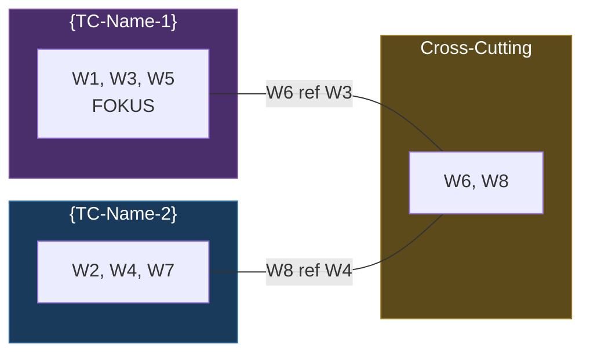
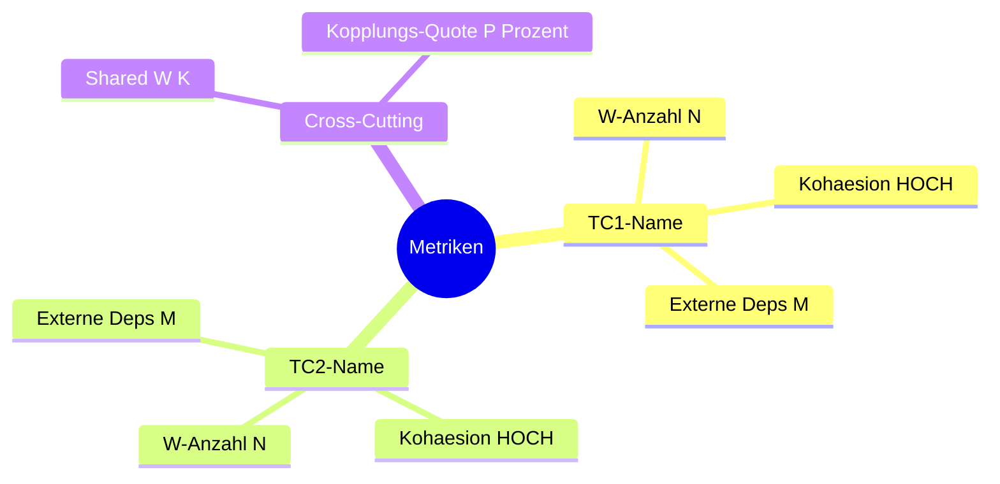
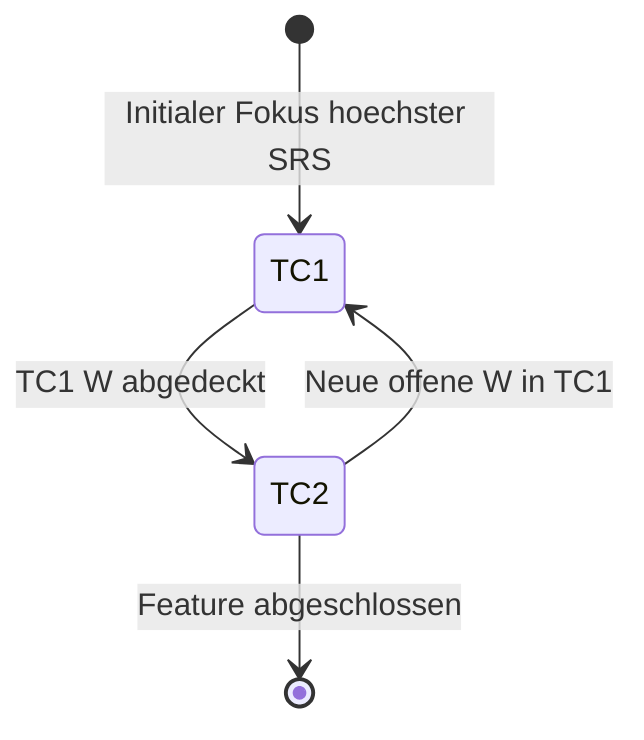

# Forschung: Model Initialisierung & Review

Du erstellst oder validierst ein System-Model - die Single Source of Truth.

## Aufruf

```
/_model {NAME} [easy|normal|hard|finish]
```

- **NAME** (Pflicht): Eindeutiger Model-Name, z.B. `Dateiabholung`, `Auth-Flow`, `Scheduler`
- **Schwierigkeit** (Optional): Default `hard` bei Erstinitialisierung, `normal` bei Review.
- **finish** (NEU v2.1): Spezialmodus fuer Feature-Abschluss (Model verfeinern + Split-Pruefung)

---

## VERTRAG (Pflicht-I/O)

```
╔═══════════════════════════════════════════════════════════════╗
║  COMMAND: /_model {NAME}                                     ║
╠═══════════════════════════════════════════════════════════════╣
║                                                               ║
║  LIEST (Input):                                               ║
║    1. .claude/analysis/_manifest.md (falls vorhanden)         ║
║    2. .claude/crumbs/{NAME}_crumbs.md (Kruemmel)             ║
║    3. .claude/specs/{NAME}_Spec.md (falls vorhanden)          ║
║       ◄── NEU v3.0: SOLL-Zustand als Kontext (NICHT fuer     ║
║           Gap-Analyse, das macht /_gap)                        ║
║    4. .claude/models/{NAME}_Model.md (falls Update/Review)    ║
║    5. Codebase (direkt)                                       ║
║                                                               ║
║  LIEST (Input) - NEU ab v2.0 (bei Review):                    ║
║    5. .claude/models/{NAME}_Model-Topologie.md (bei Split)    ║
║    6. .claude/analysis/synthese/{NAME}-OBSERVE*.md             ║
║       ◄── Findings aus _SC_observe                            ║
║    7. .claude/analysis/synthese/{NAME}-QUALITYGATE*.md         ║
║       ◄── Quality Gates + GC-Markierungen                     ║
║                                                               ║
║  SCHREIBT (Output) - PFLICHT:                                 ║
║                                                               ║
║    Welle 1 (Exploration, nur bei hard):                        ║
║      .claude/analysis/exploration/{NAME}-E01-{fokus}.md       ║
║      .claude/analysis/exploration/{NAME}-E02-{fokus}.md       ║
║      ... (pro Agent eine Datei)                               ║
║                                                               ║
║    Welle 2 (Drafts, bei normal+hard):                         ║
║      .claude/analysis/drafts/{NAME}-model-D01-{fokus}.md      ║
║      .claude/analysis/drafts/{NAME}-model-D02-{fokus}.md      ║
║      ... (pro Agent eine Datei)                               ║
║                                                               ║
║    Welle 3 (Synthese = DU, Hauptagent):                       ║
║      .claude/models/{NAME}_Model.md                           ║
║                                                               ║
║    Manifest (IMMER):                                          ║
║      .claude/analysis/_manifest.md (aktualisieren)            ║
║                                                               ║
║  COMPACT-SICHER:                                              ║
║    Nach JEDER Welle kann /compact ausgefuehrt werden.         ║
║    Die naechste Welle liest aus den geschriebenen Dateien,    ║
║    NICHT aus dem Konversations-Kontext.                        ║
║                                                               ║
║  MCP INTEGRATION (OPTIONAL, Uncle Bob Clean Code):             ║
║    - mcp__cleancoder__query() fuer Architektur-Verstaendnis   ║
║    - Query Topics:                                             ║
║      * "architecture patterns in {system description}"        ║
║      * "clean architecture for {domain}"                      ║
║      * "component responsibilities in {layer}"                ║
║                                                               ║
║  MCP-BREMSE:                                                   ║
║    ┌───────────────────────────────────────────────────┐       ║
║    │  MIDDLE-Modus → max 3 Queries, limit=3           │       ║
║    │  Modi:  min=1Q/1R  middle=3Q/3R  max=5Q/5R      │       ║
║    └───────────────────────────────────────────────────┘       ║
║                                                               ║
╚═══════════════════════════════════════════════════════════════╝
```

---

## Schritt 0: Manifest lesen

**IMMER als Erstes:**

1. Lies `.claude/analysis/_manifest.md` falls vorhanden
   - Lies **SYSTEM-MODEL** und **SCHWIERIGKEIT** aus der System-Konfiguration
   - Bestimme effektives Modell: `min(SYSTEM-MODEL, Command-Max=opus)`
   - Leite Modell-Zuordnung pro Welle ab (siehe Manifest → Modell-Zuordnung)
2. Lies `.claude/crumbs/{NAME}_crumbs.md` falls vorhanden (Kruemmel als Orientierung)
3. Pruefe ob `.claude/models/{NAME}_Model.md` bereits existiert (Update vs. Neu)
4. Falls Manifest sagt "Welle 2 pending" → ueberspringe Welle 1, starte bei Welle 2
5. Falls kein Manifest → beginne bei Welle 1

---

## Kontext

Das Model ist **kein Schritt im Zyklus**, sondern ein **persistentes Dokument**:

```
    {NAME}_Model.md  (persistent, waechst ueber Iterationen)
         │
         ▼
    /_SC_observe ──▶ /_SC_modelMaintain ──▶ /_SC_qualityGate ──▶ /_SC_hypothese ──▶ /_SC_implement ──▶ /_SC_ergebnis
         ▲                                                                                              │
         └──────────────────────────────────────────────────────────────────────────────────────────────┘
                    (updated MODEL via _SC_modelMaintain)
```

`/_model` wird aufgerufen fuer:
- **Erstinitialisierung**: Neues Model aufbauen (hard)
- **Dedizierter Review**: Model auf Aktualitaet pruefen (normal)
- **GC-Konsolidierung** (v2.0+): Widerlegte/Eliminierte W{n} aufraeumen (normal/easy)
- **Finish** (v2.1+): Feature-Abschluss, Model verfeinern, Split-Pruefung, Konsolidierung
- **NICHT** als Schritt in jeder Iteration

**WICHTIG (v2.0+):**
- **Model-Split** wird primaer von `/_SC_modelMaintain` ausgefuehrt (Kohaesion-Check)
  — dort feuert der Kohaesion-Check und der Split wird IN-LOOP durchgefuehrt.
- `/_model` kann Split bei dediziertem Review durchfuehren, aber das ist der Ausnahmefall.
- **GC im Loop:** `/_SC_modelMaintain` markiert W{n} als WIDERLEGT/ELIMINIERT und verschiebt sie.
  `/_model` konsolidiert bei Review (aufraeumen, zusammenfassen, obsolete entfernen).

**MODEL-TOPOLOGIE-PATTERN (v2.2+):**
- **Referenz:** `.claude/reference/Topologie-OmniCommand.md` ist das Quality-Gate und Muster
  fuer Model-Split-Topologien. Jede Model-Topologie MUSS der gleichen Struktur-Dichte folgen:
  Gesamtdiagramm, Vertrags-Matrix, Kohaesion-Metriken, Fokus-Transition — alles mit Mermaid.
- **Evolution:** Monolith → Split → Model-Topologie (reiches Dokument mit Diagrammen)
- **Prinzip:** Wie `Topologie-OmniCommand.md` die 15 Commands mit Diagrammen managt,
  managt die Model-Topologie die Teilmodelle — NICHT als simple Tabelle,
  sondern als dichtes, navigierbares Dokument mit verschiedenen Mermaid-Typen.

---

## Schwierigkeits-Parameter

| Schwierigkeit | Exploration (Welle 1) | Drafts (Welle 2) | Synthese (Welle 3) |
|---------------|----------------------|------------------|-------------------|
| **easy** | --- | --- | 1 Agent |
| **normal** | --- | 5 Agents | 1 Agent |
| **hard** | 9 Agents | 5 Agents | 1 Agent |

**2 Freiheitsgrade:**
1. **Schwierigkeit** = WIE VIELE Agents (easy=1, normal=5 Drafts, hard=9 Explorer + 5 Drafts)
2. **Ceiling/Floor** = WELCHE Modelle (bestimmt durch System-Model aus Manifest)

**Skalierungs-Tabelle (Freiheitsgrad 2 - Modell-Zuordnung):**

| System-Model | Exploration (floor) | Drafts (middle) | Synthese (ceiling) |
|-------------|---------------------|-----------------|-------------------|
| opus | haiku | sonnet | opus |
| sonnet | haiku | sonnet | sonnet |
| haiku | haiku | haiku | haiku |

**Hinweis:** Im Wellen-Worker-Modus spawnt der Team Lead die Agents parallel.
Im Solo-Modus fuehrt DU alle Wellen sequentiell selbst aus.

---

## Dual-Mode: Solo vs. Wellen-Worker

Dieses Command kann in zwei Modi laufen:

**SOLO-MODUS** (User ruft direkt auf: `/_model {NAME} hard`)
- Du bist selbst Orchestrator (hast Task-Tool)
- easy: Nur Synthese (du selbst, 1 Durchlauf)
- normal: Drafter-Durchlaufe sequentiell selbst, dann Synthese
- hard: Exploration sequentiell selbst, dann Drafter, dann Synthese
- Kein Spawning von Sub-Agents

**WELLEN-WORKER-MODUS** (Team Lead hat Task erstellt, Task-Beschreibung enthaelt "Welle")
- Lies die Task-Beschreibung via TaskGet um deine Rolle zu erkennen
- "Welle 1: Exploration, Fokus: {fokus}, Agent-ID: E{NN}" → Fuehre NUR Welle 1 aus
- "Welle 2: Drafts, Fokus: {fokus}, Agent-ID: D{NN}" → Fuehre NUR Welle 2 aus
- "Welle 3: Synthese" → Fuehre NUR Welle 3 aus
- Spawne KEINE Sub-Agents (kein Task-Tool verfuegbar)
- Schreibe Output in designierten Datei-Slot
- SendMessage an Team Lead: "Welle {N} fertig: {summary}"

**Erkennung:**
```pseudocode
current_task = TaskGet(my_task_id)
IF task_description enthaelt "Welle" ODER spezifische Rollen-Zuweisung:
  IS_WORKER = True  // Nur zugewiesene Welle ausfuehren
ELSE:
  IS_WORKER = False  // Solo-Modus (alle Wellen sequentiell)
```

---

## Ablauf: hard (Erstinitialisierung)

```
Welle 1:       ┌───┐ ┌───┐ ┌───┐ ┌───┐ ┌───┐
EXPLORATION    │ E │ │ E │ │ E │ │ E │ │ E │  ──SCHREIBT──▶ exploration/{NAME}-E*.md
               └─┬─┘ └─┬─┘ └─┬─┘ └─┬─┘ └─┬─┘
                 └─────┴─────┼─────┴─────┘
                             │
                        [/compact moeglich]
                        [Manifest: "Welle 1 done, Welle 2 pending"]
                             │
                             ▼
Welle 2:  ┌───┐ ┌───┐ ┌───┐
DRAFTS    │ D │ │ D │ │ D │  ──LIEST──▶ exploration/{NAME}-E*.md
          └─┬─┘ └─┬─┘ └─┬─┘  ──SCHREIBT──▶ drafts/{NAME}-model-D*.md
            └─────┼─────┘
                  │
             [/compact moeglich]
             [Manifest: "Welle 2 done, Welle 3 pending"]
                  │
                  ▼
Welle 3:  ┌──────────────────┐
SYNTHESE  │  DU, Hauptagent  │  ──LIEST──▶ drafts/{NAME}-model-D*.md
          │                  │  ──SCHREIBT──▶ models/{NAME}_Model.md
          └──────────────────┘
                  │
             [Manifest: "_model done, naechster: /_gap"]
```

---

## Welle 1: Exploration (Kartografie)

### Dein Auftrag (Wellen-Worker-Modus ODER Solo-Modus)

**Wellen-Worker-Modus:** Falls Task-Beschreibung "Welle 1: Exploration, Fokus: {fokus}, Agent-ID: E{NN}" enthaelt:
Du bist Explorer E{NN}. Fuehre NUR diese Exploration aus und schreibe dein Output in die designierte Datei.

**Solo-Modus:** Fuehre mehrere Exploration-Durchlaufe sequentiell aus (E01-architektur, dann E02-konfiguration, etc.).

**Agent-Auftrag** (fuer jeden Explorer-Slot):

```
Du bist Explorer E{NN} fuer die Kartografie von "{NAME}".

KONTEXT (falls vorhanden):
  .claude/crumbs/{NAME}_crumbs.md (Kruemmel als Orientierung)

AUFTRAG: {Fokus-Beschreibung}

SCHREIB-PFLICHT:
Du MUSST deine Findings in folgende Datei schreiben:
  .claude/analysis/exploration/{NAME}-E{NN}-{fokus}.md

DATEI-FORMAT (Pflicht):
  ---
  name: {NAME}
  phase: model
  wave: exploration
  tier: {SYSTEM-MODEL}
  model: {TATSAECHLICHES-MODELL}
  agent: E{NN}
  fokus: {fokus}
  date: {YYYY-MM-DD}
  status: final
  ---

  # Exploration E{NN}: {Fokus-Titel}

  ## Findings

  ### F1: {Finding-Titel}
  - **Datei:** {Pfad}:{Zeile}
  - **Beschreibung:** ...

  ### F2: ...

  ## Zusammenfassung
  {3-5 Saetze}

WICHTIG:
- NUR Kartografie: Dateien, Zeilen, Patterns, Strukturen
- KEINE Tiefenanalyse
- JEDES Finding mit Datei:Zeile belegen
- Die Datei MUSS geschrieben werden, NICHT nur als Text zurueckgeben
```

### Explorer-Fokus-Bereiche

| Agent | Fokus | Aufgabe |
|-------|-------|---------|
| E01 | architektur | System-Topologie, Projekte, Container, Netzwerk |
| E02 | konfiguration | Config-Dateien, Environment-Variablen, Secrets |
| E03 | code-flow | Relevante Code-Pfade, Methoden-Signaturen |
| E04 | externe-deps | Bibliotheken, NuGet, APIs, Protokolle |
| E05 | dokumentation | Bestehende Docs, Kommentare, READMEs |
| E06-E10 | (bei Bedarf) | Weitere Aspekte je nach Scope |

### Nach Welle 1: Manifest aktualisieren

```markdown
# Forschungs-Manifest

**NAME:** {NAME}
**PHASE:** _model
**WELLE:** 1 abgeschlossen, 2 ausstehend
**NAECHSTER SCHRITT:** Welle 2 (Drafts) starten - liest exploration/{NAME}-E*.md

## Geschriebene Dateien

### Exploration (Welle 1) - {Datum}
- [x] .claude/analysis/exploration/{NAME}-E01-architektur.md
- [x] .claude/analysis/exploration/{NAME}-E02-konfiguration.md
- [x] .claude/analysis/exploration/{NAME}-E03-code-flow.md
- [x] .claude/analysis/exploration/{NAME}-E04-externe-deps.md
- [x] .claude/analysis/exploration/{NAME}-E05-dokumentation.md

### Drafts (Welle 2) - ausstehend
### Synthese (Welle 3) - ausstehend
```

**NACH dem Manifest-Update kann /compact ausgefuehrt werden.**

---

## Welle 2: Drafts (Heavy Lifting)

### Voraussetzung

Lies ALLE Dateien in `.claude/analysis/exploration/{NAME}-E*.md`

Falls diese Dateien nicht existieren → FEHLER: "Welle 1 nicht abgeschlossen. Starte /_model {NAME} hard"

### Dein Auftrag (Wellen-Worker-Modus ODER Solo-Modus)

**Wellen-Worker-Modus:** Falls Task-Beschreibung "Welle 2: Drafts, Fokus: {fokus}, Agent-ID: D{NN}" enthaelt:
Du bist Drafter D{NN}. Fuehre NUR diese Tiefenanalyse aus und schreibe dein Output in die designierte Datei.

**Solo-Modus:** Fuehre mehrere Drafter-Durchlaufe sequentiell aus (D01-validierung, dann D02-zusammenhaenge, etc.).

**Agent-Auftrag** (fuer jeden Drafter-Slot):

```
Du bist Drafter D{NN} fuer die Tiefenanalyse von "{NAME}".

INPUT - LIES ZUERST DIESE DATEIEN:
  1. .claude/crumbs/{NAME}_crumbs.md (Kruemmel-Kontext)
  2. {Liste aller exploration/{NAME}-E*.md Dateien}

AUFTRAG: {Fokus-Beschreibung}

SCHREIB-PFLICHT:
Du MUSST deine Findings in folgende Datei schreiben:
  .claude/analysis/drafts/{NAME}-model-D{NN}-{fokus}.md

DATEI-FORMAT (Pflicht):
  ---
  name: {NAME}
  phase: model
  wave: drafts
  tier: {SYSTEM-MODEL}
  model: {TATSAECHLICHES-MODELL}
  agent: D{NN}
  fokus: {fokus}
  date: {YYYY-MM-DD}
  reads: exploration/{NAME}-E01-*.md, exploration/{NAME}-E02-*.md, ...
  status: final
  ---

  # Drafter D{NN}: {Fokus-Titel}

  ## Gelesene Exploration-Inputs
  {Liste der gelesenen Exploration-Dateien mit Kurzfassung}

  ## Findings

  ### F1: {Finding-Titel}
  - **Quelle:** Explorer E{NN} Finding F{M} + eigene Analyse
  - **Datei:** {Pfad}:{Zeile}
  - **Beschreibung:** ...
  - **Bewertung:** ...

  ## Zusammenhaenge
  {Cross-Cutting Findings, Architektur-Patterns}

  ## Hypothesen-Kandidaten
  {Basierend auf Findings}

  ## Zusammenfassung
  {5-10 Saetze}

WICHTIG:
- IMMER Exploration-Findings referenzieren (bestaetigend oder widerlegend)
- Eigene tiefere Analyse hinzufuegen
- Die Datei MUSS geschrieben werden, NICHT nur als Text zurueckgeben
```

### Drafter-Fokus-Bereiche

| Agent | Fokus | Aufgabe |
|-------|-------|---------|
| D01 | validierung | Validiert Exploration-Findings, prueft Relevanz und Korrektheit |
| D02 | zusammenhaenge | Cross-Cutting Concerns, Architektur-Patterns, Anomalien |
| D03 | constraints | Grenzen, Risiken, fehlende Komponenten, Gap-Analyse |
| D04-D05 | (bei hard) | Gegen-Hypothesen, alternative Perspektiven |

### Nach Welle 2: Manifest aktualisieren

Aktualisiere `.claude/analysis/_manifest.md`:

```markdown
**WELLE:** 2 abgeschlossen, 3 ausstehend
**NAECHSTER SCHRITT:** Welle 3 (Synthese) starten - liest drafts/{NAME}-model-D*.md

### Drafts (Welle 2) - {Datum}
- [x] .claude/analysis/drafts/{NAME}-model-D01-validierung.md
- [x] .claude/analysis/drafts/{NAME}-model-D02-zusammenhaenge.md
- [x] .claude/analysis/drafts/{NAME}-model-D03-constraints.md
```

**NACH dem Manifest-Update kann /compact ausgefuehrt werden.**

---

## Welle 3: Synthese (DU, Hauptagent - Wahrheits-Check + Synthese)

### Voraussetzung

Lies ALLE Dateien in `.claude/analysis/drafts/{NAME}-model-D*.md`

Falls diese Dateien nicht existieren → FEHLER: "Welle 2 nicht abgeschlossen."

### Dein Auftrag

1. Lies alle Draft-Reports
2. Lies `.claude/crumbs/{NAME}_crumbs.md` (Kruemmel-Kontext)
3. **Pruefe ob die Findings stimmen** - schlag im Code nach wenn noetig
4. Verwirf was nicht belegt werden kann
5. Synthetisiere das finale Model-Dokument
6. Schreibe `.claude/models/{NAME}_Model.md`

### Model-Dokument Struktur

```markdown
# System-Model: {NAME}

**Version:** X.Y
**Letzte Aktualisierung:** YYYY-MM-DD
**Iteration:** N
**Wissenschaftliche Frage:** {Was untersuchen wir?}

## 1. System-Architektur
   - Container-Topologie (Mermaid)
   - Port-Mapping Matrix

## 2. Kommunikationsprotokoll
   - Relevante Flows (Sequenz-Diagramme)

## 3. Konfigurationsmodell
   - Entscheidungs-Logik (Flowchart)
   - Konfigurationsdateien-Matrix

## 4. Datenfluss-Model
   - Request-Typen und Pfade

## 5. Verifizierte Wahrheiten
   - W1: {Erkenntnis} [Quelle: Explorer E{NN} F{M} + Drafter D{NN} F{M}, BESTAETIGT]
   - W2: {Erkenntnis} [Quelle: ..., BESTAETIGT]

## 5a. Widerlegte und Eliminierte Annahmen (v2.0+)
   - W{n}: {Erkenntnis} [WIDERLEGT, ERGEBNIS{K}: {Grund}]
   - W{m}: {Erkenntnis} [ELIMINIERT, ANALYSE{N}: Battle-Royale]
   (Wird von _SC_modelMaintain gepflegt. _model konsolidiert bei Review.)

## 6. Versions-Historie
   | Version | Datum | Quelle | Aenderung |
   |---------|-------|--------|-----------|
   | 1.0 | ... | _model hard | Erstinitialisierung |

## 6a. Abzaehlbare Sektionen (v2.0+, Voraussetzung fuer SRS)

   ### Offene Hypothesen-Bereiche (fuer SRS D1)
   | # | Bereich | Status | Seit |
   |---|---------|--------|------|
   (Wird von _SC_modelMaintain gepflegt, von _SC_ergebnis im DATENBANK-MODUS gelesen)

   ### Aktive Technologie-Concerns (fuer SRS D4)
   | # | TC | Status | W{n}-Anzahl | Seit |
   |---|-----|--------|-------------|------|
   (Wird von _SC_modelMaintain gepflegt, von _SC_ergebnis im DATENBANK-MODUS gelesen)

## 7. Offene Fragen
   - Was ist noch ungeklaert?

## 8. Referenzen
   | Quelle | Pfad |
   |--------|------|
   | Explorer E01 | .claude/analysis/exploration/{NAME}-E01-architektur.md |
   | Drafter D01 | .claude/analysis/drafts/{NAME}-model-D01-validierung.md |
```

### Nach Welle 3: Manifest finalisieren

```markdown
**PHASE:** _model abgeschlossen
**WELLE:** 3 abgeschlossen (alle Wellen fertig)
**NAECHSTER SCHRITT:** /_gap

### Synthese (Welle 3) - {Datum}
- [x] .claude/models/{NAME}_Model.md
```

---

## Ablauf: normal (Review)

```
Welle 1:  ┌───┐ ┌───┐ ┌───┐
DRAFTS    │ D │ │ D │ │ D │  ──LIEST──▶ models/{NAME}_Model.md
          └─┬─┘ └─┬─┘ └─┬─┘  ──SCHREIBT──▶ drafts/{NAME}-review-D*.md
            └─────┼─────┘
                  ▼
Welle 2:  ┌──────────────────┐
SYNTHESE  │  DU, Hauptagent  │  ──LIEST──▶ drafts/{NAME}-review-D*.md
          │                  │  ──SCHREIBT──▶ models/{NAME}_Model.md (update)
          └──────────────────┘
```

Keine Exploration noetig - Terrain ist bereits kartografiert.

### GC-Konsolidierung (v2.0+, bei Review)

Falls Sektion "Widerlegte und Eliminierte Annahmen" mehr als 10 Eintraege hat:
1. Pruefe ob ELIMINIERTE W{n} re-aktiviert werden koennten (Cross-Cutting-Check)
2. Entferne endgueltig obsolete WIDERLEGTE W{n} (die keine Widerlegungsinformation mehr tragen)
3. Konsolidiere verwandte ELIMINIERTE W{n} zu Gruppen
4. Dokumentiere Konsolidierung in Versions-Historie

### Model-Topologie Wartung (v2.0+, bei Review mit aktivem Split)

Falls `{NAME}_Model-Topologie.md` existiert:
1. Pruefe ob Teilmodelle noch kohaesiv sind (W{n}-Verteilung)
2. Pruefe ob FOKUS-Wechsel sinnvoll (SRS pro Teilmodel)
3. Pruefe ob Teilmodelle zusammengelegt werden koennen (VM-6)
4. Aktualisiere Abhaengigkeiten im Index

---

## Ablauf: easy (Quick Check)

```
             ┌──────────────────┐
SYNTHESE     │  DU, Hauptagent  │  ──LIEST──▶ models/{NAME}_Model.md + Code
             │                  │  ──SCHREIBT──▶ models/{NAME}_Model.md (update)
             └──────────────────┘
```

---

## Ablauf: finish (Feature-Abschluss, NEU v2.1)

**Zweck:** Model nach Feature-Abschluss verfeinern, konsolidieren und ggf. splitten.
Wird von `/_taskDefinition` vorgeschlagen wenn alle W{n} bestaetigt/widerlegt sind,
oder wenn der User explizit `/_model {NAME} finish` aufruft.

```
             ┌──────────────────┐
Phase 1:     │  DU, Hauptagent  │  ──LIEST──▶ models/{NAME}_Model.md
AUDIT        │  Vollstaendigkeit │  ──LIEST──▶ synthese/{NAME}-ERGEBNIS*.md
             │  + W{n}-Status    │  ──LIEST──▶ synthese/{NAME}-OBSERVE*.md + QUALITYGATE*.md
             └────────┬─────────┘
                      │
                      ▼
             ┌──────────────────┐
Phase 2:     │  DU, Hauptagent  │  ──LIEST──▶ Model + Audit-Ergebnis
VERFEINERN   │  Wahrheiten       │  ──SCHREIBT──▶ models/{NAME}_Model.md (verfeinert)
             │  konsolidieren    │
             └────────┬─────────┘
                      │
                      ▼
             ┌──────────────────┐
Phase 3:     │  DU, Hauptagent  │  ──LIEST──▶ Verfeinertes Model
SPLIT-CHECK  │  Kohaesion        │  ──SCHREIBT──▶ Model-Topologie (falls noetig)
             │  + Kopplung        │  ──SCHREIBT──▶ Teilmodelle (falls noetig)
             └──────────────────┘
```

### Phase 1: Model-Audit

1. Lies Model vollstaendig
2. Zaehle und kategorisiere alle W{n}:
   - BESTAETIGT: Durch Experiment verifiziert
   - WIDERLEGT: Durch Experiment widerlegt
   - ELIMINIERT: Durch Battle-Royale entfernt
   - OFFEN: Noch nicht getestet
3. Erstelle Vollstaendigkeits-Report:

```
Model-Audit: {NAME} v{X.Y}
━━━━━━━━━━━━━━━━━━━━━━━━━━━━
Wahrheiten gesamt:    {N}
  BESTAETIGT:         {N} ()
  ELIMINIERT:         {N} ()

Zyklen durchlaufen:   {N}
TCs aktiv:            {N}
SRS-Trend:            {GESCHRUMPFT/STAGNIERT/GEWACHSEN}
```

### Phase 2: Model-Verfeinerung

1. **Widerlegte W{n} konsolidieren:**
   - Entferne endgueltig obsolete Widerlegungen (die keine Lern-Information mehr tragen)
   - Behalte Widerlegungen mit wertvoller Erkenntnis als "Gelernte Lektion"

2. **Bestaeigte W{n} schaerfen:**
   - Formulierungen praezisieren basierend auf allen Zyklen-Ergebnissen
   - Redundante W{n} zusammenfassen
   - Datei:Zeile Referenzen aktualisieren

3. **Diagramme aktualisieren:**
   - Mermaid-Diagramme auf finalen Stand bringen
   - Veraltete Architektur-Ansichten entfernen

4. **Version auf naechste Major-Version erhoehen** (z.B. 1.7 → 2.0)

### Phase 3: Split-Pruefung (Kohaesion + Kopplung)

**Leitprinzip:** Hohe Kohaesion innerhalb, niedrige Kopplung zwischen Sub-Models.

1. **Kohaesion-Analyse:**
   - Gruppiere BESTAETIGT-W{n} nach Thema/TC
   - Pruefe: Gibt es klar trennbare Cluster?
   - Pruefe: Sind die Cluster thematisch geschlossen (hohe Kohaesion)?

2. **Kopplungs-Analyse:**
   - Pruefe: Welche W{n} referenzieren W{n} aus anderen Clustern?
   - Pruefe: Sind die Abhaengigkeiten minimal (niedrige Kopplung)?
   - Dokumentiere Cross-Cutting W{n}

3. **Split-Entscheidung:**

```
KEIN SPLIT noetig wenn:
  - Weniger als 15 aktive W{n}
  - Nur 1-2 TCs
  - Hohe Cross-Cutting-Quote (>30% W{n} betreffen mehrere TCs)

SPLIT EMPFOHLEN wenn:
  - 15-30 aktive W{n}
  - 3+ TCs mit klaren Grenzen
  - Niedrige Cross-Cutting-Quote (<20%)

SPLIT PFLICHT wenn:
  - >30 aktive W{n}
  - >5 TCs
  - Model ist fuer einen Kontext-Ladevorgang zu gross
```

4. **Falls Split:** Erstelle eine **Model-Topologie** nach dem Referenz-Muster
   `.claude/reference/Topologie-OmniCommand.md`

   **Evolution-Prinzip:**

   ```
   Phase 1: MONOLITH               Phase 2: SPLIT + TOPOLOGIE

   {NAME}_Model.md                 {NAME}_Model-Topologie.md  ◄── Index + Diagramme
   ┌───────────────────────┐       ├── {NAME}_{TC1}_Model.md   ◄── Hohe Kohaesion
   │ 30+ W{n}, 5+ TCs     │  ──▶  ├── {NAME}_{TC2}_Model.md   ◄── Hohe Kohaesion
   │ Niedrige Kohaesion    │       └── {NAME}_{TC3}_Model.md   ◄── Hohe Kohaesion
   └───────────────────────┘
   Wie Topologie-OmniCommand.md    Gleiche Struktur-Dichte:
   die 15 Commands managt,         Mermaid flowchart + mindmap +
   managt die Model-Topologie      stateDiagram + Tabellen
   die Teilmodelle.
   ```

### Model-Topologie Dokument-Template

**Pfad:** `models/{NAME}_Model-Topologie.md`
**Referenz-Muster:** `.claude/reference/Topologie-OmniCommand.md`

**Pflicht-Sektionen (mindestens 4 verschiedene Mermaid-Diagramm-Typen):**

| # | Sektion | Mermaid-Typ | Zweck |
|---|---------|-------------|-------|
| 1 | Gesamtdiagramm | `flowchart LR` | Alle Teilmodelle + Abhaengigkeiten visuell |
| 2 | Kohaesion/Kopplung | `mindmap` | Metriken pro Teilmodel (W-Anzahl, Deps) |
| 3 | Fokus-Transition | `stateDiagram-v2` | Wechsel-Logik zwischen Teilmodellen |
| 4 | SRS pro Teilmodel | Tabelle | D1-D4 + SRS berechenbar pro Teilmodel |
| 5 | Vertrags-Matrix | Tabelle | Shared W{n}, Cross-Cutting Abhaengigkeiten |
| 6 | Teilmodel-Index | Tabelle | Status, Fokus, W{n}, Pfad, Deps |
| 7 | Evolution | Tabelle | Split-Historie (Monolith → Split) |
| 8 | VM-Regeln | Tabelle | VM-1 bis VM-6 (Referenz) |

**Mermaid-Beispiele fuer die Model-Topologie:**

**1. Gesamtdiagramm (flowchart LR):**


**2. Kohaesion/Kopplung (mindmap):**


**3. Fokus-Transition (stateDiagram-v2):**


**QUALITAETS-GATE (Pflicht bei jeder Model-Topologie):**
- Mindestens 3 verschiedene Mermaid-Diagramm-Typen (flowchart + mindmap + stateDiagram)
- Jedes Teilmodel mit Status, Fokus, W{n}-Anzahl, Pfad
- Cross-Cutting W{n} explizit als Abhaengigkeiten dokumentiert
- SRS pro Teilmodel berechenbar (D1-D4 Spalten)
- Evolution nachvollziehbar (Monolith → Split mit Trigger-Grund)
- Referenz auf `.claude/reference/Topologie-OmniCommand.md` im Header

### Finish-Output

```
Model-Finish: {NAME}
━━━━━━━━━━━━━━━━━━━━
Version:        {X.Y} → {X+1.0}
W{n} vorher:    {N} (aktiv: {N}, widerlegt: {N}, eliminiert: {N})
W{n} nachher:   {N} (aktiv: {N}, konsolidiert: {N entfernt})
Split:          {Nicht noetig / Empfohlen / Ausgefuehrt ({N} Teilmodelle)}

Naechste Optionen:
  (A) Neues Feature starten (/_taskDefinition {NEUER-NAME})
  (B) Benachbarten Task bearbeiten (/_taskDefinition {NAME} -- Task-Kontinuitaet)
  (C) Nochmal vertiefen (/_SC_observe)
```

---

## Model-Qualitaetskriterien

| Kriterium | Pruefung |
|-----------|----------|
| Aktualitaet | Datei:Zeile Referenzen pruefen |
| Vollstaendigkeit | Keine "black boxes" |
| Konsistenz | Cross-Reference Check |
| Verifizierbarkeit | Jede W{n} mit Experiment/Quelle belegt |
| Lesbarkeit | Mermaid statt Prosa |
| Mermaid-First (v2.3+) | Bei finish: W{n} mit Ablauf-/Struktur-Charakter MUESSEN Mermaid-Diagramm haben (W114, 70/30-Regel W113). Primaeres Format fuer Architektur-, Datenfluss- und Prozess-Wahrheiten. |
| Versionierung | Changelog gefuehrt |
| Quellennachweis | Jede W{n} referenziert Explorer/Drafter-Quelle |
| Kap. 6a (v2.0+) | Abzaehlbare Sektionen vorhanden (Offene Bereiche, Aktive TCs) |
| Sek. 5a (v2.0+) | Widerlegte/Eliminierte Annahmen-Sektion vorhanden |
| GC-Konsolidierung (v2.0+) | Bei Review: Obsolete Eintraege aufgeraeumt |
| Model-Topologie (v2.0+) | Bei aktivem Split: Index konsistent, FOKUS gesetzt |
| Topologie-Dichte (v2.2+) | Bei Split: Model-Topologie hat min. 3 Mermaid-Typen (flowchart+mindmap+stateDiagram) |
| Topologie-Referenz (v2.2+) | Bei Split: Referenz auf `.claude/reference/Topologie-OmniCommand.md` im Header |
| Finish-Audit (v2.1+) | Bei finish: W{n}-Status vollstaendig kategorisiert |
| Finish-Verfeinerung (v2.1+) | Bei finish: Redundante W{n} konsolidiert, Formulierungen geschaerft |
| Finish-Split (v2.1+) | Bei finish: Kohaesion/Kopplung analysiert, Split-Entscheidung dokumentiert |

---

## Naechster Schritt

- Nach **Erstinitialisierung** (Pipeline): `/_gap` fuer Gap-Analyse (SPEC vs IST Delta).
- Nach **Erstinitialisierung** (wiss. Zyklus): `/_SC_observe` fuer Problem-Analyse.
- Nach **finish**: `/_taskDefinition {NEUER-NAME}` fuer neues Feature ODER `/_taskDefinition {NAME}` fuer benachbarten Task im bestehenden Feature.

---

## NOTIFY (Pflicht - Allerletzter Schritt)

**NUR wenn ALLES fertig ist** (alle Schritte abgeschlossen, Zusammenfassung ausgegeben):

```bash
powershell -Command "notify '{FEATURE} /_model abgeschlossen'"
```

WICHTIG: Keine Zwischen-Benachrichtigungen! NUR ganz am Ende.

ARGUMENTS: $ARGUMENTS
