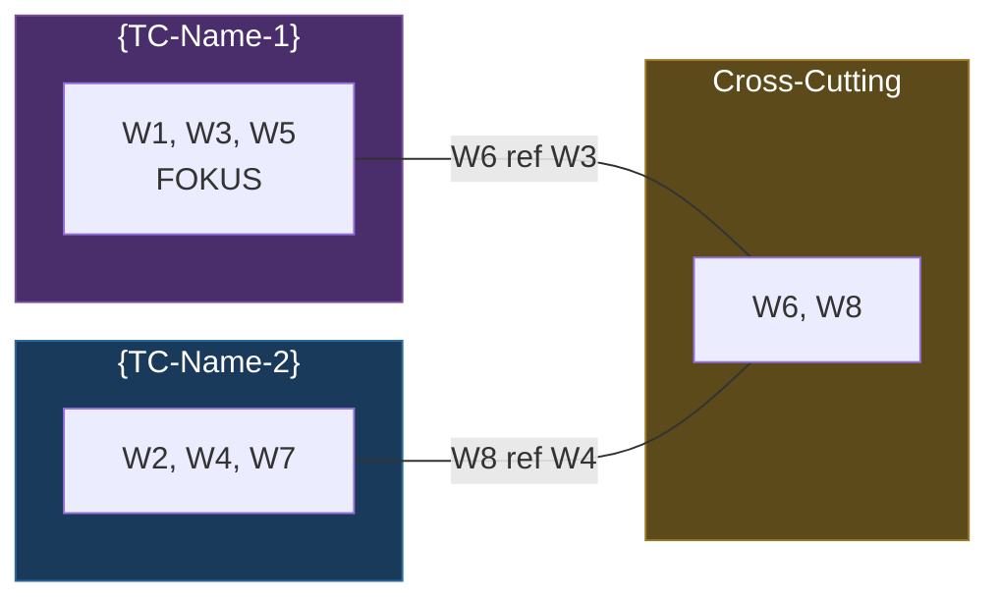
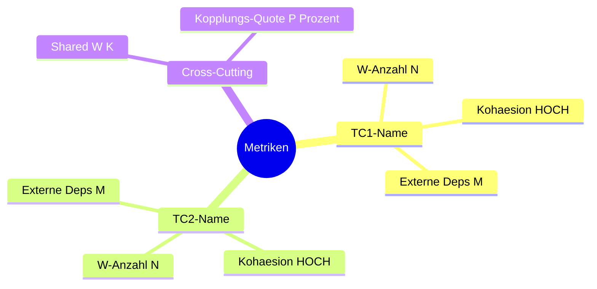
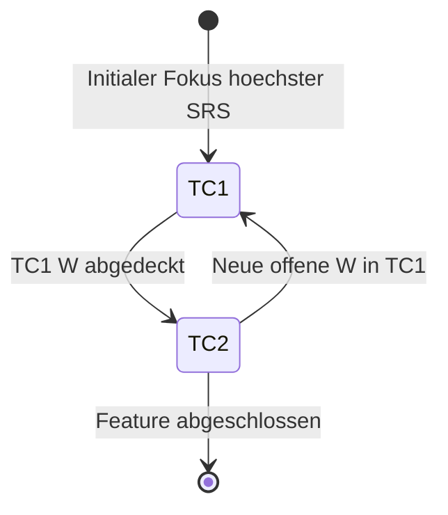

# Forschung: Model Initialisierung & Review

Du erstellst oder validierst ein System-Model - die Single Source of Truth.

## Aufruf

```
/_model {NAME} [easy|normal|hard|finish]
```

- **NAME** (Optional): Eindeutiger Model-Name, z.B. `Dateiabholung`, `Auth-Flow`, `Scheduler`. Falls nicht angegeben: 4-Stufen-Fallback (siehe unten).
- **Schwierigkeit** (Optional): Default `hard` bei Erstinitialisierung, `normal` bei Review.
- **finish** (NEU v2.1): Spezialmodus fuer Feature-Abschluss (Model verfeinern + Split-Pruefung)

**NAME-Herleitung (IF-8, name-herleitung.md):**
```
IF NAME nicht als Argument angegeben:
  Lies {WORKING_DIR}/_manifest.md  # per-Story (BL-155 AK-1)
  Suche SC_PIPELINE_STATE → feature:
  IF feature vorhanden: NAME = feature
    Logge: "NAME auto-hergeleitet aus Manifest (SC_PIPELINE_STATE): {NAME}"
  ELSE:
    Suche I_PIPELINE_STATE → feature:
    IF feature vorhanden: NAME = feature
      Logge: "NAME auto-hergeleitet aus Manifest (I_PIPELINE_STATE): {NAME}"
    ELSE:
      → FEHLER: "NAME nicht angegeben und nicht aus Manifest herleitbar"
```

---

## VERTRAG (Pflicht-I/O)

```
╔═══════════════════════════════════════════════════════════════╗
║  COMMAND: /_model {NAME}                                     ║
╠═══════════════════════════════════════════════════════════════╣
║                                                               ║
║  LIEST (Input):                                               ║
║    1. {VAULT}/_manifest.md (falls vorhanden)         ║
║    2. .claude/crumbs/{NAME}_crumbs.md (Kruemmel)             ║
║    2b. .claude/crumbs/{NAME}_wp_crumbs.md (BL-043, optional) ║
║       ◄── WP-Crumbs: Learnings aus Paper-Pipeline             ║
║       Falls vorhanden: W{n} als UNBESTAETIGT aufnehmen        ║
║    3. {VAULT}/.../Spec/{NAME}_Spec.md (falls vorhanden)       ║
║       FALLBACK: .claude/specs/{NAME}_Spec.md                  ║
║       ◄── NEU v3.0: SOLL-Zustand als Kontext (NICHT fuer     ║
║           Gap-Analyse, das macht /_gap)                        ║
║    4. {VAULT}/.../Model/{NAME}_Model.md (falls Update/Review) ║
║       FALLBACK: .claude/models/{NAME}_Model.md                ║
║    5. Codebase (direkt)                                       ║
║                                                               ║
║  LIEST (Input) - NEU ab v2.0 (bei Review):                    ║
║    5. .claude/models/{NAME}_Model-Topologie.md (bei Split)    ║
║    6. .claude/analysis/synthese/{NAME}-OBSERVE*.md             ║
║       ◄── Findings aus _SC_observe                            ║
║    7. .claude/analysis/synthese/{NAME}-QUALITYGATE*.md         ║
║       ◄── Quality Gates + GC-Markierungen                     ║
║                                                               ║
║  SCHREIBT (Output) - abhaengig von Worker-Rolle:              ║
║                                                               ║
║    Explorer E{NN}:                                             ║
║      .claude/analysis/exploration/{NAME}-E{NN}-{fokus}.md     ║
║                                                               ║
║    Drafter D{NN}:                                              ║
║      .claude/analysis/drafts/{NAME}-model-D{NN}-{fokus}.md    ║
║                                                               ║
║    Synthesist (BL-065 Vault-First DirectWrite):                ║
║      # BL-065 Vault-First: Write direkt in Vault (RF-06, INV-VFC-4) ║
║      vault_path = "{VAULT}/Backlog/{BL_SLUG}/2_Model/{NAME}_Model.md" ║
║      # Pre-Flight mkdir + Fail-fast (BL-065 AK-10, INV-VFC-4) ║
║      mkdir -p {VAULT}/Backlog/{BL_SLUG}/2_Model/  ║
║      IF mkdir fehlschlaegt ODER DCS_VAULT_ROOT leer:          ║
║        log_error "Vault unreachable: {vault_path}"            ║
║        exit 1  # KEIN stiller Fallback (INV-VFC-2)            ║
║      Schreibe {vault_path}                                     ║
║      Vault-Pfad via vault-routing.json (5-stufig)             ║
║                                                               ║
║    # ═══ RF-05 UPDATE-GUARD (BL-050 Vault-First) ═══         ║
║    # Bei Re-Synthese: created BEWAHREN, version+1,            ║
║    #   updated=HEUTE                                          ║
║    # Bei Erstanlage: created=HEUTE, version=1.0               ║
║    vault_ziel = aufgeloester Vault-Pfad (PRIMAER oder         ║
║                 FALLBACK)                                      ║
║    IF DATEI_EXISTIERT(vault_ziel):                             ║
║      bestehende_fm = LIES_FRONTMATTER(vault_ziel)             ║
║      neue_version = bestehende_fm.version + 1                 ║
║      bewahre_created = bestehende_fm.created  # NIE           ║
║                        ueberschreiben                         ║
║      updated = {HEUTE}                                        ║
║    ELSE:                                                       ║
║      neue_version = 1.0                                        ║
║      bewahre_created = {HEUTE}                                 ║
║      updated = {HEUTE}                                         ║
║    # Schreibe Frontmatter mit bewahre_created,                ║
║    #   neue_version, updated                                  ║
║                                                               ║
║    Model-Frontmatter Pflichtfelder (vault-routing.json        ║
║      Schema, BL-050):                                         ║
║      PFLICHT (required):                                       ║
║        type: model                                             ║
║        feature: {NAME}                                         ║
║        bl-item: {BL_ID}  # z.B. BL-050                        ║
║        created: {bewahre_created}  # aus IF-EXISTS Guard       ║
║        updated: {updated}          # aus IF-EXISTS Guard       ║
║        tags:                                                   ║
║          - bl/{BL_ID}                                          ║
║          - type/model                                          ║
║          - pipeline/pre-cycle                                  ║
║          - feature/{FEATURE-SLUG}                              ║
║      OPTIONAL:                                                 ║
║        keywords: [{Feature-spezifische Schlagwoerter}]         ║
║        linked-feature: "[[{NAME}]]"                            ║
║        pipeline-position: pre-cycle                            ║
║                                                               ║
║    Model-Zaehler Felder (Synthesist schreibt):                 ║
║      w_total, w_confirmed, w_open (Standard-Zaehler)          ║
║      w_extern_count: 0   # W{n} als EXTERN klassifiziert      ║
║      w_intern_count: 0   # W{n} als INTERN klassifiziert      ║
║      w_grauzone_count: 0 # uneindeutige W{n} (v2.0: immer 0) ║
║      ◄── NEU v2.0: Gesetzt durch Phase 4.1c Keyword-Scan      ║
║          (A-Pipeline). Default 0. Gelesen von                  ║
║          mode-recommendation + _SC_modelMaintain (ab v2.5).   ║
║                                                               ║
║    Per-W{n} Felder (Synthesist schreibt, ab v2.0):            ║
║      Typ: FESTSTELLUNG | FRAGE | HYPOTHESE | SOLL              ║
║        FESTSTELLUNG = Aussage/Erkenntnis (Default)             ║
║        FRAGE = offene Frage, noch zu klaeren                   ║
║        HYPOTHESE = unbewiesene Vermutung/Annahme               ║
║        SOLL = gewuenschter Ziel-Zustand (nicht IST)            ║
║      Herkunft: INTERN | EXTERN                                 ║
║        INTERN = durch Code-Analyse/Experiment loesbar (Default)║
║        EXTERN = braucht Papers, Standards, externe Recherche   ║
║      ◄── v1.0: Optionale Felder pro W{n}, Default              ║
║          FESTSTELLUNG/INTERN (rueckwaertskompatibel).          ║
║          Kein neuer Frontmatter-Zaehler in v1.0.               ║
║                                                               ║
║    IST/SOLL-Nutzungsregeln (BL-026, RF-01):                   ║
║      IST-Wahrheit  = FESTSTELLUNG + BESTAETIGT (AK-01-01)     ║
║      SOLL-Wahrheit = Typ=SOLL (AK-01-02)                      ║
║      HYPOTHESE     = IST-nah, unbestaetigt (AK-01-03)         ║
║      FRAGE         = Meta-Unklarheit (AK-01-04)               ║
║      Default       = FESTSTELLUNG/INTERN (AK-01-05)           ║
║                                                               ║
║    Generator-Modi-Zuordnung (BL-026, RF-03):                  ║
║      SC (M2-M7) → primaer FESTSTELLUNG/HYPOTHESE (AK-03-01)  ║
║      WP (M9)    → primaer SOLL/FRAGE + EXTERN (AK-03-02)     ║
║      A-Pipeline  → Synthesist setzt Typ/Herkunft (AK-03-03)  ║
║                                                               ║
║    Manifest (IMMER, nur Synthesist):                           ║
║      {VAULT}/_manifest.md (aktualisieren)            ║
║                                                               ║
║  COMPACT-SICHER:                                              ║
║    Nach JEDER Welle kann /compact ausgefuehrt werden.         ║
║    Die naechste Welle liest aus den geschriebenen Dateien,    ║
║    NICHT aus dem Konversations-Kontext.                        ║
║                                                               ║
║  MCP INTEGRATION (OPTIONAL, Uncle Bob Clean Code):             ║
║    - mcp__cleancoder__query() fuer Architektur-Verstaendnis   ║
║    - Query Topics:                                             ║
║      * "architecture patterns in {system description}"        ║
║      * "clean architecture for {domain}"                      ║
║      * "component responsibilities in {layer}"                ║
║                                                               ║
║  MCP-BREMSE:                                                   ║
║    ┌───────────────────────────────────────────────────┐       ║
║    │  MIDDLE-Modus → max 3 Queries, limit=3           │       ║
║    │  Modi:  min=1Q/1R  middle=3Q/3R  max=5Q/5R      │       ║
║    └───────────────────────────────────────────────────┘       ║
║                                                               ║
╚═══════════════════════════════════════════════════════════════╝
```

---

## SOURCE-PROVENANCE-PROPAGATION (BL-160 AK-5)

**INV-PROV-PROP-4:** Jeder Output-Datei MUSS source_provenance + provenance_chain Frontmatter-Block enthalten.

**Pattern:**
1. Lies Vorgaenger-Output (crumbs, Spec). Extrahiere predecessor.source_provenance + predecessor.provenance_chain.
2. Bei Output-Schreibung ({NAME}_Model.md):
   - source_provenance: kopiere von predecessor (gleiche Source-URL/PageId)
   - provenance_chain: haenge neuen Layer-Eintrag an (layer=3, artifact=model_pfad, role="model", timestamp=ISO, derived_from=[predecessor_pfad])
3. Bei mehreren Predecessors: provenance_chain.derived_from sammelt alle Vorgaenger.
4. Wenn predecessor.source_provenance FEHLT (legacy): setze source_provenance={source: "legacy_pre_BL-160", source_kind: "legacy", fetched_at: ISO_NOW}.

**Helper:** Verwende `.claude/scripts/propagate_provenance.py update <output_path>` nach Output-Schreibung — autoupdate predecessor.used_in (Hebb-bidir).

**role-Mapping fuer diesen Skill:** `"model"`

---

## Schritt 0: Manifest lesen

**IMMER als Erstes:**

1. Lies `{VAULT}/_manifest.md` falls vorhanden
   - Lies **SYSTEM-MODEL** und **SCHWIERIGKEIT** aus der System-Konfiguration
   - Bestimme effektives Modell: `min(SYSTEM-MODEL, Command-Max=opus)`
   - Leite Modell-Zuordnung pro Welle ab (siehe Manifest → Modell-Zuordnung)
2. Lies `.claude/crumbs/{NAME}_crumbs.md` falls vorhanden (Kruemmel als Orientierung)
2b. Lies `.claude/crumbs/{NAME}_wp_crumbs.md` falls vorhanden (BL-043 AK-04-02: WP-Crumbs)
   - Falls vorhanden: `INFO: WP-Crumbs gefunden fuer {NAME}. Learnings als UNBESTAETIGT-Kandidaten.`
   - Falls nicht vorhanden: Kein Fehler (Graceful Degradation — kein WP-Rueckkanal vorhanden)
3. Pruefe ob `.claude/models/{NAME}_Model.md` bereits existiert (Update vs. Neu)
4. Falls Manifest sagt "Welle 2 pending" → ueberspringe Welle 1, starte bei Welle 2
5. Falls kein Manifest → beginne bei Welle 1

---

## Kontext

Das Model ist **kein Schritt im Zyklus**, sondern ein **persistentes Dokument**:

```
    {NAME}_Model.md  (persistent, waechst ueber Iterationen)
         │
         ▼
    /_SC_observe ──▶ /_SC_modelMaintain ──▶ /_SC_qualityGate ──▶ /_SC_hypothese ──▶ /_SC_implement ──▶ /_SC_ergebnis
         ▲                                                                                              │
         └──────────────────────────────────────────────────────────────────────────────────────────────┘
                    (updated MODEL via _SC_modelMaintain)
```

`/_model` wird aufgerufen fuer:
- **Erstinitialisierung**: Neues Model aufbauen (hard)
- **Dedizierter Review**: Model auf Aktualitaet pruefen (normal)
- **GC-Konsolidierung** (v2.0+): Widerlegte/Eliminierte W{n} aufraeumen (normal/easy)
- **Finish** (v2.1+): Feature-Abschluss, Model verfeinern, Split-Pruefung, Konsolidierung
- **NICHT** als Schritt in jeder Iteration

**WICHTIG (v2.0+):**
- **Model-Split** wird primaer von `/_SC_modelMaintain` ausgefuehrt (Kohaesion-Check)
  — dort feuert der Kohaesion-Check und der Split wird IN-LOOP durchgefuehrt.
- `/_model` kann Split bei dediziertem Review durchfuehren, aber das ist der Ausnahmefall.
- **GC im Loop:** `/_SC_modelMaintain` markiert W{n} als WIDERLEGT/ELIMINIERT und verschiebt sie.
  `/_model` konsolidiert bei Review (aufraeumen, zusammenfassen, obsolete entfernen).

**MODEL-TOPOLOGIE-PATTERN (v2.2+):**
- **Referenz:** `.claude/reference/Topologie-OmniCommand.md` ist das Quality-Gate und Muster
  fuer Model-Split-Topologien. Jede Model-Topologie MUSS der gleichen Struktur-Dichte folgen:
  Gesamtdiagramm, Vertrags-Matrix, Kohaesion-Metriken, Fokus-Transition — alles mit Mermaid.
- **Evolution:** Monolith → Split → Model-Topologie (reiches Dokument mit Diagrammen)
- **Prinzip:** Wie `Topologie-OmniCommand.md` die 15 Commands mit Diagrammen managt,
  managt die Model-Topologie die Teilmodelle — NICHT als simple Tabelle,
  sondern als dichtes, navigierbares Dokument mit verschiedenen Mermaid-Typen.

---

## Worker-Vertrag: Exploration (Kartografie)

**Rolle:** Explorer E{NN}
**Wann:** Team Lead weist dir Fokus-Bereich und Agent-ID zu.

**Agent-Auftrag** (fuer jeden Explorer-Slot):

```
Du bist Explorer E{NN} fuer die Kartografie von "{NAME}".

KONTEXT (falls vorhanden):
  .claude/crumbs/{NAME}_crumbs.md (Kruemmel als Orientierung)
  ODER {VAULT}/Crumbs/{NAME}_crumbs.md (W14: Vault-First Kruemmel)
  .claude/crumbs/{NAME}_wp_crumbs.md (BL-043 AK-04-02: WP-Crumbs, falls vorhanden)
    → WP-Learnings als zusaetzlicher Kontext fuer Kartografie

VAULT-INDEX (W32, RF-08: Obsidian-Nachbar-Navigation):
  Lies .claude/analysis/_vault_index.md (falls vorhanden).
  Dieser Index listet alle bekannten Vault-Knoten mit Pfad, Typ, Feature und Nachbar-Links.
  Nutze den Index um relevante Nachbar-Knoten zu identifizieren:
    1. Suche Eintraege deren Feature oder Typ zum aktuellen {NAME} passen
    2. Lies bis zu 3 Nachbar-Knoten direkt aus dem Vault (Read-only, 1-Hop)
    3. Extrahiere daraus Kontext-Kruemmel fuer deine Findings
  LIMITATION: Haiku-Kontextfenster begrenzt — max. 3 Nachbar-Knoten lesen.
  Falls _vault_index.md fehlt: Schritt ueberspringen (Graceful Degradation).

AUFTRAG: {Fokus-Beschreibung}

SCHREIB-PFLICHT:
Du MUSST deine Findings in folgende Datei schreiben:
  .claude/analysis/exploration/{NAME}-E{NN}-{fokus}.md

DATEI-FORMAT (Pflicht):
  ---
  name: {NAME}
  phase: model
  wave: exploration
  tier: {SYSTEM-MODEL}
  model: {TATSAECHLICHES-MODELL}
  agent: E{NN}
  fokus: {fokus}
  date: {YYYY-MM-DD}
  vault_neighbours_read: {N}
  status: final
  ---

  # Exploration E{NN}: {Fokus-Titel}

  ## Vault-Nachbar-Kontext (W32)
  {Falls Vault-Index gelesen: Liste der gelesenen Nachbar-Knoten + Kurz-Zusammenfassung}
  {Falls kein Index: "Kein Vault-Index verfuegbar. Nur lokale Kartografie."}

  ## Findings

  ### F1: {Finding-Titel}
  - **Datei:** {Pfad}:{Zeile}
  - **Beschreibung:** ...

  ### F2: ...

  ## Zusammenfassung
  {3-5 Saetze}

WICHTIG:
- NUR Kartografie: Dateien, Zeilen, Patterns, Strukturen
- KEINE Tiefenanalyse
- JEDES Finding mit Datei:Zeile belegen
- Vault-Nachbar-Knoten NUR LESEN (Read-only), NIE schreiben
- Die Datei MUSS geschrieben werden, NICHT nur als Text zurueckgeben
```

### Explorer-Fokus-Bereiche

| Agent | Fokus | Aufgabe |
|-------|-------|---------|
| E01 | architektur | System-Topologie, Projekte, Container, Netzwerk |
| E02 | konfiguration | Config-Dateien, Environment-Variablen, Secrets |
| E03 | code-flow | Relevante Code-Pfade, Methoden-Signaturen |
| E04 | externe-deps | Bibliotheken, NuGet, APIs, Protokolle |
| E05 | dokumentation | Bestehende Docs, Kommentare, READMEs |
| E06-E10 | (bei Bedarf) | Weitere Aspekte je nach Scope |

---

## Worker-Vertrag: Drafts (Heavy Lifting)

**Rolle:** Drafter D{NN}
**Wann:** Team Lead weist dir Fokus-Bereich und Agent-ID zu.
**Voraussetzung:** Exploration-Dateien existieren in `.claude/analysis/exploration/{NAME}-E*.md`

**Agent-Auftrag** (fuer jeden Drafter-Slot):

```
Du bist Drafter D{NN} fuer die Tiefenanalyse von "{NAME}".

INPUT - LIES ZUERST DIESE DATEIEN:
  1. .claude/crumbs/{NAME}_crumbs.md (Kruemmel-Kontext)
  1b. .claude/crumbs/{NAME}_wp_crumbs.md (BL-043 AK-04-02: WP-Crumbs, falls vorhanden)
     → WP-Learnings als zusaetzliche Primaerquelle (DIREKT lesen, Anti-Stille-Post)
  2. {Liste aller exploration/{NAME}-E*.md Dateien}

AUFTRAG: {Fokus-Beschreibung}

SCHREIB-PFLICHT:
Du MUSST deine Findings in folgende Datei schreiben:
  .claude/analysis/drafts/{NAME}-model-D{NN}-{fokus}.md

DATEI-FORMAT (Pflicht):
  ---
  name: {NAME}
  phase: model
  wave: drafts
  tier: {SYSTEM-MODEL}
  model: {TATSAECHLICHES-MODELL}
  agent: D{NN}
  fokus: {fokus}
  date: {YYYY-MM-DD}
  reads: exploration/{NAME}-E01-*.md, exploration/{NAME}-E02-*.md, ...
  status: final
  ---

  # Drafter D{NN}: {Fokus-Titel}

  ## Gelesene Exploration-Inputs
  {Liste der gelesenen Exploration-Dateien mit Kurzfassung}

  ## Findings

  ### F1: {Finding-Titel}
  - **Quelle:** Explorer E{NN} Finding F{M} + eigene Analyse
  - **Datei:** {Pfad}:{Zeile}
  - **Beschreibung:** ...
  - **Bewertung:** ...

  ## Zusammenhaenge
  {Cross-Cutting Findings, Architektur-Patterns}

  ## Hypothesen-Kandidaten
  {Basierend auf Findings}

  ## Zusammenfassung
  {5-10 Saetze}

WICHTIG:
- IMMER Exploration-Findings referenzieren (bestaetigend oder widerlegend)
- Eigene tiefere Analyse hinzufuegen
- Die Datei MUSS geschrieben werden, NICHT nur als Text zurueckgeben
```

### Drafter-Fokus-Bereiche

| Agent | Fokus | Aufgabe |
|-------|-------|---------|
| D01 | validierung | Validiert Exploration-Findings, prueft Relevanz und Korrektheit |
| D02 | zusammenhaenge | Cross-Cutting Concerns, Architektur-Patterns, Anomalien |
| D03 | constraints | Grenzen, Risiken, fehlende Komponenten, Gap-Analyse |
| D04-D05 | (bei hard) | Gegen-Hypothesen, alternative Perspektiven |

---

## Worker-Vertrag: Synthese (Wahrheits-Check + Synthese)

**Rolle:** Synthesist (1 Worker)
**Wann:** Team Lead spawnt dich nach Abschluss aller Drafter.
**Voraussetzung:** Draft-Dateien existieren in `.claude/analysis/drafts/{NAME}-model-D*.md`

### Worker-Vertrag PHASE 3 MODEL — STRENGE Variante (RF-MODEL-LIVE-2026-05-08, BL-161 Vorbote)

**Status:** PFLICHT-Worker-Vertrag fuer A-Pipeline Phase 3 model seit 2026-05-08.

**Live-Validierung:** DCSRE-486 Phase 3 Model — 30 W{n}, 28 confirmed (93% HIGH), 64 Edges,
11 Edge-Typen, 1 Synthese-Pass mit 110k Tokens / 0 tool uses (dichter Output, keine
zerstreute Hin-und-Her-Generation).

**Begruendung:** Quick-Win VOR BL-161 (Vault-Quality-System voll implementiert). Pflicht-
Frontmatter + Pflicht-Body + Edges-Pflicht + Anker-Verbindung muessen direkt im Worker-
Vertrag stehen — Operator hat das bisher manuell als ~200-Zeilen-Spawn-Prompt geschrieben.
Spar mehr als 1h pro Story-Pipeline.

#### PFLICHT-FRONTMATTER (14 Felder strikt, Vault-Driven-Development konform)

```yaml
---
type: model
feature: {NAME}
bl-item: {BL_ID}
created: {DATE}
updated: {DATE}
status: complete | partial | review-pending
phase: A-3-model
sources:
  - W_fetch/W_fetch_{date}.md
  - Crumbs/{NAME}_findings_crumbs_master.md  # BL-235 AK-11: traegt CORE/BORDER+weight (dispatch_findings) -> CORE-Rang als Headline-/Sortier-Signal lesen (CORE zuerst gewichten), NICHT flach
  - 1_Task/{NAME}_Task.md
  - Findings_Assays_Konsolidiert_{date}.md
  - {Schwester-Story}/2_Model/ (falls Template-basiert)
template_ref: {Schwester-BL-ID} | null
w_total: {N}
w_confirmed: {M}
w_offen: {K}
w_extern_count: {E}     # extern = Wiki/Tickets/Standards (z.B. EM003, ZEVSP)
w_intern_count: {I}     # intern = Code/Schwester-Patterns
w_maturity_level: HIGH | MEDIUM | LOW
edges_count: {EC}       # Wiki-Link-Edges total
disambiguation_groups: {DG}  # aus W_fetch uebernommen
sync:
  last_sync_commit: {git-hash}
  last_sync_date: {DATE}
tags: [bl/{BL_ID}, type/model, pipeline/A-3, scope/{SCOPE}, ...]
---
```

#### PFLICHT-BODY (11 Sektionen, Reihenfolge fix)

1. **Executive Summary** — 1 Absatz: Was, Scope, Template, Delta
2. **Datenmodell** (W-DOM-{n} Wahrheiten)
3. **Validator-Pattern** (W-VAL-{n} Wahrheiten)
4. **Service- + Controller-Pattern** (W-CTRL-{n} Wahrheiten)
5. **AutoMapper / Mapping-Patterns** (W-MAP-{n} Wahrheiten)
6. **Scope + DoD** (W-SCO-{n} + W-AK-{n} aus Task.md uebernommen)
7. **Tag-Anchors / Disambiguierung-Map** (aus W_fetch uebernommen — NICHT neu erfinden)
8. **Edges-Manifest (User-Direktive — KRITISCH)** ← Tabelle mit allen Wiki-Link-Edges
9. **Offene Items** (W{n} = TENTATIV mit Next-Action)
10. **Konsumenten-Hinweis** (Phase 4 spec — was ableitbar, was tentative)
11. **Anker-Verbindung (zur Vault-Topologie)** ← Schwester-Hubs + Pattern-Library + Glossar

Pro W{n}-Knoten Pflicht-Felder:
- `text:` einzeiliger Wahrheits-Satz
- `Status:` Kanonischer Wert aus BL-205 Status-Konvention (siehe unten) — freie Strings VERBOTEN
- `source:` Quelle mit Prefix fuer INTERN/EXTERN-Klassifikation (siehe unten)
- `Quelle:` 1+ Wiki-Link `[[{path}#{section}]]` oder `[[Repo:{path}:{line-range}]]`
- `Edge zu:` 1+ andere W{n} oder Source-Knoten

#### Kanonische Status-Werte (BL-205 AK-5) — ABGESCHLOSSEN

| Status | Kategorie | SRS-Gewicht |
|--------|-----------|-------------|
| BESTAETIGT / BESTAETIGT-DB / STABLE / AKTIV (BESTAETIGT) / RESOLVED / RESOLVED-DB / CLOSED | Sicher | 0.0 |
| TENTATIV / HYPOTHESE / OFFEN | Unsicher | 1.0 |
| RETRACTED | Ausgeschlossen | n/a |

Vollstaendige Tabelle + Gewichte: `/_K_score.md` Sektion "Wahrheits-Status-Konvention".

#### W{n}.source Klassifikation (BL-205 AK-6) — INTERN vs. EXTERN

**INTERN** (SC-klaerbar): Prefix `"Repo:"`, `"Crumbs:"`, `"Assays:"`, `"W_fetch:"`
**EXTERN** (WP erforderlich): Prefix `"Wiki:"`, `"URL:"`, andere Story-ID, `"Stakeholder:"`, `"Industry-Standard:"`

Konsument: `_srs_compute` bestimmt `bottleneck_signal` (SC vs WP) pro W{n} aus diesem Feld.
Vollstaendige Klassifikations-Tabelle: `/_K_score.md` Sektion "SRS Resolve-Strategie + Source-Klassifikation".

#### EDGES-MANIFEST (PFLICHT, Sektion 8) — 11 Edge-Typen

Tabelle ueber ALLE Wiki-Link-Edges (Source-Knoten -> Target-Knoten -> Edge-Typ):

| Edge-Typ | Bedeutung | Beispiel |
|----------|-----------|----------|
| `code-grounded` | Repo-Datei mit Zeilen-Range | `Repo:Service.cs:42-67` |
| `derives-from` | Vorgaenger-Knoten leitet ab | `W_fetch#W4` |
| `template-pattern` | Schwester-Story als Template | `DCSRE-94/2_Model/...#Sektion 3.1` |
| `wiki-link` | Internes Vault-Doc-Verweis | `Task.md#AK-3` |
| `external-source` | Externes Wiki/Standard | `Wiki:EM003 (pageId 184976300)` |
| `rule-from` | Memory-Regel als Quelle | `Memory:project_serialized_lists_format` |
| `self-ref` | Verweis auf eigenes Manifest | `_manifest.md#scope_cut` |
| `closes` | Schliesst Open-Item / Konflikt | `Cluster-A_Datenmodell_Assay#KONFLIKT-1` |
| `tentative` | Annahme, noch zu klaeren | `EM003 (Konsultation)` |
| `external-pending` | Externes Audit ausstehend | `Wiki:Konsultation pending` |
| `template-anchor` | Schwester-Story als Hauptanker | `DCSRE-94/2_Model/...Model.md` |

Mindest-Edge-Count: `w_total * 1.5` (jedes W{n} braucht ≥1 Quelle, 50% haben 2+).

#### ANKER-VERBINDUNG (PFLICHT, Sektion 11)

Liste der Schwester-Model-Hubs an die DIESES Model andockt:
- **Schwester-Story:** `[[DCSRE-{N}-{slug}/2_Model/...Model.md]]` (falls vorhanden)
- **Pattern-Library Hubs:** `[[Libraries/PatternLibrary/_project/{LAYER}/...]]`
- **SemanticLibrary Glossar:** `[[Libraries/SemanticLibrary/_global/glossary]]`

→ Wird bei BL-161-Implementierung als pre-computed Anker-Index genutzt (AK-2). Aktuell
manuell, nach BL-161 automatisch via `_W_push_organic`-Hook.

#### REGELN (W7-Constraint)

- **KEIN Sub-Agent-Spawning** durch Worker
- **Vault-First Pfade:** schreibt nach `{bl_folder}/2_Model/`, NICHT `.claude/analysis/`
- **Disambiguierung-Map UEBERNEHMEN** aus W_fetch (nicht neu erfinden — Konsistenz!)
- **Skalierbar denken:** KEIN Read-All, gezielt Inputs konsumieren
- **Memory-Verweise** mit `rule-from` Edge-Type, nicht ad-hoc kopiert
- **Edges-Pflicht** (RF-WF-EDGES analog) — jedes W{n} braucht ≥1 Quellen-Edge

#### MANIFEST-UPDATE (PFLICHT, Append)

`{bl_folder}/_manifest.md` → BERATER_OUTPUTS Sektion APPEND `### model`:
```yaml
### model
- status: DONE
- timestamp: {DATE}
- output_path: 2_Model/{NAME}_Model.md
- w_total: {N}
- w_confirmed: {M}
- w_open: {K}
- edges_count: {EC}
- maturity_level: HIGH | MEDIUM | LOW
- next_consumer: phase-4-spec
- last_berater: model
```

A_PIPELINE_STATE Update:
- `model_links: ["2_Model/{NAME}_Model.md"]`
- `MODEL_MATURITY: "{HIGH|MEDIUM|LOW}_{N}_PERCENT"`

---

### Dein Auftrag

1. Lies alle Draft-Reports
2. Lies `.claude/crumbs/{NAME}_crumbs.md` (Kruemmel-Kontext)
2b. Lies `.claude/crumbs/{NAME}_wp_crumbs.md` falls vorhanden (BL-043 AK-04-02)
   → WP-Crumbs-Learnings als UNBESTAETIGT-Kandidaten fuer W{n} aufnehmen
   → Quelle: "wp_crumbs" (nicht "Explorer" oder "Drafter")
   → Status-Promotion durch SC-Zyklus oder Implementierung
3. **Pruefe ob die Findings stimmen** - schlag im Code nach wenn noetig
4. Verwirf was nicht belegt werden kann
5. Synthetisiere das finale Model-Dokument
6. Schreibe `.claude/models/{NAME}_Model.md`
7. **Setze Typ + Herkunft fuer jedes W{n}** (ab v1.0):

```
Typ-Entscheidungsbaum (v2.0, RF-13 BL-018):
  1. Formuliert W{n} eine offene Frage?
     JA  → Typ: FRAGE
  2. Formuliert W{n} eine unbewiesene Vermutung / Annahme / Vorhersage?
     (Signale: "vermutlich", "wahrscheinlich", "muesste", "koennte sein", "Annahme")
     JA  → Typ: HYPOTHESE
  3. Beschreibt W{n} einen gewuenschten Ziel-Zustand (nicht IST)?
     (Signale: "sollte", "muss kuenftig", "Ziel:", "geplant", SOLL-Zustand)
     JA  → Typ: SOLL
  4. Formuliert W{n} eine durch Beobachtung/Experiment gestuetzte Aussage?
     JA  → Typ: FESTSTELLUNG
  Default bei Unsicherheit: FESTSTELLUNG

  HINWEIS: Typ ist orthogonal zum Status-Automaten.
  Alle Typen durchlaufen: AKTIV → BESTAETIGT / WIDERLEGT / ELIMINIERT.
  HYPOTHESE + BESTAETIGT = durch Experiment verifizierte Vermutung → wird FESTSTELLUNG.
  SOLL + BESTAETIGT = implementierter Ziel-Zustand → wird FESTSTELLUNG.

Herkunft-Entscheidungsbaum:
  Ist die Antwort durch Code-Experiment/Analyse findbar?
  JA  → Herkunft: INTERN
  Braucht die Antwort externe Quellen (Paper, Doku, Standards)?
  JA  → Herkunft: EXTERN
  UNSICHER → Default: INTERN
```

Bestehende W{n} ohne Typ/Herkunft-Feld: Default FESTSTELLUNG/INTERN annehmen, kein Update erzwungen.
Legacy FRAGEND → wird als FRAGE interpretiert (rueckwaertskompatibel).

### Model-Dokument Struktur

```markdown
# System-Model: {NAME}

**Version:** X.Y
**Letzte Aktualisierung:** YYYY-MM-DD
**Iteration:** N
**Wissenschaftliche Frage:** {Was untersuchen wir?}

## 1. System-Architektur
   - Container-Topologie (Mermaid)
   - Port-Mapping Matrix

## 2. Kommunikationsprotokoll
   - Relevante Flows (Sequenz-Diagramme)

## 3. Konfigurationsmodell
   - Entscheidungs-Logik (Flowchart)
   - Konfigurationsdateien-Matrix

## 4. Datenfluss-Model
   - Request-Typen und Pfade

## 5. Verifizierte Wahrheiten
   - W1: {Erkenntnis} [Typ: FESTSTELLUNG, Herkunft: INTERN, Quelle: Explorer E{NN} F{M} + Drafter D{NN} F{M}, BESTAETIGT]
   - W2: {Erkenntnis} [Typ: FESTSTELLUNG|FRAGE|HYPOTHESE|SOLL, Herkunft: INTERN|EXTERN, Quelle: ..., BESTAETIGT]
   - W{n}: {Erkenntnis aus WP-Learning} [Typ: FESTSTELLUNG, Herkunft: EXTERN, Quelle: wp_crumbs, UNBESTAETIGT]
   (BL-043 AK-04-02: WP-Crumbs-Learnings werden als UNBESTAETIGT aufgenommen. Status-Promotion durch SC-Zyklus.)
   (Typ/Herkunft optional, Default: FESTSTELLUNG/INTERN. Bestehende W{n} ohne diese Felder bleiben gueltig.)
   (Legacy FRAGEND → wird als FRAGE interpretiert, rueckwaertskompatibel.)

## 5a. Widerlegte und Eliminierte Annahmen (v2.0+)
   - W{n}: {Erkenntnis} [WIDERLEGT, ERGEBNIS{K}: {Grund}]
   - W{m}: {Erkenntnis} [ELIMINIERT, ANALYSE{N}: Battle-Royale]
   (Wird von _SC_modelMaintain gepflegt. _model konsolidiert bei Review.)

## 6. Versions-Historie
   | Version | Datum | Quelle | Aenderung |
   |---------|-------|--------|-----------|
   | 1.0 | ... | _model hard | Erstinitialisierung |

## 6a. Abzaehlbare Sektionen (v2.0+, Voraussetzung fuer SRS)

   ### Offene Hypothesen-Bereiche (fuer SRS D1)
   | # | Bereich | Status | Seit |
   |---|---------|--------|------|
   (Wird von _SC_modelMaintain gepflegt, von _SC_ergebnis im DATENBANK-MODUS gelesen)

   ### Aktive Technologie-Concerns (fuer SRS D4)
   | # | TC | Status | W{n}-Anzahl | Seit |
   |---|-----|--------|-------------|------|
   (Wird von _SC_modelMaintain gepflegt, von _SC_ergebnis im DATENBANK-MODUS gelesen)

## 7. Offene Fragen
   - Was ist noch ungeklaert?

## 8. Referenzen
   | Quelle | Pfad |
   |--------|------|
   | Explorer E01 | .claude/analysis/exploration/{NAME}-E01-architektur.md |
   | Drafter D01 | .claude/analysis/drafts/{NAME}-model-D01-validierung.md |
```

---

## Ablauf: normal (Review)

Keine Exploration noetig - Terrain ist bereits kartografiert.
Worker-Vertraege "Drafts" und "Synthese" (oben) gelten analog.

### GC-Konsolidierung (v2.0+, bei Review)

Falls Sektion "Widerlegte und Eliminierte Annahmen" mehr als 10 Eintraege hat:
1. Pruefe ob ELIMINIERTE W{n} re-aktiviert werden koennten (Cross-Cutting-Check)
2. Entferne endgueltig obsolete WIDERLEGTE W{n} (die keine Widerlegungsinformation mehr tragen)
3. Konsolidiere verwandte ELIMINIERTE W{n} zu Gruppen
4. Dokumentiere Konsolidierung in Versions-Historie

### Model-Topologie Wartung (v2.0+, bei Review mit aktivem Split)

Falls `{NAME}_Model-Topologie.md` existiert:
1. Pruefe ob Teilmodelle noch kohaesiv sind (W{n}-Verteilung)
2. Pruefe ob FOKUS-Wechsel sinnvoll (SRS pro Teilmodel)
3. Pruefe ob Teilmodelle zusammengelegt werden koennen (VM-6)
4. Aktualisiere Abhaengigkeiten im Index

---

## Ablauf: easy (Quick Check)

```
             ┌──────────────────┐
SYNTHESE     │  DU, Hauptagent  │  ──LIEST──▶ models/{NAME}_Model.md + Code
             │                  │  ──SCHREIBT──▶ models/{NAME}_Model.md (update)
             └──────────────────┘
```

---

## Ablauf: finish (Feature-Abschluss, NEU v2.1)

**Zweck:** Model nach Feature-Abschluss verfeinern, konsolidieren und ggf. splitten.
Wird von `/_taskDefinition` vorgeschlagen wenn alle W{n} bestaetigt/widerlegt sind,
oder wenn der User explizit `/_model {NAME} finish` aufruft.

```
             ┌──────────────────┐
Phase 1:     │  DU, Hauptagent  │  ──LIEST──▶ models/{NAME}_Model.md
AUDIT        │  Vollstaendigkeit │  ──LIEST──▶ synthese/{NAME}-ERGEBNIS*.md
             │  + W{n}-Status    │  ──LIEST──▶ synthese/{NAME}-OBSERVE*.md + QUALITYGATE*.md
             └────────┬─────────┘
                      │
                      ▼
             ┌──────────────────┐
Phase 2:     │  DU, Hauptagent  │  ──LIEST──▶ Model + Audit-Ergebnis
VERFEINERN   │  Wahrheiten       │  ──SCHREIBT──▶ models/{NAME}_Model.md (verfeinert)
             │  konsolidieren    │
             └────────┬─────────┘
                      │
                      ▼
             ┌──────────────────┐
Phase 3:     │  DU, Hauptagent  │  ──LIEST──▶ Verfeinertes Model
SPLIT-CHECK  │  Kohaesion        │  ──SCHREIBT──▶ Model-Topologie (falls noetig)
             │  + Kopplung        │  ──SCHREIBT──▶ Teilmodelle (falls noetig)
             └──────────────────┘
```

### Phase 1: Model-Audit

1. Lies Model vollstaendig
2. Zaehle und kategorisiere alle W{n}:
   - BESTAETIGT: Durch Experiment verifiziert
   - WIDERLEGT: Durch Experiment widerlegt
   - ELIMINIERT: Durch Battle-Royale entfernt
   - OFFEN: Noch nicht getestet
3. Erstelle Vollstaendigkeits-Report:

```
Model-Audit: {NAME} v{X.Y}
━━━━━━━━━━━━━━━━━━━━━━━━━━━━
Wahrheiten gesamt:    {N}
  BESTAETIGT:         {N} ()
  ELIMINIERT:         {N} ()

Zyklen durchlaufen:   {N}
TCs aktiv:            {N}
SRS-Trend:            {GESCHRUMPFT/STAGNIERT/GEWACHSEN}
```

### Phase 1.5: Truth-Atomic-First-Gate (BL-243 AK-S4) — ADVISORY / non-blocking

```
# Schritt 1.5: Quality-Gate (advisory, WARN, nicht-blockierend)
py -3 .claude/scripts/quality_model_wform.py {model_pfad}
```

Fuehre den Validator auf dem gerade auditierten Model aus und nimm das Ergebnis in den
Finish-Output auf (gold_count / violations / prose_only).

**WICHTIG: Dieses Gate ist rein advisory und non-blocking.**
Grund: Die prose-Model-Backfill-Phase (AK-S4 Daten-Haelfte) ist quiescence-gated —
d.h. noch nicht vollstaendig abgeschlossen. Das Gate meldet WARN bei Verletzungen,
bricht den finish-Ablauf aber nicht ab. Violations im Output sind ein Hinweis zur
schrittweisen Bereinigung, kein Hard-Fail.

Ergaenze den Finish-Output um die Zeile:
```
Truth-Atomic-Gate:    gold={gold_count}, violations={violations}, prose_only={prose_only}  [ADVISORY]
```

### Phase 1.6: Forward-Garantie — View→Atom Auto-Referenz (P2, BL-460-Folge)

```
# Schritt 1.6: Forward-Garantie (dry-run, BL-443 gated)
py -3 .claude/scripts/view_forward_reference.py <model_pfad>
```

Fuehre `view_forward_reference` auf dem gerade auditierten Model aus.
Das Skript baut einen `atom_index` aus dem Vault und leitet daraus
`source_atoms` ab — die Quell-Atome, auf die dieses View-Artefakt
verweisen sollte (View→Atom Forward-Referenz).

**Forward-Garantie (P2):** Neue und abgeschlossene View-Artefakte
referenzieren ihre Quell-Atome AUTOMATISCH. Die `--write`-Materialisierung
ist **gated/deferred (BL-443)** bis der Vault geheilt ist. Solange BL-443
offen ist, laeuft der Schritt im **dry-run**-Modus und meldet Proposals
(`action: dry-run` oder `action: deferred-gated`). Sobald der Vault
sauber ist, schreibt `view_forward_reference` automatisch (`action: written`).

Ergaenze den Finish-Output um die Zeile:
```
Forward-Garantie:    {n} source_atoms vorgeschlagen [action: dry-run|deferred-gated|written]
```

### Phase 2: Model-Verfeinerung

1. **Widerlegte W{n} konsolidieren:**
   - Entferne endgueltig obsolete Widerlegungen (die keine Lern-Information mehr tragen)
   - Behalte Widerlegungen mit wertvoller Erkenntnis als "Gelernte Lektion"

2. **Bestaeigte W{n} schaerfen:**
   - Formulierungen praezisieren basierend auf allen Zyklen-Ergebnissen
   - Redundante W{n} zusammenfassen
   - Datei:Zeile Referenzen aktualisieren

3. **Diagramme aktualisieren:**
   - Mermaid-Diagramme auf finalen Stand bringen
   - Veraltete Architektur-Ansichten entfernen

4. **Version auf naechste Major-Version erhoehen** (z.B. 1.7 → 2.0)

### Phase 2.5: sync-Metadata + Ghost-Erkennung (NEU v2.2, CaseStudy MV-3)

Nach dem Version-Bump werden sync-Felder aktualisiert und Ghost-Artefakte erkannt:

```
# Schritt 2.5.1: sync-Metadata kanonisieren (5-Felder-Schema)
CURRENT_HEAD = git rev-parse HEAD
CURRENT_DATE = {YYYY-MM-DD}

Aktualisiere Frontmatter:
  sync:
    last_sync_commit: "{CURRENT_HEAD}"
    last_sync_date: "{CURRENT_DATE}"
    sync_source: "model-finish"
    last_sync_command: "/_model {NAME} finish"
    diff_since_last: 0

Begruendung: Nach finish ist das Model per Definition auf HEAD-Stand
  → diff_since_last ist immer 0.
  → Kanonisiert beide inkonsistenten Schema-Varianten (W33).

# Schritt 2.5.2: Ghost-Artefakt-Erkennung
TRACKED_FILES = git ls-files  # kanonischer Git-Stand (W27: zuverlaessiger als Filesystem)
GHOST_COUNT = 0

Fuer jede W{n} im Model:
  IF W{n} referenziert eine Datei (Beleg-Feld enthaelt Dateipfad, .cs/.md/.json etc.):
    IF Dateipfad NICHT in TRACKED_FILES (weder absoluter Pfad noch Basename):
      W{n}.status = "VERALTET_DATEI_GELOESCHT"
      GHOST_COUNT += 1
      Log: "Ghost-Artefakt: W{n} referenziert {Dateipfad} — Datei nicht in git ls-files"

# Schritt 2.5.3: verifikation_status setzen
IF GHOST_COUNT == 0:
  Frontmatter: verifikation_status: BESTAETIGT
  Frontmatter: abgleich_methode: automatisch
ELSE:
  Frontmatter: verifikation_status: REFUTED
  Frontmatter: abgleich_methode: automatisch
  Log: "{GHOST_COUNT} Ghost-Artefakte erkannt. Model benoetigt Bereinigung."

# Schritt 2.5.4: WERT-Drift-Verifikation (BL-236 AK-1/2/3 — erweitert die Datei-EXISTENZ-Pruefung um INHALT)
# Ghost-Check (2.5.2) prueft nur OB die Anker-Datei existiert. BL-236 prueft, ob der Model-CLAIM noch
# mit dem CODE uebereinstimmt (Wert-Drift, z.B. Enum 6->1). code>vault: der abgenommene Code ist die Wahrheit.
# Source-only, wirkt erst bei Redeploy. AK-7 Finish-Harvest-write-back = Folge-Scheibe (eigene A-Pipeline-Reife).
drift = Workflow(name="dispatch_model_drift", args={bl_id: BL_ID, model_path: "{model_pfad}"})
IF drift != null AND drift.drift_count > 0:
  FOR g IN drift.drifted:    # truth_grade=code_contradicted
    Setze W{g.w_id}.truth_grade = "code_contradicted", W{g.w_id}.drift = g.drift_detail
  Log: "[BL-236] {drift.drift_count} Knoten code_contradicted (Wert-Drift) + {|drift.hypotheses|} vault_hypothesis — Model driftet gegen develop."
  Frontmatter: verifikation_status: REFUTED   # Wert-Drift ueberstimmt BESTAETIGT
ELIF drift != null:
  FOR g IN drift.truth_graded: Setze W{g.w_id}.truth_grade = g.truth_grade   # code_verified|vault_hypothesis
  Log: "[BL-236] 0 Wert-Drift — Model code-verified gegen develop."

Frontmatter (immer setzen):
  letzter_abgleich: "{CURRENT_DATE}"
```

### Phase 3: Split-Pruefung (Kohaesion + Kopplung)

**Leitprinzip:** Hohe Kohaesion innerhalb, niedrige Kopplung zwischen Sub-Models.

1. **Kohaesion-Analyse:**
   - Gruppiere BESTAETIGT-W{n} nach Thema/TC
   - Pruefe: Gibt es klar trennbare Cluster?
   - Pruefe: Sind die Cluster thematisch geschlossen (hohe Kohaesion)?

2. **Kopplungs-Analyse:**
   - Pruefe: Welche W{n} referenzieren W{n} aus anderen Clustern?
   - Pruefe: Sind die Abhaengigkeiten minimal (niedrige Kopplung)?
   - Dokumentiere Cross-Cutting W{n}

3. **Split-Entscheidung:**

```
KEIN SPLIT noetig wenn:
  - Weniger als 15 aktive W{n}
  - Nur 1-2 TCs
  - Hohe Cross-Cutting-Quote (>30% W{n} betreffen mehrere TCs)

SPLIT EMPFOHLEN wenn:
  - 15-30 aktive W{n}
  - 3+ TCs mit klaren Grenzen
  - Niedrige Cross-Cutting-Quote (<20%)

SPLIT PFLICHT wenn:
  - >30 aktive W{n}
  - >5 TCs
  - Model ist fuer einen Kontext-Ladevorgang zu gross
```

4. **Falls Split:** Erstelle eine **Model-Topologie** nach dem Referenz-Muster
   `.claude/reference/Topologie-OmniCommand.md`

   **Evolution-Prinzip:**

   ```
   Phase 1: MONOLITH               Phase 2: SPLIT + TOPOLOGIE

   {NAME}_Model.md                 {NAME}_Model-Topologie.md  ◄── Index + Diagramme
   ┌───────────────────────┐       ├── {NAME}_{TC1}_Model.md   ◄── Hohe Kohaesion
   │ 30+ W{n}, 5+ TCs     │  ──▶  ├── {NAME}_{TC2}_Model.md   ◄── Hohe Kohaesion
   │ Niedrige Kohaesion    │       └── {NAME}_{TC3}_Model.md   ◄── Hohe Kohaesion
   └───────────────────────┘
   Wie Topologie-OmniCommand.md    Gleiche Struktur-Dichte:
   die 15 Commands managt,         Mermaid flowchart + mindmap +
   managt die Model-Topologie      stateDiagram + Tabellen
   die Teilmodelle.
   ```

### Model-Topologie Dokument-Template

**Pfad:** `models/{NAME}_Model-Topologie.md`
**Referenz-Muster:** `.claude/reference/Topologie-OmniCommand.md`

**Pflicht-Sektionen (mindestens 4 verschiedene Mermaid-Diagramm-Typen):**

| # | Sektion | Mermaid-Typ | Zweck |
|---|---------|-------------|-------|
| 1 | Gesamtdiagramm | `flowchart LR` | Alle Teilmodelle + Abhaengigkeiten visuell |
| 2 | Kohaesion/Kopplung | `mindmap` | Metriken pro Teilmodel (W-Anzahl, Deps) |
| 3 | Fokus-Transition | `stateDiagram-v2` | Wechsel-Logik zwischen Teilmodellen |
| 4 | SRS pro Teilmodel | Tabelle | D1-D4 + SRS berechenbar pro Teilmodel |
| 5 | Vertrags-Matrix | Tabelle | Shared W{n}, Cross-Cutting Abhaengigkeiten |
| 6 | Teilmodel-Index | Tabelle | Status, Fokus, W{n}, Pfad, Deps |
| 7 | Evolution | Tabelle | Split-Historie (Monolith → Split) |
| 8 | VM-Regeln | Tabelle | VM-1 bis VM-6 (Referenz) |

**Mermaid-Beispiele fuer die Model-Topologie:**

**1. Gesamtdiagramm (flowchart LR):**


**2. Kohaesion/Kopplung (mindmap):**


**3. Fokus-Transition (stateDiagram-v2):**


**QUALITAETS-GATE (Pflicht bei jeder Model-Topologie):**
- Mindestens 3 verschiedene Mermaid-Diagramm-Typen (flowchart + mindmap + stateDiagram)
- Jedes Teilmodel mit Status, Fokus, W{n}-Anzahl, Pfad
- Cross-Cutting W{n} explizit als Abhaengigkeiten dokumentiert
- SRS pro Teilmodel berechenbar (D1-D4 Spalten)
- Evolution nachvollziehbar (Monolith → Split mit Trigger-Grund)
- Referenz auf `.claude/reference/Topologie-OmniCommand.md` im Header

### Finish-Output

```
Model-Finish: {NAME}
━━━━━━━━━━━━━━━━━━━━
Version:              {X.Y} → {X+1.0}
W{n} vorher:          {N} (aktiv: {N}, widerlegt: {N}, eliminiert: {N})
W{n} nachher:         {N} (aktiv: {N}, konsolidiert: {N entfernt})
Split:                {Nicht noetig / Empfohlen / Ausgefuehrt ({N} Teilmodelle)}
sync.last_sync_commit: {COMMIT-HASH}
Ghost-Artefakte:      {N gefunden | 0 (CLEAN)}
  (falls > 0): Betroffene W{n}: W{X}, W{Y}... → Status VERALTET_DATEI_GELOESCHT
verifikation_status:  {BESTAETIGT | REFUTED}
Forward-Garantie:    {n} source_atoms vorgeschlagen [action: dry-run|deferred-gated|written]

Naechste Optionen:
  (A) Neues Feature starten (/_taskDefinition {NEUER-NAME})
  (B) Benachbarten Task bearbeiten (/_taskDefinition {NAME} -- Task-Kontinuitaet)
  (C) Nochmal vertiefen (/_SC_observe)
```

---

## Model-Qualitaetskriterien

| Kriterium | Pruefung |
|-----------|----------|
| Aktualitaet | Datei:Zeile Referenzen pruefen |
| Vollstaendigkeit | Keine "black boxes" |
| Konsistenz | Cross-Reference Check |
| Verifizierbarkeit | Jede W{n} mit Experiment/Quelle belegt |
| Lesbarkeit (BL-243) | Atomare W{n}-Aussage (knapper, praeziser Aussage-Text) — NICHT Prosa-Fliesstext UND NICHT Flowchart-statt-Text. Mermaid bleibt optionale Ableitung (z.B. Topologie-Overview fuer Menschen), kein Ersatz fuer den atomaren Truth-Text. |
| Truth-Atomic-First (v2.4+, BL-243) | Die atomare SOLL-Einheit der Wahrheit ist **W{n} + atomarer Aussage-Text + Status + evidence_links + Falsifikationskriterium** (Gold-Form `### W{n}`). Mermaid/Flowchart ist eine OPTIONALE Ableitung (Presentation / Topologie-Overview fuer Menschen) — **KEIN Qualitaets-Gate, NICHT Pflicht bei finish.** ERSETZT das alte `Mermaid-First`-MUSS (W113/W114), das den Human-Flowchart-Bias als SOLL zementierte. User-Voice 2026-06-02: „Wahrheiten + Texte sind die atomare Einheit; Flowchart ist Ableitung, nicht die Quelle." Mechanischer Check: `quality_model_wform.py` (BL-243 AK-S4, advisory gate in Phase 1.5). |
| Versionierung | Changelog gefuehrt |
| Quellennachweis | Jede W{n} referenziert Explorer/Drafter-Quelle |
| Kap. 6a (v2.0+) | Abzaehlbare Sektionen vorhanden (Offene Bereiche, Aktive TCs) |
| Sek. 5a (v2.0+) | Widerlegte/Eliminierte Annahmen-Sektion vorhanden |
| GC-Konsolidierung (v2.0+) | Bei Review: Obsolete Eintraege aufgeraeumt |
| Model-Topologie (v2.0+) | Bei aktivem Split: Index konsistent, FOKUS gesetzt |
| Topologie-Dichte (v2.2+) | Bei Split: Model-Topologie hat min. 3 Mermaid-Typen (flowchart+mindmap+stateDiagram) |
| Topologie-Referenz (v2.2+) | Bei Split: Referenz auf `.claude/reference/Topologie-OmniCommand.md` im Header |
| Finish-Audit (v2.1+) | Bei finish: W{n}-Status vollstaendig kategorisiert |
| Finish-Verfeinerung (v2.1+) | Bei finish: Redundante W{n} konsolidiert, Formulierungen geschaerft |
| Finish-Split (v2.1+) | Bei finish: Kohaesion/Kopplung analysiert, Split-Entscheidung dokumentiert |
| Forward-Garantie (P2, BL-460-Folge) | Bei finish: `view_forward_reference.py` ausgefuehrt — View-Artefakt referenziert seine Quell-Atome (Forward-Referenz). Materialisierung BL-443-gated (dry-run/deferred-gated bis Vault clean, dann auto-written). Mechanischer Check: `view_forward_reference` im Finish-Output sichtbar. |

---

## Naechster Schritt

- Nach **Erstinitialisierung** (Pipeline): `/_gap` fuer Gap-Analyse (SPEC vs IST Delta).
- Nach **Erstinitialisierung** (wiss. Zyklus): `/_SC_observe` fuer Problem-Analyse.
- Nach **finish**: `/_taskDefinition {NEUER-NAME}` fuer neues Feature ODER `/_taskDefinition {NAME}` fuer benachbarten Task im bestehenden Feature.

---

## NOTIFY (Pflicht - Allerletzter Schritt)

**NUR wenn ALLES fertig ist** (alle Schritte abgeschlossen, Zusammenfassung ausgegeben):

```bash
powershell -Command "notify '{FEATURE} /_model abgeschlossen'"
```

WICHTIG: Keine Zwischen-Benachrichtigungen! NUR ganz am Ende.

ARGUMENTS: $ARGUMENTS
