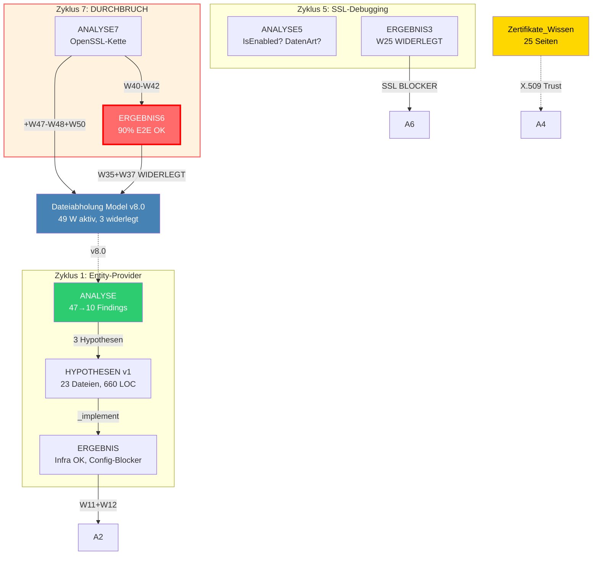

# Obsidian Integration - Hilfe & Referenz

Zeigt die vollstaendige Obsidian-Integration des wissenschaftlichen Forschungszyklus:
Tag-Taxonomie, Graph-Farben, Frontmatter-Konventionen und manuelle Setup-Schritte.

## Aufruf

```
/_obsidianHelp
```

---

## TAG-TAXONOMIE (3 Ebenen)

Obsidian Nested Tags ermoeglichen hierarchische Trennung.
In YAML Frontmatter geschrieben, in Tag-Pane als Baum sichtbar.

### Ebene 1: System-Tags (`type/`)

Fester Satz. Steuern die **Graph-Knotenfarben**. Aendern sich NUR wenn ein neuer
Dokumenttyp eingefuehrt wird.

| Tag | Dokumenttyp | Graph-Farbe | Hex |
|-----|-------------|-------------|-----|
| `type/knowledge` | Wissen (Feynman Deep-Dive) | Gold | `#FFD700` |
| `type/model` | System-Model | Stahlblau | `#4682B4` |
| `type/spec` | Spezifikation (SOLL-Definition) | Petrol | `#009688` |
| `type/gap` | Gap-Analyse (Delta IST↔SOLL) | Bernstein | `#FF8F00` |
| `type/observe` | Observe-Synthese (Findings) | Tuerkis | `#26C6DA` |
| `type/qualitygate` | Quality-Gate-Bewertung | Lila | `#AB47BC` |
| `type/analyse` | Analyse-Synthese (LEGACY <v2.2) | Smaragd | `#2ECC71` |
| `type/hypothese` | Hypothesen | Orange | `#E67E22` |
| `type/ergebnis` | Ergebnis-Messung (Rohdaten) | Indigo | `#3F51B5` |
| `type/presentation` | Praesentation | Violett | `#9B59B6` |
| `type/parking-lot` | Incidental Findings Queue | Gelb | `#FDD835` |
| `type/epic` | Epic (PO-Pipeline Output) | Gruen | `#4CAF50` |
| `type/user-story` | User Story / Feature | Cyan | `#00BCD4` |
| `type/problem` | Problem / Blocker | Rot | `#E74C3C` |

### Ebene 2: Thematische Tags (`topic/`)

Wachsender Satz. Zentral kontrolliert via **Tag-Registry** im Manifest.
Dient der **Wissenssuche** und **Verknuepfung** verwandter Dokumente.

Beispiele:
- `topic/Zertifikate` - X.509, TLS, SSL
- `topic/SFTP` - SSH File Transfer Protocol
- `topic/WCF-Binding` - WCF Service Bindings
- `topic/DIC` - Datenaustausch-Infrastruktur
- `topic/Docker` - Container-Infrastruktur

**WICHTIG:** Vor der Vergabe eines neuen `topic/`-Tags → **Tag-Index im Vault pruefen!**
Datei: `{VAULT}/_Tag-Index.md`
Verhindert Synonyme wie `topic/SSL` + `topic/TLS` + `topic/Zertifikate`.
Der Tag-Index wird von `/_W_obsidianSync` gelesen und aktualisiert (Schritt 1b + 5b).

### Ebene 3: Operative Tags (`op/`)

Ticket-/Feature-Ebene. Verbindet Dokumente mit der zugehoerigen User Story.

- `op/DCSRE-881` - Dateiabholung Analyse
- `op/DCSRE-XXX` - (zukuenftige Features)

---

## GRAPH COLOR GROUPS - MANUELLE EINRICHTUNG

### Globaler Graph

Die Color Groups muessen in Obsidian **manuell** konfiguriert werden:

1. **Graph View oeffnen:** Linke Sidebar → Graph View (oder `Ctrl+G`)
2. **Settings oeffnen:** Zahnrad-Icon oben links im Graph
3. **Groups-Sektion:** "Color groups" aufklappen
4. **Fuer jede der 13 Groups:**
   a) "New group" klicken
   b) Query eingeben (siehe Tabelle)
   c) Farbkreis anklicken → Hex-Code eingeben

| # | Query (exakt eingeben) | Hex-Farbe | Farbe |
|---|------------------------|-----------|-------|
| 1 | `tag:#type/knowledge` | `#FFD700` | Gold |
| 2 | `tag:#type/model` | `#4682B4` | Stahlblau |
| 3 | `tag:#type/spec` | `#009688` | Petrol |
| 4 | `tag:#type/gap` | `#FF8F00` | Bernstein |
| 5 | `tag:#type/observe` | `#26C6DA` | Tuerkis |
| 6 | `tag:#type/qualitygate` | `#AB47BC` | Lila |
| 7 | `tag:#type/analyse` | `#2ECC71` | Smaragd |
| 8 | `tag:#type/hypothese` | `#E67E22` | Orange |
| 9 | `tag:#type/ergebnis` | `#3F51B5` | Indigo |
| 10 | `tag:#type/presentation` | `#9B59B6` | Violett |
| 11 | `tag:#type/parking-lot` | `#FDD835` | Gelb |
| 12 | `tag:#type/epic` | `#4CAF50` | Gruen |
| 13 | `tag:#type/user-story` | `#00BCD4` | Cyan |
| 14 | `tag:#type/problem` | `#E74C3C` | Rot |

### Lokaler Graph (SEPARATE Einstellungen!)

**ACHTUNG:** Der lokale Graph hat **eigene** Color-Group-Einstellungen.
Die globalen Groups werden NICHT automatisch uebernommen.

Beim ERSTEN Oeffnen eines lokalen Graphs:
1. Rechtsklick auf eine Note → "Open local graph"
2. Zahnrad → Groups → alle 14 Groups mit **gleichen** Queries+Farben anlegen
3. **Tiefe:** "1" fuer direkte Verbindungen, "2" fuer 2 Hops

Danach bleiben die Einstellungen fuer den lokalen Graph gespeichert.

### graph.json Referenz

Obsidian speichert Color Groups in `{VAULT}/.obsidian/graph.json`.
Format pro Group:

```json
{
  "query": "tag:#type/knowledge",
  "color": {
    "a": 1,
    "rgb": 16766720
  }
}
```

RGB-Wert = `(R * 65536) + (G * 256) + B` als Integer.

| Hex | R | G | B | RGB-Integer |
|-----|---|---|---|-------------|
| `#FFD700` | 255 | 215 | 0 | 16766720 |
| `#4682B4` | 70 | 130 | 180 | 4620980 |
| `#009688` | 0 | 150 | 136 | 38536 |
| `#FF8F00` | 255 | 143 | 0 | 16748288 |
| `#26C6DA` | 38 | 198 | 218 | 2541274 |
| `#AB47BC` | 171 | 71 | 188 | 11225020 |
| `#2ECC71` | 46 | 204 | 113 | 3066993 |
| `#E67E22` | 230 | 126 | 34 | 15105570 |
| `#3F51B5` | 63 | 81 | 181 | 4149685 |
| `#9B59B6` | 155 | 89 | 182 | 10181046 |
| `#FDD835` | 253 | 216 | 53 | 16635957 |
| `#00BCD4` | 0 | 188 | 212 | 48340 |
| `#E74C3C` | 231 | 76 | 60 | 15158332 |

---

## FRONTMATTER-KONVENTION

Jedes Synthese-Dokument im Vault bekommt folgendes YAML Frontmatter:

**Beispiel: Wissens-Dokument (kein Chain-Glied)**

```yaml
---
id: Zertifikate_Wissen
aliases:
  - Zertifikate Wissen
  - DIC Zertifikate
  - X509
tags:
  - type/knowledge
  - topic/Zertifikate
  - topic/SFTP
  - topic/WCF-Binding
  - op/DCSRE-881
feature: '[[DCSRE-881]]'
cycle: 0
chain-position: knowledge
---

> [!info] Feature-Kontext
> Wissens-Dokument fuer [[DCSRE-881]].
> Erstellt im wissenschaftlichen Forschungszyklus.
```

**Beispiel: Analyse-Dokument (Chain-Glied, Zyklus 2)**

```yaml
---
id: Dateiabholung-ANALYSE2
aliases:
  - Analyse2
  - Zweite Analyse
tags:
  - type/analyse
  - topic/DIC
  - topic/SFTP
  - op/DCSRE-881
feature: '[[DCSRE-881]]'
cycle: 2
chain-position: analyse
prev: '[[Dateiabholung-ERGEBNIS]]'
next: '[[Dateiabholung-HYPOTHESEN]]'
---

> [!info] Feature-Kontext
> Analyse-Dokument fuer [[DCSRE-881]]. Zyklus 2.
> Kette: [[Dateiabholung-ERGEBNIS]] → **dieses Dokument** → [[Dateiabholung-HYPOTHESEN]]
```

### Frontmatter-Felder

| Feld | Pflicht | Beschreibung |
|------|---------|-------------|
| `id` | Ja | Dateiname ohne .md |
| `aliases` | Ja | 2-5 alternative Bezeichnungen fuer Wiki-Links |
| `tags` | Ja | Nested Tags: mindestens 1x `type/` + 1x `op/` |
| `feature` | Ja | Wiki-Link zur Feature-Note |
| `cycle` | Ja | Zyklus-Nummer (0 fuer Nicht-Chain-Glieder) |
| `chain-position` | Ja | model, spec, gap, observe, qualitygate, analyse, hypothese, ergebnis, knowledge, presentation, parking-lot |
| `prev` | Chain | Wiki-Link zum Vorgaenger in der Forschungs-Kette |
| `next` | Chain | Wiki-Link zum Nachfolger (leer wenn noch nicht existent) |
| `model-br` | Model | Wiki-Link zur letzten Battle-Royale-Bewertung (nur Model) |

### Tags pro Dokumenttyp

| Dokumenttyp | Pflicht-Tags | Zusatz-Tags |
|-------------|-------------|-------------|
| Wissen | `type/knowledge`, `op/{FEATURE}` | `topic/{THEMA}` (mehrere!) |
| Model | `type/model`, `op/{FEATURE}` | `topic/` (Kern-Konzepte) |
| Spec | `type/spec`, `op/{FEATURE}` | `topic/` (spezifizierte Bereiche) |
| Gap | `type/gap`, `op/{FEATURE}` | `topic/` (Gap-Bereiche) |
| Observe | `type/observe`, `op/{FEATURE}` | `topic/` (beobachtete Themen) |
| Quality Gate | `type/qualitygate`, `op/{FEATURE}` | `topic/` (geprueft Bereiche) |
| Analyse | `type/analyse`, `op/{FEATURE}` | `topic/` (analysierte Themen) |
| Hypothese | `type/hypothese`, `op/{FEATURE}` | `topic/` (untersuchte Themen) |
| Ergebnis | `type/ergebnis`, `op/{FEATURE}` | `topic/` (gemessene Themen) |
| Presentation | `type/presentation`, `op/{FEATURE}` | `topic/` (praesentierte Themen) |
| Parking Lot | `type/parking-lot`, `op/{FEATURE}` | `topic/` (gesammelte Bereiche) |
| User Story | `type/user-story` | `op/{FEATURE}` |
| Problem | `type/problem`, `op/{FEATURE}` | `topic/` (betroffene Bereiche) |

---

## TAG-PANE DARSTELLUNG

Obsidian zeigt nested Tags als **Baum** in der Tag-Pane (rechte Sidebar):

```
type/ (N)
  ├── knowledge (3)
  ├── model (2)
  ├── spec (1)
  ├── gap (1)
  ├── observe (4)
  ├── qualitygate (4)
  ├── analyse (4)
  ├── hypothese (2)
  ├── ergebnis (1)
  ├── presentation (1)
  ├── parking-lot (1)
  ├── user-story (5)
  └── problem (1)
topic/ (N)
  ├── Zertifikate (5)
  ├── SFTP (3)
  ├── WCF-Binding (2)
  ├── DIC (8)
  └── Docker (4)
op/ (N)
  ├── DCSRE-881 (12)
  └── DCSRE-XXX (...)
```

**Navigation:** Klick auf einen Tag filtert alle Notizen mit diesem Tag.
`topic/` aufklappen → `Zertifikate` klicken → alle Zertifikate-Dokumente.

---

## VERLINKUNGS-TOPOLOGIE (ZIP-Kette)

Forschungs-Dokumente bilden eine **bidirektionale Kette** (prev ← Dokument → next).
Analyse und Hypothesen verzahnen sich wie Reissverschluss-Zaehne.

### Ketten-Struktur

**V2.2+ (Neue Kette):**
```
   MODEL ◄──(updated by)── /_SC_modelMaintain (nach /_SC_observe)

   OBSERVE1 ──▶ QUALITYGATE1 ──▶ HYPOTHESEN ──▶ ERGEBNIS1
                                                      │
   OBSERVE2 ◄────────────────────────────────────────┘
     │
   OBSERVE2 ──▶ QUALITYGATE2 ──▶ HYPOTHESEN ──▶ ERGEBNIS2
                                                      │
   OBSERVE3 ◄────────────────────────────────────────┘
     ...
```

**V3.0+ Standalone-Dokumente (kein Chain-Glied):**
```
   SPEC (SOLL-Referenz)    ──input──▶ GAP (IST↔SOLL Delta)
   MODEL (IST-Zustand)     ──input──▶ GAP
```

**<V2.2 (Legacy Kette):**
```
   MODEL ◄─────(updated by)────── ANALYSE{latest}

   ANALYSE1 ──▶ HYPOTHESEN ──▶ ERGEBNIS1
                                    │
   ANALYSE2 ◄──────────────────────┘
     ...
```

### Navigation

| Von | Nach | Wie |
|-----|------|-----|
| Feature-Note | Letzte Analyse | Forschungs-Kette Sektion → Mermaid-Diagramm |
| Beliebiges Dokument | Vorgaenger | Frontmatter `prev` → Wiki-Link |
| Beliebiges Dokument | Nachfolger | Frontmatter `next` → Wiki-Link |
| Model | Battle-Royale | Frontmatter `model-br` → Heading-Link |
| Obsidian Graph | Ketten-Fluss | prev/next-Links erzeugen Pfad im Graph |

### Einstiegspunkt: Feature-ID eingeben

```
DCSRE-881 eingeben → Feature-Note oeffnen
  → ## Forschungs-Kette
    → Mermaid: Gesamte Chronologie visuell
    → Letzter Stand: ANALYSE4 → HYPOTHESEN (ausstehend: ERGEBNIS4)
    → Model v2.1
  → Klick auf beliebigen Knoten → direkt zum Dokument
  → Von dort: prev/next fuer sequentielles Durchlaufen
```

### Mermaid in Obsidian

Obsidian rendert Mermaid-Diagramme nativ (Core Plugin, kein Addon).
Die Forschungs-Kette wird als `graph TD` (top-down) mit Subgraphs dargestellt.
Knoten-Farben entsprechen den Graph Color Groups (type/-Tags).

---

## ERWEITERTE TOPOLOGIE-FEATURES

Seit v2.0 (2026-02-01) geht die Forschungs-Kette **ueber die ZIP-Kette hinaus**:
Externe Knoten, kausale Kanten-Labels und automatische Guards machen die
Informationsfluesse sichtbar.

### Externe Referenz-Knoten

Neben den Chain-Gliedern (ANALYSE, HYPOTHESEN, ERGEBNIS) erscheinen **externe Knoten**
im Mermaid-Diagramm:

| Knoten | Farbe | Wann sichtbar | Funktion |
|--------|-------|---------------|----------|
| **MODEL** | Stahlblau #4682B4 | Immer | Zentraler Hub: Wird aktualisiert durch ANALYSE, liefert Input fuer ANALYSE |
| **WISSEN{*}** | Gold #FFD700 | Wenn von ANALYSE referenziert | Input: Liefert Fachwissen (z.B. Zertifikate_Wissen) |
| **PRESENTATION** | Violett #9B59B6 | Wenn existent | Output: Abgeleitet aus ERGEBNIS{N} |

**Warum sichtbar?** Ohne diese Knoten sieht man nur die Chronologie (wann?).
Mit ihnen sieht man den **Informationsfluss** (woher? wohin?).

### Cross-Reference Kanten

Kanten zwischen Chain-Gliedern und externen Knoten zeigen **was die Zyklen antreibt**.

| Kanten-Typ | Beispiel | Stil | Bedeutung |
|------------|----------|------|-----------|
| **Model-Input** | MODEL -.-> ANALYSE{N} | Dashed | ANALYSE liest Model v{X} als Grundlage |
| **Model-Update** | ANALYSE{N} --> MODEL | Solid | ANALYSE fuegt W{n} zum Model hinzu |
| **Model-Widerlegung** | ERGEBNIS{N} --> MODEL | Solid (rot) | ERGEBNIS widerlegt W{n} im Model |
| **Wissens-Input** | WISSEN -.-> ANALYSE{N} | Dashed | ANALYSE nutzt Wissen (z.B. X.509-Mechanik) |
| **Ergebnis-Output** | ERGEBNIS{N} -.-> PRESENTATION | Dashed | PRESENTATION basiert auf Ergebnis |
| **Kausaler Uebergang** | ERGEBNIS{N} --> ANALYSE{N+1} | Solid (bold) | Warum der naechste Zyklus noetig war |

**Dashed (-.->)** = Input lesen (informativ, kein Zustand geaendert)
**Solid (-->)** = Output schreiben (kausaler Effekt, Zustand geaendert)

### Kausale Kanten-Labels

Jede Kante zwischen Zyklen traegt ein **kausales Label** — die W{n}-Marker oder
Kern-Findings die den Uebergang begruendeten.

**Beispiele aus DCSRE-881:**
```
ERGEBNIS3 ──"W25 WIDERLEGT, SSL BLOCKER"──▶ ANALYSE4
ANALYSE7  ──"W40-W42, Option F"──▶ ERGEBNIS6
ERGEBNIS6 ──"W35+W37 WIDERLEGT"──▶ MODEL
```

**Label-Quellen:** Automatisch extrahiert aus Manifest Zyklus-Historie (Spalte "Ergebnis").

**Nutzen:** Rueckwaerts durch die Kette navigieren und verstehen WARUM jeder Zyklus
noetig war. Ohne Labels: Chronologie. Mit Labels: Kausale Erklaerung.

### Subgraphs (Zyklus-Gruppierung)

Jeder Zyklus wird als eigener **Subgraph** dargestellt mit Titel:

```mermaid
subgraph Z1["Zyklus 1: Entity-Provider Pattern"]
  A1[ANALYSE\n47→10 Findings]
  H1[HYPOTHESEN v1\n23 Dateien]
  E1[ERGEBNIS\nConfig-Blocker]
end

subgraph Z7["Zyklus 7: DURCHBRUCH"]
  A7[ANALYSE7\nOpenSSL-Kette]
  E6[ERGEBNIS6\n90% E2E OK]
end
```

**Titel-Format:** `"Zyklus {N}: {THEMA}"` — THEMA aus Manifest extrahiert.
**Letzter Subgraph:** Oranger Rand (hervorgehoben).

### Knoten-Labels (Kurztext)

Jeder Knoten zeigt **2 Zeilen**:
- Zeile 1: Dateiname
- Zeile 2: Kurztext (max. 30 Zeichen) aus Manifest

**Beispiel:**
```
A7[ANALYSE7\nOpenSSL-Kette]
E6[ERGEBNIS6\n90% E2E OK]
MODEL[Dateiabholung v8.0\n49 W aktiv]
```

**Aktueller Knoten:** Zusaetzlich rote Umrandung + roter Hintergrund #FF6B6B.

### Topology-Guards (Validierung)

Bei jedem Sync laufen **5 Guards** die die Topologie pruefen:

| Guard | Prueft | Beispiel-Warnung |
|-------|--------|------------------|
| **G-CHAIN** | Alle Zyklen vollstaendig | "Zyklus 3 hat kein ERGEBNIS aber ANALYSE4 existiert" |
| **G-BIDIR** | prev/next symmetrisch | "A2.prev zeigt auf E1, aber E1.next zeigt auf A3" |
| **G-NAME** | Vault-Name = Quell-Name | "Retrospekt_Model.md → OmniCommand_Model.md (Umbenennung)" |
| **G-XREF** | ANALYSE→MODEL Kanten | "ANALYSE4 hat keine erkennbare MODEL-Referenz" |
| **G-CAUSAL** | Kanten haben W{n}-Labels | "Uebergang E3→A4 hat kein W{n}-Label im Manifest" |

**Output:** Guards erscheinen in der Zusammenfassung (`/_W_obsidianSync` Schritt 6)
und ggf. als Callout unter dem Mermaid-Diagramm:

```markdown
> [!warning] Topology-Guards: 2 Warnungen
> G-NAME: 3 Umbenennungen (Retrospekt→OmniCommand)
> G-CAUSAL: Kante E3→A4 ohne W{n}-Label
```

### Beispiel: Vollstaendiges Mermaid (DCSRE-881)



**Sofort erkennbar:**
- 7 Zyklen, 3 hervorgehoben (1, 5, 7)
- ERGEBNIS6 ist aktuell (rot)
- Model wurde 2x aktualisiert, 1x widerlegt
- Zertifikate-Wissen war Input fuer Zyklus 4
- W35+W37 wurden in Zyklus 7 widerlegt

---

## HASH-BASIERTE SYNC-OPTIMIERUNG

Verhindert redundantes Kopieren unveraenderter Dateien.

### Prinzip

```
Quelldatei ──MD5──▶ Hash ──Vergleich──▶ Manifest-Hash
                                            │
                            GLEICH → SKIP (kein Sync)
                            VERSCHIEDEN → SYNC (kopieren + Frontmatter)
                            FEHLT → SYNC (erstmaliger Sync)
```

### Typische Ergebnisse

| Dateityp | Aendert sich | Hash-Effekt |
|----------|-------------|-------------|
| ANALYSE{N} | Einmalig (immutable) | Nach Erst-Sync immer SKIP |
| ERGEBNIS{N} | Einmalig (immutable) | Nach Erst-Sync immer SKIP |
| HYPOTHESEN | Jeder Zyklus | Immer SYNC |
| MODEL | Jeder Zyklus (_analyse Update) | Immer SYNC |
| Wissen | Selten | Meist SKIP |

Bei 20 Dokumenten und Zyklus 5: ~12 SKIP, ~8 SYNC → 60% weniger Datei-Ops.

---

## LOKALER GRAPH - USE CASE

### Workflow: Feature-Ueberblick

1. Oeffne `DCSRE-881.md` im Vault
2. Rechtsklick → "Open local graph"
3. Knotenfarben zeigen sofort die Dokumenttypen:

```
  ■ Gold       → Wissen-Dokumente
  ■ Stahlblau  → System-Model
  ■ Smaragd    → Analysen (wie viele Zyklen?)
  ■ Orange     → Hypothesen (offene Fragen?)
  ■ Indigo     → Ergebnisse (Messdaten, Rohdaten)
  ■ Violett    → Praesentation (Deliverables)
  ■ Cyan       → User Story (Hub-Knoten)
  ■ Rot        → Probleme (Blocker)
```

### Beispiel: DCSRE-881 Lokaler Graph

```
              ┌───────────────────────┐
              │ Dateiabholung-ANALYSE  │ ■ Smaragd
              └───────────┬───────────┘
                          │
  ┌────────────────┐      │      ┌─────────────────────────┐
  │ Dateiabholung  │──────┼──────│ Dateiabholung-ANALYSE-02│
  │   _Model       │      │      │       ■ Smaragd         │
  │ ■ Stahlblau    │      │      └─────────────────────────┘
  └────────────────┘      │
                          │
          ┌───────────────┴──────────────────┐
          │          DCSRE-881               │
          │           ■ Cyan                 │
          └───────────────┬──────────────────┘
                          │
  ┌────────────────┐      │      ┌──────────────────────────────┐
  │ Zertifikate    │──────┼──────│ Dateiabholung-ANALYSE-03-WCF │
  │   _Wissen      │      │      │         ■ Smaragd            │
  │ ■ Gold         │      │      └──────────────────────────────┘
  └────────────────┘      │
                          │
  ┌─────────────────────┐ │ ┌─────────────────────────────┐
  │ Dateiabholung       │─┘ │ Dateiabholung-ERGEBNIS      │
  │   -HYPOTHESEN       │───│         ■ Indigo             │
  │ ■ Orange            │   └─────────────────────────────┘
  └─────────────────────┘
                               ┌─────────────────────────────┐
                               │ DCSRE-881-Umsetzungsplan    │
                               │         ■ Violett            │
                               └─────────────────────────────┘
```

9 Knoten, 6 Farben → sofort visuell erfassbar.

---

## GRAPH-FILTER (Thematische Suche)

Im globalen Graph → Suchfeld oben:

| Filter | Zeigt |
|--------|-------|
| `tag:#type/knowledge` | Alle Wissens-Dokumente |
| `tag:#topic/Zertifikate` | Alles zum Thema Zertifikate |
| `tag:#op/DCSRE-881` | Alle Dokumente dieser User Story |
| `tag:#type/knowledge tag:#topic/SFTP` | Wissen ueber SFTP |
| `path:` | Alle Dateien in einem Ordner |

---

## ERWEITERBARKEIT

### Neuen Dokumenttyp einfuehren

1. Tag in `type/`-Hierarchie hinzufuegen (z.B. `type/problem`)
2. Farbe waehlen (kein Konflikt mit bestehenden Hex-Werten)
3. In Obsidian manuell als neue Color Group hinzufuegen
4. `/_obsidianHelp` aktualisieren (diese Datei)
5. `/_W_obsidianSync` → Dokument-Typ-Tabelle ergaenzen

### Neues Thema registrieren

1. Tag-Registry im Manifest pruefen (Synonyme vermeiden!)
2. `topic/{THEMA}` als Tag in Frontmatter verwenden
3. Registry-Eintrag im Manifest hinzufuegen

---

## FARB-DESIGN: RATIONALE

| Farbe | Warum |
|-------|-------|
| Gold (#FFD700) | Wissen = Wert, Bestaendigkeit. User-Wunsch. |
| Stahlblau (#4682B4) | Model = Kuehle, Stabilitaet. Architektonisches Fundament. |
| Smaragd (#2ECC71) | Analyse = Erkundung, Wachstum. "Wir graben rein." |
| Orange (#E67E22) | Hypothese = Warm, warnend. "Noch unbewiesen." |
| Indigo (#3F51B5) | Ergebnis = Kuehle Tiefe, Daten. "Gemessen, nicht interpretiert." |
| Violett (#9B59B6) | Presentation = Formell, abgeschlossen, "poliert." |
| Cyan (#00BCD4) | User Story = Neutral, auffaellig. Hub-Knoten. |
| Rot (#E74C3C) | Problem = Universelle Warnung. Blocker. |

---

## QUELLEN & MECHANISMEN

Obsidian-native Mechanismen die wir nutzen (keine Plugins noetig):

| Mechanismus | Zweck | Wo |
|------------|-------|-----|
| Nested Tags | Hierarchische Tag-Taxonomie (3 Ebenen) | YAML Frontmatter |
| Graph Color Groups | Knoten nach `type/`-Tag einfaerben | Graph View → Settings → Groups |
| YAML Frontmatter | Metadaten pro Dokument (id, aliases, tags) | Dateikopf |
| Wiki-Links `[[...]]` | Bidirektionale Verlinkung | Inline + Frontmatter |
| Callout Boxes `> [!info]` | Feature-Kontext Hinweis | Nach Frontmatter |
| Tag Pane | Navigationsbaum fuer nested Tags | Rechte Sidebar |
| Aliases | Multi-Name Wiki-Link Resolution | Frontmatter `aliases:` |
| Local Graph | Feature-zentrierte Knotenansicht | Rechtsklick → Open local graph |

**Aktivierte Core Plugins (erforderlich):**
- Graph View → `graph: true`
- Tag Pane → `tag-pane: true`
- Backlinks → `backlink: true`
- Properties → empfohlen: `true` (fuer Frontmatter-Darstellung)

ARGUMENTS: $ARGUMENTS
