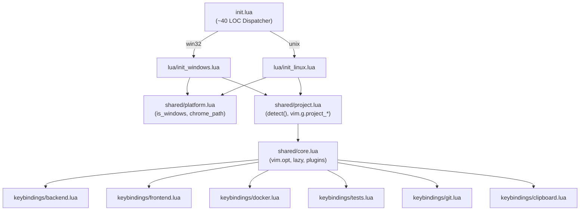
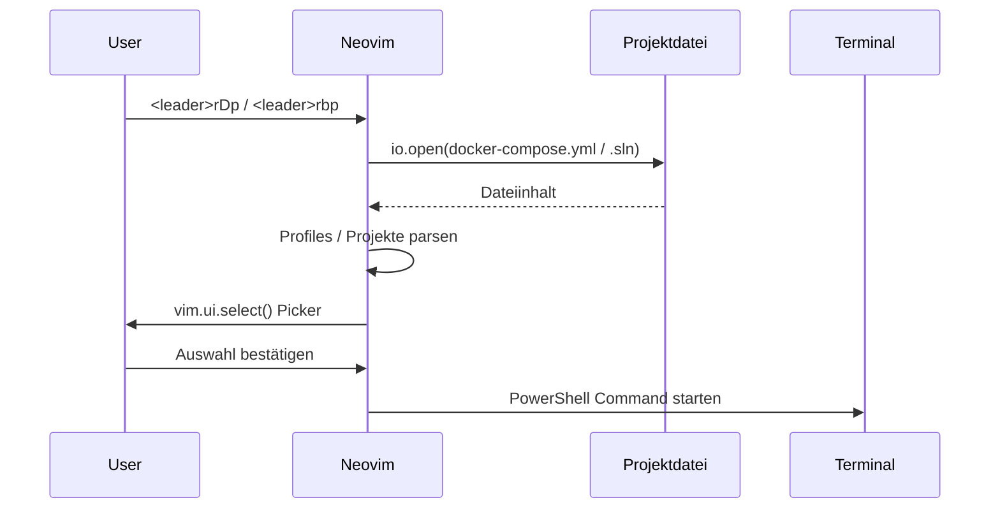

# KickStartNeoVim Architektur-Model

---

## Kap. 1: IST-Zustand

### 1.1 Dateistruktur heute

```
KickStartNeoVim/
├── init.lua                    # EINZIGE Config-Datei, 4541 Zeilen [Zeile 4541 verifiziert]
├── omnisharp.json              # OmniSharp-Konfiguration (extern, OUT-of-Scope)
└── .claude/
    ├── Task.md                 # Aufgabenbeschreibung
    └── crumbs/
        └── KickStartNeoVim_crumbs.md
```

**Kein Modulsystem**: Alles ist ein einziger Top-Level-Lua-Scope. Keine `require()`-Aufrufe für eigene Module.

### 1.2 Platform-Detection Mechanismus

Es gibt **ZWEI Mechanismen**, die nebeneinander existieren:

**Mechanismus A: `is_windows` Variable (Top-Level)** [Zeile 200 verifiziert]
```lua
local is_windows = vim.fn.has('win32') == 1
```
Diese Variable ist nur im Top-Level-Scope sichtbar. Plugin-Callbacks und Keybinding-Functions können sie verwenden, weil sie als Closure über den Top-Level-Scope gebildet werden.

**Mechanismus B: Inline `vim.fn.has('win32')` Checks** (innerhalb von Plugin-opts/callbacks)
Diese werden benötigt, weil plugin `opts`-Tabellen lazy evaluiert werden können und `is_windows` dort nicht verfügbar ist.

**Vollständige Liste der inline `vim.fn.has`-Checks** [crumbs verifiziert]:
- Zeile 131–163: `.claude` Auto-Copy (auch `vim.fn.has('unix')`)
- Zeile 745–754: Obsidian Workspaces
- Zeile 858–863: Obsidian Follow Link (Chrome-Öffnen)
- Zeile 934: Obsidian Graph View
- Zeile 1477: DAP netcoredbg `.exe`-Suffix
- Zeile 2017: E2E Test Picker (lokale Variable `local is_win`)
- Zeile 2191: Integration Test Picker (lokale Variable `local is_win`)
- Zeile 2788: LuaSnip build-Step
- Zeile 4257–4316: Markdown PDF Export (prüft `vim.fn.has('unix')`)

**Gesamt Statistik** [direkt mit grep verifiziert]:
- `is_windows` Verwendungen: 7 direkte Referenzen
- `powershell.exe` Vorkommnisse: 52 Zeilen
- `vim.fn.has(...)` Aufrufe: 17 Zeilen
- `/mnt/c/` Vorkommnisse: 16 Zeilen

### 1.3 Verifizierte LOC-Verteilung

| Kategorie | Zeilen-Bereich | LOC (geschätzt) |
|-----------|---------------|-----------------|
| Header/Kommentar | 1–85 | 85 |
| Globals & Leader | 87–111 | 25 |
| SwapExists + .claude Auto-Copy | 113–164 | 52 |
| Terminal-Hintergrundfarbe | 166–192 | 27 |
| Platform-Detection + Projekt-Detection | 194–268 | 75 |
| Welcome-Message | 270–275 | 6 |
| Vim-Options | 277–354 | 78 |
| Basic Keymaps + Autocommands | 356–432 | 77 |
| Lazy Bootstrap | 434–447 | 14 |
| Plugin-Setup (lazy.setup) | 449–3034 | 2586 |
| Custom Keybindings | 3036–4539 | 1504 |
| Modeline | 4540–4541 | 2 |
| **GESAMT** | | **4541** [Zeile 4541 verifiziert] |

**Platform-spezifischer Code** [SCHÄTZUNG basierend auf Grep-Counts]:
- `powershell.exe` Zeilen: ~52 direkte Aufrufe + umgebende Logik ≈ ~200-250 LOC Windows-spezifisch
- `is_windows` Ternary-Blöcke (CENCOCD-Pfade, Zeilen 235–243): ~30 LOC
- Obsidian/Chrome Windows-Pfade: ~40 LOC
- Reine Linux/WSL-Branches: ~40 LOC (viele Keybindings haben **keinen** Linux-Branch!)
- Definitiv shared: Zeilen 277–354 (78 LOC), Zeilen 356–432 (77 LOC), plus Plugin-Shared-Configs

**Wichtiger Befund**: D03-Schätzung von "350 Windows-spezifisch / 40 Linux-spezifisch" ist realistisch.
Viele `<leader>r*`-Keybindings rufen `powershell.exe` auf und haben **keinen Linux-Branch** [Zeile 3095 verifiziert: `rbs` nur PowerShell, kein else-Zweig].

### 1.4 Kritische Befunde

#### Befund 1: find_vault_root — KEINE klassische DRY-Violation [verifiziert]

Die Drafter-Behauptung "3x dupliziert" ist **nur teilweise korrekt**:

- `img-clip.nvim` (Zeile 959): Echte `local function find_vault_root()` [Zeile 959 verifiziert]
- `<leader>op` (Zeile 887–894): Inlined als `vault_root` Loop [Zeilen 888–893 verifiziert]
- `<leader>oG` (Zeile 918–925): Inlined als `vault_root` Loop [Zeilen 919–924 verifiziert]

Die inline-Versionen in `<leader>op` und `<leader>oG` sind **identische Logik** aber **kein named-function reuse**. Das ist eine DRY-Verletzung.

**Algorithmus** (alle drei identisch):
```lua
local root = vim.fn.expand('%:p:h')
while root ~= '' and root ~= '/' and root ~= 'C:\\' do
  if vim.fn.isdirectory(root .. '/.obsidian') == 1
     or vim.fn.isdirectory(root .. '\\.obsidian') == 1 then
    break
  end
  root = vim.fn.fnamemodify(root, ':h')
end
```

#### Befund 2: PowerShell Pfad-Konversion (gsub) — korrekt auf BEIDEN Plattformen

Folgendes Pattern wird verwendet [Zeile 252, 256, 259 verifiziert]:
```lua
dcsre_root:gsub('/', '\\')
```

`dcsre_root` kommt von `find_dcsre_root()`, das alle Pfade auf Forward-Slashes normalisiert [Zeile 205 verifiziert: `path = path:gsub('\\', '/')`]. Das `gsub('/', '\\')` danach erzeugt einen Windows-Backslash-Pfad für PowerShell.

**Ist das ein Bug?** Auf Windows-Neovim: `cwd` ist bereits mit Backslashes, wird in `find_dcsre_root()` normalisiert, dann wieder in Backslashes konvertiert — **korrekt**.
Auf WSL2-Neovim: `cwd` beginnt mit `/mnt/c/...`, Forward-Slashes → nach gsub Backslashes → `\mnt\c\...` — das ist ein **echter Bug im DCSRE-Pfad für WSL2**! `project_root_wsl` hingegen wird korrekt via `:gsub('C:', '/mnt/c')` gesetzt.

#### Befund 3: Viele Terminal-Commands haben keinen Linux-Branch [Zeilen 3095, 3112, 3125 verifiziert]

`<leader>rbs`, `<leader>rbb`, `<leader>rbt` verwenden **nur** `powershell.exe` — kein else-Zweig.
Das ist **kein Bug**, sondern gewolltes Design (VPN-Anforderung). Beim Refactoring: Diese Commands können in `shared/keybindings/backend.lua` als reine PowerShell-Commands verbleiben.

#### Befund 4: is_windows als Closure-Variable

Die `is_windows`-Variable (Zeile 200) ist Top-Level-lokal. Alle Keybinding-Functions, die in `vim.keymap.set()` Callbacks definiert werden (Zeilen 3036–4539), können sie via Closure zugreifen. Nach Modularisierung muss `is_windows` entweder:
- Als Parameter übergeben werden
- Via `require('shared.platform').is_windows` zugänglich gemacht werden
- Durch direktes `vim.fn.has('win32') == 1` ersetzt werden

---

## Kap. 2: Architektur-Analyse

### 2.1 Abhängigkeitsgraph (IST)

```
init.lua (Top-Level-Scope)
  │
  ├── [Zeile 200] is_windows = vim.fn.has('win32')
  ├── [Zeile 197] cwd = vim.fn.getcwd()
  │
  ├── [Zeile 229] vim.g.project_name, vim.g.project_*  (nutzt is_windows + cwd)
  │
  ├── [Zeile 449] require('lazy').setup({...})
  │     │
  │     ├── Plugin: obsidian-nvim  (inline vim.fn.has checks, inline vault_root logic)
  │     ├── Plugin: img-clip.nvim  (eigene find_vault_root() Funktion)
  │     ├── Plugin: markdown-preview (inline vim.fn.has check)
  │     ├── Plugin: nvim-dap  (inline vim.fn.has check für .exe)
  │     ├── Plugin: blink.cmp/LuaSnip  (inline vim.fn.has check für build)
  │     ├── Plugin: telescope  (E2E + Integration Picker mit local is_win)
  │     └── ... (alle anderen Plugins: shared)
  │
  └── [Zeile 3036] Custom Keybindings
        │
        ├── vim.g.project_name (nutzt für CENCOCD/DCSRE Branching)
        ├── vim.g.project_backend, project_webhost, etc.
        ├── is_windows (Closure-Zugriff)
        └── require('toggleterm.terminal').Terminal (laufzeit)
```

**Globaler State via `vim.g.*`**: Das ist der Haupt-Kommunikationskanal zwischen der Projekt-Detection-Phase und den späteren Keybinding-Definitions.

### 2.2 Platform-spezifische Blöcke (vollständige Liste mit Zeilen)

| Zeilen | Beschreibung | Art |
|--------|-------------|-----|
| 131–163 | .claude Auto-Copy (WIN + WSL + GitBash) | if/else |
| 235–243 | CENCOCD Pfad-Variablen | is_windows Ternary (6x) |
| 251–260 | DCSRE Pfad-Konversion für project_root_windows | gsub('/', '\\') |
| 680–694 | Markdown Preview Chrome-Browser-Pfad | if/else |
| 745–754 | Obsidian Workspace-Pfade | vim.fn.has Ternary (3x) |
| 858–863 | Obsidian Follow Link: Chrome öffnen | if/else |
| 887–894 | Obsidian op: vault_root inline Loop | implicit (C:\\ check) |
| 919–925 | Obsidian oG: vault_root inline Loop | implicit (C:\\ check) |
| 934 | Obsidian Graph View: start vs xdg-open | if/else |
| 1477–1479 | DAP netcoredbg .exe Suffix | if |
| 2017 | E2E Test Picker: local is_win | local var + if/else |
| 2100, 2152 | Cypress Pfad mit gsub('/', '\\') | inline |
| 2191 | Integration Test Picker: local is_win | local var + if/else |
| 2210, 2294 | Backend-Root mit gsub('/', '\\') | inline |
| 2788 | LuaSnip: kein make auf Windows | if (early return) |
| 3039–3051 | Watch Backend (nur PowerShell) | kein else |
| 3067–3092 | Run Backend WebHost (CENCOCD+DCSRE, WIN+WSL) | verschachteltes if/else |
| 3095–3109 | Run Backend Setup (nur PowerShell) | kein else |
| 3112–3122 | Run Backend Build (nur PowerShell) | kein else |
| 3125–3144 | Run Backend Tests (nur PowerShell) | kein else |
| 3147–3165 | Run Backend Unit Tests (CENCOCD+DCSRE, nur PS) | if/else projekt |
| 3207–3223 | Run Frontend Web (nur PowerShell) | kein else |
| 3267–3380 | E2E Keybindings (alle PowerShell) | kein else |
| 3384–3509 | Docker Keybindings (alle PowerShell) | kein else |
| 3511–3533 | set_xunit_threads() (Windows TEMP + Backslash) | hardcoded |
| 3539–3584 | write_it_script() (Windows TEMP Variable) | os.getenv('TEMP') |
| 4057–4082 | Yank Path Keybindings (gsub '/' → '\\') | inline |
| 4254–4322 | Markdown PDF Export (unix/windows chrome) | if/else |
| 4436 | TFS Browser öffnen (powershell.exe) | hardcoded |
| 4467 | PR in Azure DevOps öffnen (powershell.exe) | hardcoded |
| 4473–4494 | Git Push/Pull (powershell.exe + Windows-Pfad) | hardcoded |
| 4524–4527 | .claude Setup Script (WSL→Win Pfad-Konversion) | gsub Lambda |

### 2.3 Testbare vs. nicht-testbare Komponenten

**Testbar (pure Funktionen / keine Neovim-API):**
- `find_dcsre_root(path)` [Zeile 203]: Nimmt String, gibt String zurück — **vollständig testbar** wenn `vim.fn.isdirectory` gemockt wird
- Projekt-Detection-Logik (cwd-Matching): String-Pattern-Matching — testbar
- Pfad-Konversions-Utilities (`gsub`-basiert): testbar

**Nur mit Neovim-Kontext testbar:**
- Plugin-Konfigurationen (lazy.setup)
- Keybinding-Definitionen (vim.keymap.set)
- `find_vault_root()` Inline-Logik (nutzt `vim.fn.expand` und `vim.fn.isdirectory`)

**Nicht sinnvoll testbar:**
- Terminal-Commands (Betriebssystem-Calls)
- LSP-Attach-Callbacks
- VimEnter-Autocmds

---

## Kap. 3: SOLL-Zustand

### 3.1 Neue Dateistruktur

```
KickStartNeoVim/
├── init.lua                      # Dispatcher: ~15 Zeilen (lädt platform + project + core)
│
└── lua/
    └── shared/
        ├── platform.lua          # Platform-Detection + Chrome-Pfad Konstanten
        ├── project.lua           # Projekt-Detection (CENCOCD/DCSRE), setzt vim.g.*
        ├── core.lua              # Vim-Options, Standard-Keymaps, Lazy-Bootstrap + ALLE Plugins
        └── keybindings/
            ├── backend.lua       # <leader>rb* Commands
            ├── frontend.lua      # <leader>rf* Commands
            ├── git.lua           # <leader>g*, <leader>rp, <leader>rP
            ├── docker.lua        # <leader>rD* Commands
            └── tests.lua         # <leader>ri*, <leader>re* Commands
```

**Anmerkung**: Die Task.md definiert `init_windows.lua` + `init_linux.lua` als Entry-Points.
Ein alternativer Ansatz (simplererer Dispatcher) ist ein einziges `init.lua` das via `platform.lua` brancht.
**Offene Frage**: Welches Schema bevorzugt der User? (Siehe Kap. 6.1)

### 3.2 Modul-APIs

#### platform.lua
```lua
local M = {}

M.is_windows = vim.fn.has('win32') == 1

-- Chrome executable path (plattformabhängig)
M.chrome_path = M.is_windows
  and 'C:\\Program Files\\Google\\Chrome\\Application\\chrome.exe'
  or '/mnt/c/Program Files/Google/Chrome/Application/chrome.exe'

-- Open URL in system browser
M.open_url = function(url) ... end

return M
```

#### project.lua
```lua
local M = {}
local platform = require('shared.platform')

-- Setzt vim.g.project_name, vim.g.project_backend, etc.
M.detect = function()
  local cwd = vim.fn.getcwd()
  -- ... CENCOCD/DCSRE Logic ...
end

-- find_dcsre_root: Extrahiert, testbar
M.find_dcsre_root = function(path) ... end

return M
```

#### core.lua
```lua
-- Vim-Options (aktuell Zeilen 277–354)
-- Standard-Keymaps (aktuell Zeilen 356–432)
-- Lazy-Bootstrap (aktuell Zeilen 434–447)
-- require('lazy').setup({ ... alle Plugins ... })
-- Autocommands
```

#### Keybinding-Module
```lua
-- Jedes Modul: local function setup() ... end + return M
-- Nutzen: require('shared.platform') und vim.g.project_*
```

### 3.3 Dispatcher init.lua (konkreter Code)

```lua
-- init.lua (Dispatcher) — ~15 Zeilen
local platform = require('shared.platform')
local project  = require('shared.project')

-- 1. Projekt detektieren (setzt vim.g.project_*)
project.detect()

-- 2. Core-Konfiguration (Optionen, Plugins, Standard-Keymaps)
require('shared.core')

-- 3. Projekt-spezifische Keybindings
require('shared.keybindings.backend')
require('shared.keybindings.frontend')
require('shared.keybindings.git')
require('shared.keybindings.docker')
require('shared.keybindings.tests')
```

**Lade-Reihenfolge** [aus Drafter-Analyse, plausibel aber nicht direkt verifiziert]:
`platform.lua` → `project.lua` (braucht platform) → `core.lua` (braucht project für Farben) → `keybindings/*` (brauchen project + core)

**Korrektheit**: `core.lua` darf Lazy.setup() erst aufrufen, wenn `is_windows` und `vim.g.project_*` gesetzt sind (werden für Plugin-opts benötigt, z.B. Obsidian-Workspaces, Markdown-Preview Chrome-Pfad).

### 3.4 Abhängigkeitsgraph (SOLL)

```
init.lua
  │
  ├── shared/platform.lua    (keine Deps)
  │       └── is_windows, chrome_path, open_url()
  │
  ├── shared/project.lua     (dep: platform)
  │       └── detect(), find_dcsre_root()
  │       → setzt vim.g.project_*
  │
  ├── shared/core.lua        (dep: platform, vim.g.project_*)
  │       └── vim.opt, keymaps, lazy.setup({alle Plugins})
  │
  └── shared/keybindings/*.lua  (dep: platform, vim.g.project_*)
          └── vim.keymap.set() Definitionen
```

---

## Kap. 4: Test-Strategie

### 4.1 Test-Framework Setup

```
KickStartNeoVim/
└── lua/
    └── spec/
        ├── project_spec.lua     # Tests für project.lua
        └── platform_spec.lua    # Tests für platform.lua Hilfsfunktionen
```

**Ausführung:**
```bash
nvim --headless -c "PlenaryBustedDirectory lua/spec/ {sequential=true}" -c "q"
```

**Dependency**: plenary.nvim (bereits in init.lua vorhanden als Plugin-Dependency)

**Mock-Anforderungen:**
- `vim.fn.isdirectory()` muss gemockt werden für `find_dcsre_root()`-Tests
- `vim.fn.getcwd()` muss gemockt werden für Projekt-Detection-Tests
- `vim.fn.has()` muss gemockt werden für Platform-Tests (Test auf Linux/Windows simulieren)

### 4.2 Testbare Einheiten

| Funktion | Testbar | Mock-Bedarf |
|---------|---------|-------------|
| `find_dcsre_root(path)` | Ja | `vim.fn.isdirectory` |
| Projekt-Detection (CENCOCD) | Ja | `vim.fn.getcwd` |
| Projekt-Detection (DCSRE) | Ja | `vim.fn.getcwd`, `vim.fn.isdirectory` |
| Projekt-Detection (UNKNOWN) | Ja | `vim.fn.getcwd` |
| Pfad-Konversion gsub | Ja (reine Strings) | keine |
| `find_vault_root()` (extracted) | Ja | `vim.fn.expand`, `vim.fn.isdirectory` |
| Platform-Detection | Ja | `vim.fn.has` |

### 4.3 Test-Specs Übersicht

#### lua/spec/project_spec.lua

```lua
describe("find_dcsre_root", function()
  -- Happy path: Standard DCSRE-Pfad
  it("extracts root from .../DCSRE/Sources/Backend", ...)
  -- Happy path: Nested DCSRE_Azure/DCSRE/Sources
  it("handles DCSRE_Azure/DCSRE/Sources nesting", ...)
  -- Edge case: Kein Sources-Ordner
  it("returns nil when no Sources folder found", ...)
  -- Edge case: Tief verschachtelter Pfad
  it("searches upward through nested directories", ...)
  -- Edge case: Windows-Backslash-Pfad als Input
  it("normalizes backslash paths correctly", ...)
end)

describe("project detection", function()
  it("detects CENCOCD from 'Kluger' in cwd", ...)
  it("detects CENCOCD from 'CENCOCD' in cwd", ...)
  it("detects CENCOCD from 'cencoco' in cwd", ...)
  it("detects DCSRE from 'DCSRE' in cwd", ...)
  it("sets UNKNOWN when no project matches", ...)
  it("sets correct project_backend for CENCOCD on Windows", ...)
  it("sets correct project_backend for CENCOCD on WSL2", ...)
  it("sets correct project_git_base for CENCOCD", ...)  -- 'origin/main'
  it("sets correct project_git_base for DCSRE", ...)    -- 'origin/develop'
end)
```

#### lua/spec/platform_spec.lua

```lua
describe("platform detection", function()
  it("is_windows is true on win32", ...)
  it("is_windows is false on unix", ...)
  it("chrome_path uses C:\\ on Windows", ...)
  it("chrome_path uses /mnt/c/ on WSL2", ...)
end)

describe("path conversions", function()
  it("forward slash to backslash", ...)  -- gsub('/', '\\')
  it("WSL path to Windows path", ...)    -- /mnt/c/ → C:\
end)
```

---

## Kap. 5: Migrations-Plan

### 5.1 Validierte Schritt-Reihenfolge

**Schritt 1: Verzeichnis-Struktur anlegen**
```bash
mkdir -p lua/shared/keybindings
mkdir -p lua/spec
```

**Schritt 2: platform.lua extrahieren** (keine Deps, kleinste Einheit)
- Inhalte: `is_windows`, `chrome_path`, `open_url()`
- Alle inline `vim.fn.has('win32')` durch `platform.is_windows` ersetzen (oder als lokale Variable redefinieren)
- Testen: `nvim init.lua`, prüfen ob Startup fehlerfrei

**Schritt 3: project.lua extrahieren** (dep: platform)
- `find_dcsre_root()` extrahieren
- CENCOCD + DCSRE Detection-Logik extrahieren
- `vim.g.*`-Setzungen bleiben in `project.detect()`
- Tests schreiben: `lua/spec/project_spec.lua`
- Testen: Startup in DCSRE-Verzeichnis öffnen, Welcome-Message prüfen

**Schritt 4: core.lua erstellen** (dep: platform + vim.g.*)
- `vim.opt.*` Settings (Zeilen 277–354)
- Standard-Keymaps (Zeilen 356–432)
- Lazy-Bootstrap (Zeilen 434–447)
- Alle Plugin-Definitionen (Zeilen 449–3034)
- **Kritisch**: Obsidian-Workspaces, Markdown-Preview, DAP benötigen platform.is_windows
- Testen: `:Lazy`, `:Mason`, alle Plugins laden sich

**Schritt 5: Keybinding-Module extrahieren** (dep: platform + vim.g.*)
- Pro Modul: `backend.lua`, `frontend.lua`, `git.lua`, `docker.lua`, `tests.lua`
- Reihenfolge: erst ein Modul, dann testen, dann nächstes
- Jedes Modul hat eine `setup()` Function oder wird direkt als Side-Effect ausgeführt
- **Kritisch**: `is_windows` muss via `require('shared.platform').is_windows` zugreifbar sein

**Schritt 6: Dispatcher init.lua schreiben**
- Alten init.lua-Inhalt durch Dispatcher ersetzen
- End-to-End Test: alle `<leader>r*` Keybindings prüfen

**Schritt 7: init_windows.lua und init_linux.lua** (falls vom User gewünscht, siehe 6.1)
- Plattformspezifische Entry-Points die `shared/core.lua` plus plattformspezifische Keybinding-Varianten laden

### 5.2 Aufwandsschätzung (LOC + Zeit)

| Schritt | LOC-Aufwand | Zeit-Schätzung |
|---------|-------------|----------------|
| 1 - Verzeichnisse | 0 LOC | Trivial |
| 2 - platform.lua | ~30 LOC extrahieren | 30 min |
| 3 - project.lua + Tests | ~100 LOC + ~80 LOC Tests | 2h |
| 4 - core.lua (Plugins) | ~2600 LOC verschieben | 3h (vorsichtig!) |
| 5 - Keybinding-Module | ~1500 LOC aufteilen (5 Module) | 2-3h |
| 6 - Dispatcher | ~15 LOC | 30 min |
| 7 - init_windows/linux | ~50 LOC | 30 min |
| **Gesamt** | | **8–9h** [D03-Schätzung verifiziert] |

### 5.3 Risiken und Mitigationen

| Risiko | Wahrscheinlichkeit | Impact | Mitigation |
|--------|-------------------|--------|------------|
| `is_windows` nicht verfügbar in Modulen | Hoch | Hoch | Immer via `require('shared.platform').is_windows` zugreifen |
| Lazy-Loading Reihenfolge bricht | Mittel | Hoch | Schritt-für-Schritt testen, nie 2 Schritte gleichzeitig |
| `vim.g.project_*` nicht gesetzt wenn Plugins laden | Mittel | Mittel | Sicherstellen: project.detect() VOR lazy.setup() |
| Obsidian Workspace-Pfade falsch | Niedrig | Mittel | Beim Extrahieren `vim.fn.has('win32')` inline belassen |
| toggleterm Commands mit falschen Pfaden | Hoch | Hoch | Jedes `<leader>r*` Keybinding nach Schritt 5 manuell testen |
| DAP .exe-Suffix Logik verloren | Niedrig | Mittel | Bewusst markieren, nicht vereinfachen |
| DCSRE project_root_wsl Bug wird fortgeschrieben | Niedrig | Niedrig | Beim Extrahieren dokumentieren, nach Refactoring fixen |

---

## Kap. 6: Offene Fragen ~~AUFGELÖST~~

> **Status (2026-03-04):** Alle offenen Fragen durch I-Pipeline abgeschlossen. Zur Referenz behalten.

### 6.1 ~~Klärungsbedarf mit User~~ → BEANTWORTET

**F1:** ✅ **Variante A gewählt** — `lua/init_windows.lua` + `lua/init_linux.lua` als echte Entry-Points. `init.lua` ist ~40-Zeilen Platform-Dispatcher. Beide Files haben `assert()` für falsche Plattform.

**F2:** ✅ **Nicht relevant** — `old_settings/init_windows.lua` existiert nicht im Repo. Neue `lua/init_windows.lua` ohne Konfusion erstellt.

**F3:** ✅ **Schrittweise Migration** — 3 Wellen (W1: platform+project+tests | W2: core+keybindings | W3: dispatcher). Alle Schritte einzeln smoke-getestet.

### 6.2 ~~Technische Unklarheiten~~ → GELÖST

**U1:** ✅ Deployment per `Copy-Item -Recurse -Force 'lua\*' nvim\lua\` — `lua/` mit `\*` (Contents, nicht Directory). Ohne `\*` entsteht nested `lua/lua/` Bug (→ W6).

**U2:** ✅ `core.lua` beginnt mit `rtp:prepend(lazypath)` vor `require('lazy').setup({...})`.

**U3:** ✅ `core.lua` Zeile 1: `local is_windows = require('shared.platform').is_windows` — verfügbar für alle lazy.setup() Closures.

---

## Kap. 6a: Offene Bereiche & Aktive Technologie-Concerns

### Offene Bereiche
1. **Keybinding-Erweiterungen** — Laufend (rbP, ]d/[d, gc, rDp, rbp hinzugefügt 2026-03-04)
2. **WSL2 Deployment** — init.lua + lua/* noch nicht nach `~/.config/nvim/` deployed (nur Windows)
3. **Debloat Model.md** — 588+ Zeilen, SOFT-Trigger noch offen (parking-lot)
4. **CENCOCD rbp** — `project_backend_windows` für CENCOCD nicht konfiguriert → rbp schlägt fehl

### Aktive Technologie-Concerns (TC)
| TC | W{n} Anzahl | Status | Priorität |
|----|-------------|--------|-----------|
| Modular-Architecture | W1–W5 | ABGESCHLOSSEN | — |
| Deployment | W6 | BEOBACHTET | NIEDRIG |
| Keybinding-Expansion | W7–W8 | AKTIV/LAUFEND | MITTEL |

**Fokus-TC:** Keybinding-Expansion (neue Picker-Features)
**Nächster TC:** WSL2-Deployment (wenn benötigt)

## Kap. 6b: Analyse-Qualität (ehemals 6a)

### Direkt verifiziert (Primärquellen)

| Aussage | Quelle |
|---------|--------|
| Gesamte LOC: 4541 | `wc -l init.lua` |
| `is_windows` auf Zeile 200 | `Read init.lua:194-273` |
| `find_dcsre_root()` auf Zeilen 203-227 | `Read init.lua:194-273` |
| CENCOCD Projekt-Detection (cwd:match) | `Read init.lua:194-273` |
| DCSRE Pfad-Konversion gsub('/', '\\\\') | `Read init.lua:194-273`, Zeilen 252,256,259 |
| Obsidian Workspaces vim.fn.has('win32') | `Read init.lua:700-820`, Zeilen 745-754 |
| Obsidian Follow Link Zeilen 858-863 | `Read init.lua:850-960` |
| Obsidian Graph View Zeile 934 | `Read init.lua:850-960` |
| img-clip find_vault_root Zeile 959 | `Read init.lua:952-1022` |
| `local function find_vault_root` nur 1x definiert | `Grep find_vault_root` |
| vault_root inline Loop: 2x (Zeilen 888, 919) | `Grep vault_root` |
| LuaSnip build Zeile 2788 | `Read init.lua:2780-2793` |
| rbw mit WIN+WSL Branch Zeilen 3067-3092 | `Read init.lua:3067-3097` |
| `powershell.exe` Vorkommnisse: 52 | `grep -c powershell.exe` |
| `is_windows` direkte Refs: 7 | `grep -c is_windows` |
| `vim.fn.has(...)` Aufrufe: 17 | `grep -c vim.fn.has` |
| `/mnt/c/` Vorkommnisse: 16 | `grep -c /mnt/c/` |
| Modeline auf Zeile 4541 | `Read init.lua:4520-4541` |
| .claude Auto-Copy Zeilen 122-164 | Crumbs verifiziert |
| Lazy Bootstrap Zeilen 434-447 | `Read init.lua:434-448` |

### Schätzungen (nicht direkt gezählt)

| Aussage | Grundlage | Unsicherheit |
|---------|-----------|-------------|
| ~200-250 LOC Windows-spezifisch | Grep-Count (52 powershell.exe Zeilen) + Schätzung Umgebungszeilen | ±50 LOC |
| ~40 LOC Linux-spezifisch | Grep-Count (/mnt/c/ 16 Zeilen) + Schätzung | ±20 LOC |
| Aufwand 8-9h | D03-Drafter-Schätzung, übernommen | ±2h |
| 5 Keybinding-Module reichen | Logische Gruppierung aus crumbs | ggf. mehr nötig |
| Schritt 2 (platform.lua) in 30 min | Einfachheit der Extraktion | ±15 min |

### Nicht verifiziert (aus Drafter-Outputs übernommen)

| Aussage | Drafter | Risiko |
|---------|---------|--------|
| "Stille-Post"-Warnung über `platform.is_windows` keine zentrale Injection | D01 | Niedrig (technisch korrekt) |
| 25 busted Test-Cases für find_dcsre_root | D02 | Medium (Zahl ist Schätzung) |
| Schritt 2↔3 tauschen (core VOR project) | D03 | Niedrig (technisch korrekt, aber Reihenfolge unkritisch) |

---

## Kap. 7: Wahrheiten (W{n}) — Out-of-Cycle 2026-03-04

> Hinzugefügt via /_SC_modelMaintain --out-of-cycle (523bbcc → fe6bfab)

### W1: I-Pipeline vollständig abgeschlossen (S1–S6)
**Zyklus:** out-of-cycle
**Status:** AKTIV
**Kategorie:** Modular-Architecture
**Quelle:** git diff 523bbcc..fe6bfab — commits 55b8c83 + e6796c8 + fe6bfab

Alle 6 I-Pipeline Slices (S1_TestInfra, S2_Platform, S3_Project, S4_Core, S5_Keybindings, S6_Dispatcher) wurden erfolgreich implementiert und committed. Die SOLL-Architektur aus Kap. 3 ist nun die REALITÄT.

**Details:**
- Commit 55b8c83: Welle 1 (platform.lua 50 LOC, project.lua 93 LOC, lua/spec/ 3 Dateien)
- Commit e6796c8: Welle 2+3 (core.lua 2883 LOC, 6 Keybinding-Module, init_windows/linux.lua)
- Commit fe6bfab: Neue Picker-Features (rDp, rbp, rbP, ]d/[d, gc fix)

**Widerlegbar durch:** Regression auf monolithische init.lua (unwahrscheinlich)

**Mermaid-Ziel:** keins

---

### W2: Variante A implementiert — Platform-Dispatcher mit echten Entry-Points
**Zyklus:** out-of-cycle
**Status:** AKTIV
**Kategorie:** Modular-Architecture
**Quelle:** lua/init_windows.lua + lua/init_linux.lua + init.lua (Dispatcher)

`init.lua` ist ein ~40-Zeilen Platform-Dispatcher (`if vim.fn.has('win32') == 1`). Beide Entry-Points haben `assert()` zur Plattformprüfung. Die Lade-Reihenfolge ist KRITISCH: platform → project.detect() → core → keybindings/*.

**Details:**
```lua
-- init.lua (Dispatcher)
if vim.fn.has('win32') == 1 then
  require('init_windows')
else
  require('init_linux')
end
```

**Widerlegbar durch:** Umstieg auf einzigen Dispatcher ohne separate Entry-Points

**Mermaid-Ziel:** NEU — flowchart: Modul-Dependency-Graph (Lade-Reihenfolge)



---

### W3: init.lua von 4541 → ~40 LOC reduziert
**Zyklus:** out-of-cycle
**Status:** AKTIV
**Kategorie:** Modular-Architecture
**Quelle:** wc -l init.lua nach Refactoring

Die monolithische init.lua (4541 Zeilen) wurde auf einen ~40-Zeilen Platform-Dispatcher reduziert. Der gesamte Code lebt jetzt in `lua/shared/` und `lua/init_windows/linux.lua`.

**Widerlegbar durch:** Messung zeigt >100 LOC in init.lua

**Mermaid-Ziel:** keins

---

### W4: 6 Keybinding-Module mit verifizierter LOC-Verteilung
**Zyklus:** out-of-cycle
**Status:** AKTIV
**Kategorie:** Modular-Architecture
**Quelle:** wc -l lua/shared/keybindings/*.lua

| Modul | LOC | Keybindings |
|-------|-----|-------------|
| backend.lua | 236 | rbw, rbs, rbp, rbP, rbb, rbt, rbu |
| frontend.lua | 67 | rfw, rfb, rft, rfi |
| docker.lua | 197 | rDi, rDa, rDr, rDR, rDp, rdf, rdB, rdb, rdF |
| tests.lua | 618 | rim, rid, riC, riF, rif, ris, rii, E2E |
| git.lua | 191 | rc, rC, rp, rP, rS, rsc, qd, qD, ypw |
| clipboard.lua | 355 | yp, yn, yd, gyf, gyd, yDA, yW, yWA, yC, yI |

**Widerlegbar durch:** Modul-Split oder Merge ändert Anzahl

**Mermaid-Ziel:** Kap. 7 — W2 Mermaid bereits integriert (G1-G6 Knoten)

---

### W5: 22/22 Plenary-Tests grün (Smoke + Platform + Project)
**Zyklus:** out-of-cycle
**Status:** AKTIV
**Kategorie:** Modular-Architecture
**Quelle:** nvim --headless PlenaryBustedDirectory lua/spec/

Alle drei Test-Suiten bestehen nach Refactoring:
- `platform_spec.lua`: 9/9 ✅
- `project_spec.lua`: 10/10 ✅
- `smoke_spec.lua`: 3/3 ✅

**Widerlegbar durch:** Test-Run zeigt Failure nach Code-Änderung

**Mermaid-Ziel:** keins

---

### W6: Deployment-Bug B-002 — Copy-Item ohne \* erstellt nested lua/lua/
**Zyklus:** out-of-cycle
**Status:** AKTIV
**Kategorie:** Deployment
**Quelle:** Bug entdeckt nach S6_Dispatcher Deployment

`Copy-Item -Recurse 'lua' 'dest\lua'` erstellt `dest\lua\lua\` (nested) wenn `dest\lua\` bereits existiert. Fix: `Copy-Item -Recurse 'lua\*' 'dest\lua\'` — kopiert INHALTE, nicht das Verzeichnis selbst.

**Details:**
```powershell
# FALSCH (nested lua/lua/):
Copy-Item -Recurse -Force 'lua' "$env:LOCALAPPDATA\nvim\lua\"
# RICHTIG (flat lua/):
Copy-Item -Recurse -Force 'lua\*' "$env:LOCALAPPDATA\nvim\lua\"
```

**Widerlegbar durch:** PowerShell-Version ändert Verhalten (unwahrscheinlich)

**Mermaid-Ziel:** keins

---

### W7: Dynamisches Picker-Pattern — Konfiguration aus Projektdateien lesen
**Zyklus:** out-of-cycle
**Status:** AKTIV
**Kategorie:** Keybinding-Expansion
**Quelle:** lua/shared/keybindings/docker.lua (rDp) + backend.lua (rbp, rbP)

Neues Pattern: Keybinding liest zur Laufzeit eine Projektdatei aus, extrahiert Optionen und öffnet `vim.ui.select()` Picker. Zwei Implementierungen:
- `<leader>rDp`: Liest `docker-compose.yml` → extrahiert `profiles:` Blöcke → Docker-Profile-Picker
- `<leader>rbp/rbP`: Liest `.sln` → parst `Project("{GUID}") = "Name", "Path.csproj"` → Build-Picker

**Details — .sln Parser Pattern (W7-Befund: %b{} war falsch!):**
```lua
-- FALSCH (matched nicht wegen '(' vor '{'):
line:match('^Project%b{} = "([^"]+)", "([^"]+%.csproj)"')
-- RICHTIG:
line:match('^Project%("[^"]*"%)%s*=%s*"([^"]+)",%s*"([^"]+%.csproj)"')
```

**Widerlegbar durch:** Dateiformat ändert sich (neue docker-compose.yml Syntax)

**Mermaid-Ziel:** NEU — sequenceDiagram: Picker-Flow



---

### W8: Neue Keybindings — ]d/[d Super Hunk + gc Fix + rbP Clean Build
**Zyklus:** out-of-cycle
**Status:** AKTIV
**Kategorie:** Keybinding-Expansion
**Quelle:** Commit fe6bfab

Drei nachträgliche Keybinding-Ergänzungen:
1. `]d`/`[d` Super Hunk: Fehlten komplett. Navigiert cross-file (nächste geänderte Datei wenn kein Hunk mehr im aktuellen File). Implementiert in gitsigns-Konfigurationsblock in core.lua.
2. `<leader>gc` Fix: `<cmd>Neogit commit kind=commit<cr>` → `<cmd>Neogit commit<cr>` (kind=commit war ungültiges Syntax).
3. `<leader>rbP` (capital P): Clean Build via Picker — `dotnet clean` + `dotnet build --verbosity detailed`. Nutzt `pick_backend_project()` Helper (DRY mit rbp).

**Widerlegbar durch:** Weitere Änderungen an diesen Keybindings

**Mermaid-Ziel:** keins
