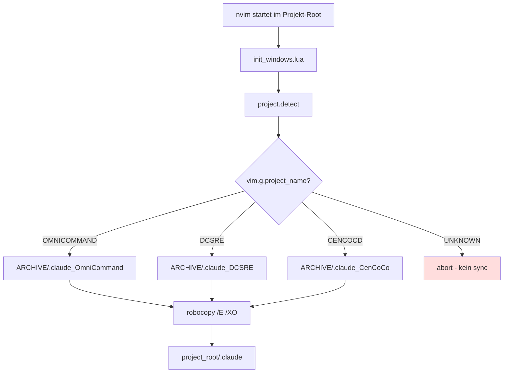
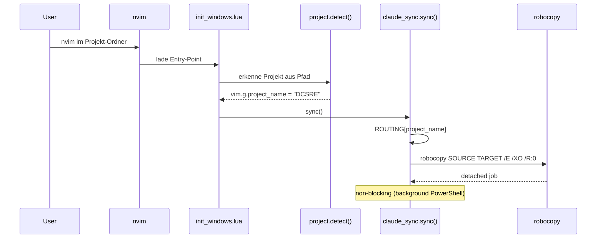

# claude_sync.lua: AgentsArchive → Projekt Routing

**Datum:** 2026-05-07 (Update: 3-Slot-Symmetrie via Schweizer-Uhrmacher-Instruction)
**Status:** AKTIV — 3 explizite Slots
**Quelle:** `lua/shared/claude_sync.lua`

---

## Executive Summary

Beim Start von Neovim wird automatisch ein **projekt-spezifischer `.claude`-Ordner** aus dem zentralen `AgentsArchive` in den aktuellen Projekt-Root kopiert. **Drei Slots, drei explizite Mappings** — Symmetrie-Prinzip nach Schweizer-Uhrmacher-Audit 2026-05-07. Kein impliziter `.claude`-Default mehr.

---

## Architektur



---

## ROUTING-Tabelle (aktuell, 3-Slot-Symmetrie)

| `vim.g.project_name` | Quelle (AgentsArchive)    | Ziel (Projekt-Root) |
|----------------------|---------------------------|---------------------|
| `DCSRE`              | `\.claude_DCSRE`          | `\.claude`          |
| `CENCOCD`            | `\.claude_CenCoCo`        | `\.claude`          |
| `OMNICOMMAND`        | `\.claude_OmniCommand`    | `\.claude`          |
| `UNKNOWN` / sonst    | —                         | kein Sync           |

**Detection-Reihenfolge** (spezifisch → allgemein, wichtig wegen `DCSRE_Azure/OmniCommand`-Substring-Risiko):
1. `OmniCommand` → OMNICOMMAND
2. `Kluger` / `CenCoCo` / `cencoco` / `CENCOCD` → CENCOCD
3. `DCSRE` → DCSRE
4. sonst → UNKNOWN

---

## Trigger & Zeitpunkt



**Wichtig:**
- Nur bei `vim.g.project_name ∈ {DCSRE, CENCOCD}`
- Quell-Ordner muss existieren (sonst Notify "Quelle fehlt")
- Job läuft **detached** (PowerShell minimiert, blockiert nvim nicht)

---

## robocopy-Flags (kritisch verstehen)

| Flag | Bedeutung | Konsequenz |
|------|-----------|------------|
| `/E` | Alle Unterordner inkl. leere | Kompletter Tree |
| `/XO` | **eXclude Older** | **Neuere Ziel-Dateien werden NICHT überschrieben** |
| `/NJH /NJS /NFL /NDL` | Stille Ausgabe | Kein Output-Spam |
| `/R:0` | Kein Retry | Fail-fast bei Fehlern |

**Konsequenz für Workflow:** Wenn ein Worktree manuell editierte (neuere) `.claude/`-Dateien hat, bleiben die erhalten. Sister-Session-Edits werden **nicht** vom Sync zurückgesetzt — gut. Aber: Wenn AgentsArchive aktualisiert wird (`/_redeploy`), dann wird der Worktree erst beim nächsten nvim-Start oder via `<leader>rca` aktualisiert — und auch nur **ältere** Dateien werden ersetzt.

---

## Ziel-Pfad

```
{project_root}\.claude
```

`project_root` kommt aus `vim.g.project_root_windows` (gesetzt in `project.detect()`).

---

## Manuelle Trigger

| Trigger | Effekt |
|---------|--------|
| nvim-Start | Auto-sync (silent, im Hintergrund) |
| `<leader>rca` | `sync_with_notify()` → mit Feedback (zeigt Quelle + Ziel) |
| `:ClaudeSync` (falls Command definiert) | Wie `<leader>rca` |

---

## Beispiel-Szenarien

### Szenario 1: Neues DCSRE-Worktree
```
DCSRE-94 hat KEIN .claude Ordner
↓ nvim DCSRE-94/
↓ project.detect() → vim.g.project_name = "DCSRE"
↓ ARCHIVE\.claude → DCSRE-94\.claude (alle Dateien kopiert)
```

### Szenario 2: CenCoCo-Projekt
```
cencoco/ hat KEIN .claude
↓ nvim cencoco/
↓ vim.g.project_name = "CENCOCD"
↓ ARCHIVE\.claude_CenCoCo → cencoco\.claude (CenCoCo-Variante)
```

### Szenario 3: Worktree mit neuerem File (Sister-Session)
```
DCSRE-94/.claude/meta/.../stage_3.md = 211 Zeilen (heute editiert)
ARCHIVE/.claude/meta/.../stage_3.md  = 124 Zeilen (älter)
↓ nvim DCSRE-94/
↓ robocopy /XO sieht: Ziel ist neuer
↓ KEIN Überschreiben — 211 Zeilen bleiben
```

---

## Bekannte Grenzen

- **Kein Two-Way-Sync:** Edits im Projekt fließen nicht zurück nach AgentsArchive (das macht `/_redeploy` aus OmniCommand)
- **`.claude_DCSRE` ungenutzt:** Im Archive vorhanden, aber kein ROUTING-Mapping. Entweder löschen oder einbauen
- **Kein `--mirror`:** Gelöschte Source-Files werden im Ziel **nicht** gelöscht (das ist Absicht)

---

## Geänderte Dateien (Phase 4 Refactor)

| Datei | Änderung |
|-------|----------|
| `lua/shared/claude_sync.lua` | `ARCHIVE_BASE` nutzt `USERPROFILE` statt hardcoded `Administrator` |

---

## Referenzen

- Code: `lua/shared/claude_sync.lua` (Zeilen 11-19, 24-57)
- Trigger: `lua/init_windows.lua` (nach `project.detect()`)
- Manueller Hotkey: `lua/shared/keybindings/git.lua` (`<leader>rca`)
- Architektur-Diagramm Sister-Session: 3-Schichten-Modell (OmniCommand → AgentsArchive → Worktree)
