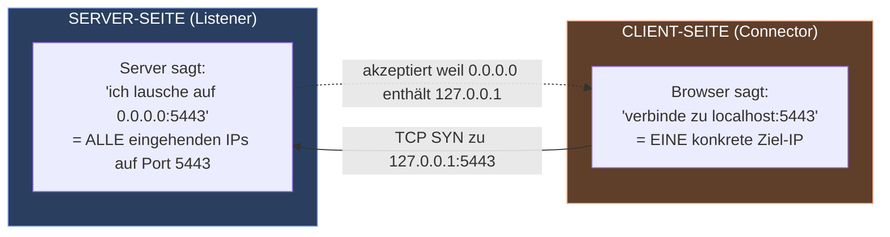
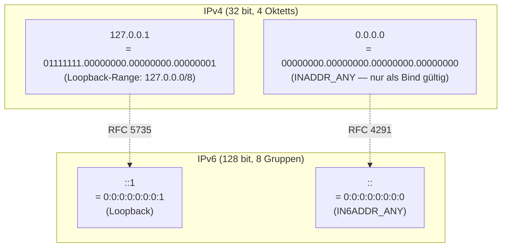
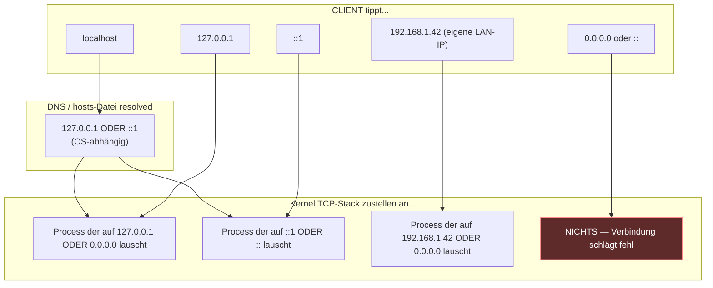
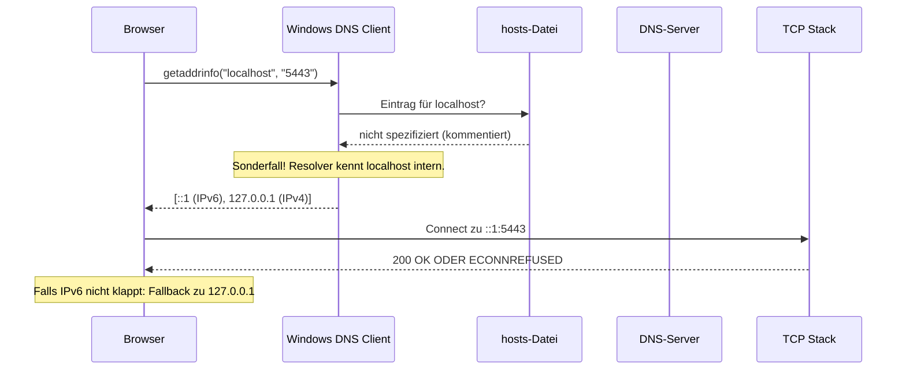
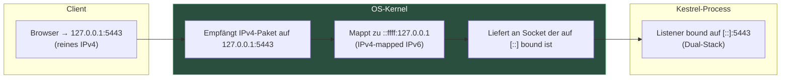
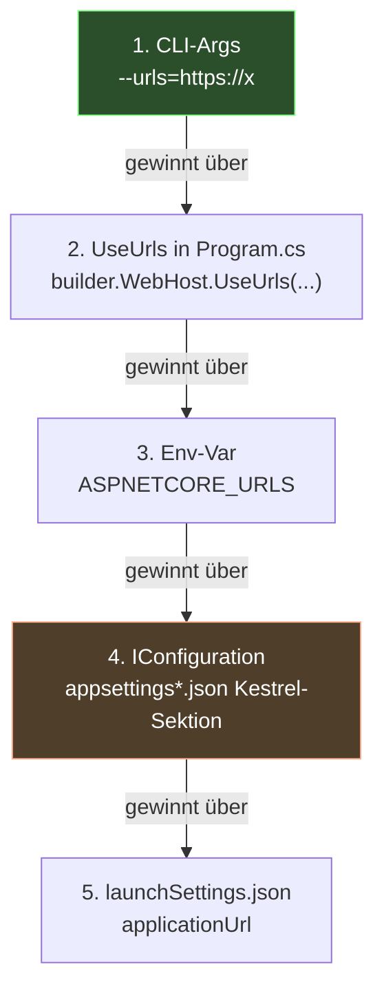
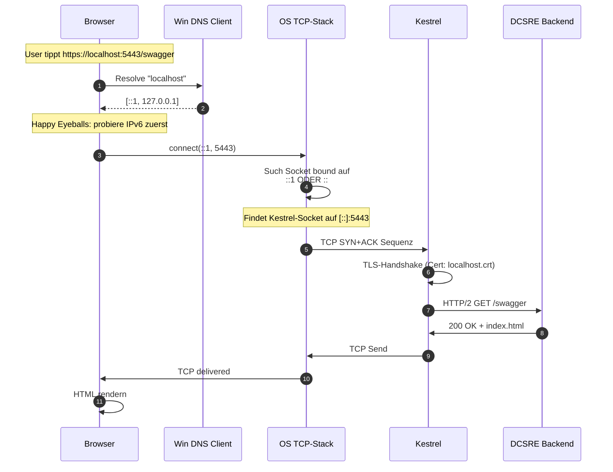
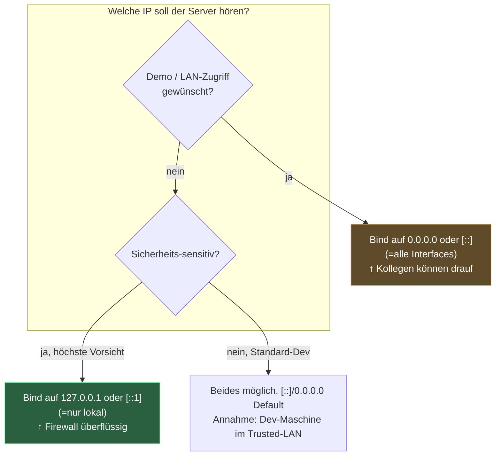

# `localhost` vs `[::]` vs `0.0.0.0` — Server-Bind vs Client-Adressen

**Datum:** 2026-06-17
**Status:** REFERENZ
**Quelle:** Eigene Synthese aus Kestrel-Logs, RFCs (RFC 5735, RFC 4291), Microsoft Docs (ASP.NET Core Kestrel), Wireshark-Analyse
**Hinweis:** Dieses Dokument wurde mit KI-Unterstützung (Claude Code) erstellt.

---

## Executive Summary

Die Verwirrung kommt daher, dass IP-Notation in **zwei völlig verschiedenen Rollen** auftaucht — und beide sehen syntaktisch ähnlich aus:

| Notation | Bedeutung | Wo? |
|----------|-----------|-----|
| `0.0.0.0` / `[::]` | **"jede" Adresse** (Wildcard) — Server-Bind | Server-seitig: "lausche überall" |
| `127.0.0.1` / `[::1]` / `localhost` | **"meine eigene" Adresse** — konkret | Client-seitig: "verbinde zu mir selbst" |

Der TCP-Stack des Betriebssystems unterscheidet diese beiden Welten strikt. Du als Browser kannst **nicht** zu `0.0.0.0` connecten — das ist keine Ziel-Adresse, sondern eine Bind-Wildcard. Du tippst `localhost`, das resolved zu `127.0.0.1` (oder `::1`), und der TCP-Stack routet das an einen Server, der entweder spezifisch auf `127.0.0.1` lauscht ODER auf `0.0.0.0` ("alles"). Beides funktioniert für dich.

Ein Server, der auf `0.0.0.0` lauscht, ist **vom LAN aus erreichbar**. Einer, der nur auf `127.0.0.1` lauscht, ist nur lokal erreichbar. Das ist eine **Sicherheits-Entscheidung**, keine Performance- oder Konfig-Frage.

---

## 1. Das Problem in einem Bild



**Schlüssel-Erkenntnis:** `0.0.0.0` ist **kein Ziel**, sondern eine **Bind-Wildcard**. Sie sagt: "Lausche auf JEDER Adresse die zu mir gehört". Der Browser tippt eine konkrete Adresse, die im Wildcard enthalten ist → es klappt.

---

## 2. Analogie: Telefon-Vermittlung

| Konzept | Server-Bind (Listener) | Client-Connect | Telefon-Analogie |
|---------|------------------------|----------------|-------------------|
| `127.0.0.1` | "lausche nur auf 127.0.0.1" | "rufe 127.0.0.1 an" | **Hausintern**: nur die Hausnummer 1 nimmt ab |
| `0.0.0.0` | "lausche auf JEDEM Anschluss" | ❌ nicht erlaubt | **Zentrale**: alle Apparate gehen gleichzeitig dran |
| `localhost` | (selten gebraucht für Bind) | "rufe meinen eigenen Anschluss an" | Sage "intern": Vermittlung leitet zur eigenen Nummer |
| `192.168.1.42` | "lausche nur auf der LAN-IP" | "rufe Maschine 192.168.1.42 an" | Konkrete Hausnummer im Stadtnetz |

**Wo die Analogie greift:** Trennung **wer hört zu** (Server) vs **wen rufst du an** (Client).
**Wo sie nicht trägt:** Bei Telefon ist 0815-Vermittlung physisch — IP ist eine Software-Abstraktion, der gleiche Prozess kann auf 4 Adressen gleichzeitig lauschen ohne 4 Sockets.

---

## 3. Die 4 Welten: IPv4 + IPv6, "lokal" + "alle"

Es gibt **zwei Adress-Familien** (IPv4 und IPv6) und in jeder die Achse **konkret** vs **Wildcard**. Das ergibt eine 2×2-Matrix:

|  | **konkret = mich selbst** | **Wildcard = alles** |
|--|---------------------------|----------------------|
| **IPv4** | `127.0.0.1` (Loopback) | `0.0.0.0` (Any) |
| **IPv6** | `[::1]` (Loopback) | `[::]` (Any) |



### Warum `[::]` mit eckigen Klammern?

In URLs wird `:` als Trenner zwischen Host und Port genutzt: `localhost:5443`. IPv6-Adressen **enthalten selbst Doppelpunkte**: `::`, `::1`, `2001:db8::1`. Ohne Klammern wüsste der URL-Parser nicht wo die IP aufhört und der Port anfängt:

| Ohne Klammern (✗) | Mit Klammern (✓) |
|-------------------|------------------|
| `http://::1:5443/` ← ambivalent | `http://[::1]:5443/` ← klar |
| `http://2001:db8::1:5443/` ← unklar | `http://[2001:db8::1]:5443/` ← klar |

Definiert in **RFC 3986 (URI-Syntax)**. Diese Konvention gilt nur in URLs — wenn Kestrel in einem Log-Eintrag `https://[::]:5443` schreibt, formattet er für URL-Konsistenz, obwohl `[::]` als Client-Adresse keinen Sinn ergibt.

---

## 4. Wer kann auf was connecten? Die Routing-Matrix



**Faustregel:**
- Client-Eingabe muss eine **konkrete** Adresse sein
- Server-Bind kann **konkret oder Wildcard** sein
- `Wildcard ⊇ konkret`: wer auf `0.0.0.0` lauscht, fängt auch `127.0.0.1`-Pakete

---

## 5. DNS und der Name `localhost`

`localhost` ist **kein** IP, sondern ein **Name**, der über DNS oder die `hosts`-Datei zur IP wird. Auf Windows steht im `hosts`-File:

```
# C:\Windows\System32\drivers\etc\hosts
# Standardmäßig ALLE Zeilen für localhost auskommentiert (auch dafür sorgt der DNS-Resolver)
# 127.0.0.1       localhost
# ::1             localhost
```

Der **Windows DNS Client** behandelt `localhost` als Sonderfall und gibt **immer** zurück:
- Bevorzugt IPv6 → `::1` (wenn IPv6 aktiviert ist — Standard seit Windows Vista)
- Fallback → `127.0.0.1`

### Resolver-Reihenfolge: `getaddrinfo()`



**Wichtig:** **Chrome bevorzugt IPv6** wenn der Server beides anbietet — RFC 6555 ("Happy Eyeballs"). Falls IPv6-Verbindung in 250ms nicht klappt, parallel IPv4-Versuch. Das erklärt warum manchmal `[::1]`-Probleme erst nach 250ms zu `127.0.0.1` führen.

---

## 6. Dual-Stack: Warum `[::]` auch IPv4 fängt

Hier wird's interessant. Linux-Kernel und Windows-Kernel implementieren **IPv4-mapped IPv6 addresses** (RFC 4291, Abschnitt 2.5.5.2):

```
::ffff:127.0.0.1
```

Das ist eine IPv6-Adresse, die einen IPv4-Wert "einbettet". Wenn ein Socket mit `[::]` bound ist UND Dual-Stack aktiviert ist (Default in .NET 8), kann er IPv4-Verbindungen empfangen — der Kernel mappt sie intern auf `::ffff:127.0.0.1`.



**Konsequenz für dich:**
- Kestrel logged `Now listening on: https://[::]:5443`
- Du tippst `https://127.0.0.1:5443` → Browser sendet IPv4-Paket
- Kernel mappt → an Kestrel-Socket weitergeleitet
- Funktioniert ✅

`[::]` ist also de facto **"alle IPs egal welche Familie"** auf Dual-Stack-Systemen. Das macht es zur stärksten Bind-Form.

### Wann Dual-Stack NICHT greift

| Plattform | Standard Dual-Stack? | Override |
|-----------|----------------------|----------|
| Windows .NET 8+ | ✅ ja | `socket.DualMode = false` deaktiviert |
| Linux .NET 8+ | ✅ ja | sysctl `net.ipv6.bindv6only=1` deaktiviert |
| BSD / macOS | ⚠️ konfigurabel | `IPV6_V6ONLY` socket option |

Falls Dual-Stack aus ist: Kestrel auf `[::]` empfängt **nur** IPv6 — IPv4-Clients (127.0.0.1) sehen `connection refused`. Bei DCSRE auf Windows Default — kein Problem.

---

## 7. Kestrel's Override-Hierarchie (warum der `WRN` im Log?)

In deinem Log siehst du:

```
[WRN] Overriding address(es) 'https://localhost:5443, http://localhost:5080'.
      Binding to endpoints defined via IConfiguration and/or UseKestrel() instead.
[INF] Now listening on: https://[::]:5443
```

Was passiert: Du gibst via Env-Var `ASPNETCORE_URLS` URLs an, aber **`appsettings.json` hat höhere Priorität**. Sie definiert wahrscheinlich:

```json
{
  "Kestrel": {
    "Endpoints": {
      "Https": { "Url": "https://+:5443" }
    }
  }
}
```

Das `+` ist Kestrel-Notation für **"alle Interfaces"** (= `[::]` auf Dual-Stack-Systemen).

### Hierarchie (höchste zuerst, niedrigste verliert)



**Wichtige Falle:** `appsettings.Development.json` wird gelesen wenn `ASPNETCORE_ENVIRONMENT=Development`. Diese Datei kann eigene `Kestrel:Endpoints` haben — diese gewinnt gegen die Basis-`appsettings.json`.

### Konkret bei DCSRE

Das `<leader>rbw` Kommando setzt:
```powershell
$env:ASPNETCORE_URLS='https://localhost:5443;http://localhost:5080'
$env:ASPNETCORE_ENVIRONMENT='Development'
dotnet run --no-restore
```

DCSRE hat aber `appsettings.json` oder `appsettings.Development.json` mit `Kestrel:Endpoints` → diese **übersteuert** die Env-Var. Resultat: lauscht auf `[::]:5443` (alle Interfaces) statt nur `localhost:5443`. Funktional kein Problem, aber **Sicherheits-Implikation**: Backend ist im LAN sichtbar.

---

## 8. Sequenz: Was beim Browser-Request passiert



**Pro Schritt was passieren kann:**

| Schritt | Was scheitern kann | Symptom |
|---------|--------------------|---------|
| 2 | DNS-Konflikt (z.B. hosts-Datei modifiziert) | "Server not found" |
| 4 | Port belegt (anderer Process) | "ERR_CONNECTION_REFUSED" |
| 5 | Kein Socket auf der Adresse | Selbes Symptom |
| 7 | Cert ungültig / abgelaufen | "Ihre Verbindung ist nicht privat" |
| 8 | Application Error | 500er, Backend-Exception |

---

## 9. Sicherheits-Implikationen



### Praktische DCSRE-Konsequenzen

| Szenario | Risiko | Mitigation |
|----------|--------|------------|
| Du arbeitest im Office-LAN | Kollege im selben WLAN kann auf `https://192.168.x.x:5443/swagger` zugreifen, sieht **deine Test-Daten** | Browser-Auth + Cert-Trust filtern viel weg, aber: Backend ist trotzdem **erreichbar**. Lockt nur in trusted-Netzwerken. |
| Im VPN | VPN-Subnet sieht dich. Bei Split-Tunnel: andere VPN-User können auf dich connecten | Bei sensiblen Daten: Bind explizit auf `127.0.0.1` |
| Café/öffentl. WLAN | **Theoretisch jeder im selben WLAN** kann connecten — Firewall blockt meist | Windows Firewall fragt beim ersten `dotnet run` ob du Zugriff erlauben willst |

### Wirklich auf localhost-only beschränken

In `appsettings.Development.json` (lokal, nicht ins Git):

```json
{
  "Kestrel": {
    "Endpoints": {
      "Https": { "Url": "https://localhost:5443" },
      "Http":  { "Url": "http://localhost:5080" }
    }
  }
}
```

`localhost` als Bind-Name resolved zu `127.0.0.1` (+ optional `::1`). LAN-Zugriff dann blockiert.

---

## 10. Häufige Missverständnisse

| Missverständnis | Realität |
|-----------------|----------|
| "0.0.0.0 ist eine externe IP" | Falsch. Es ist eine **lokale Bind-Wildcard**. Im Internet routebar ist sie nicht. |
| "`localhost` und `127.0.0.1` sind exakt das gleiche" | Fast. `localhost` ist ein Name, der **manchmal zu ::1 resolved**. Bei reinem IPv4-only-Server kann das Probleme machen. |
| "Wenn ich auf `127.0.0.1` lausche, ist die App offline" | Falsch. Sie läuft, ist aber nur lokal erreichbar — Browser auf derselben Maschine sieht sie. |
| "`[::]` ist sicherer als `0.0.0.0` weil IPv6" | Falsch. `[::]` ist auf Dual-Stack-Systemen **sogar offener** (fängt IPv4 mit). |
| "Browser kann mit `0.0.0.0:5443` connecten" | Falsch. `0.0.0.0` ist keine gültige Zieladresse. Manche Browser (Chrome) interpretieren es zwar gnädig als `127.0.0.1`, aber Standard ist's nicht. Verlass dich nicht drauf. |
| "Port-Konflikt nur wenn beide auf gleicher IP lauschen" | Falsch. Wer `0.0.0.0:5443` will scheitert, wenn jemand schon auf `127.0.0.1:5443` lauscht — Wildcard überschneidet sich mit konkret. |

---

## 11. Praktische Cheat Sheet

### Im Browser-Adressbalken

| Ziel | URL |
|------|-----|
| DCSRE-Backend, allgemein | `https://localhost:5443/swagger` |
| Explizit IPv4 | `https://127.0.0.1:5443/swagger` |
| Explizit IPv6 | `https://[::1]:5443/swagger` |
| Vom LAN (Kollegen) | `https://<deine-LAN-IP>:5443/swagger` (nur wenn Server auf `0.0.0.0`/`[::]` bound) |

### Diagnose-Befehle

```powershell
# Welche Sockets lauschen gerade?
netstat -ano | findstr ':5443'
# Ausgabe: TCP   [::]:5443    [::]:0    LISTENING   12345

# Konvertiert: Process mit PID 12345 hört auf [::]:5443

# Wer ist PID 12345?
Get-Process -Id 12345

# Meine LAN-IP?
ipconfig | Select-String 'IPv4'

# DNS-Resolution für localhost
Resolve-DnsName localhost
# Liefert auf Windows typischerweise: ::1 + 127.0.0.1
```

### Im DCSRE-Workflow

```
<leader>rbw    →  startet WebHost, lauscht auf [::] (durch appsettings)
<leader>rbW    →  startet im Watch-Mode, gleiche Bind-Adresse
<leader>rDi    →  Docker Infra hochfahren (eigene Bind-Logic, intern auf 127.0.0.1)
```

Browser dann immer: **`https://localhost:5443/swagger/index.html`** — fertig.

---

## 12. Glossar

| Begriff | Formale Definition | Feynman-Version |
|---------|---------------------|------------------|
| **Loopback** | IP-Adresse im Bereich 127.0.0.0/8 (IPv4) oder ::1/128 (IPv6) die Pakete an die eigene Maschine zurückleitet | "Ich rufe mich selbst an, das Paket verlässt nie meinen Computer" |
| **Bind** | Socket-Operation `bind(socket, address, port)` die einen Listener auf eine Adresse+Port-Kombi setzt | "Server sagt dem OS: 'wenn was auf dieser Adresse:Port kommt, gib's mir'" |
| **Wildcard-Address** | `0.0.0.0` (IPv4) oder `::` (IPv6) — Platzhalter für "irgendeine Adresse" | "Beim Lauschen: 'jede IP nehme ich entgegen', nicht als Ziel verwendbar" |
| **Dual-Stack** | Socket der gleichzeitig IPv4 und IPv6 entgegennimmt via IPv4-mapped IPv6 | "Ein Server-Socket, zwei Adress-Familien — Magie des Kernels" |
| **IPv4-mapped IPv6** | Format `::ffff:a.b.c.d` das eine IPv4-Adresse als IPv6 repräsentiert | "Verkleidet eine IPv4 in IPv6-Kleidung, damit der Code nur eine Codierung sehen muss" |
| **Happy Eyeballs** | RFC 6555 — Algorithmus der parallel IPv4+IPv6 probiert | "Browser probiert beide gleichzeitig, nimmt das was zuerst klappt" |
| **Kestrel** | ASP.NET Cores integrierter Web-Server | "Der Postbote von .NET — bringt HTTP-Pakete zwischen TCP und App" |
| **getaddrinfo** | POSIX-Funktion die Name→IP-Liste übersetzt | "Bibliotheks-Funktion: 'gib mir alle IPs für diesen Namen' — kennt DNS, hosts, Sonderfälle" |

---

## 13. Quellen

| ID | Titel | Typ | URL/Pfad |
|----|-------|-----|----------|
| P01 | RFC 5735 — Special Use IPv4 Addresses | RFC | https://www.rfc-editor.org/rfc/rfc5735 |
| P02 | RFC 4291 — IP Version 6 Addressing Architecture | RFC | https://www.rfc-editor.org/rfc/rfc4291 |
| P03 | RFC 3986 — URI Generic Syntax (IPv6 in URL) | RFC | https://www.rfc-editor.org/rfc/rfc3986 |
| P04 | RFC 6555 — Happy Eyeballs | RFC | https://www.rfc-editor.org/rfc/rfc6555 |
| S01 | Microsoft Docs — Kestrel Endpoint Configuration | Docs | https://learn.microsoft.com/aspnet/core/fundamentals/servers/kestrel/endpoints |
| S02 | Microsoft Docs — IPv6 Dual-Mode Sockets | Docs | https://learn.microsoft.com/dotnet/framework/network-programming/ipv6-dual-mode |
| T01 | Stack Overflow — Difference between 0.0.0.0 and 127.0.0.1 | Community | https://stackoverflow.com/questions/20778771 |
| T02 | Wireshark Wiki — TCP loopback packet capture | Tutorial | https://wiki.wireshark.org/CaptureSetup/Loopback |
| L01 | DCSRE-Backend Log (08:31:03–08:35:31 vom 2026-06-17) | Beobachtung | dein letzter `<leader>rbw` Lauf |
| L02 | `appsettings.Development.json` Kestrel-Sektion | Codebase | `Sources/Backend/VDEK.DCSP.WebHost/appsettings.Development.json` |

---

## TL;DR

1. **`localhost` ist ein Name**, kein IP. Resolved zu `::1` (IPv6 Loopback) oder `127.0.0.1` (IPv4 Loopback).
2. **`[::]` ist eine Server-Bind-Wildcard**, kein Client-Ziel. Heißt: "Server lauscht auf jeder Interface-Adresse".
3. **`[::]` ↔ `0.0.0.0` ↔ `+`** sind verschiedene Schreibweisen für **"alle Interfaces"** in IPv6 / IPv4 / Kestrel-Notation.
4. **Dual-Stack** sorgt dafür dass ein Socket auf `[::]` auch IPv4-Verbindungen empfängt — `[::]` ist also de facto die stärkste Bind-Form.
5. **Im Browser tippst du immer `localhost`** — das DNS macht den Rest. `[::]` oder `0.0.0.0` als URL ist sinnlos.
6. **Kestrel's `WRN [Overriding address(es)]`** kommt weil `appsettings.json:Kestrel:Endpoints` Vorrang über deine `ASPNETCORE_URLS` Env-Var hat. Funktional egal, Security-Tradeoff: Backend ist LAN-erreichbar.
7. **Wenn du paranoid bist:** `appsettings.Development.json` lokal anpassen, dort `https://localhost:5443` statt `https://+:5443` einsetzen.

Dein Setup mit `<leader>rbw` ist **korrekt und sicher genug für Trusted-Network-Dev**. Kein Handlungsbedarf.
