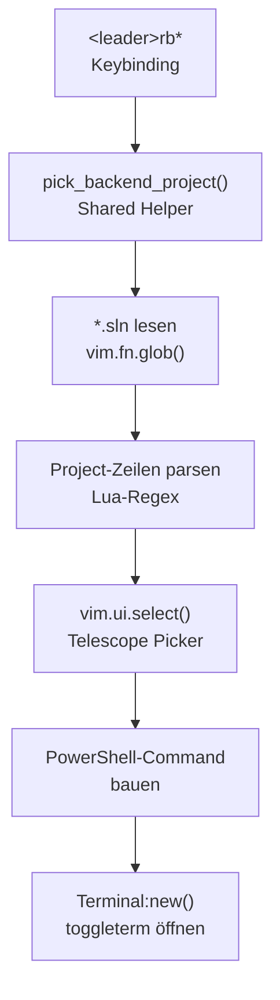
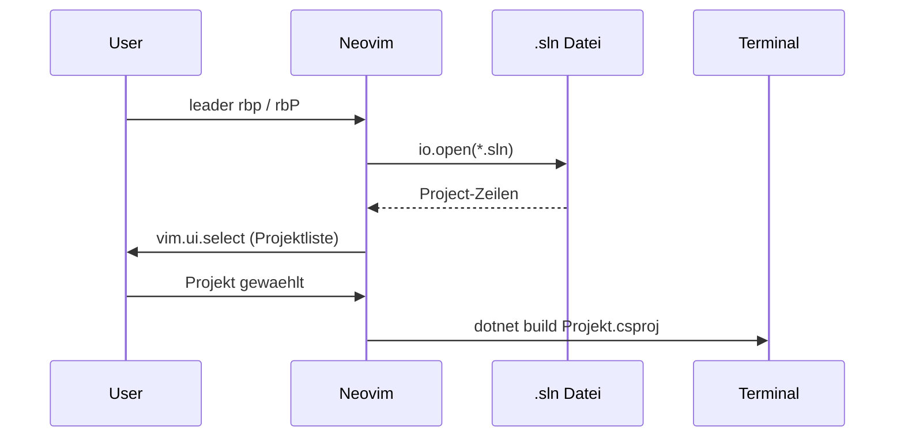
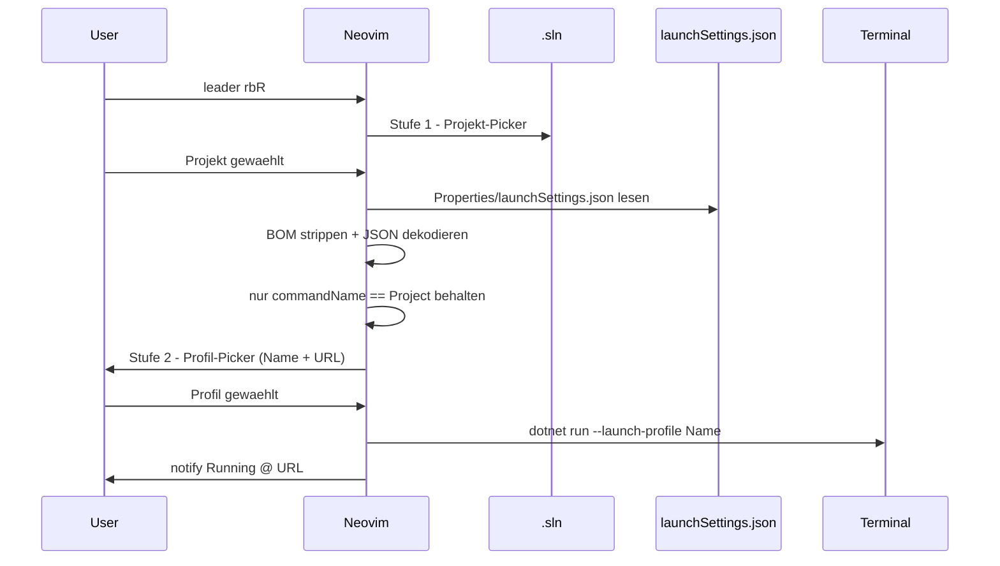
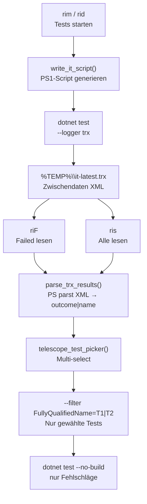

# Backend-Keybindings Aufbau: `<leader>rb*`

**Datum:** 2026-03-06
**Status:** ZWISCHENERGEBNIS
**Quelle:** lua/shared/keybindings/backend.lua

---

## Executive Summary

Alle `<leader>rb*` Keybindings folgen demselben 3-stufigen Muster:
**Lesen → Picker → PowerShell-Command**. Der geteilte Helper `pick_backend_project()`
verhindert Code-Duplizierung. Jedes Keybinding öffnet ein `toggleterm`-Terminal.

---

## Architektur: Gemeinsames Fundament



---

## Der DRY-Helper: `pick_backend_project()`

Geteilt von: `rbp`, `rbP`, `rbR` — kein Copy-Paste.

```lua
local function pick_backend_project(prompt, callback)
  local sln_files = vim.fn.glob(vim.g.project_backend_windows .. '\\*.sln', false, true)
  -- .sln Format: Project("{GUID}") = "Name", "Path\File.csproj", "{GUID}"
  local name, rel_path = line:match(
    '^Project%("[^"]*"%)%s*=%s*"([^"]+)",%s*"([^"]+%.csproj)"'
  )
  vim.ui.select(names, { prompt = prompt }, function(choice)
    callback(choice_name, rel_path, backend_win)
  end)
end
```

---

## Alle rb* Keybindings auf einen Blick

| Key | Art | Picker | Befehl |
|-----|-----|--------|--------|
| `rbw` | Fix | — | `dotnet run --no-restore` (WebHost :5443) |
| `rbs` | Fix | — | `dotnet run --project VDEK.DCSP.Setup` |
| `rbb` | Fix | — | `dotnet build` (Solution-Root) |
| `rbp` | Picker | .sln → Projekt | `dotnet build <projekt>` (Cache/inkrementell) |
| `rbP` | Picker | .sln → Projekt | `dotnet clean` + `dotnet build --verbosity detailed` |
| `rbR` | 2-Stufen | .sln → launchSettings | `dotnet run --launch-profile <name>` |
| `rbt` | Fix | — | `dotnet test --filter FullyQualifiedName~{file}` |
| `rbu` | Projekt-Branch | — | `dotnet test --filter Category!=Database...` |

---

## 1-Stufen-Picker: rbp / rbP



---

## 2-Stufen-Picker: rbR



---

## launchSettings.json Filterung

```json
{
  "profiles": {
    "https": {
      "commandName": "Project",
      "applicationUrl": "https://localhost:5443;http://localhost:5444"
    },
    "IIS Express": {
      "commandName": "IISExpress"
    }
  }
}
```

- `commandName == "Project"` → im Picker zeigen
- `commandName == "IISExpress"` → überspringen (funktioniert nicht mit `dotnet run`)
- Kein `applicationUrl` → zeigt `(kein URL – Background Service)`
- CWD = **Projektverzeichnis** → `appsettings.json` wird korrekt gefunden

---

## .sln Regex — Warum so komplex?

```
Project("{FAE04EC0-301F-11D3-BF4B-00C04F79EFBC}") = "VDEK.DCSP.WebHost", "VDEK.DCSP.WebHost\VDEK.DCSP.WebHost.csproj", "{GUID}"
```

- `%b{}` war **falsch** — matched balanced Klammern, aber `("{"` verhindert Match
- Richtig: `^Project%("[^"]*"%)%s*=%s*"([^"]+)",%s*"([^"]+%.csproj)"`

---

## Terminal-Muster (alle rb*)

```lua
Terminal:new({
  cmd           = 'powershell.exe -Command "Set-Location \'proj_dir\'; dotnet ..."',
  direction     = 'horizontal',
  close_on_exit = false,   -- Fenster bleibt offen, Fehler sichtbar
  count         = 20,      -- Terminal-ID (20 = Backend WebHost)
}):toggle()
```

---

## Test-Retry-Pipeline (ri* Workflow)

### Datenfluss: TRX als Zwischendaten



### Schritt 1 — Tests laufen + TRX speichern

`write_it_script()` generiert ein PS1-Script das:
1. `dotnet test --logger "trx;LogFileName=$trx"` ausführt
2. TRX nach `%TEMP%\it-latest.trx` speichert
3. Am Ende **Zusammenfassung** anzeigt: `PASSED: 42  FAILED: 3`
4. Jeden fehlgeschlagenen Test mit Fehlermeldung (max 200 Zeichen) listet

### Schritt 2 — TRX parsen (Zwischendaten lesen)

`parse_trx_results()`:
```lua
-- PowerShell liest TRX-XML → einfache Textdatei: "outcome|testName"
vim.fn.system('powershell ... $r.TestRun.Results.UnitTestResult |
  ForEach-Object { $_.outcome + "|" + $_.testName } | Out-File ...')
-- Lua liest Textdatei → { outcome = "Failed", name = "TestMethodName" }
```

### Schritt 3 — Telescope Picker + Re-Run

`riF` filtert nur `outcome == "Failed"` → Telescope öffnet sich:
- `<Tab>` = mehrere Tests markieren
- `<Enter>` = gewählte Tests re-runnen

Filter wird gebaut:
```
FullyQualifiedName=Namespace.TestClass.Test1|FullyQualifiedName=Namespace.TestClass.Test2
```

### Manuell aus dem Terminal

Wer `riF` nicht nutzen will — dasselbe von Hand:

```powershell
# 1. TRX lesen, Failed-Tests extrahieren
[xml]$r = Get-Content "$env:TEMP\it-latest.trx"
$failed = $r.TestRun.Results.UnitTestResult | Where-Object { $_.outcome -eq 'Failed' }
$failed | ForEach-Object { $_.testName }

# 2. Filter bauen (Beispiel: 2 Tests)
$filter = "FullyQualifiedName=NS.Class.Test1|FullyQualifiedName=NS.Class.Test2"

# 3. Nur diese Tests ausführen
cd "C:\...\VDEK.DCSP.IntegrationTests"
dotnet test --no-build --no-restore --filter $filter --verbosity detailed
```

### Übersicht ri* Keybindings

| Key | Was | Zwischendaten? |
|-----|-----|----------------|
| `rim` | Integration Mock (38 Threads) | schreibt TRX |
| `rid` | Integration DB (8 Threads) | schreibt TRX |
| `riF` | **Failed aus TRX** | liest TRX |
| `ris` | **Alle aus TRX** (Picker) | liest TRX |
| `rif` | Test-Dateien aus Filesystem | kein TRX |
| `riC` | Docker clean + rebuild | kein TRX |

---

## Abhängigkeiten

```
backend.lua
  ├── vim.g.project_backend_windows   (von project.lua beim Start gesetzt)
  ├── vim.g.project_name              (DCSRE / CENCOCD)
  ├── require('toggleterm.terminal')  (lazy, zur Laufzeit)
  └── io.open() / vim.fn.glob()       (Lua-Standard + Neovim-API)
```
