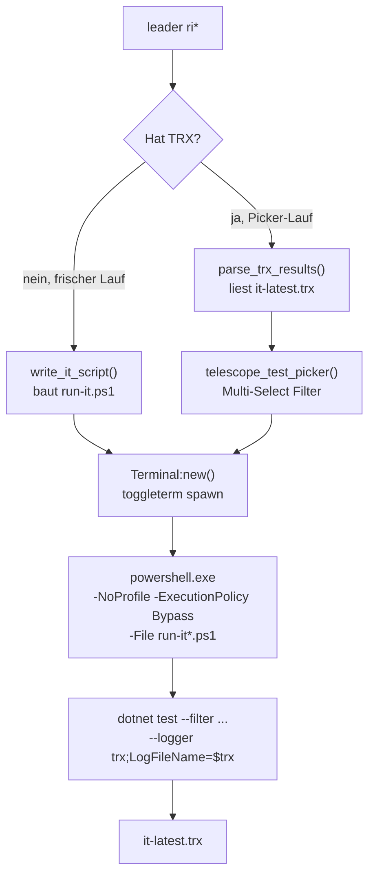
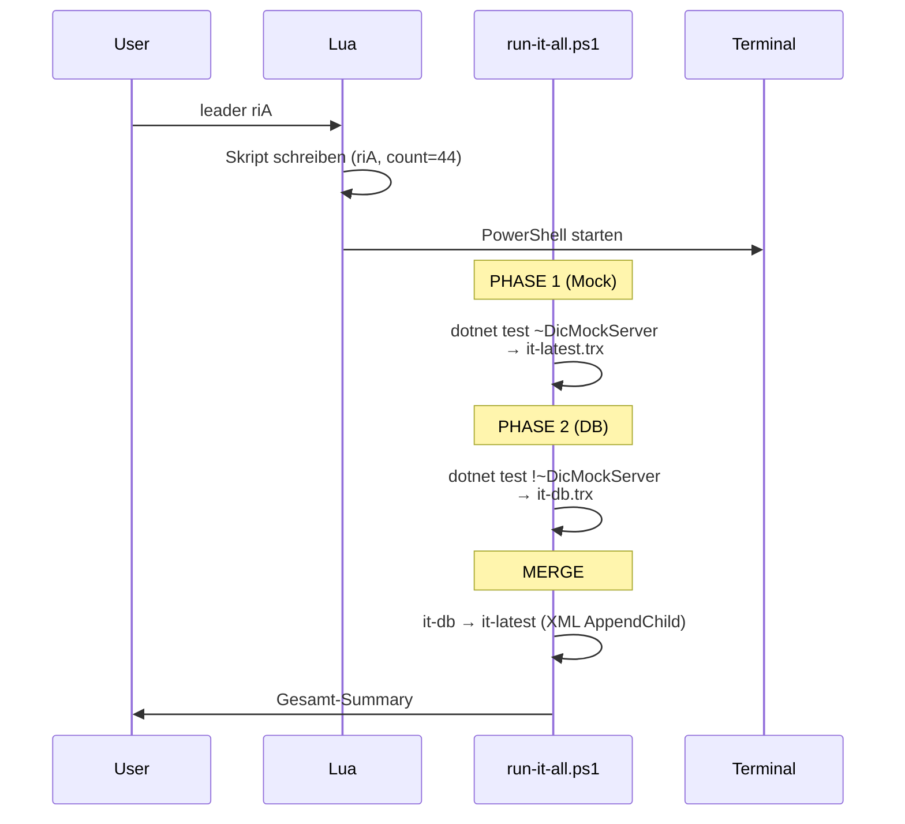
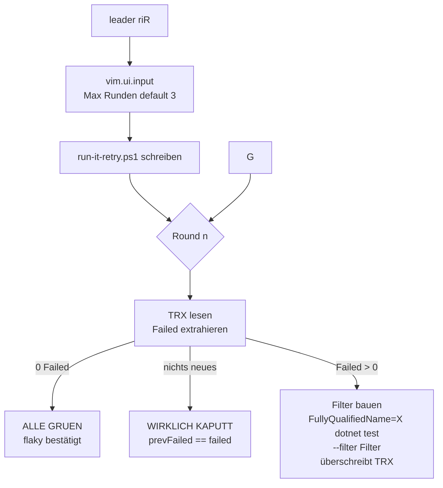

# Integration-Test-Keybindings Aufbau: `<leader>ri*`

**Datum:** 2026-05-11
**Status:** REFERENZ
**Quelle:** `lua/shared/keybindings/tests.lua` (Zeilen 1–840)
**Hinweis:** Diese Dokumentation und die zugrunde liegenden Keybindings wurden mit KI-Unterstützung (Claude Code) erstellt.

---

## Executive Summary

Alle `<leader>ri*` Keybindings sind **DCSRE-only**. Sie nutzen ein gemeinsames Fundament: **TRX-Logger + PowerShell-Wrapperskripte + xUnit-Thread-Steuerung**. Jeder Run erzeugt eine TRX-XML-Datei in `%TEMP%`, die von nachfolgenden Pickern (`riF`/`riR`/`ris`) wieder eingelesen wird.

---

## Datei- und Pfad-Inventar

### Source-Datei
```
C:\Users\Administrator\Documents\Projekt\KickStartNeoVim\lua\shared\keybindings\tests.lua
```

### Test-Projekt (DCSRE)
```
<project_backend_windows>\VDEK.DCSP.IntegrationTests
  ├─ VDEK.DCSP.IntegrationTests.csproj
  └─ xunit.runner.json          ← maxParallelThreads wird hier patcht
```

### TEMP-Artefakte (alle in `%TEMP%`, Resolver siehe `tests_temp()` Zeile 10)
| Datei | Zweck | Erzeugt von |
|---|---|---|
| `it-latest.trx` | Haupt-Ergebnis (XML), wird von Pickern gelesen | `rim`, `rid`, `riA`, `riR`, `riF` (merge), `rif`, `ris` |
| `it-rerun.trx` | Re-Run-Ergebnis, wird in `it-latest.trx` gemerged | `riF`, `ris` |
| `it-db.trx` | DB-Phase von `riA`, wird in `it-latest.trx` gemerged | `riA` |
| `it-parsed.txt` | TRX→Text Cache (`outcome\|testName` pro Zeile) | `parse_trx_results()` |
| `run-it.ps1` | PowerShell-Wrapper für Standardlauf | `write_it_script()` |
| `run-it-rerun.ps1` | Wrapper für Picker-Re-Run | `telescope_test_picker()` |
| `run-it-retry.ps1` | Wrapper für `riR` Multi-Round-Loop | `riR` |
| `run-it-all.ps1` | Wrapper für `riA` 2-Phasen-Pipeline | `riA` |

---

## Geteilte Helper (das Fundament)



### `tests_temp()` — Zeile 10
Portabler TEMP-Resolver: `%TEMP%` → `%TMP%` → `$TMPDIR` → Fallback `<user_home>\AppData\Local\Temp`.

### `set_xunit_threads(n)` — Zeile 134
Patcht `xunit.runner.json` via Regex: `"maxParallelThreads": %d+` → `"maxParallelThreads": <n>`. Kein JSON-Parser, reine String-Substitution.

### `write_it_script(filter, label, extra_flags)` — Zeile 161
Generiert PowerShell-Skript mit dieser Struktur:

```powershell
$ErrorActionPreference = "Continue"
$trx = "%TEMP%\it-latest.trx"
if (Test-Path $trx) { Remove-Item $trx -Force }

dotnet test "<test_dir>" --no-build --no-restore `
  --filter "<filter>" `
  --logger "console;verbosity=detailed" `
  --logger "trx;LogFileName=$trx" `
  --verbosity detailed

# Inline-Summary: TRX parsen → PASSED/FAILED/SKIPPED zählen, Fehler-Output gekürzt
```

`extra_flags` default: `--no-build --no-restore`. Wird aufrufer-spezifisch überschrieben (`rif` setzt z.B. `''`).

### `parse_trx_results()` — Zeile 230
```powershell
[xml]$r = Get-Content '<it-latest.trx>'
$r.TestRun.Results.UnitTestResult |
  ForEach-Object { $_.outcome + '|' + $_.testName } |
  Out-File -Encoding UTF8 '<it-parsed.txt>'
```
Lua liest dann `it-parsed.txt` zeilenweise zurück.

### `telescope_test_picker(title, list)` — Zeile 294
Reusable Picker mit 3-Spalten-Display: `[Icon] [Klassenkürzel] [KB rechtsbündig]`. Multi-Select via Tab. Enter baut Filter `FullyQualifiedName=X|FullyQualifiedName=Y` und schreibt `run-it-rerun.ps1` mit Inline-Merge in `it-latest.trx`.

---

## Alle ri* Keybindings auf einen Blick

| Key | Zeile | Stage | Filter / Aktion | Threads | Terminal | TRX-Output |
|---|---|---|---|---|---|---|
| `rim` | 411 | Run | `FullyQualifiedName~IntegrationTests & ~DicMockServer` | aktueller xunit-Wert | 40 | `it-latest.trx` |
| `rid` | 416 | Run | `FullyQualifiedName~IntegrationTests & !~DicMockServer` | aktueller xunit-Wert | 41 | `it-latest.trx` |
| `riA` | 580 | Run | Mock → DB sequenziell + Merge | aktueller xunit-Wert | 44 | `it-latest.trx` (gemerged aus 2 Phasen) |
| `riR` | 437 | Re-Run | Failed-Tests aus `it-latest.trx`, multi-round | wie aktuell | 44 | `it-latest.trx` (in-place überschrieben) |
| `riF` | 684 | Picker | Failed aus TRX → Telescope | n/a (Picker) | 42 | merge `it-rerun.trx` → `it-latest.trx` |
| `rif` | 708 | Picker | `*.cs` Files via globpath | User-Input | 42 | `it-latest.trx` |
| `ris` | 820 | Picker | ALLE aus TRX → Telescope | n/a (Picker) | 42 | merge `it-rerun.trx` → `it-latest.trx` |
| `riC` | 535 | Cleanup | Docker prune ALL + rebuild | — | 43 | — |
| `riD` | 563 | Cleanup | nur `dic-mock-server:integration-test` löschen | — | 43 | — |

---

## 1. `<leader>rim` — Run Integration **Mock**

**Aufruf:**
```lua
run_integration_tests(
  'FullyQualifiedName~IntegrationTests&FullyQualifiedName~DicMockServer',
  'Mock',
  40
)
```

**Was passiert konkret:**
1. `write_it_script()` schreibt `%TEMP%\run-it.ps1`
2. toggleterm öffnet horizontales Terminal (count=40)
3. Skript-Inhalt führt aus:
   ```powershell
   dotnet test "<backend>\VDEK.DCSP.IntegrationTests" --no-build --no-restore `
     --filter "FullyQualifiedName~IntegrationTests&FullyQualifiedName~DicMockServer" `
     --logger "console;verbosity=detailed" `
     --logger "trx;LogFileName=%TEMP%\it-latest.trx" `
     --verbosity detailed
   ```
4. Nach Lauf: Inline-Summary parst `it-latest.trx` → PASSED/FAILED/SKIPPED, Fehlertexte (max 200 Zeichen).

**Status:** `DEPRECATED -> rT3` (Hinweis im desc). Wird vermutlich durch Stage-basierte Keys ersetzt.

---

## 2. `<leader>rid` — Run Integration **Docker** (DB-Tests)

Wie `rim`, aber **invertierter Filter** (alles AUSSER MockServer):
```
FullyQualifiedName~IntegrationTests&FullyQualifiedName!~DicMockServer
```

Ablauf identisch zu `rim` (TRX-Logger, Inline-Summary), nur Terminal-Count=41.

**Status:** `DEPRECATED -> rT4/rT3`.

---

## 3. `<leader>riA` — Run Integration **All** (sequentiell + Merge)



**Skript-Kern:**
```powershell
# PHASE 1
dotnet test "$dir" --no-build --no-restore `
  --filter "FullyQualifiedName~IntegrationTests&FullyQualifiedName~DicMockServer" `
  --logger "trx;LogFileName=$trx"        # → it-latest.trx

# PHASE 2
dotnet test "$dir" --no-build --no-restore `
  --filter "FullyQualifiedName~IntegrationTests&FullyQualifiedName!~DicMockServer" `
  --logger "trx;LogFileName=$dbTrx"      # → it-db.trx

# MERGE
[xml]$mainXml = Get-Content $trx
[xml]$dbXml   = Get-Content $dbTrx
foreach ($node in $dbXml.TestRun.Results.UnitTestResult) {
    $imp = $mainXml.ImportNode($node, $true)
    $mainXml.TestRun.Results.AppendChild($imp) | Out-Null
}
$mainXml.Save($trx)
```

Ergebnis: Single `it-latest.trx` mit Mock+DB → bereit für `riF` / `riR` / `ris`.

---

## 4. `<leader>riR` — Run Integration **Retry** (multi-round)

**Voraussetzung:** `it-latest.trx` muss existieren (sonst Warnung).

**Flow:**


**Kern-Skript:**
```powershell
for ($round = 1; $round -le $maxRounds; $round++) {
    [xml]$r = Get-Content $trx
    $failed = @($r.TestRun.Results.UnitTestResult | Where-Object { $_.outcome -eq 'Failed' })

    if ($failed.Count -eq 0)            { break }   # Alle grün
    if ($failed.Count -eq $prevFailed)  { break }   # Keine Verbesserung

    $prevFailed = $failed.Count
    $filterParts = $failed | ForEach-Object { "FullyQualifiedName=" + $_.testName }
    $filter = $filterParts -join "|"
    Remove-Item $trx -Force

    dotnet test $testDir --no-build --no-restore --filter $filter `
      --logger "trx;LogFileName=$trx" --verbosity detailed
}
```

**Status:** `DEPRECATED -> rTR`.

---

## 5. `<leader>riF` — Failed-Picker (Telescope)

**Voraussetzung:** `it-latest.trx` muss existieren.

**Flow:**
1. `parse_trx_results()` → Lua-Tabelle aller Ergebnisse
2. Filter auf `outcome == 'Failed'`
3. `telescope_test_picker(title, failed)` öffnet Picker
4. Tab = Multi-Select, Enter = Re-Run der Auswahl
5. Re-Run-Skript (`run-it-rerun.ps1`) führt aus:
   ```powershell
   dotnet test '<dir>' --no-build --no-restore `
     --filter 'FullyQualifiedName=Test1|FullyQualifiedName=Test2|...' `
     --logger "trx;LogFileName=$rerunTrx"

   # Merge zurück in it-latest.trx (in-place outcome-Update pro testName)
   foreach ($newTest in $rerunXml.TestRun.Results.UnitTestResult) {
       $match = $mainXml.TestRun.Results.UnitTestResult |
                Where-Object { $_.testName -eq $newTest.testName }
       if ($match) { $match.outcome = $newTest.outcome }
   }
   $mainXml.Save($mainTrx)
   ```

**Status:** `DEPRECATED -> rTF`.

---

## 6. `<leader>rif` — Find Test Files

**Anders als `riF`:** liest **keine TRX**, sondern scannt Dateisystem.

```lua
local all_files = vim.fn.globpath(test_root, '**/*Tests*.cs', false, true)
-- Filter obj/ Verzeichnisse raus
```

**User-Flow:**
1. Telescope-Picker mit allen `*Tests*.cs` (excl. obj/)
2. Multi-Select via Tab
3. Enter → `vim.ui.input` fragt **Threads** (default 8)
4. `set_xunit_threads(N)` patcht `xunit.runner.json`
5. Filter: `FullyQualifiedName~ClassName1|FullyQualifiedName~ClassName2`
6. Lauf via `write_it_script()` mit `extra_flags=''` (NICHT `--no-build`)
7. `on_exit` Callback: `set_xunit_threads(1)` resettet auf 1

**Warum reset auf 1?** Sicherer Default-Zustand nach Test, verhindert versehentliche Parallelität bei nächstem Run.

---

## 7. `<leader>ris` — Search All Tests

Identisch zu `riF`, aber **ohne Filter auf 'Failed'** — Telescope zeigt alle Tests aus TRX (Passed/Failed/Skipped mit V/X/− Icons).

**Use-Case:** "Lass mich aus dem letzten Lauf gezielt 2 Tests nochmal anschauen, egal ob die grün waren."

**Status:** `DEPRECATED -> rTS`.

---

## 8. `<leader>riC` — Clean (Nuclear Docker Reset)

**Achtung:** Löscht **alle** Docker-Images, nicht nur Test-relevante.

```powershell
docker container prune -f
docker volume prune -f
docker images -q | ForEach-Object { docker rmi -f $_ }   # ALLES weg!
docker builder prune -f --all
dotnet build "<backend>\VDEK.DCSP.IntegrationTests\VDEK.DCSP.IntegrationTests.csproj"
```

Use-Case: Wenn `dic-mock-server` oder Testcontainer-Images korrupt sind und `riD` nicht reicht.

---

## 9. `<leader>riD` — Delete MockServer Image Only

Gezielter als `riC`:
```powershell
docker rmi dic-mock-server:integration-test -f
```

Use-Case: MockServer-Build hat sich geändert, nächster Test-Lauf soll Image neu bauen.

---

## Terminal-Count-Map

`count=N` in `Terminal:new()` reserviert eine separate toggleterm-Instanz, damit parallele Workflows sich nicht stören.

| Count | Verwendet von | Zweck |
|---|---|---|
| 40 | `rim` | Mock-Lauf |
| 41 | `rid` | DB-Lauf / Stufe-3 |
| 42 | `riF`, `rif`, `ris` | Picker-Re-Runs |
| 43 | `riC`, `riD` | Docker-Cleanup |
| 44 | `riA`, `riR` | Multi-Phase / Multi-Round |

→ Mit `<leader>st` (Search Terminals) lassen sich alle Instanzen einzeln aufrufen.

---

## Bekannte Schwachstellen

1. **Naming-Konflikt:** `rid` (lowercase) vs `riD` (uppercase) — lowercase startet DB-Tests, uppercase löscht ein Image. Vertippen = fataler Unterschied.
2. **TRX-Abhängigkeit:** `riF`/`riR`/`ris` brauchen vorher `rim`/`rid`/`riA`. Bei frischer Session unbrauchbar.
3. **Deprecation-Hinweise:** 5 von 9 Keys sind als `DEPRECATED -> rT*` markiert — neue rT-Familie scheint geplant aber noch nicht migriert.
4. **`riC` löscht ALLES:** `docker images -q | ForEach-Object { docker rmi -f $_ }` killt auch unbeteiligte Container-Images.
5. **Threads-Reset:** Nur `rif` resettet `xunit.runner.json` auf 1 nach Lauf. `rim`/`rid` lassen den aktuellen Wert stehen → kann zu Überraschungen im nächsten Run führen.

---

## Quick-Reference (Cheat-Sheet)

```
RUN
  rim   Mock (DicMockServer only)
  rid   DB-Tests (alles AUSSER DicMockServer)
  riA   Mock + DB sequentiell, gemerged

RE-RUN
  riR   Multi-Round Retry (flaky-Filter)
  riF   Picker: nur Failed aus TRX
  ris   Picker: alle Tests aus TRX
  rif   Picker: Test-Files vom Filesystem

CLEANUP
  riC   Docker prune ALL + rebuild
  riD   nur dic-mock-server:integration-test löschen
```
