# Obsidian.nvim Research Report

**Datum**: 2025-01-16
**Status**: Phase 1 - Forschung abgeschlossen
**Ziel**: Vollständige Obsidian-Integration in Neovim mit Image-Support

---

## Executive Summary

Die aktuelle Obsidian-Konfiguration in `init.lua` ist **minimal** und fehlt wichtige Einstellungen. Das erklärt warum:
- `:Obsidian today` funktioniert
- `:Obsidian new` Notizen "verliert" (erstellt sie im falschen Ordner)

---

## 1. Architektur-Übersicht

### Obsidian Ecosystem

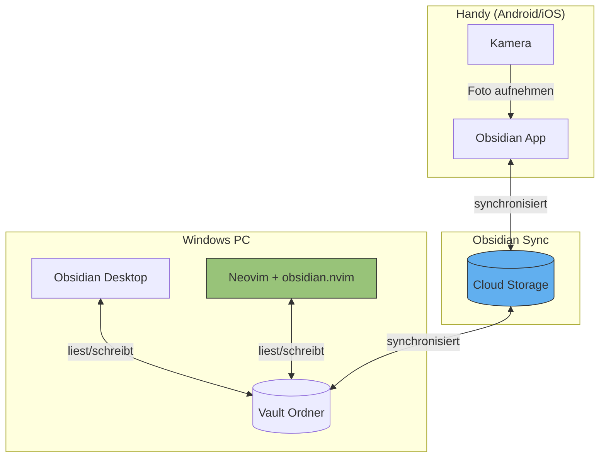

### Dateistruktur eines Obsidian Vaults

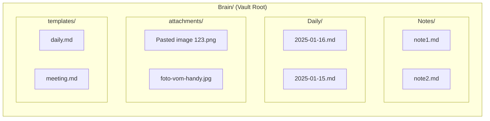

---

## 2. Problem-Analyse

### Warum "Neue Notizen funktionieren nicht"

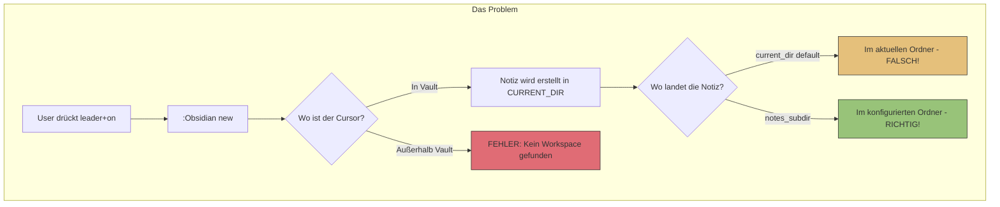

### Aktuelle Config vs. Empfohlene Config

| Setting | Aktuell | Default | Empfohlen | Auswirkung |
|---------|---------|---------|-----------|------------|
| `notes_subdir` | - | `nil` | `"Notes"` | Wo neue Notizen landen |
| `new_notes_location` | - | `"current_dir"` | `"notes_subdir"` | Relativ zu was? |
| `daily_notes.folder` | - | `nil` | `"Daily"` | Wo Daily Notes landen |
| `daily_notes.date_format` | - | `"%Y-%m-%d"` | `"%Y-%m-%d"` | Dateiname-Format |
| `templates.folder` | - | `nil` | `"templates"` | Template-Ordner |
| `attachments.folder` | - | `"attachments"` | `"attachments"` | Wo Bilder landen |

### Warum `:Obsidian today` funktioniert

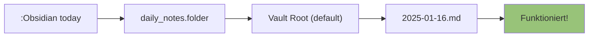

### Warum `:Obsidian new` fehlschlägt

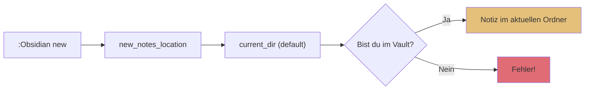

---

## 3. Image-Handling Deep Dive

### Wie Bilder in Obsidian funktionieren

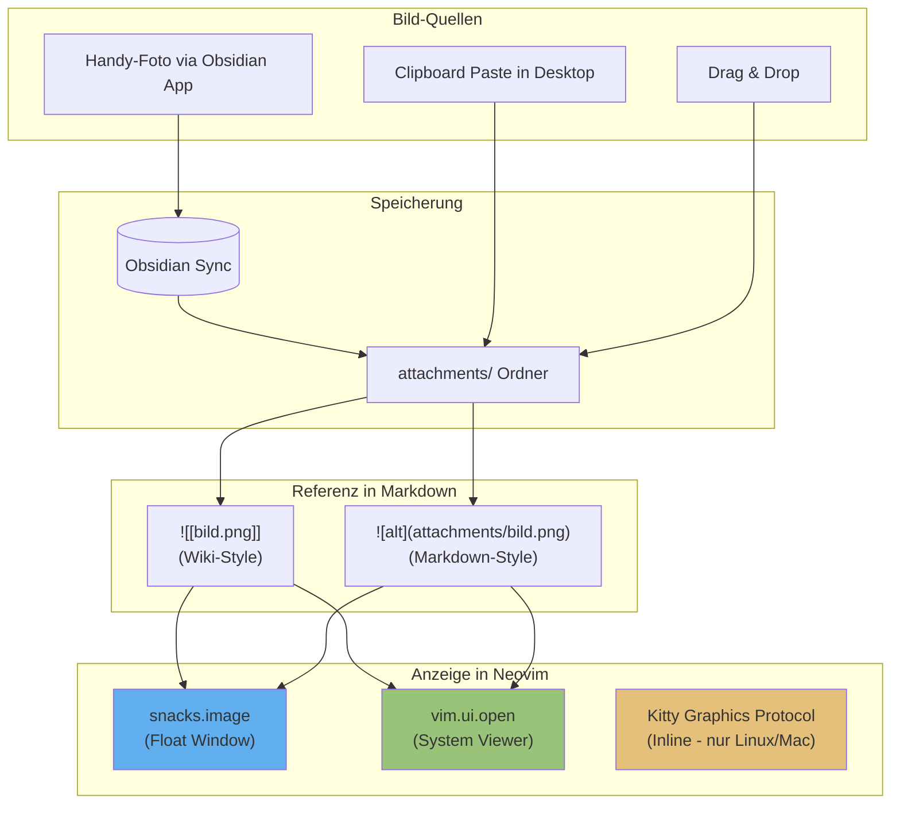

### Windows Limitierungen

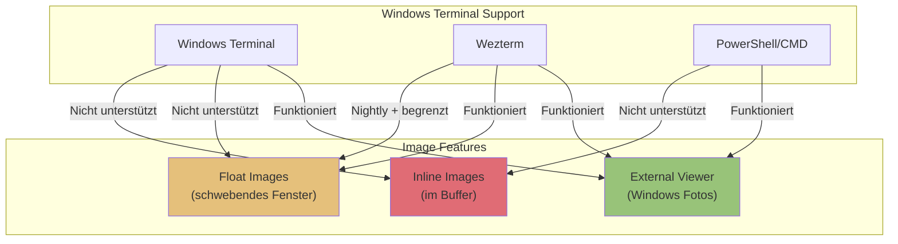

### Empfehlung für Windows

| Option | Terminal | Komplexität | Ergebnis |
|--------|----------|-------------|----------|
| `vim.ui.open` | Alle | Einfach | Öffnet Windows Foto-Viewer |
| `snacks.image` Float | Wezterm Nightly | Mittel | Schwebendes Fenster in Neovim |
| Inline Images | Nicht möglich | - | Windows unterstützt Kitty Protocol nicht |

---

## 4. Plugin-Abhängigkeiten

### Aktuell installiert

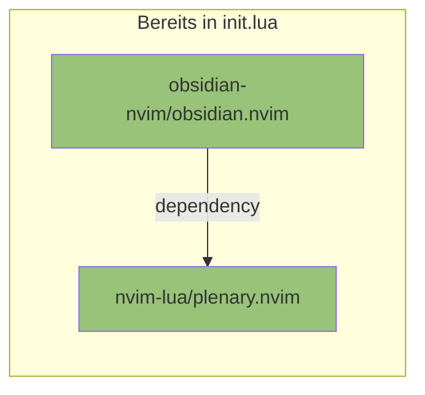

### Empfohlene Erweiterungen

```mermaid
flowchart TB
    subgraph Core["Core (bereits installiert)"]
        OBS["obsidian.nvim"]
    end

    subgraph Optional["Optional - Image Viewing"]
        SNACKS["folke/snacks.nvim"]
        MAGICK["ImageMagick (System)"]
    end

    subgraph Completion["Optional - Completion"]
        BLINK["blink.cmp"]
        CMP["nvim-cmp"]
    end

    OBS -.->|für Images| SNACKS
    SNACKS -->|benötigt| MAGICK

    OBS -.->|für [[links]]| BLINK
    OBS -.->|alternativ| CMP

    style OBS fill:#98c379
    style SNACKS fill:#61afef
    style BLINK fill:#c678dd
```

---

## 5. Lösungsvorschlag

### Schritt 1: Erweiterte Obsidian Config

```lua
-- Vorgeschlagene Konfiguration
opts = {
  legacy_commands = false,

  workspaces = {
    { name = 'DCSRE', path = '...' },
    { name = 'CenCoCo', path = '...' },
    { name = 'Brain', path = '...' },
  },

  -- NEU: Wo neue Notizen landen
  notes_subdir = 'Notes',
  new_notes_location = 'notes_subdir',

  -- NEU: Daily Notes Konfiguration
  daily_notes = {
    folder = 'Daily',
    date_format = '%Y-%m-%d',
    default_tags = { 'daily' },
  },

  -- NEU: Templates
  templates = {
    folder = 'templates',
    date_format = '%Y-%m-%d',
    time_format = '%H:%M',
  },

  -- NEU: Attachments (Bilder)
  attachments = {
    folder = 'attachments',
    confirm_img_paste = true,
  },

  -- NEU: Wie Bilder geöffnet werden (Enter auf Bild-Link)
  follow_img_func = function(url)
    vim.ui.open(url)  -- Öffnet im Windows Foto-Viewer
  end,
}
```

### Schritt 2: Neue Keybindings

```lua
keys = {
  -- Bestehende...
  { '<leader>on', '<cmd>Obsidian new<cr>', desc = '[O]bsidian [N]ew note' },
  { '<leader>ot', '<cmd>Obsidian today<cr>', desc = '[O]bsidian [T]oday' },

  -- NEU: Template-basierte Notiz
  { '<leader>oT', '<cmd>Obsidian new_from_template<cr>', desc = '[O]bsidian [T]emplate' },

  -- NEU: Bild einfügen
  { '<leader>oi', '<cmd>Obsidian paste_img<cr>', desc = '[O]bsidian [I]mage paste' },

  -- NEU: Link folgen (auch für Bilder)
  { '<leader>of', '<cmd>Obsidian follow_link<cr>', desc = '[O]bsidian [F]ollow link' },

  -- NEU: Tägliche Notizen Browser
  { '<leader>od', '<cmd>Obsidian dailies<cr>', desc = '[O]bsidian [D]ailies list' },
}
```

### Schritt 3 (Optional): snacks.nvim für Float-Images

```lua
-- Nur wenn du Wezterm Nightly verwendest
{
  'folke/snacks.nvim',
  opts = {
    image = {
      enabled = true,
      -- Integration mit obsidian.nvim
      resolve = function(path, src)
        local ok, api = pcall(require, 'obsidian.api')
        if ok and api.path_is_note(path) then
          return api.resolve_attachment_path(src)
        end
      end,
    },
  },
}
```

---

## 6. Workflow nach Implementation

### Neue Notiz erstellen

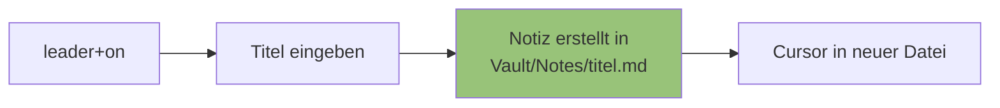

### Bild einfügen

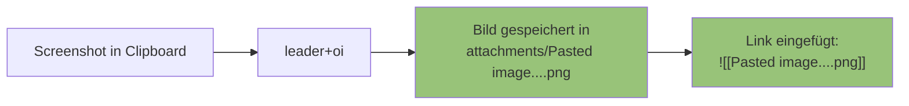

### Bild anzeigen (Enter auf Link)

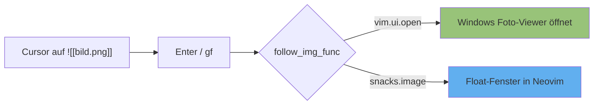

---

## 7. Offene Fragen

1. **Welche Ordnerstruktur** verwendest du in deinen Vaults?
   - Hast du bereits `Notes/`, `Daily/`, `attachments/` Ordner?
   - Oder eine andere Struktur?

2. **Welches Terminal** verwendest du?
   - Windows Terminal → nur `vim.ui.open` möglich
   - Wezterm → Float-Images möglich (mit Nightly + ImageMagick)

3. **Obsidian Sync** - Welche Vaults werden synchronisiert?
   - Brain?
   - CenCoCo?
   - DCSRE?

---

## 8. Nächste Schritte

| Phase | Aktion | Status |
|-------|--------|--------|
| 1 | Forschung abschließen | ✅ Erledigt |
| 2 | User-Feedback zu Ordnerstruktur | ⏳ Warte auf Antwort |
| 3 | Config implementieren | ⏳ Pending |
| 4 | Testen | ⏳ Pending |
| 5 | Dokumentation aktualisieren | ⏳ Pending |

---

## Quellen

- [obsidian-nvim/obsidian.nvim (GitHub)](https://github.com/obsidian-nvim/obsidian.nvim)
- [Images Wiki](https://github.com/obsidian-nvim/obsidian.nvim/wiki/Images)
- [Commands Wiki](https://github.com/obsidian-nvim/obsidian.nvim/wiki/Commands)
- [snacks.nvim Image Viewer](https://github.com/folke/snacks.nvim/blob/main/docs/image.md)
- [snacks.image Windows Compatibility](https://github.com/folke/snacks.nvim/discussions/1720)
- [linkarzu - Obsidian to Neovim](https://linkarzu.com/posts/neovim/obsidian-to-neovim/)
